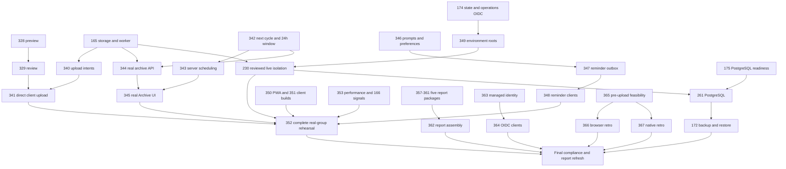

# Rewind Sprint 2 execution plan — 2 October 2026

**Planning complete; implementation has not started in this session.** This is the single execution plan for `Collaboration95/rewind-app`, with an applied GitHub backlog. It supersedes the older “first delivery slice” queue, not valid implementation evidence or the working agreement.

> **Current owner direction — 3 October 2026, 23:28 SGT:** The current iOS release target is Safari and the installed iPhone Home Screen web app (PWA), not a compiled native iOS application. Native iOS compilation, signing, distribution and the compiled-client bug #386 are outside the current release/overnight target. Android work is last, after the web release; preserve its outstanding contracts without making it a web-release prerequisite. The overnight queue and unattended execution boundaries in §16 supersede conflicting platform priorities below. Existing physical-device acceptance is not silently waived; the earlier simulator substitution remains specific to #328/#329/#350.

## 1. Executive decision

**Sprint Goal:** By 10 October, make the website and installed iPhone web app support one private real-group journey from invitation through capture, sealed contributions, conversation and reminders to automatic film release, immediate next-cycle capture and permanent Archive. Prepare the Android APK/iOS preview and all five assessment packages alongside that journey.

**Minimum complete increment:** Two authenticated members and an outsider can demonstrate the whole flow on a reviewed hosted build, with functioning video review, photo/video submission, authoritative quota/correction, private chat, server-driven rollover, valid film/audio, release/download permissions and a repeatable acceptance path. A Demo-only film, a merged PR or a green CI run is insufficient. Submission-specific identity/storage/processing obligations remain visible in Sprint 3, as the owner explicitly requested below.

**Owner decision in this session:** The final Sprint is reserved for fulfilling the original proposal conditions: managed OIDC, PostgreSQL, managed database backups and retro processing **before upload**. The owner did not grant an assessment waiver. Keep the existing local-password/SQLite/no-backup/server-retro implementation as a temporary Sprint 2 delivery path; complete the required migration/processing work in Sprint 3. This is an intentional exception to the brief's “Sprint 3 primarily buffer” preference for these four areas only. Do not quietly move other predictable core features there.

**First three issues to acquire:**

1. [#328](https://github.com/Collaboration95/rewind-app/issues/328) — remove the confirmed shared camera-preview blocker; smallest direct user-value repair.
2. [#342](https://github.com/Collaboration95/rewind-app/issues/342) — unlock the defining cycle/Archive path; the current lifecycle creates the successor too late and does not enforce a 24-hour premiere.
3. [#354](https://github.com/Collaboration95/rewind-app/issues/354) — establish measured focused commands and bounded execution guidance with near-term payback. It does not block product work.

These can run in disjoint scopes. [#329](https://github.com/Collaboration95/rewind-app/issues/329) follows the preview repair in the same capture lane. [#165](https://github.com/Collaboration95/rewind-app/issues/165) is the next sensitive-media lane; do not wait for live AWS to build and verify the local adapter boundary. No workers, scheduler or overnight execution were launched during planning.

**Cut line:** Treat capture, privacy, direct hosted transfer, automatic lifecycle, real Archive, required reminders and the real-account rehearsal as the product path. Draft all report sections before 10 October. Cut the three-concept UI redesign, speculative telemetry, SQS/Organizations, visual polish, unnecessary native launches and optional tooling expansion first. Missing privacy, reliable storage, required clients or ordinary data-loss protection cannot be relabelled “edge cases.” An unmet mandatory item is an explicit incomplete requirement, not Done.

**Feasibility:** 2 October is already Sprint day 6. Eight remaining execution nights (2–9 October) plus the 10 October acceptance/review day are available. The issue estimates total **211–365 focused hours for Sprint 2** and **76–132 for the explicitly reserved Sprint 3 work**. These are planning ranges, not measured effort or a promise. Some acceptance checks share one device window, but serial integration and review remain real costs. The 10 October complete increment is credible only near the lower half with sustained parallel capacity and prompt human gates; the upper estimate does not fit. See §7 for forecasts and explicit decision triggers.

[Project #11 — Sprint 2](https://github.com/users/Collaboration95/projects/11) is the acquisition board. [Project #8 — longer-term backlog/Sprint 3](https://github.com/users/Collaboration95/projects/8) holds the separately timed compliance work. Native parent and blocked-by links connect them.

### Navigation

[Evidence](#2-evidence-baseline) · [Coverage](#3-requirement-to-delivery-coverage) · [Scope](#4-scope-decisions-and-conflicts) · [Epics and contracts](#5-epic-and-issue-map) · [Reconciliation](#6-backlog-and-board-reconciliation-receipt) · [Waves](#7-dependency-graph-execution-waves-and-capacity) · [PWA acceptance](#8-product-and-pwa-acceptance-plan) · [Tooling](#9-tooling-plan) · [Verification](#10-verification-matrix) · [PR/release](#11-pr-review-and-release-strategy) · [Overnight](#12-overnight-runbook) · [Report](#13-assessment-and-report-plan) · [Gates/risks](#14-human-gates-and-risks) · [Launch/completion](#15-launch-checklist-and-completion-test)

## 2. Evidence baseline

- Workspace: `/Users/speedpowermac/Documents/projects/CODE_MAIN/NUS/SWE5006/rewind-app`.
- Observation: **2 October 2026, Asia/Singapore**; the initial refresh began around 17:00 SGT. Final reconciliation timestamp and counts appear in §6. Dates in issue comments retain their original timestamps; older evidence is not re-labelled as a fresh test.
- Integrated `dev`: **`450a7199767ecc4ea3e96f0f7503d0f2170d382c`**, obtained through authenticated `gh repo clone … -- --branch dev --single-branch --depth 1` into an isolated temporary checkout. It matches the handoff SHA, but was independently refreshed. No local branch/commit was created and the user's checkout was not switched.
- User checkout: `codex/s2-backend-namespaces`. Existing changes to `infra/terraform/bootstrap/access.tf`, `main.tf`, `variables.tf`, `tests/infra/`, and the two supplied untracked planning inputs were preserved. The authoritative application `src/` inspected is **inside rewind-app**; no retired sibling source or `rewind-v1` archive was inspected.
- Initial remote snapshot: **31 open issues; 4 open PRs (#298, #333, #332, #335); Project #11 33/33 cards, 21 Done and 12 In Progress; Project #8 174/174 cards.** Issue list used limit 500; Project lists used limit 500 and returned counts were checked. The full recent PR inventory and targeted issue comments/native relationships were read through `gh`.
- Existing runs for the recorded SHA: [Quality 36826478756](https://github.com/Collaboration95/rewind-app/actions/runs/36826478756), [CodeQL 36826478793](https://github.com/Collaboration95/rewind-app/actions/runs/36826478793), [Deploy dev 36826478747](https://github.com/Collaboration95/rewind-app/actions/runs/36826478747) all report success. These runs were **read**, not rerun. Deployment workflow success does not establish deployed multi-user acceptance.
- `main` was not independently checked out or tested. No release/deployment parity is inferred from `dev` or the handoff's older main SHA.

### Inputs and authority

| Input read directly                                                                                                             | How it informs this plan                                                                                                                                                                                                                                                                       |
| ------------------------------------------------------------------------------------------------------------------------------- | ---------------------------------------------------------------------------------------------------------------------------------------------------------------------------------------------------------------------------------------------------------------------------------------------- |
| `AGENTS.md`, `doc/README.md`, `skills/agent-solve-issue/SKILL.md`, `skills/verify-issue/SKILL.md`                               | Current branch, verification, scope-discussion and completion rules.                                                                                                                                                                                                                           |
| `doc/planning/sprints/sprint-2-planning-agent-prompt-2026-10-02.md`                                                             | Required planning/backlog output and stopping boundary.                                                                                                                                                                                                                                        |
| `doc/planning/sprints/sprint-2-planning-handoff-2026-10-02.md`                                                                  | Leads, not immutable counts/status or acceptance.                                                                                                                                                                                                                                              |
| `/Users/speedpowermac/Downloads/rewind-project.docx`                                                                            | Submitted §§4–7 and quality/client obligations. All body paragraphs and tables were extracted; its embedded architecture diagram was visually inspected. It shows OIDC, authenticated control-plane API, relational DB, private object storage/direct media, workers and notification service. |
| `/Users/speedpowermac/Downloads/SWE5006 - Project Report Template for Practice Module.docx`                                     | Exact report structure and per-use-case/per-major-flow/per-pattern obligations. All text/tables were read; the only embedded image is the NUS/ISS logo, inspected. This was content analysis, not a rendered page-layout audit.                                                                |
| `doc/planning/proposals/proposal-rewind.md`, `context/project-brief.md`                                                         | Repository proposal differs from submitted retro-processing timing; brief supplies presentation/Agile context. Neither overrides submitted requirements or later explicit owner direction.                                                                                                     |
| `doc/planning/sprints/base-plan.md`, `sprint-2-user-journey-plan.md`                                                            | Accepted technical direction and journey map. Historical statements about no CI deployment, nginx defaults, admin-only signup and deferring all lifecycle/S3/APK work are not current facts.                                                                                                   |
| Issues #169/#238/#230, #168/#239, #247–#252, #327–#329/#336, #145/#203, #254/#267/#321 and relevant closed children/PR comments | Explicit accepted changes, real human verification, unaccepted implementation, keep-unmerged constraints and conditional work.                                                                                                                                                                 |
| Recorded `dev` code, tests/scripts, CI, deploy and Terraform source                                                             | Implementation evidence only; no live AWS inventory, apply, hosted mutation or phone run occurred.                                                                                                                                                                                             |

Source precedence is: current owner instructions → submitted obligations and explicit accepted product changes → issue contracts/decisions → current integrated code plus valid acceptance evidence → older plans/handoff. An owner pilot exception is not lecturer approval. The latest owner direction here restores the four deferred proposal obligations for Sprint 3; no lecturer waiver is assumed.

### Material code observations

| Evidence at `450a7199`                                                                              | Finding and confidence                                                                                                                                                                                                         |
| --------------------------------------------------------------------------------------------------- | ------------------------------------------------------------------------------------------------------------------------------------------------------------------------------------------------------------------------------ |
| `src/capture/VideoCaptureScreen.tsx:1269`, review panel around line 1314                            | Shared preview is gated by `!recording`; successful review lacks a captured-video player. High confidence code finding; physical root-cause reproduction remains part of #328/#329.                                            |
| `app.json`, `public/manifest.json`                                                                  | Portrait already configured. #327 is behavior/platform investigation, not another configuration-only change.                                                                                                                   |
| `server/src/cycles/lifecycle.ts`, especially `advanceCycleLifecycle`                                | Boundary creates the film job but returns no successor; successor creation occurs on archival. Publication-to-archive path does not enforce a 24-hour window. High confidence implementation gap.                              |
| `server/src/http.ts:2480`, `server/src/cli.ts`                                                      | Demo `/demo/reveal` orchestrates lifecycle; no real-group server scheduler was found. Durable worker exists, but does not prove automatic real close/publication.                                                              |
| `src/groups/RealAccountGroupExperience.tsx`; `server/src/http.ts:2894` and `requireAuthorisedGroup` | Real-account screen set lacks Archive; `/archive` uses the Demo identity helper. This is a real-client and authorization-adapter gap, not proof that film assembly is missing.                                                 |
| `server/src/ffmpeg.ts`, `server/src/jobs/index.ts`, `worker.ts`, `retention.ts`                     | Existing validation, chronological assembly, loudness normalization, filler, durable retries and staged-source cleanup should be reused and verified against real sessions/S3.                                                 |
| `server/src/groups/real.ts`, `src/reminders/reminder-service.ts`                                    | Built-in/custom prompt at group creation exists; no real owner-update/group-timezone/remote-outbox path found. Device-local reminder service reports web unsupported.                                                          |
| `server/src/media/index.ts`, `src/capture/clip-uploader.ts`, `package.json`                         | Filesystem/staged upload implementation; no S3/presigning runtime adapter found. Selected direct-transfer architecture remains work.                                                                                           |
| `deploy/nginx.conf`                                                                                 | Already allows 50 MiB and disables request buffering. A stale “default 1 MB proxy” diagnosis is not repeated.                                                                                                                  |
| `public/sw.js`, manifest, `scripts/check-pwa.mjs`                                                   | Standalone shell and cache/offline checks exist; actual iPhone lifecycle/camera permissions and real session behavior still need acceptance. No full offline synchronization requirement.                                      |
| `package.json`, `jest.config.cjs`, `.github/workflows/quality.yml`                                  | `test:fast` runs broad `npm test`; frontend statement gate 70%; server measured coverage without threshold; browser lane only on main after #334.                                                                              |
| `scripts/production-e2e-server.mjs:131`, `run-production-e2e.mjs`                                   | Slow path exports once, then both clean production-shaped journeys independently rebuild server and export again. Reuse opportunity is real; a measured speedup is not yet available.                                          |
| `.github/workflows/quality.yml` and `deploy-dev.yml`                                                | Whole Quality workflow has path filters, while dev deployment can wait 1,500 seconds for the SHA's Quality push run. Documentation-only behavior needs #254 verification/correction, not a duplicate “skip CI” implementation. |

Historical evidence remains distinct: #248 records a synthetic JPEG completing the hosted pipeline; #249 records a failed installed-PWA simulator recording; #251/#252 have older unavailable-route observations that cannot be presumed current. On 2 October the owner explicitly verified #305, verified Safari under #306, and marked #309 verified; those statements are preserved. #307 has a newer screenshot, not proof of every exceptional flow. Closed issues with explicit missing acceptance remain closed historically but are surfaced in board acceptance state (§6).

No application test suite, simulator, physical phone, load test, current cloud inventory or hosted acceptance journey ran during planning. Only document/code/CLI inspection, planning-file validation and remote planning-state verification were performed.

## 3. Requirement-to-delivery coverage

Implementation and acceptance are independent. **Integrated** means present on recorded `dev`; **partial** means relevant foundations exist; **missing** means the inspected path is absent; **verified** is always limited to the named evidence. High confidence applies to source inspection, not unrun hosted/device behavior. Every row has an implementation and acceptance path; no requirement is waived by a closed ticket alone.

| ID and submitted/accepted requirement                                                      | Implementation state and accepted change                                                                                                                  | Acceptance state/evidence                                                                                             | Delivery path and verification/gate                                                                                                                                                                                                                                                                                                                                                                                                                                                                                                                                                                |
| ------------------------------------------------------------------------------------------ | --------------------------------------------------------------------------------------------------------------------------------------------------------- | --------------------------------------------------------------------------------------------------------------------- | -------------------------------------------------------------------------------------------------------------------------------------------------------------------------------------------------------------------------------------------------------------------------------------------------------------------------------------------------------------------------------------------------------------------------------------------------------------------------------------------------------------------------------------------------------------------------------------------------- |
| R01 — DOCX §4.1/§5.2 managed OIDC, authenticated sessions; later signup                    | Pilot password/session/signup integrated (`server/src/auth`, #241/#242/#307/#308). OIDC missing; owner requires it in Sprint 3.                           | Owner #305 confirms working hosted sign-in; full native/expiry/provider parity not established.                       | #168; [#363](https://github.com/Collaboration95/rewind-app/issues/363) → [#364](https://github.com/Collaboration95/rewind-app/issues/364). Provider invalid-token/redirect/session/privacy tests, reviewed identity mapping, real web/native callbacks.                                                                                                                                                                                                                                                                                                                                            |
| R02 — §4.1 invite-only groups of 2–10, server membership privacy                           | Real groups/profiles/policy integrated, #244/#246/#251. Group starts with owner; capacity 2–10 does not require two people before creation.               | Local API tests/older live notes; #251 real multi-user acceptance open.                                               | #168/#239; [#251](https://github.com/Collaboration95/rewind-app/issues/251), [#356](https://github.com/Collaboration95/rewind-app/issues/356), [#352](https://github.com/Collaboration95/rewind-app/issues/352). Owner/member/outsider tests on every data/media/chat route.                                                                                                                                                                                                                                                                                                                       |
| R03 — §4.1 expiring native/web invitations                                                 | Invite creation, revoke/accept and short codes integrated (#245/#246/#312). Preserve links and codes.                                                     | Local HTTPS two-account API flow observed in #312, not all physical/native/hosted links.                              | #168; [#351](https://github.com/Collaboration95/rewind-app/issues/351), [#350](https://github.com/Collaboration95/rewind-app/issues/350), [#364](https://github.com/Collaboration95/rewind-app/issues/364). Expired/revoked/replayed/full-group and invite-through-signup/redirect checks.                                                                                                                                                                                                                                                                                                         |
| R04 — §4.2 camera-first vertical 720p with audio, ≤15s, trim/portrait/review               | Partial: capture adapters/trim exist; preview and player defects confirmed. Final 720p acceptance must not silently use a 480p fallback.                  | #247/#249 phone acceptance open; simulator fixture/failed recording is not proof.                                     | [#328](https://github.com/Collaboration95/rewind-app/issues/328) → [#329](https://github.com/Collaboration95/rewind-app/issues/329), [#327](https://github.com/Collaboration95/rewind-app/issues/327), [#247](https://github.com/Collaboration95/rewind-app/issues/247)/[#249](https://github.com/Collaboration95/rewind-app/issues/249); final 720p under [#365](https://github.com/Collaboration95/rewind-app/issues/365)/[#366](https://github.com/Collaboration95/rewind-app/issues/366)/[#367](https://github.com/Collaboration95/rewind-app/issues/367). Gallery-only normal flow forbidden. |
| R05 — §4.2 four original retro styles after capture **before final upload**                | Current server FFmpeg treatment differs from submission. Repository proposal says server treatment. Owner now requires submitted timing in Sprint 3.      | No accepted assessment exception; local feasibility not measured.                                                     | [#365](https://github.com/Collaboration95/rewind-app/issues/365) → [#366](https://github.com/Collaboration95/rewind-app/issues/366) + [#367](https://github.com/Collaboration95/rewind-app/issues/367). Inspect original styles, source audio and network bytes; prototype must prove physical PWA feasibility before choosing library.                                                                                                                                                                                                                                                            |
| R06 — accepted photo addition, three-second/one-slot film contribution                     | Integrated #248/#250, actual photo processing code and quota model.                                                                                       | Synthetic hosted JPEG and simulator review exist; actual phone end-to-end remains.                                    | [#248](https://github.com/Collaboration95/rewind-app/issues/248) plus [#341](https://github.com/Collaboration95/rewind-app/issues/341). Real photo→review→private processed three-second segment→sealed→film.                                                                                                                                                                                                                                                                                                                                                                                      |
| R07 — §4.2 five items/30s per seven-day cycle window, one correction, sealed metadata only | Integrated policy/ledger/correction (#250), including photo accounting.                                                                                   | #250 has relevant merged-code review/test evidence; final direct-upload concurrency and phone parity need regression. | [#340](https://github.com/Collaboration95/rewind-app/issues/340), [#341](https://github.com/Collaboration95/rewind-app/issues/341), existing #250 and [#352](https://github.com/Collaboration95/rewind-app/issues/352). Boundary/cross-media/concurrent completion/retake tests; owner also cannot replay/thumbnail pre-reveal.                                                                                                                                                                                                                                                                    |
| R08 — §4.3 four weeks/one-day test; server closing and immediate new cycle                 | Partial deterministic engine/jobs; automatic real scheduling missing, successor late.                                                                     | Demo trigger and unit tests do not establish real automatic rollover.                                                 | [#342](https://github.com/Collaboration95/rewind-app/issues/342) → [#343](https://github.com/Collaboration95/rewind-app/issues/343). Controlled time, duplicate tick, restart, delayed old film with new captures.                                                                                                                                                                                                                                                                                                                                                                                 |
| R09 — §4.3 24-hour premiere and permanent archive                                          | Partial release/publication/Archive foundations; missing real navigation and 24h enforcement.                                                             | Synthetic release evidence only.                                                                                      | [#342](https://github.com/Collaboration95/rewind-app/issues/342), [#344](https://github.com/Collaboration95/rewind-app/issues/344) → [#345](https://github.com/Collaboration95/rewind-app/issues/345). Publication-based 24h, old/new-cycle coexistence, permanent authorized access.                                                                                                                                                                                                                                                                                                              |
| R10 — §4.4/§5.3 durable asynchronous processing, bounded retry and safe failure            | Worker/leases/jobs integrated; scheduler and storage adaptation remain.                                                                                   | Existing tests/CI support foundations, not deployed automatic real journey.                                           | [#343](https://github.com/Collaboration95/rewind-app/issues/343), [#165](https://github.com/Collaboration95/rewind-app/issues/165), [#166](https://github.com/Collaboration95/rewind-app/issues/166). Crash/retry/exhaustion/missing output; never publish corrupt/incomplete film.                                                                                                                                                                                                                                                                                                                |
| R11 — §4.4 chronological ordering, normalized source audio, labelled filler                | Integrated FFmpeg/compilation code; low-contribution reuse policy is present and should be checked against actual member/group archive behavior.          | No fresh playback/25-clip measurement here.                                                                           | [#353](https://github.com/Collaboration95/rewind-app/issues/353), [#352](https://github.com/Collaboration95/rewind-app/issues/352). Out-of-order timestamps, deterministic ties, invalid media, audible output and archive label; no licensed music requirement.                                                                                                                                                                                                                                                                                                                                   |
| R12 — §4.5 built-in/custom owner prompt controls                                           | Creation-time prompt integrated; real owner update path incomplete.                                                                                       | Existing create tests; ongoing owner controls unverified.                                                             | [#346](https://github.com/Collaboration95/rewind-app/issues/346). Non-owner denial, validation and explicit current/next-cycle effect.                                                                                                                                                                                                                                                                                                                                                                                                                                                             |
| R13 — §4.5 Sunday 19:00 group-local reminder, snooze/disable, async provider outcomes      | Device-local service partial; real timezone/preferences/outbox/provider/subscription path missing.                                                        | Local notification checks are not remote PWA/native delivery.                                                         | [#346](https://github.com/Collaboration95/rewind-app/issues/346) → [#347](https://github.com/Collaboration95/rewind-app/issues/347) → [#348](https://github.com/Collaboration95/rewind-app/issues/348). Timezone/DST, duplicate schedule/restart, bad token and failure tests; real opted-in provider check.                                                                                                                                                                                                                                                                                       |
| R14 — §4.6 private text/reply/reaction, reconnect/persistence                              | Integrated #252 and profile context #251.                                                                                                                 | Single-account Demo chat is not real two-member/outsider acceptance.                                                  | [#251](https://github.com/Collaboration95/rewind-app/issues/251) → [#252](https://github.com/Collaboration95/rewind-app/issues/252). History/SSE/send/reply/react denial, restart and reconnect, two-person group; no editing/read receipts/attachments.                                                                                                                                                                                                                                                                                                                                           |
| R15 — §4.7 group film and own processed-clip playback/download after reveal                | Demo Archive/download foundation; real API/UI integration missing.                                                                                        | Not verified for real members.                                                                                        | [#344](https://github.com/Collaboration95/rewind-app/issues/344) → [#345](https://github.com/Collaboration95/rewind-app/issues/345); short-lived authorized access, ownership, range/HEAD/download, expired session/group switch.                                                                                                                                                                                                                                                                                                                                                                  |
| R16 — §4.4/§5.1 direct private object transfer, narrowly scoped signed URLs                | Selected in #238/base plan; runtime S3 adapter/intent flow missing. Existing proxy limit fix does not satisfy direct transfer.                            | Not cloud-verified.                                                                                                   | [#165](https://github.com/Collaboration95/rewind-app/issues/165) → [#340](https://github.com/Collaboration95/rewind-app/issues/340) → [#341](https://github.com/Collaboration95/rewind-app/issues/341); [#349](https://github.com/Collaboration95/rewind-app/issues/349)/[#230](https://github.com/Collaboration95/rewind-app/issues/230); [#170](https://github.com/Collaboration95/rewind-app/issues/170) if retained disk data. Version/replay/CORS/length/expiry/cross-environment tests; human media/infra review.                                                                            |
| R17 — §4.7/§5.2–5.3 minimization, PostgreSQL, managed backups/recoverability               | Source cleanup integrated locally; cloud cleanup missing. SQLite/no backups are temporary accepted pilot choices, restored as final obligations by owner. | No current managed DB/backup/restore evidence.                                                                        | [#165](https://github.com/Collaboration95/rewind-app/issues/165); Sprint 3 [#175](https://github.com/Collaboration95/rewind-app/issues/175) → [#261](https://github.com/Collaboration95/rewind-app/issues/261) → [#172](https://github.com/Collaboration95/rewind-app/issues/172). Original deletion, exact reference integrity, migration parity and measured isolated recovery.                                                                                                                                                                                                                  |
| R18 — §5.4/§5.6 installable PWA and visible lifecycle/errors                               | Manifest/service worker/export integrated; phone-specific acceptance incomplete. Website-first owner priority.                                            | Some owner Safari and simulator Home Screen evidence; actual standalone recording still open.                         | [#350](https://github.com/Collaboration95/rewind-app/issues/350), [#249](https://github.com/Collaboration95/rewind-app/issues/249), [#352](https://github.com/Collaboration95/rewind-app/issues/352). Install/session/invites/permission/audio/upload/background/safe-area/asset-update checks; no invented offline sync.                                                                                                                                                                                                                                                                          |
| R19 — §5.6 Android APK plus iOS build/preview subject to signing                           | Shared Expo foundation integrated; final package artifacts not found on baseline. Older “APK tabled” is superseded by requested full coverage.            | No current pinned APK/native build acceptance established.                                                            | [#351](https://github.com/Collaboration95/rewind-app/issues/351), then OIDC/retro/push rebuilds. Preserve Android artifact and iOS preview; signing limitation is explicit; App Store approval excluded.                                                                                                                                                                                                                                                                                                                                                                                           |
| R20 — §5.1/§5.5 API p95 ≤2s, 25 clips/150s ≤10min; tests/modularity/logging/metrics        | Tests, audit and CI integrated; bounded target measurements and scheduled/notification signals incomplete.                                                | Existing CI green; these are not target measurements.                                                                 | [#353](https://github.com/Collaboration95/rewind-app/issues/353), [#166](https://github.com/Collaboration95/rewind-app/issues/166); tooling [#354](https://github.com/Collaboration95/rewind-app/issues/354)/[#355](https://github.com/Collaboration95/rewind-app/issues/355)/[#356](https://github.com/Collaboration95/rewind-app/issues/356)/[#254](https://github.com/Collaboration95/rewind-app/issues/254). Five-member workload, separate queue/processing time, redaction and actual exit codes.                                                                                            |
| R21 — §5.2/§5.6 least privilege, HTTPS, repeatable low-cost AWS, isolated environments     | Current single-host deployment workflow/OIDC exists; two environments and target S3 not proven live.                                                      | #305 human hosted verification; #298 preparatory PR; #230 gates outstanding.                                          | [#174](https://github.com/Collaboration95/rewind-app/issues/174) → [#349](https://github.com/Collaboration95/rewind-app/issues/349) → [#230](https://github.com/Collaboration95/rewind-app/issues/230); later [#172](https://github.com/Collaboration95/rewind-app/issues/172). Exact plan, cost/alerts, scoped credentials, version/health/isolation; no AWS actions now.                                                                                                                                                                                                                         |
| R22 — final report template plus project-brief presentation/Agile evidence                 | Contracts/docs exist, but complete five packages and every template model are not evidenced.                                                              | No final-report assembly or model coverage audit passed.                                                              | [#339](https://github.com/Collaboration95/rewind-app/issues/339) and six report children (§13); draft Sprint 2, update final compliance/release evidence Sprint 3; factual human contribution completion.                                                                                                                                                                                                                                                                                                                                                                                          |

Explicit exclusions remain: public social feed/discovery/followers, owner transfer/member removal/leaving/account deletion in first delivery, message edit/delete/read receipts/typing/attachments, licensed music, commercial SLA, massive scale and public store approval. Report privacy/retention limitations honestly. No new feature is added solely to obtain a fifth design pattern.

## 4. Scope decisions and conflicts

| Decision/conflict                                                         | Reconciled direction and consequence                                                                                                                                                                                                                                                                                                                                              |
| ------------------------------------------------------------------------- | --------------------------------------------------------------------------------------------------------------------------------------------------------------------------------------------------------------------------------------------------------------------------------------------------------------------------------------------------------------------------------- |
| Four submitted architecture/processing obligations versus pilot decisions | Owner's new 2 October answer is authoritative: fulfill OIDC/PostgreSQL/managed backups/client-side pre-upload retro in Sprint 3. #175 is readiness/service choice, #261 is required migration, #172 now includes managed backup configuration. Their older “only if SQLite inadequate” or no-backup conditions do not cancel the requirement. Human migration/infra gates remain. |
| Signup versus #169 admin-only accounts                                    | #168/#307/#308 accepted self-registration on 30 September. Preserve it now and through managed-provider registration. MFA is not added by this plan.                                                                                                                                                                                                                              |
| Website-first versus native contracts                                     | Ordinary buttons/forms/navigation/playback use browser automation. Actual iPhone Home Screen capture/audio remains a physical gate; native-specific safe areas/keyboard/camera use supported simulator/phone. Android APK and iOS preview remain obligations.                                                                                                                     |
| #165 in Sprint 3 versus direct-transfer choice                            | Move the minimum adapter/intent/client path to Sprint 2. Do not make local adapter coding wait on full cloud provisioning; hosted completion still waits on reviewed environments.                                                                                                                                                                                                |
| #230 backup-gated delete-to-OFF versus #238/base plan                     | Preserve stop/start without deletion for Sprint 2. Do not restore obsolete routine destructive OFF behavior. Sprint 3 backup/recovery adds the original reliability obligation; no production data reset is authorized.                                                                                                                                                           |
| Current real-auth origin versus older Lightsail distribution architecture | #305 is human verified; PR #333 documents a canonical CloudFront host and removes retired distribution config. Treat PR claims as pending integration evidence; inspect actual inventory before environment work and retain effective origin trust. No rollback to old proxy assumptions.                                                                                         |
| Retro timing and quality                                                  | Submitted pre-upload treatment and 720p are final requirements. Existing server FFmpeg may remain canonical validation/transcode/audio normalization, but cannot stand in for client treatment or apply effects twice. Feasibility proof has an explicit stop/escalation outcome.                                                                                                 |
| Native/PWA portrait                                                       | Already configured. #327 must establish supported behavior; if literal web locking is unavailable, owner must choose a truthful guidance fallback or accept incompletion. Do not claim manifest metadata guarantees Safari locking.                                                                                                                                               |
| #145 non-author requirement                                               | Preserve the recorded owner-authorized agent-review substitution with its correct label; it is not a peer run. The issue remains a synthetic hosted acceptance task, distinct from the new real-group rehearsal.                                                                                                                                                                  |
| #267/#321                                                                 | Research comments and closed-unmerged #325 are evidence, not integrated optimization. No speculative instrumentation: proceed only if the accepted research identifies an unobservable required boundary and redaction is agreed.                                                                                                                                                 |
| #336 and redesign                                                         | Keep in backlog, explicitly blocked by the UI direction/revamp under #189. Do not implement validation copy against the current UI; redesign is not a prerequisite for the main journey.                                                                                                                                                                                          |
| #254 docs-only CI                                                         | #257 already added filters. Revised acceptance must preserve a required aggregate result and avoid deploy waiting for a missing workflow. No protection change or unconditional “green” check for runnable changes.                                                                                                                                                               |
| Report member attribution                                                 | Plan five real packages without assignments. The template still requires factual member ownership/contributions; reserve final human completion, not invented names/hours or a claimed waiver.                                                                                                                                                                                    |

No further owner product decision is needed to begin the first bounded local issues. Provider/service/callback/retention details require concrete reviewed execution proposals before resource changes, not another planning permission loop. If unavailable, finish preparatory code/models and keep affected hosted acceptance blocked.

## 5. Epic and issue map

The following contracts mirror actual GitHub issues. Existing bodies/comments remain available; the dated execution-contract block explains superseding scope. Requirements use §3 IDs. Hours are rough focused-work estimates excluding CI/review/device wait. **S** usually fits 2–6 hours; **M** 4–12; **L** 8–30 with elevated uncertainty. Split a batch when these bounds fail, not every function into a ticket.

“Ready” means a bounded implementation/drafting slice can start with local resources and known tests. A required human review before integration does not forbid preparing reviewable code. “Acceptance” means implementation exists but full acceptance is pending. “Deferred” here means deliberately scheduled Sprint 3 or backlog, never an approved omission.

| Track / epic                                                                                                                                        | Outcome                                                                                                                                                                                                                                                | Children and closure                                                                                                                                                                                                                                                                                                                                                                                                                                                                                                                                                                                                                                                                                                                                                                                                                                                                                                                                                                                                                                                                                                                                                                                                                                                              |
| --------------------------------------------------------------------------------------------------------------------------------------------------- | ------------------------------------------------------------------------------------------------------------------------------------------------------------------------------------------------------------------------------------------------------ | --------------------------------------------------------------------------------------------------------------------------------------------------------------------------------------------------------------------------------------------------------------------------------------------------------------------------------------------------------------------------------------------------------------------------------------------------------------------------------------------------------------------------------------------------------------------------------------------------------------------------------------------------------------------------------------------------------------------------------------------------------------------------------------------------------------------------------------------------------------------------------------------------------------------------------------------------------------------------------------------------------------------------------------------------------------------------------------------------------------------------------------------------------------------------------------------------------------------------------------------------------------------------------- |
| Product and assessment — [#168](https://github.com/Collaboration95/rewind-app/issues/168) First launch to a private real-member group               | A new or returning member can register/sign in, restore a session, create or join a private 2–10-member group and retain invite intent. Sprint 2 uses the temporary pilot identity; Sprint 3 replaces it with managed OIDC without losing memberships. | [#363](https://github.com/Collaboration95/rewind-app/issues/363), [#364](https://github.com/Collaboration95/rewind-app/issues/364). Two members plus an outsider pass the complete hosted entry/privacy journey. Preserve the owner’s 2 October verification of #305. Native redirect and managed-identity completion remain Sprint 3 gates.                                                                                                                                                                                                                                                                                                                                                                                                                                                                                                                                                                                                                                                                                                                                                                                                                                                                                                                                      |
| Product and assessment — [#239](https://github.com/Collaboration95/rewind-app/issues/239) Capture sealed moments and participate in a private group | Members capture/review video and photos, submit privately within quota, converse, configure prompts and receive group-local reminders. Sprint 3 moves retro treatment before upload.                                                                   | [#328](https://github.com/Collaboration95/rewind-app/issues/328), [#329](https://github.com/Collaboration95/rewind-app/issues/329), [#327](https://github.com/Collaboration95/rewind-app/issues/327), [#346](https://github.com/Collaboration95/rewind-app/issues/346), [#347](https://github.com/Collaboration95/rewind-app/issues/347), [#348](https://github.com/Collaboration95/rewind-app/issues/348), [#365](https://github.com/Collaboration95/rewind-app/issues/365), [#366](https://github.com/Collaboration95/rewind-app/issues/366), [#367](https://github.com/Collaboration95/rewind-app/issues/367), [#247](https://github.com/Collaboration95/rewind-app/issues/247), [#248](https://github.com/Collaboration95/rewind-app/issues/248), [#249](https://github.com/Collaboration95/rewind-app/issues/249), [#251](https://github.com/Collaboration95/rewind-app/issues/251), [#252](https://github.com/Collaboration95/rewind-app/issues/252). Physical iPhone Home Screen web capture plus Android/native obligations, metadata-only sealed behavior, correction quota, real-member chat and durable reminders pass; no source/media or notification subscription crosses groups.                                                                                   |
| Product and assessment — [#337](https://github.com/Collaboration95/rewind-app/issues/337) Automatically reveal each capsule and keep its archive    | A closed cycle compiles automatically while the next cycle immediately accepts contributions; members see a 24-hour premiere and permanent authorized archive/download.                                                                                | [#342](https://github.com/Collaboration95/rewind-app/issues/342), [#343](https://github.com/Collaboration95/rewind-app/issues/343), [#344](https://github.com/Collaboration95/rewind-app/issues/344), [#345](https://github.com/Collaboration95/rewind-app/issues/345). Controllable-clock two-member/outsider journey passes without /demo/reveal, with one successor and film across duplicate ticks, restart and bounded processing failures. Own-clip and group-film access remain sealed before reveal.                                                                                                                                                                                                                                                                                                                                                                                                                                                                                                                                                                                                                                                                                                                                                                      |
| Product and assessment — [#338](https://github.com/Collaboration95/rewind-app/issues/338) Deliver private hosted media and installable clients      | Serve an isolated, observable dev/release product using direct private object storage, installable PWA and Android APK/iOS preview, then meet PostgreSQL and managed backup obligations in Sprint 3.                                                   | [#165](https://github.com/Collaboration95/rewind-app/issues/165), [#340](https://github.com/Collaboration95/rewind-app/issues/340), [#341](https://github.com/Collaboration95/rewind-app/issues/341), [#349](https://github.com/Collaboration95/rewind-app/issues/349), [#174](https://github.com/Collaboration95/rewind-app/issues/174), [#230](https://github.com/Collaboration95/rewind-app/issues/230), [#350](https://github.com/Collaboration95/rewind-app/issues/350), [#351](https://github.com/Collaboration95/rewind-app/issues/351), [#352](https://github.com/Collaboration95/rewind-app/issues/352), [#353](https://github.com/Collaboration95/rewind-app/issues/353), [#175](https://github.com/Collaboration95/rewind-app/issues/175), [#261](https://github.com/Collaboration95/rewind-app/issues/261), [#172](https://github.com/Collaboration95/rewind-app/issues/172), [#166](https://github.com/Collaboration95/rewind-app/issues/166), [#170](https://github.com/Collaboration95/rewind-app/issues/170). Reviewed configuration and live isolation/media checks, client artifacts, measured quality targets and real-group rehearsal pass. Configured/provisioned/deployed/verified remain separate. No cloud changes are authorized by this planning issue. |
| Product and assessment — [#339](https://github.com/Collaboration95/rewind-app/issues/339) Complete the assessment models and final project report   | Build five coherent use-case/design-problem packages and every required template section, traceable to implementation and honest remaining work.                                                                                                       | [#357](https://github.com/Collaboration95/rewind-app/issues/357), [#358](https://github.com/Collaboration95/rewind-app/issues/358), [#359](https://github.com/Collaboration95/rewind-app/issues/359), [#360](https://github.com/Collaboration95/rewind-app/issues/360), [#361](https://github.com/Collaboration95/rewind-app/issues/361), [#362](https://github.com/Collaboration95/rewind-app/issues/362). Every in-scope use case and major flow has required analysis/design diagrams; five genuine pattern discussions match code; DOCX/PDF assembly is structurally and visually checked. Actual contribution facts are supplied by humans, never invented.                                                                                                                                                                                                                                                                                                                                                                                                                                                                                                                                                                                                                  |
| Tooling — [#319](https://github.com/Collaboration95/rewind-app/issues/319) Fast verification and dependable delivery preparation                    | Reduce repeated local work while preserving focused behavioral evidence, aggregate Quality, sensitive review and truthful acceptance. Preserve the historical #320 miscellaneous-delivery record below.                                                | [#354](https://github.com/Collaboration95/rewind-app/issues/354), [#355](https://github.com/Collaboration95/rewind-app/issues/355), [#356](https://github.com/Collaboration95/rewind-app/issues/356), [#254](https://github.com/Collaboration95/rewind-app/issues/254), [#145](https://github.com/Collaboration95/rewind-app/issues/145), [#203](https://github.com/Collaboration95/rewind-app/issues/203), [#267](https://github.com/Collaboration95/rewind-app/issues/267), [#232](https://github.com/Collaboration95/rewind-app/issues/232). Focused commands and build reuse have measured before/after timings, real-account fixtures are isolated and reproducible, docs-only CI cannot strand required checks, and historical acceptance/research gates remain honest.                                                                                                                                                                                                                                                                                                                                                                                                                                                                                                     |

Native parent relationships retain existing historical children in addition to the execution contracts below. Product epics can span the explicit Sprint 3 compliance tranche; their parent closure waits for that full outcome. Project #11 distinguishes the current execution tranche from eight explicitly Deferred / Integrated later Sprint 3 child cards; those compliance cards also live in Project #8. This limited overlap makes the complete epic outcome visible without treating future work as Ready.

### [#168](https://github.com/Collaboration95/rewind-app/issues/168) — First launch to a private real-member group

#### [#363](https://github.com/Collaboration95/rewind-app/issues/363) — Replace pilot credential verification with managed OIDC authorization

**Created · Sprint 3 · Deferred · P0 · L / High risk · 12–20h estimated · batch OIDC-SERVER.** Requirements R01,R17. Prerequisites: none for the bounded local slice; see gate.

Implement a standards-based managed OIDC boundary (Cognito preferred by submission) and identity-subject mapping while preserving membership/session privacy. Plan migration of pilot identities, registration and revocation; exclude silent account merging or new cloud provisioning without review.

Acceptance: (1) Validate issuer/audience/signature/expiry and nonce/state/PKCE at the appropriate flow boundary; key rotation and invalid/expired/wrong-issuer tests fail closed. (2) Hosted auth delegates password handling to provider; new and existing members retain authorized memberships through reviewed explicit account mapping, never email-only automatic linking. (3) Pilot credential path is retired or disabled for final hosted delivery after safe migration; credentials/tokens are absent from URLs/logs and no real identity can become Demo. (4) Provider tenant/callback/logout origins, registration policy, token lifetime, least privilege, cost and rollback are reviewed; dev/release provider/client boundaries are isolated.

**Boundaries:** `server/src/auth`; `server/src/session`; `server/src/http.ts`; `server/migrations`; `server/src/policy.ts`; `infra/terraform`. **Verify:** OIDC validation/key-rotation/authorization tests; migration rehearsal; npm run test:fast; reviewed provider integration and outsider regression.

**Gate/stop:** Owner on 2 October requires literal compliance in Sprint 3. Human auth/migration/infra review, provider account/redirect configuration and controlled identity migration before cutover. Stop on new material scope, unsafe private-data handling, unexpected cloud/destructive action or two failed focused diagnoses.

#### [#364](https://github.com/Collaboration95/rewind-app/issues/364) — Complete OIDC sign-in and invite return on web and native builds

**Created · Sprint 3 · Deferred · P0 · L / High risk · 8–14h estimated · batch OIDC-CLIENT.** Requirements R01,R03,R19. Prerequisites: [#363](https://github.com/Collaboration95/rewind-app/issues/363), [#351](https://github.com/Collaboration95/rewind-app/issues/351).

Replace hosted pilot login UI with managed sign-in/registration, retaining invite intent, logout, expiry and secure storage. Implement authorization-code flow with PKCE and platform-appropriate callbacks; no embedded password collector.

Acceptance: (1) Installed iPhone web, Android APK and signed iOS development/preview build complete sign-in/cancel/failure/logout and restore expected session state. (2) Invite survives redirect/registration; forged callback/state, replay, wrong environment and revoked account do not enter protected groups. (3) Tokens remain in appropriate secure session/storage and never in application query links/logs; provider callback artifacts are consumed/cleared safely. (4) Use development builds for native OIDC; Expo Go preview is not accepted as native redirect evidence. Rebuild packages and rerun real-group privacy/capture/archive smoke.

**Boundaries:** `App.tsx`; `src/auth`; `src/invites/deep-links.ts`; `app.json`; `build profiles`. **Verify:** Focused auth/deep-link tests; npm run test:fast; npm run test:slow; actual web/provider and native callback tests.

**Gate/stop:** Human auth review plus provider/signing access; preserve signup as accepted product capability using managed registration. Stop on new material scope, unsafe private-data handling, unexpected cloud/destructive action or two failed focused diagnoses.

### [#239](https://github.com/Collaboration95/rewind-app/issues/239) — Capture sealed moments and participate in a private group

#### [#328](https://github.com/Collaboration95/rewind-app/issues/328) — [Critical] Keep the camera preview visible while recording

**Reused · Sprint 2 · Ready · P0 · M / Medium risk · 2–4h estimated · batch CAPTURE.** Requirements R04. Prerequisites: none for the bounded local slice; see gate.

Repair the shared recording screen so both browser stream and native CameraView stay mounted while recording; retain timer/stop/cancel and release resources only at the correct lifecycle boundary. Exclude broad UI redesign.

Acceptance: (1) Starting recording keeps a visible live image and usable stop/cancel/timer; stop, cancel and navigation release owned tracks once. (2) Cover the currently confirmed !recording render guard in UI tests; repeated record/retake does not leak a stream. (3) Run the reported Demo path and real-account path; physical iPhone web acceptance is required, native camera acceptance stays explicit.

**Boundaries:** `src/capture/VideoCaptureScreen.tsx`; `src/capture/platform.ts`; `tests/video-recording.test.ts`; `tests/video-review.test.ts`; `new focused screen regression if needed`. **Verify:** Focused capture/UI tests; npm run test:fast; relevant browser journey; npm run check before native review; physical iPhone capture.

**Gate/stop:** No additional human gate for ordinary changes; preserve the repository review and acceptance rules. Stop on new material scope, unsafe private-data handling, unexpected cloud/destructive action or two failed focused diagnoses.

#### [#329](https://github.com/Collaboration95/rewind-app/issues/329) — [Critical] Show the captured video in the review screen

**Reused · Sprint 2 · Blocked · P0 · M / Medium risk · 4–8h estimated · batch CAPTURE.** Requirements R04. Prerequisites: [#328](https://github.com/Collaboration95/rewind-app/issues/328).

Render playable owned captured bytes before submission; preserve trim, retake, audio and upload. Reproduce the separate browser portrait rejection and restore a usable preview after invalid capture. Exclude post-submit playback and global redesign.

Acceptance: (1) Successful capture opens play/pause and supported seek controls, with audible source audio and trim bounds respected. (2) Retake releases the old player/blob/file and returns to live preview; submission removes content access and thumbnails. (3) Portrait rejection/duration failure is reproduced separately with clear recovery; do not label a simulator failure a physical-phone result.

**Boundaries:** `src/capture/VideoCaptureScreen.tsx`; `src/capture/video-review.ts`; `src/capture/platform.ts`. **Verify:** Focused player/ownership/UI checks; npm run test:fast; browser media fixtures; physical iPhone Home Screen record/review/retake/upload.

**Gate/stop:** No additional human gate for ordinary changes; preserve the repository review and acceptance rules. Stop on new material scope, unsafe private-data handling, unexpected cloud/destructive action or two failed focused diagnoses.

#### [#327](https://github.com/Collaboration95/rewind-app/issues/327) — Lock the app to portrait orientation

**Reused · Sprint 2 · Ready · P1 · S / Medium risk · 2–4h estimated · batch CAPTURE.** Requirements R04,R18. Prerequisites: none for the bounded local slice; see gate.

Investigate actual rotation in iPhone Safari/Home Screen/native, since app.json and manifest already declare portrait. Fix the observed control/layout failure; determine supported enforcement per client. Do not duplicate configuration or promise unsupported browser locking.

Acceptance: (1) Record reproduction client and orientation; camera controls/navigation remain usable during rotation. (2) Native portrait configuration is verified on a supported iPhone 14+ simulator; actual phone Home Screen behavior is recorded. (3) If the browser cannot enforce a lock, stop for the smallest UX decision (portrait guidance plus usable layout); do not silently weaken literal acceptance.

**Boundaries:** `app.json`; `public/manifest.json`; `src/capture/VideoCaptureScreen.tsx`; `mobile layout tests`. **Verify:** Browser rotation/layout tests; npm run test:responsive; npm run check then supported native simulator; physical PWA check.

**Gate/stop:** Only if literal browser orientation lock is unavailable: approve a truthful portrait-guidance fallback. Physical phone acceptance remains required. Stop on new material scope, unsafe private-data handling, unexpected cloud/destructive action or two failed focused diagnoses.

#### [#346](https://github.com/Collaboration95/rewind-app/issues/346) — Edit group prompts and persist group-local reminder preferences

**Created · Sprint 2 · Ready · P1 · M / High risk · 6–10h estimated · batch PARTICIPATION.** Requirements R12,R13. Prerequisites: none for the bounded local slice; see gate.

Extend real-group owner controls and member reminder preferences. Persist a validated group timezone, built-in/custom prompt and per-member snooze/disable; deadlines remain server-authoritative. Exclude provider sending and arbitrary messaging features.

Acceptance: (1) Owner can set built-in/custom prompt; non-owner/outsider mutation fails; current/next prompt effect is explicitly documented. (2) Default schedule is Sunday 19:00 in the configured group timezone, not the phone timezone; DST and one non-DST zone are covered. (3) Member snooze/disable survives restart; one member cannot alter another’s preference or cycle deadline. (4) Permission or provider unavailability has truthful UI and does not block group/capture/chat.

**Boundaries:** `server/src/groups/real.ts`; `server/src/http.ts`; `server/migrations`; `src/groups/RealAccountGroupExperience.tsx`; `src/reminders`. **Verify:** Focused group/prefs/timezone/UI tests; migration upgrade; npm run test:fast; owner/member/outsider browser behavior.

**Gate/stop:** Human authorization/migration review; use group-selected timezone with a clearly displayed default, never silently infer all groups are Singapore. Stop on new material scope, unsafe private-data handling, unexpected cloud/destructive action or two failed focused diagnoses.

#### [#347](https://github.com/Collaboration95/rewind-app/issues/347) — Deliver weekly reminders through a durable asynchronous outbox

**Created · Sprint 2 · Blocked · P1 · M / High risk · 8–12h estimated · batch REMINDER-SERVER.** Requirements R13,R20. Prerequisites: [#346](https://github.com/Collaboration95/rewind-app/issues/346).

Add persisted due reminders and a provider adapter for Web Push/Expo delivery. Reuse job patterns and group-local preference semantics; exclude guaranteed arrival times, marketing campaigns and a new orchestration service.

Acceptance: (1) One eligible Sunday 19:00 group/member reminder is queued per schedule; duplicate scans/restart do not duplicate it. (2) Snoozed/disabled members are skipped; send status, provider response category and bounded retries persist. (3) Expired subscriptions/invalid tokens are disabled; transient failures retry and permanent failure stays inspectable without blocking group operations. (4) Payload/logs exclude private media, chat, credentials and capability URLs; provider secrets stay outside repository.

**Boundaries:** `server/src/jobs`; `server/src/config.ts`; `server/src/http.ts`; `server/migrations`; `src/reminders`. **Verify:** Fake-provider timezone/retry/restart/token tests; npm run test:fast; one reviewed non-production real provider send.

**Gate/stop:** Human review for subscription privacy/migrations and permission to configure provider credentials; real delivery acceptance needs compatible phone/build. Stop on new material scope, unsafe private-data handling, unexpected cloud/destructive action or two failed focused diagnoses.

#### [#348](https://github.com/Collaboration95/rewind-app/issues/348) — Subscribe installed web and native clients to private weekly reminders

**Created · Sprint 2 · Blocked · P1 · L / High risk · 8–14h estimated · batch REMINDER-CLIENT.** Requirements R13,R18,R19. Prerequisites: [#347](https://github.com/Collaboration95/rewind-app/issues/347).

Add explicit user-gesture opt-in, secure subscription/token registration, notification tap routing and snooze/disable to the installed web app and native development/APK clients. Use feature detection; no notification prompt at cold launch.

Acceptance: (1) Installed iPhone Home Screen opt-in receives a test reminder and opens only the authorized selected group. (2) Native development/APK build registers a token and receives a test reminder; Expo Go is not claimed as remote native push proof. (3) Deny/revoke/disable and account sign-out/switch stop association; outsider cannot register or overwrite another member’s destination. (4) Unsupported browser/build explains its limitation and remains usable; duplicate subscriptions do not cause repeated reminders.

**Boundaries:** `public/sw.js`; `src/reminders`; `src/auth`; `src/groups/RealAccountGroupExperience.tsx`; `app.json`. **Verify:** Focused subscription/UI/privacy tests; npm run test:fast; browser mocks; physical iPhone Home Screen and native build provider checks.

**Gate/stop:** Human private subscription review; provider credentials and Android/iOS builds/device access needed for final acceptance. Stop on new material scope, unsafe private-data handling, unexpected cloud/destructive action or two failed focused diagnoses.

#### [#365](https://github.com/Collaboration95/rewind-app/issues/365) — Prove a bounded pre-upload retro pipeline for browser and native clients

**Created · Sprint 3 · Deferred · P0 · M / High risk · 4–8h estimated · batch RETRO-PROOF.** Requirements R04,R05,R16. Prerequisites: none for the bounded local slice; see gate.

Resolve submitted §4.2 (retro after recording before final upload) versus repository server-FFmpeg behavior. Timebox a prototype comparing current platform-compatible local processing choices for 720p portrait, ≤15s and four original styles, preserving audio/trim. Do not silently waive the requirement.

Acceptance: (1) Produce a decision with actual small iPhone Home Screen and native build feasibility/memory/time/codec measurements; no invented support or speed claims. (2) Define client processed-media metadata, version/style identity, canonical validation and server handling without double effects. (3) Original unfiltered bytes never need to reach cloud in final path; local original cleanup occurs only when recovery safety permits. (4) Choose one maintainable implementation path per platform; after one bounded prototype session escalate an unsupported path, not indefinite framework research.

**Boundaries:** `src/capture/platform.ts`; `src/capture/video-review.ts`; `server/src/ffmpeg.ts`; `app.json`; `build config`. **Verify:** Proposed isolated ≤15s 720p prototype benchmark with physical iPhone and native build; no library installation or implementation in planning.

**Gate/stop:** Owner mandates original timing in Sprint 3. Review dependency/licensing/performance and processed-media contract; phone/build access needed before picking an implementation. Stop on new material scope, unsafe private-data handling, unexpected cloud/destructive action or two failed focused diagnoses.

#### [#366](https://github.com/Collaboration95/rewind-app/issues/366) — Process all four retro modes locally before web upload

**Created · Sprint 3 · Deferred · P0 · L / High risk · 12–20h estimated · batch RETRO-WEB.** Requirements R04,R05,R16. Prerequisites: [#365](https://github.com/Collaboration95/rewind-app/issues/365), [#341](https://github.com/Collaboration95/rewind-app/issues/341).

Implement the selected browser processing path after review/trim and before direct upload; preserve portrait 720p, ≤15s source audio and the accepted still-photo path. No realtime GPU preview or gallery-first product.

Acceptance: (1) Disposable-flash, compact-digital/CCD, 8mm and VHS/camcorder are original documented treatments; approved visual/audio samples compare expected output. (2) Network evidence on physical iPhone Home Screen shows only locally processed final bytes uploaded; no original/cloud processing substitute. (3) Cancellation, memory/codec failure, background/foreground and retry never seal corrupt bytes or consume quota twice; readable recovery preserves owned data safely. (4) Server validates processed media and avoids double retro application; direct upload/compile/download parity remains green.

**Boundaries:** `src/capture`; `selected browser processing adapter`; `server/src/media`; `server/src/ffmpeg.ts`. **Verify:** Focused pipeline/ownership tests; npm run test:fast; production-shaped media journey; physical 720p/audio/style/privacy acceptance.

**Gate/stop:** Human private-media review and physical browser feasibility; unsupported outcome stays Blocked, never silently changes submitted requirement. Stop on new material scope, unsafe private-data handling, unexpected cloud/destructive action or two failed focused diagnoses.

#### [#367](https://github.com/Collaboration95/rewind-app/issues/367) — Process retro video before upload in Android and iOS builds

**Created · Sprint 3 · Deferred · P0 · L / High risk · 12–20h estimated · batch RETRO-NATIVE.** Requirements R04,R05,R19. Prerequisites: [#365](https://github.com/Collaboration95/rewind-app/issues/365), [#341](https://github.com/Collaboration95/rewind-app/issues/341), [#351](https://github.com/Collaboration95/rewind-app/issues/351).

Implement the proven native processing adapter and rebuild Android/iOS previews. Share processed-media contract and original styles with web; do not assume Expo Go supports newly needed native modules.

Acceptance: (1) Native recorded vertical 720p/audio trim is processed locally in all four original modes before any upload; resulting film remains playable with normalized source audio. (2) Native cancellation/interruption/retake and retry clean only owned files and preserve recovery; no unfiltered cloud transfer. (3) APK and iOS development/preview install and complete capture→review→processed upload→sealed→reveal; signing limitation is explicit. (4) UI clearly distinguishes processing from upload; no realtime filter-preview scope added.

**Boundaries:** `src/capture/platform.ts`; `native media adapter`; `app.json`; `build profiles`; `server media validation`. **Verify:** Focused adapter tests; npm run check before native review; rebuilt APK/iOS preview plus actual camera/audio and upload traces.

**Gate/stop:** Human private-media/dependency review, native toolchain/signing and physical devices. Stop on new material scope, unsafe private-data handling, unexpected cloud/destructive action or two failed focused diagnoses.

#### [#247](https://github.com/Collaboration95/rewind-app/issues/247) — Record and submit a 15-second video from a real phone

**Reused · Sprint 2 · Acceptance · P0 · M / Medium risk · 2–4h estimated · batch ACCEPTANCE.** Requirements R04,R06,R07. Prerequisites: [#341](https://github.com/Collaboration95/rewind-app/issues/341).

Preserve the original acceptance contract and comments. Implementation is already integrated where labelled dev; complete only outstanding acceptance or a reproduced focused defect. Do not reimplement the feature or treat a synthetic check as real acceptance.

Acceptance: (1) Verify each existing acceptance item with exact build/client/data identity and passing relevant checks. (2) Report unavailable account/device/environment as Blocked, not a product failure or pass. (3) Keep the issue open until review, integrated dev and its complete acceptance agree; no closure from merged PR alone.

**Boundaries:** `src/capture`; `server/src/media`. **Verify:** Use original issue tests; local real-account browser fixtures first, then consolidate hosted/phone checks as required.

**Gate/stop:** Physical Android and iPhone camera/audio with approved hosted test identities. Stop on new material scope, unsafe private-data handling, unexpected cloud/destructive action or two failed focused diagnoses.

#### [#248](https://github.com/Collaboration95/rewind-app/issues/248) — Submit a real photo contribution and process it for the film

**Reused · Sprint 2 · Acceptance · P0 · M / Medium risk · 2–4h estimated · batch ACCEPTANCE.** Requirements R06,R07. Prerequisites: [#341](https://github.com/Collaboration95/rewind-app/issues/341).

Preserve the original acceptance contract and comments. Implementation is already integrated where labelled dev; complete only outstanding acceptance or a reproduced focused defect. Do not reimplement the feature or treat a synthetic check as real acceptance.

Acceptance: (1) Verify each existing acceptance item with exact build/client/data identity and passing relevant checks. (2) Report unavailable account/device/environment as Blocked, not a product failure or pass. (3) Keep the issue open until review, integrated dev and its complete acceptance agree; no closure from merged PR alone.

**Boundaries:** `src/capture/CameraCaptureScreen.tsx`; `server/src/media`. **Verify:** Use original issue tests; local real-account browser fixtures first, then consolidate hosted/phone checks as required.

**Gate/stop:** Actual phone photo through hosted processing; simulator test pattern is not acceptance. Stop on new material scope, unsafe private-data handling, unexpected cloud/destructive action or two failed focused diagnoses.

#### [#249](https://github.com/Collaboration95/rewind-app/issues/249) — Record video directly in the installed web app

**Reused · Sprint 2 · Acceptance · P0 · M / Medium risk · 2–4h estimated · batch ACCEPTANCE.** Requirements R04,R06,R18. Prerequisites: [#341](https://github.com/Collaboration95/rewind-app/issues/341).

Preserve the original acceptance contract and comments. Implementation is already integrated where labelled dev; complete only outstanding acceptance or a reproduced focused defect. Do not reimplement the feature or treat a synthetic check as real acceptance.

Acceptance: (1) Verify each existing acceptance item with exact build/client/data identity and passing relevant checks. (2) Report unavailable account/device/environment as Blocked, not a product failure or pass. (3) Keep the issue open until review, integrated dev and its complete acceptance agree; no closure from merged PR alone.

**Boundaries:** `src/capture/platform.ts`; `src/capture/VideoCaptureScreen.tsx`. **Verify:** Use original issue tests; local real-account browser fixtures first, then consolidate hosted/phone checks as required.

**Gate/stop:** Physical iPhone Home Screen and Android browser; remove unnecessary dependence on native acceptance #247, retaining shared-code prerequisites. Stop on new material scope, unsafe private-data handling, unexpected cloud/destructive action or two failed focused diagnoses.

#### [#251](https://github.com/Collaboration95/rewind-app/issues/251) — Show real group members and selected-group context

**Reused · Sprint 2 · Acceptance · P1 · M / Medium risk · 2–4h estimated · batch ACCEPTANCE.** Requirements R02,R14. Prerequisites: [#356](https://github.com/Collaboration95/rewind-app/issues/356).

Preserve the original acceptance contract and comments. Implementation is already integrated where labelled dev; complete only outstanding acceptance or a reproduced focused defect. Do not reimplement the feature or treat a synthetic check as real acceptance.

Acceptance: (1) Verify each existing acceptance item with exact build/client/data identity and passing relevant checks. (2) Report unavailable account/device/environment as Blocked, not a product failure or pass. (3) Keep the issue open until review, integrated dev and its complete acceptance agree; no closure from merged PR alone.

**Boundaries:** `src/groups`; `server/src/groups/profiles.ts`. **Verify:** Use original issue tests; local real-account browser fixtures first, then consolidate hosted/phone checks as required.

**Gate/stop:** Current hosted HTTPS origin plus two members and outsider; do not infer old 404 persists. Stop on new material scope, unsafe private-data handling, unexpected cloud/destructive action or two failed focused diagnoses.

#### [#252](https://github.com/Collaboration95/rewind-app/issues/252) — Converse with real group members using text, replies and reactions

**Reused · Sprint 2 · Acceptance · P1 · M / Medium risk · 2–4h estimated · batch ACCEPTANCE.** Requirements R14. Prerequisites: [#251](https://github.com/Collaboration95/rewind-app/issues/251).

Preserve the original acceptance contract and comments. Implementation is already integrated where labelled dev; complete only outstanding acceptance or a reproduced focused defect. Do not reimplement the feature or treat a synthetic check as real acceptance.

Acceptance: (1) Verify each existing acceptance item with exact build/client/data identity and passing relevant checks. (2) Report unavailable account/device/environment as Blocked, not a product failure or pass. (3) Keep the issue open until review, integrated dev and its complete acceptance agree; no closure from merged PR alone.

**Boundaries:** `src/chat`; `server/src/chat`; `server/src/realtime`. **Verify:** Use original issue tests; local real-account browser fixtures first, then consolidate hosted/phone checks as required.

**Gate/stop:** Two real members, outsider, restart/reconnect and phone; preserve original chat privacy acceptance. Stop on new material scope, unsafe private-data handling, unexpected cloud/destructive action or two failed focused diagnoses.

### [#337](https://github.com/Collaboration95/rewind-app/issues/337) — Automatically reveal each capsule and keep its archive

#### [#342](https://github.com/Collaboration95/rewind-app/issues/342) — Start the next cycle at closure and preserve a 24-hour premiere

**Created · Sprint 2 · Ready · P0 · L / High risk · 8–12h estimated · batch LIFECYCLE.** Requirements R08,R09. Prerequisites: none for the bounded local slice; see gate.

Correct the persistent lifecycle: at the closing boundary lock the old cycle, queue exactly one film and create exactly one successor immediately. Publication starts a 24-hour premiere; archive follows publication+24h. Keep processing/reveal/current capture distinct in data and API.

Acceptance: (1) At exactly the boundary late old-cycle writes fail, next-cycle capture succeeds even while the old film is delayed. (2) Duplicate ticks, restart, concurrent calls and legacy rows cannot create duplicate successor/job/film or shift the intended boundary. (3) Film publication is gated on verified durable output; archive occurs only after a full 24-hour reveal and film remains accessible. (4) Four-week production and one-day controlled test configuration pass; no production clock/reset endpoint is introduced.

**Boundaries:** `server/src/cycles/lifecycle.ts`; `server/src/cycles/engine.ts`; `server/src/groups/real.ts`; `server/src/jobs/index.ts`; `server/migrations`; `server/tests/cycles.test.mjs`. **Verify:** Controllable-clock server tests, crash/idempotency and migration tests; npm run test:fast; existing full-cycle regression (new real scenarios required).

**Gate/stop:** Human review for any migration; preserve existing Demo compatibility without using Demo as real acceptance. Stop on new material scope, unsafe private-data handling, unexpected cloud/destructive action or two failed focused diagnoses.

#### [#343](https://github.com/Collaboration95/rewind-app/issues/343) — Advance real cycles and publish films from a restart-safe server loop

**Created · Sprint 2 · Blocked · P0 · M / High risk · 6–10h estimated · batch LIFECYCLE.** Requirements R08–R11,R20. Prerequisites: [#342](https://github.com/Collaboration95/rewind-app/issues/342).

Wire bounded server-owned due-cycle scanning, compilation readiness, publication and archival into the durable runtime/worker. Keep local persisted jobs; no new SQS/EventBridge service solely for scheduling. Exclude infrastructure provisioning.

Acceptance: (1) With every client closed, due real groups close and publish once output is ready, then archive after the window; next capture stays usable. (2) Duplicate scan delivery/restarts/concurrent loop claims are safe; delayed/missing/corrupt outputs never publish. (3) Bounded retries and inspectable job/transition outcomes distinguish queue wait, execution and exhaustion. (4) A real-account test uses controlled clock and real persisted jobs without POST /demo/reveal or production reset.

**Boundaries:** `server/src/cli.ts`; `server/src/jobs/worker.ts`; `server/src/cycles`; `server/src/config.ts`; `server/tests/full-cycle-scenario.test.mjs`. **Verify:** Focused timer/lease/restart tests, FFmpeg film suite, npm run test:fast; production-shaped real lifecycle journey.

**Gate/stop:** Human review if deployment/process configuration or schema changes; existing worker separation #164 remains optional. Stop on new material scope, unsafe private-data handling, unexpected cloud/destructive action or two failed focused diagnoses.

#### [#344](https://github.com/Collaboration95/rewind-app/issues/344) — Authorize real-member premiere, archive and processed-media downloads

**Created · Sprint 2 · Blocked · P0 · M / High risk · 6–10h estimated · batch ARCHIVE-API.** Requirements R02,R09,R15,R16. Prerequisites: [#165](https://github.com/Collaboration95/rewind-app/issues/165), [#342](https://github.com/Collaboration95/rewind-app/issues/342).

Adapt current Demo-oriented archive/media APIs to real session and group membership, owner-only processed-clip downloads, released group-film downloads and private storage links. Exclude UI and gallery imports.

Acceptance: (1) Both real members can list/play/download a revealed group film; each can download only their own processed clips after reveal. (2) Outsider, cross-group, expired/revoked session, pre-reveal clip/film and forged identity requests fail across metadata, range/head and download paths. (3) Short-lived private URLs are issued only after membership/release checks and never logged; missing/corrupt output has a safe unavailable state. (4) Paging and downloads preserve integrity/byte headers and do not expose local paths or synthetic identities.

**Boundaries:** `server/src/http.ts`; `server/src/archive`; `server/src/policy.ts`; `server/src/auth`; `server/src/media`; `server/tests/film-compilation.test.mjs`. **Verify:** Real-session API authorization tests including range/HEAD; npm run test:fast; authorized/outsider production-shaped downloads.

**Gate/stop:** Human private-media/auth review before integration; S3 access evidence remains a hosted gate. Stop on new material scope, unsafe private-data handling, unexpected cloud/destructive action or two failed focused diagnoses.

#### [#345](https://github.com/Collaboration95/rewind-app/issues/345) — Open real-group premiere and permanent Archive from Home

**Created · Sprint 2 · Blocked · P0 · M / Medium risk · 6–10h estimated · batch ARCHIVE-UI.** Requirements R09,R15,R18. Prerequisites: [#344](https://github.com/Collaboration95/rewind-app/issues/344), [#343](https://github.com/Collaboration95/rewind-app/issues/343).

Add real-account release, delayed-processing and Archive navigation using authorized APIs. Reuse existing Archive/player components behind real adapters, preserving group selection, permanent history and own-clip/group-film download choices.

Acceptance: (1) Real Home distinguishes the current capture cycle from a previous processing/premiere film and reaches Archive without switching to Demo. (2) Sealed/no-film, delayed, failed, ready, expired-session and offline states remain truthful; no post-submit source thumbnail. (3) Play with audio, group film download and own-clip download work after release; group switch removes stale protected media. (4) Returning/reloading and two consecutive cycles preserve permanent archive and selected group.

**Boundaries:** `src/groups/RealAccountGroupExperience.tsx`; `src/archive/ArchiveScreen.tsx`; `src/archive/archive-download.ts`; `src/auth/real-account-client.ts`; `src/domain/premiere.ts`. **Verify:** Focused real-route/player tests; npm run test:fast; npm run test:slow; installed-PWA playback/download window.

**Gate/stop:** No additional human gate for ordinary changes; preserve the repository review and acceptance rules. Stop on new material scope, unsafe private-data handling, unexpected cloud/destructive action or two failed focused diagnoses.

### [#338](https://github.com/Collaboration95/rewind-app/issues/338) — Deliver private hosted media and installable clients

#### [#165](https://github.com/Collaboration95/rewind-app/issues/165) — TASK: Introduce a private S3 media adapter

**Reused · Sprint 2 · Ready · P0 · L / High risk · 10–16h estimated · batch MEDIA-STORE.** Requirements R16,R17. Prerequisites: none for the bounded local slice; see gate.

Implement the media-store boundary and local/private-S3 adapters plus worker read/write/cleanup, preserving current media validation, integrity and filesystem rollback. This issue owns storage/worker semantics; intent authorization and client transfer are separate children of the delivery epic.

Acceptance: (1) Scoped PUT/GET/HEAD/delete and immutable object version identity are covered with local/double integration; no public bucket or stored public URL. (2) Worker reads the pinned object, writes processed output/film privately, deletes unfiltered input only after success and preserves bounded retry semantics. (3) Expiry, wrong group/environment, missing object, checksum mismatch and failed cleanup are observable; retained processed assets are not expired. (4) Non-production S3 verifies versioned reads, CORS, encryption and lifecycle after reviewed infrastructure; mocks do not prove cloud semantics.

**Boundaries:** `server/src/media`; `server/src/jobs/index.ts`; `server/src/jobs/worker.ts`; `server/src/jobs/retention.ts`; `server/src/ffmpeg.ts`; `server/src/config.ts`. **Verify:** Focused media/job/retention server suites; npm run test:fast; S3-compatible integration; separate reviewed real-S3 smoke.

**Gate/stop:** Human private-media review before integration; AWS skill, reviewed permissions/plan and explicit environment authorization before any real S3 changes. Stop on new material scope, unsafe private-data handling, unexpected cloud/destructive action or two failed focused diagnoses.

#### [#340](https://github.com/Collaboration95/rewind-app/issues/340) — Authorize direct uploads and finalize one immutable contribution

**Created · Sprint 2 · Blocked · P0 · L / High risk · 10–16h estimated · batch MEDIA-INTENT.** Requirements R06,R07,R16,R17. Prerequisites: [#165](https://github.com/Collaboration95/rewind-app/issues/165).

Add request/status/complete upload intents to the existing membership and quota boundary. Persist exact immutable version identity. Authoritative quota and exactly-once completion must survive replay, retries and restart. Exclude client UI and resource provisioning.

Acceptance: (1) Request denies invalid session, wrong group, closed cycle, type/declared-size violations and exhausted quota; idempotency key returns the same intent. (2) Completion checks actual byte length/type and the pinned version, atomically registers once and rechecks quota. Overwrite before/after HEAD, duplicate completion and lost PUT response cannot replace accepted media. (3) Expired/uncompleted intents and original/noncurrent incoming objects have bounded cleanup; missing identity fails closed. (4) Small JSON APIs return safe errors; session tokens and signed URLs never enter URLs/logs beyond the narrowly scoped storage capability itself.

**Boundaries:** `server/src/http.ts`; `server/src/media`; `server/src/policy.ts`; `server/migrations`; `server/tests/media-upload.test.mjs`. **Verify:** Focused authorization/quota/concurrency/replay tests; migration fresh/upgrade tests; npm run test:fast; emulator request→PUT→complete→processed.

**Gate/stop:** Human authentication/private-media/migration review before integration; stop if immutable identity cannot be proven. Stop on new material scope, unsafe private-data handling, unexpected cloud/destructive action or two failed focused diagnoses.

#### [#341](https://github.com/Collaboration95/rewind-app/issues/341) — Upload phone and browser contributions directly to private storage

**Created · Sprint 2 · Blocked · P0 · M / High risk · 8–12h estimated · batch MEDIA-CLIENT.** Requirements R04–R07,R16. Prerequisites: [#340](https://github.com/Collaboration95/rewind-app/issues/340), [#328](https://github.com/Collaboration95/rewind-app/issues/328), [#329](https://github.com/Collaboration95/rewind-app/issues/329).

Use one intent→PUT→complete flow for photo/video, with browser Blob and native file-URI adapters, status queries on ambiguous retries, progress and readable errors. Preserve temporary server-side retro during Sprint 2; accept processed client bytes in Sprint 3 without double treatment.

Acceptance: (1) Large bytes bypass the hosted app API; bucket requests carry no app session token. (2) Preflight duration/type/byte limits are clear; XML/HTML/expiry/offline failures produce recoverable messages. (3) A lost response queries intent/object state before retrying; repeated submission neither duplicates quota nor overwrites accepted media. (4) Video/photo from installed iPhone web and Android/native reach private processed/sealed states; source disposal is checked.

**Boundaries:** `src/capture/clip-uploader.ts`; `src/capture/real-account-video-runtime.ts`; `src/capture/platform.ts`; `src/capture/CameraCaptureScreen.tsx`; `src/capture/VideoCaptureScreen.tsx`. **Verify:** Focused adapter/UI tests; npm run test:fast; npm run test:slow; hosted CORS and consolidated physical-device checks.

**Gate/stop:** Human private-media review; physical iPhone/Android test window after reviewed hosted configuration. Stop on new material scope, unsafe private-data handling, unexpected cloud/destructive action or two failed focused diagnoses.

#### [#349](https://github.com/Collaboration95/rewind-app/issues/349) — Define isolated dev and release roots with private storage controls

**Created · Sprint 2 · Blocked · P0 · L / High risk · 10–16h estimated · batch ENV-CONFIG.** Requirements R16,R17,R21. Prerequisites: [#174](https://github.com/Collaboration95/rewind-app/issues/174).

Prepare reusable per-environment Terraform roots, preserving existing Demo/shared resources and exact origin trust. Include private S3, CORS, version/lifecycle, scoped credential delivery and cost/inventory handoff. No apply/provision in the code-preparation issue.

Acceptance: (1) Plans for dev/prod address only intended resources; state keys and import/ownership map are distinct and reviewed. (2) Origin forwarding/caching/authentication preserves cookie/native auth; direct forged-protocol requests fail closed. (3) Bucket public block, TLS, encryption, CORS, immutable version access, incoming cleanup and per-environment privileges are covered by policy tests. (4) Full inventory and dated total cost including overlap, S3, shared services and alerts accompany exact reviewed plans before apply; $100 is a planning ceiling, not a cap.

**Boundaries:** `infra/terraform/bootstrap`; `infra/terraform/demo`; `proposed infra/terraform/env and shared`; `tests/terraform`; `deploy/nginx.conf`. **Verify:** terraform fmt/validate where providers available; offline policy tests; exact plan and separate reviewed live S3/origin/isolation checks under #230.

**Gate/stop:** Human infra/private-media review before integration; approved inventory/cost/exact plan before AWS apply. Preserve unrelated local bootstrap edits; integrate PR #333 only after separate review. Stop on new material scope, unsafe private-data handling, unexpected cloud/destructive action or two failed focused diagnoses.

#### [#174](https://github.com/Collaboration95/rewind-app/issues/174) — TASK: Add environment-scoped Terraform state and OIDC applies

**Reused · Sprint 2 · Review · P0 · M / High risk · 8–12h estimated · batch ENV-IDENTITY.** Requirements R21. Prerequisites: none for the bounded local slice; see gate.

Reuse PR #298 state-key preparation and prepare exact per-environment GitHub OIDC roles and reviewed plan/apply operations. The accepted single-account direction removes Organizations/#167 as a prerequisite. End-user OIDC is a different issue.

Acceptance: (1) Refresh PR #298 from current dev without discarding existing bootstrap changes; state-key collision inventory is repeated before use. (2) Account assertions and exact repository/ref/environment trust prevent cross-environment changes; no static AWS keys or Organizations/billing permissions. (3) Plan/apply identities remain distinct; applies require the reviewed exact plan and human gate; operations serialize by environment. (4) Offline IAM/state/workflow tests pass and actual integration is recorded separately from provisioned state.

**Boundaries:** `infra/terraform/bootstrap`; `infra/terraform/environments/backend`; `infra/scripts/check-environment-backends.sh (PR #298)`; `.github/workflows`. **Verify:** Existing Terraform policy tests and format/validate; inspect exact trust/diff; refresh required Quality; no live apply in coding slice.

**Gate/stop:** Human infrastructure/IAM review. PR #298 is behind dev and only preparatory; current dirty bootstrap work requires explicit write-scope handoff. Stop on new material scope, unsafe private-data handling, unexpected cloud/destructive action or two failed focused diagnoses.

#### [#230](https://github.com/Collaboration95/rewind-app/issues/230) — TASK: Run isolated integration and release AWS environments concurrently

**Reused · Sprint 2 · Blocked · P0 · L / High risk · 8–14h estimated · batch ENV-LIVE.** Requirements R17,R21. Prerequisites: [#349](https://github.com/Collaboration95/rewind-app/issues/349), [#165](https://github.com/Collaboration95/rewind-app/issues/165).

Retain this as the end-to-end environment outcome, delivered by #174, isolated roots and reviewed deploy/start/stop/isolation operations. Reconcile backup-gated destructive OFF wording with #169/#238: Sprint 2 stop preserves resources and SQLite/no-backup is temporary; Sprint 3 managed backups are mandatory per owner on 2 October.

Acceptance: (1) Both independent HTTPS environments report correct commit/environment/schema and deny cross-environment tokens, data, media and IAM operations. (2) Deploy dev from accepted dev, release from reviewed main; required checks and sensitive review remain. Normal stop/start never destroys resources. (3) Inventory, data-retention/cutover disposition, dated cost/alert owners and exact plans are reviewed before provisioning; preserve healthy service through rollback window. (4) Final managed database backup/recovery is completed under #261/#172 in Sprint 3; do not claim pilot stop/start proves recoverability.

**Boundaries:** `infra/terraform`; `.github/workflows/deploy-dev.yml`; `deploy/compose.yaml`; `deploy/release-host.sh`; `deploy/README.md`. **Verify:** Offline deployment/policy fixtures; reviewed apply and version/health/origin/isolation smoke; no automatic cloud retries.

**Gate/stop:** Human plan/apply/deploy review, budget/secret access and live isolated environment acceptance; no AWS work authorized by planning. Stop on new material scope, unsafe private-data handling, unexpected cloud/destructive action or two failed focused diagnoses.

#### [#350](https://github.com/Collaboration95/rewind-app/issues/350) — Accept installed iPhone web lifecycle and secure asset updates

**Created · Sprint 2 · Blocked · P1 · M / Medium risk · 5–9h estimated · batch CLIENT-ACCEPT.** Requirements R03,R04,R18. Prerequisites: [#329](https://github.com/Collaboration95/rewind-app/issues/329), [#345](https://github.com/Collaboration95/rewind-app/issues/345).

Consolidate PWA install/standalone/session/invite/update behavior around the real user journey; reuse manifest/service worker tests. Fix only demonstrated lifecycle failures. Camera feature implementation remains in #249/#328/#329.

Acceptance: (1) Share/Add to Home Screen launches standalone, retains/restores a real session and invite intent, and clears protected UI on expiry/sign-out. (2) Safe areas, keyboard and rotation leave actions usable; background/foreground cancels or resumes explicitly without hidden recording or duplicate upload. (3) Asset updates reach a consistent build; service worker never caches private API/media responses or replays writes. Offline UI is honest, with no new offline sync. (4) Browser automation covers navigation and deterministic update/permission states; physical Safari/Home Screen checklist records real camera/audio/upload/download behavior.

**Boundaries:** `public/manifest.json`; `public/sw.js`; `public/index.html`; `src/auth`; `src/invites/deep-links.ts`; `src/capture/capture-interruption.ts`; `tests/pwa.test.mjs`. **Verify:** npm run test:pwa; npm run test:responsive; npm run test:slow; actual iPhone Home Screen acceptance linked to #249.

**Gate/stop:** One consolidated physical iPhone window; browser emulation is supporting evidence, not standalone Safari acceptance. Stop on new material scope, unsafe private-data handling, unexpected cloud/destructive action or two failed focused diagnoses.

#### [#351](https://github.com/Collaboration95/rewind-app/issues/351) — Produce and verify Android APK and an iOS preview build

**Created · Sprint 2 · Ready · P1 · M / Medium risk · 6–12h estimated · batch CLIENT-BUILD.** Requirements R03,R19. Prerequisites: none for the bounded local slice; see gate.

Prepare reproducible build profiles and distributable Android APK from the reviewed shared code, plus iOS build/preview within signing access. Keep website-first order. Support stable deep-link/auth callback configuration for Sprint 3; public store approval excluded.

Acceptance: (1) APK artifact is pinned to an accepted commit/config and installs on Android; sign-in/invite/capture/chat/reveal/archive smoke passes. (2) An iPhone 14+ native preview/build runs and records runtime/signing limitations; Expo Go baseline may cover pilot APIs but not final OIDC/remote push. (3) No credentials are embedded; build environment/API origin and update/version behavior are explicit and isolated. (4) Native notification/OIDC/client-retro changes trigger rebuild and relevant acceptance in Sprint 3; preserve APK obligation despite older base-plan deferral.

**Boundaries:** `app.json`; `package.json`; `proposed eas.json or existing build config`; `src/invites`; `client build documentation`. **Verify:** npm run check; Android install smoke; supported iOS simulator/phone; final OIDC/remote push requires development build.

**Gate/stop:** Build/signing account and device access; any paid build/provisioning needs existing budget authorization. Stop after one diagnosed native toolchain retry, record precise blocker. Stop on new material scope, unsafe private-data handling, unexpected cloud/destructive action or two failed focused diagnoses.

#### [#352](https://github.com/Collaboration95/rewind-app/issues/352) — Accept the complete real-group journey with two members and an outsider

**Created · Sprint 2 · Blocked · P0 · M / High risk · 6–10h estimated · batch ACCEPTANCE.** Requirements R01–R21. Prerequisites: [#341](https://github.com/Collaboration95/rewind-app/issues/341), [#345](https://github.com/Collaboration95/rewind-app/issues/345), [#348](https://github.com/Collaboration95/rewind-app/issues/348), [#230](https://github.com/Collaboration95/rewind-app/issues/230), [#350](https://github.com/Collaboration95/rewind-app/issues/350), [#351](https://github.com/Collaboration95/rewind-app/issues/351), [#353](https://github.com/Collaboration95/rewind-app/issues/353), [#166](https://github.com/Collaboration95/rewind-app/issues/166), [#247](https://github.com/Collaboration95/rewind-app/issues/247), [#248](https://github.com/Collaboration95/rewind-app/issues/248), [#249](https://github.com/Collaboration95/rewind-app/issues/249), [#251](https://github.com/Collaboration95/rewind-app/issues/251), [#252](https://github.com/Collaboration95/rewind-app/issues/252).

Run the real-account acceptance across the same group from invite through the next cycle and permanent archive. This is distinct from #145’s explicitly synthetic Demo contract. Record per-issue results instead of creating a separate evidence dossier.

Acceptance: (1) Two authorized hosted test accounts and outsider perform register/login→invite/join→video/photo→quota/correction/sealed→chat/reply/reaction→reminder→automatic compile→next cycle→premiere/archive/play/download. (2) Repeat from independent clean owned test data; restart and bounded failed processing recover without data leakage, duplicate quota/films or lost accepted media. (3) Phone window verifies installed iPhone web camera/audio/lifecycle plus Android/APK and native obligations; synthetic media is labelled and never called camera proof. (4) Record exact dev/deployed commit, tests run, remaining gates and per-requirement verdict; repeat sensitive parity after Sprint 3 OIDC/PostgreSQL/retro/backup changes.

**Boundaries:** `tests/e2e`; `server/tests/full-cycle-scenario.test.mjs`; `existing issue acceptance comments`; `single execution plan coverage map`. **Verify:** npm run test:fast; npm run test:slow; relevant coverage; protected Quality; reviewed non-production hosted identities/clock; consolidated phones.

**Gate/stop:** Explicit non-production test identities/data mutation permission, deployed version, physical phones and sensitive-change review. No production resets or clock changes. Stop on new material scope, unsafe private-data handling, unexpected cloud/destructive action or two failed focused diagnoses.

#### [#353](https://github.com/Collaboration95/rewind-app/issues/353) — Measure the submitted API and compilation targets on a bounded workload

**Created · Sprint 2 · Blocked · P1 · M / Medium risk · 4–8h estimated · batch QUALITY.** Requirements R11,R20. Prerequisites: [#343](https://github.com/Collaboration95/rewind-app/issues/343), [#344](https://github.com/Collaboration95/rewind-app/issues/344).

Use existing external request timings and durable job timestamps to measure non-media API p95 and five-member film performance. Cover correctness/failure before optimization. #267 is research; #321 remains conditional on a demonstrated missing measurement boundary.

Acceptance: (1) Document host/build/config, fixture size, warm-up, request mix/concurrency, sample count and repeated runs; group/prompt/budget/chat non-media API p95 ≤2s excluding external IdP latency. (2) Compile 25 new clips/150s input for five synthetic members in ≤10 minutes under normal declared conditions; report queue wait separately and include end-to-end elapsed time. (3) Inspect playable chronological output, source audio normalization, invalid/missing input failure, bounded retry and labelled filler; privacy regressions pass. (4) If targets fail, identify a bounded measured bottleneck and follow-up; no fictional speedup, commercial SLA or mandatory instrumentation.

**Boundaries:** `server/src/ffmpeg.ts`; `server/src/jobs`; `server/src/audit`; `server/tests/film-compilation.test.mjs`; `doc/planning/performance-profiling-research.md`. **Verify:** Existing FFmpeg/film tests; proposed bounded request/film measurement runner; npm run test:fast; exact resource/build results in issue.

**Gate/stop:** Use owned synthetic non-production data; hosted load only after explicit bounded workload permission. Stop measurement rather than overload live member traffic. Stop on new material scope, unsafe private-data handling, unexpected cloud/destructive action or two failed focused diagnoses.

#### [#175](https://github.com/Collaboration95/rewind-app/issues/175) — Prepare PostgreSQL migration and choose the managed service

**Reused · Sprint 3 · Deferred · P0 · M / Medium risk · 4–8h estimated · batch DB-DESIGN.** Requirements R17,R20. Prerequisites: none for the bounded local slice; see gate.

Owner 2 October requires PostgreSQL in Sprint 3; this is now migration readiness and service selection, not whether a measured SQLite limit permits compliance. Compare smallest suitable managed PostgreSQL options, schema/transaction differences, measured baseline, cost, TLS, backup and rollback.

Acceptance: (1) Inventory SQLite SQL, pragmas, transaction/locking/idempotency and migration semantics plus data/size/concurrency. (2) Select reviewed managed PostgreSQL service/region/connection/access model with actual dated cost and backup/restore capabilities; do not assume RDS mandatory or console row browser exists. (3) Record migration/cutover/rollback and credential boundaries; a no-migration result cannot satisfy R17 without a new explicit scope decision. (4) No provisioning/migration authorized by research; output is concise issue decision feeding #261/#172.

**Boundaries:** `server/src/db.ts`; `server/migrations`; `server/src/config.ts`; `server/tests`; `infra/terraform`. **Verify:** Read-only schema/query inventory and bounded disposable baseline; reviewed decision before migration.

**Gate/stop:** Database service/cost/backup decision and human migration review; original conditional gate is superseded by owner’s 2 October direction. Stop on new material scope, unsafe private-data handling, unexpected cloud/destructive action or two failed focused diagnoses.

#### [#261](https://github.com/Collaboration95/rewind-app/issues/261) — Migrate hosted persistence to managed PostgreSQL with safe data cutover

**Reused · Sprint 3 · Deferred · P0 · L / High risk · 18–30h estimated · batch POSTGRES.** Requirements R17. Prerequisites: [#175](https://github.com/Collaboration95/rewind-app/issues/175), [#230](https://github.com/Collaboration95/rewind-app/issues/230).

Make the existing detailed #261 migration contract committed Sprint 3 work rather than a conditional optimization. Preserve its SQL/transaction/migration parity, least-privilege inspection, TLS, isolation, backup, rehearsal and rollback acceptance; no application data loss.

Acceptance: (1) After #175 service/readiness decision, all SQLite-specific queries and transaction semantics have PostgreSQL equivalents and parity tests. (2) Disposable migration reconciles row counts, foreign keys, timestamps, quotas, memberships, sessions, jobs/leases and media references; interrupted migration is restart-safe. (3) Cutover uses verified pre-change recovery, versioned schema and explicit rollback/fix-forward rule; hosted dev/release databases and secrets are distinct. (4) Authorized read-only inspection is documented; it is not unrestricted SQL in the app. Re-run capture/chat/cycle/archive and API performance against final DB.

**Boundaries:** `server/src/db.ts`; `server/src/config.ts`; `server/migrations`; `all server repository/query boundaries`; `deploy`; `infra/terraform`. **Verify:** Database contract/parity tests; migration/rollback rehearsal; npm run test:fast; real-account browser/full-cycle regression; human-reviewed hosted acceptance.

**Gate/stop:** Human DB/infra/cost review and verified pre-migration recovery; owner mandate supersedes old “only if SQLite limits” condition, not safety gates. Stop on new material scope, unsafe private-data handling, unexpected cloud/destructive action or two failed focused diagnoses.

#### [#172](https://github.com/Collaboration95/rewind-app/issues/172) — Configure managed backups and rehearse isolated recovery

**Reused · Sprint 3 · Deferred · P0 · M / High risk · 6–12h estimated · batch RECOVERY.** Requirements R17,R21. Prerequisites: [#261](https://github.com/Collaboration95/rewind-app/issues/261), [#165](https://github.com/Collaboration95/rewind-app/issues/165).

Restore the submitted managed relational backup obligation in Sprint 3: configure reviewed encrypted backup retention/recovery and object-storage recovery settings, then rehearse on isolated infrastructure. Temporary #169 no-backup posture is not final acceptance.

Acceptance: (1) Selected managed PostgreSQL backup mechanism, retention/cost, access and encryption are recorded; backup completion and retrievability are observed. (2) Restore fresh isolated DB plus media references, check schema/counts/ownership/quota/jobs/session policy and run complete real-group journey. (3) Measure actual recovery-point age/RPO and recovery elapsed/RTO with declared target; no unmeasured guarantee. (4) Failed restore does not replace a healthy environment; rollback is rehearsed and secrets/private objects never enter public evidence.

**Boundaries:** `deploy backup/recovery scripts`; `infra/terraform`; `server/migrations`; `server/tests`; `future operating guidance`. **Verify:** Provider backup inspection under AWS skill; approved isolated restore; integrity/schema/media/full-path tests and failed-restore rollback.

**Gate/stop:** Human backup retention/cost, restore target and DB/infra review; never destructive production restore or automatic reset. Stop on new material scope, unsafe private-data handling, unexpected cloud/destructive action or two failed focused diagnoses.

#### [#166](https://github.com/Collaboration95/rewind-app/issues/166) — TASK: Add structured redacted logs service metrics and actionable alarms

**Reused · Sprint 2 · Blocked · P1 · M / High risk · 4–8h estimated · batch OBSERVABILITY.** Requirements R20. Prerequisites: [#343](https://github.com/Collaboration95/rewind-app/issues/343), [#347](https://github.com/Collaboration95/rewind-app/issues/347).

Deliver the submitted minimum operational visibility for API errors, job age/failure/duration, notification failures and scheduled transitions. Reuse existing audit rows and health first; broad tracing or a new telemetry platform is excluded. Preserve actual required alarm acceptance from the original issue.

Acceptance: (1) Redaction tests exclude credentials, cookies, invite codes, signed URLs, private media paths and message content. (2) A reviewed non-production failure demonstrates each applicable critical API/job/storage/deploy signal and its named operator/runbook; no silent exhausted job or notification failure. (3) Separate configured alarms from actually exercised delivery; record any untested provider signal as a remaining gate.

**Boundaries:** `server/src/audit`; `server/src/jobs`; `server/src/http.ts`; `server/src/config.ts`; `infra/terraform`. **Verify:** Existing audit-redaction/job tests; focused signal fixtures; npm run test:fast; reviewed non-production alarm test.

**Gate/stop:** Human privacy/infra review and approved recipients/cost before live alarm configuration. Stop on new material scope, unsafe private-data handling, unexpected cloud/destructive action or two failed focused diagnoses.

#### [#170](https://github.com/Collaboration95/rewind-app/issues/170) — TASK: Migrate disk media to S3 with reversible cutover

**Reused · Sprint 2 · Blocked · P1 · M / High risk · 4–8h estimated · batch MEDIA-CUTOVER.** Requirements R16,R17. Prerequisites: [#165](https://github.com/Collaboration95/rewind-app/issues/165), [#230](https://github.com/Collaboration95/rewind-app/issues/230).

Retain this existing migration contract as a conditional Sprint 2 data-preservation gate. Read-only inventory must decide whether accepted disk media must move before storage cutover. If no retained media exists, record the evidence and explicit disposition; do not silently discard real member data.

Acceptance: (1) Dry run creates an immutable checksum/object manifest and identifies every retained DB reference. (2) Backfill is idempotent/resumable and verifies every object; failed cutover restores the old adapter/configuration. (3) No source deletion or production migration without separately approved scope, exact dataset and rollback window.

**Boundaries:** `server/src/media`; `server/src/jobs/consistency.ts`; `deploy`; `existing #170 contract`. **Verify:** Disposable migration/interruption/rollback fixtures; checksum/DB-reference reconciliation; reviewed isolated hosted rehearsal.

**Gate/stop:** Human inventory/data-retention/migration/cutover approval. No destructive migration is authorized by planning. Stop on new material scope, unsafe private-data handling, unexpected cloud/destructive action or two failed focused diagnoses.

### [#339](https://github.com/Collaboration95/rewind-app/issues/339) — Complete the assessment models and final project report

#### [#357](https://github.com/Collaboration95/rewind-app/issues/357) — Model identity, groups and invitation design

**Created · Sprint 2 · Ready · P1 · M / Low risk · 6–10h estimated · batch REPORT-ACCESS.** Requirements R01–R03,R22. Prerequisites: none for the bounded local slice; see gate.

Create one coherent report package covering UC01 authenticate/register/session; UC02 create/select group; UC03 issue/revoke/accept invite. Design problem: Central authorization and identity boundaries: compare Policy/Strategy and Chain of Responsibility; justify actual shared policy plus adapter boundaries. Reuse valid docs/domain and docs/architecture material. Exclude application refactors to manufacture a pattern and member assignments.

Acceptance: (1) Enumerate every included normal and relevant exceptional major flow, source requirement and exact accepted code commit; distinguish analysis concepts from design interfaces. (2) For each in-scope use case: one analysis class diagram, analysis sequence for EACH major flow, one design class diagram and design sequence for EACH major flow. Link applicable end-to-end transition strategies. (3) Pattern discussion includes problem/before class and sequence diagrams, candidate alternatives, justified selected solution/after diagrams and actual implementation decisions; if missing, label target and link implementation issue. (4) Write future report sources under doc/planning/report/packages/access/; render diagrams with existing tools, verify readability and cross-links. Draft now; refresh to final OIDC/PostgreSQL/client-retro implementation before final sign-off.

**Boundaries:** `server/src/auth`; `server/src/policy.ts`; `server/src/groups`; `server/src/invites`; `src/auth`; `src/invites`; `docs/domain`; `docs/architecture`. **Verify:** Source/model walkthrough, flow coverage checklist, rendered diagram inspection; no product tests for prose-only work.

**Gate/stop:** No additional human gate for ordinary changes; preserve the repository review and acceptance rules. Stop on new material scope, unsafe private-data handling, unexpected cloud/destructive action or two failed focused diagnoses.

#### [#358](https://github.com/Collaboration95/rewind-app/issues/358) — Model capture, contribution and media-processing design

**Created · Sprint 2 · Ready · P1 · M / Low risk · 6–10h estimated · batch REPORT-CAPTURE.** Requirements R04–R07,R16,R22. Prerequisites: none for the bounded local slice; see gate.

Create one coherent report package covering UC04 record/review/trim/retro/submit video; UC05 photo contribution; UC06 quota/one correction. Design problem: Platform capture/upload/retro variation: compare Adapter, Strategy and Template Method; ground selections in platform adapters, upload and processing contracts. Reuse valid docs/domain and docs/architecture material. Exclude application refactors to manufacture a pattern and member assignments.

Acceptance: (1) Enumerate every included normal and relevant exceptional major flow, source requirement and exact accepted code commit; distinguish analysis concepts from design interfaces. (2) For each in-scope use case: one analysis class diagram, analysis sequence for EACH major flow, one design class diagram and design sequence for EACH major flow. Link applicable end-to-end transition strategies. (3) Pattern discussion includes problem/before class and sequence diagrams, candidate alternatives, justified selected solution/after diagrams and actual implementation decisions; if missing, label target and link implementation issue. (4) Write future report sources under doc/planning/report/packages/capture/; render diagrams with existing tools, verify readability and cross-links. Draft now; refresh to final OIDC/PostgreSQL/client-retro implementation before final sign-off.

**Boundaries:** `src/capture`; `server/src/media`; `server/src/contributions`; `server/src/ffmpeg.ts`; `docs/domain`; `docs/architecture`. **Verify:** Source/model walkthrough, flow coverage checklist, rendered diagram inspection; no product tests for prose-only work.

**Gate/stop:** No additional human gate for ordinary changes; preserve the repository review and acceptance rules. Stop on new material scope, unsafe private-data handling, unexpected cloud/destructive action or two failed focused diagnoses.

#### [#359](https://github.com/Collaboration95/rewind-app/issues/359) — Model cycle, compilation and reveal design

**Created · Sprint 2 · Ready · P1 · M / Low risk · 6–10h estimated · batch REPORT-CYCLE.** Requirements R08–R11,R22. Prerequisites: none for the bounded local slice; see gate.

Create one coherent report package covering UC07 automatic close/next cycle; UC08 compile/retry/publish/archive. Design problem: Timed state transitions and durable retries: compare State, Command and scheduler polling; describe actual persisted transition/queue design, not invented class hierarchy. Reuse valid docs/domain and docs/architecture material. Exclude application refactors to manufacture a pattern and member assignments.

Acceptance: (1) Enumerate every included normal and relevant exceptional major flow, source requirement and exact accepted code commit; distinguish analysis concepts from design interfaces. (2) For each in-scope use case: one analysis class diagram, analysis sequence for EACH major flow, one design class diagram and design sequence for EACH major flow. Link applicable end-to-end transition strategies. (3) Pattern discussion includes problem/before class and sequence diagrams, candidate alternatives, justified selected solution/after diagrams and actual implementation decisions; if missing, label target and link implementation issue. (4) Write future report sources under doc/planning/report/packages/cycle/; render diagrams with existing tools, verify readability and cross-links. Draft now; refresh to final OIDC/PostgreSQL/client-retro implementation before final sign-off.

**Boundaries:** `server/src/cycles`; `server/src/jobs`; `src/capsule`; `src/domain/premiere.ts`; `docs/domain`; `docs/architecture`. **Verify:** Source/model walkthrough, flow coverage checklist, rendered diagram inspection; no product tests for prose-only work.

**Gate/stop:** No additional human gate for ordinary changes; preserve the repository review and acceptance rules. Stop on new material scope, unsafe private-data handling, unexpected cloud/destructive action or two failed focused diagnoses.

#### [#360](https://github.com/Collaboration95/rewind-app/issues/360) — Model chat, prompts and reminders design

**Created · Sprint 2 · Ready · P1 · M / Low risk · 6–10h estimated · batch REPORT-PARTICIPATION.** Requirements R12–R14,R22. Prerequisites: none for the bounded local slice; see gate.

Create one coherent report package covering UC09 owner prompt/timezone; UC10 reminder opt-in/snooze/delivery; UC11 chat/text/reply/reaction/reconnect. Design problem: Asynchronous subscription/provider coordination: compare Observer, Adapter and Strategy; explain realtime events and durable notification delivery. Reuse valid docs/domain and docs/architecture material. Exclude application refactors to manufacture a pattern and member assignments.

Acceptance: (1) Enumerate every included normal and relevant exceptional major flow, source requirement and exact accepted code commit; distinguish analysis concepts from design interfaces. (2) For each in-scope use case: one analysis class diagram, analysis sequence for EACH major flow, one design class diagram and design sequence for EACH major flow. Link applicable end-to-end transition strategies. (3) Pattern discussion includes problem/before class and sequence diagrams, candidate alternatives, justified selected solution/after diagrams and actual implementation decisions; if missing, label target and link implementation issue. (4) Write future report sources under doc/planning/report/packages/participation/; render diagrams with existing tools, verify readability and cross-links. Draft now; refresh to final OIDC/PostgreSQL/client-retro implementation before final sign-off.

**Boundaries:** `src/chat`; `src/reminders`; `server/src/chat`; `server/src/realtime`; `planned notification job boundary`; `docs/domain`; `docs/architecture`. **Verify:** Source/model walkthrough, flow coverage checklist, rendered diagram inspection; no product tests for prose-only work.

**Gate/stop:** No additional human gate for ordinary changes; preserve the repository review and acceptance rules. Stop on new material scope, unsafe private-data handling, unexpected cloud/destructive action or two failed focused diagnoses.

#### [#361](https://github.com/Collaboration95/rewind-app/issues/361) — Model authorized playback, downloads and client delivery

**Created · Sprint 2 · Ready · P1 · M / Low risk · 6–10h estimated · batch REPORT-ARCHIVE.** Requirements R15,R18,R19,R22. Prerequisites: none for the bounded local slice; see gate.

Create one coherent report package covering UC12 premiere/archive/playback; UC13 own-clip/group-film download; UC14 install/update/open invite across clients. Design problem: Private media access and portable delivery: compare Proxy, Adapter and Facade; show actual authorized delivery and client download adapters. Reuse valid docs/domain and docs/architecture material. Exclude application refactors to manufacture a pattern and member assignments.

Acceptance: (1) Enumerate every included normal and relevant exceptional major flow, source requirement and exact accepted code commit; distinguish analysis concepts from design interfaces. (2) For each in-scope use case: one analysis class diagram, analysis sequence for EACH major flow, one design class diagram and design sequence for EACH major flow. Link applicable end-to-end transition strategies. (3) Pattern discussion includes problem/before class and sequence diagrams, candidate alternatives, justified selected solution/after diagrams and actual implementation decisions; if missing, label target and link implementation issue. (4) Write future report sources under doc/planning/report/packages/archive/; render diagrams with existing tools, verify readability and cross-links. Draft now; refresh to final OIDC/PostgreSQL/client-retro implementation before final sign-off.

**Boundaries:** `src/archive`; `server/src/archive`; `server/src/http.ts`; `public/sw.js`; `app.json`; `docs/domain`; `docs/architecture`. **Verify:** Source/model walkthrough, flow coverage checklist, rendered diagram inspection; no product tests for prose-only work.

**Gate/stop:** No additional human gate for ordinary changes; preserve the repository review and acceptance rules. Stop on new material scope, unsafe private-data handling, unexpected cloud/destructive action or two failed focused diagnoses.

#### [#362](https://github.com/Collaboration95/rewind-app/issues/362) — Assemble and validate every final-report template section

**Created · Sprint 2 · Blocked · P1 · L / Low risk · 8–14h estimated · batch REPORT-ASSEMBLY.** Requirements R22. Prerequisites: [#357](https://github.com/Collaboration95/rewind-app/issues/357), [#358](https://github.com/Collaboration95/rewind-app/issues/358), [#359](https://github.com/Collaboration95/rewind-app/issues/359), [#360](https://github.com/Collaboration95/rewind-app/issues/360), [#361](https://github.com/Collaboration95/rewind-app/issues/361).

Assemble the supplied final-report template using the five packages and exact implementation evidence. Include architecture, transitions, schema, conduct, metrics and DevSecOps. Draft all sections in Sprint 2, update compliance deltas and submit in Sprint 3.

Acceptance: (1) Cover template §§1.1–1.4.3 background/business/stakeholders/scope/qualities; §§2.1–2.3 WBS/estimates/status/actual milestones/effort; §§3.1–3.6 architecture/transitions/use cases/models/patterns/schema; §§4.1–4.3 SCM/CI/CD; §5 contributions. (2) Overall use-case diagram includes in- and out-of-scope cases. Five packages do not cap the number of use cases or major-flow diagrams. Actual and target architecture/schema are clearly distinguished. (3) Every model and pattern maps to code/issue/commit; no fake member attribution, effort, lecturer approval, deployment or device pass. Humans supply names/actual contributions and confirm at least one use case and design problem per member before submission. (4) Future report sources doc/planning/report/, assembled DOCX/PDF doc/planning/report/exports/; check template structure, references, tables, diagrams and every rendered page. Also prepare the module-brief presentation/demo and factual Scrum outcomes from real records.

**Boundaries:** `Submitted report template in Downloads`; `doc/planning/context/project-brief.md`; `doc/planning/report (future)`; `server/migrations`; `.github/workflows`. **Verify:** Requirement/use-case/major-flow coverage audit; DOCX structural and render QA; links/figures; final real-delivery and compliance acceptance attached before sign-off.

**Gate/stop:** Human factual member/contribution/effort completion and final assessment sign-off; unknown effort remains unknown. Final submission waits for Sprint 3 compliance. Stop on new material scope, unsafe private-data handling, unexpected cloud/destructive action or two failed focused diagnoses.

### [#319](https://github.com/Collaboration95/rewind-app/issues/319) — Fast verification and dependable delivery preparation

#### [#354](https://github.com/Collaboration95/rewind-app/issues/354) — Add a measured focused verification loop without weakening batch gates

**Created · Sprint 2 · Ready · P1 · S / Medium risk · 3–6h estimated · batch TOOL-LOOP.** Requirements R20. Prerequisites: none for the bounded local slice; see gate.

Document/add a small focused runner for exact frontend/server/root tests and failures; preserve npm run test:fast after code edits and the existing batch/PR requirements until a separate policy change is accepted. No orchestrator or new testing framework.

Acceptance: (1) Record measured timings of one representative focused UI run, one focused server run and current test:fast, with build/config metadata and no claimed baseline before running. (2) Focus selection passes actual failures/nonzero exit codes and never silently omits required batch checks; unknown selectors fail clearly. (3) Shared skills explain web-first verification, direct gh operations without auth preflight, resource ownership, bounded retries and sensitive review. (4) Scope stays ≤4–6h; abandon low-payback wrapper work if existing exact commands suffice and retain guidance.

**Boundaries:** `package.json`; `scripts`; `skills/agent-solve-issue/SKILL.md`; `AGENTS.md (only explicit proposed changes in PR)`. **Verify:** Focused command failure fixtures only where runner behavior is added; existing test:fast and CI retained; measured before/after timings.

**Gate/stop:** No additional human gate for ordinary changes; preserve the repository review and acceptance rules. Stop on new material scope, unsafe private-data handling, unexpected cloud/destructive action or two failed focused diagnoses.

#### [#355](https://github.com/Collaboration95/rewind-app/issues/355) — Reuse verified web artifacts across independent clean-data journeys

**Created · Sprint 2 · Blocked · P1 · M / Medium risk · 4–8h estimated · batch TOOL-BUILD.** Requirements R20. Prerequisites: [#354](https://github.com/Collaboration95/rewind-app/issues/354).

Remove repeated exports/server builds across slow/production-shaped runs. Key reuse to source content including dirty working files, lockfile, Expo/public configuration, mode and output; isolate databases/processes for every run.

Acceptance: (1) One compatible build/export serves both production-shaped runs; both still use different data directories and reset state. (2) Changes to source, public env, config, lockfile or mode invalidate reuse; missing/corrupt artifacts rebuild or fail. (3) Health/readiness verifies owner/build; no unrelated process is killed; exit codes survive cleanup and redacted diagnostics. (4) Benchmark baseline versus changed total slow path; no speedup claim without measurement; retain one clean build at PR batch boundary.

**Boundaries:** `scripts/run-production-e2e.mjs`; `scripts/production-e2e-server.mjs`; `playwright.e2e.config.ts`; `package.json`. **Verify:** Cache invalidation and failure/cleanup scenarios; npm run test:slow twice; report elapsed times and clean-data checks.

**Gate/stop:** No additional human gate for ordinary changes; preserve the repository review and acceptance rules. Stop on new material scope, unsafe private-data handling, unexpected cloud/destructive action or two failed focused diagnoses.

#### [#356](https://github.com/Collaboration95/rewind-app/issues/356) — Exercise real-account browser journeys with isolated HTTPS fixtures

**Created · Sprint 2 · Ready · P1 · M / High risk · 6–10h estimated · batch TOOL-JOURNEY.** Requirements R01–R03,R07–R15,R18. Prerequisites: none for the bounded local slice; see gate.

Extend the existing Playwright stack with disposable owner/member/outsider identities, trusted local HTTPS/proxy and controllable test time. Do not add cloud credentials, production reset or shared account secrets. This supplies assertions used by feature issues.

Acceptance: (1) Registration/login/invite context and wrong-group denials exercise real auth routes rather than Demo profiles. (2) Per-run DB/media/ports/clock/process ownership prevents contamination; no machine-wide trust changes or unrelated process cleanup. (3) Fixture media is deterministic and explicitly synthetic; failures retain only redacted diagnostic traces/logs. (4) Add capture/media/reveal/archive assertions as corresponding contracts land; unavailable features fail/skip explicitly, never fake a pass.

**Boundaries:** `scripts/production-e2e-server.mjs`; `scripts/production-web-proxy.mjs`; `playwright.e2e.config.ts`; `tests/e2e`; `server/tests fixtures`. **Verify:** Focused fixture start/failure/cleanup assertions; two isolated browser runs; npm run test:slow; certificate validation remains enabled.

**Gate/stop:** Review test-only auth/clock hooks for non-production isolation; no production bypass, global CA or token-in-URL shortcut. Stop on new material scope, unsafe private-data handling, unexpected cloud/destructive action or two failed focused diagnoses.

#### [#254](https://github.com/Collaboration95/rewind-app/issues/254) — Keep documentation-only checks fast without blocking required Quality

**Reused · Sprint 2 · Ready · P1 · S / High risk · 3–6h estimated · batch CI-DOCS.** Requirements R20. Prerequisites: none for the bounded local slice; see gate.

Reconcile the already integrated #257 path filters with required aggregate Quality and deploy-dev’s wait for a push Quality run. Preserve fewer expensive doc checks while always producing a truthful required result; no branch-protection changes.

Acceptance: (1) Read current required checks and inspect docs-only, code-only, mixed, workflow and executable-doc changes; verify the exact head receives the required aggregate result. (2) Docs-only path does not strand required checks or trigger a 25-minute deployment wait for a nonexistent Quality run. (3) Code/workflow/mixed changes still run relevant existing jobs; documentation consumed by tests remains covered. (4) Do not claim #334 browser split is new; main retains browser verification. No bypass/dummy success for untested runnable changes.

**Boundaries:** `.github/workflows/quality.yml`; `.github/workflows/codeql.yml`; `.github/workflows/deploy-dev.yml`; `tests/scaffold.test.mjs`. **Verify:** Workflow classification fixtures plus actual permitted PR/push evidence during execution; inspect aggregate result and deployment trigger behavior.

**Gate/stop:** Human deployment/workflow review if deploy-dev behavior changes. This planning clarification supersedes the old exclusion of required-check behavior; no code changed now. Stop on new material scope, unsafe private-data handling, unexpected cloud/destructive action or two failed focused diagnoses.

#### [#145](https://github.com/Collaboration95/rewind-app/issues/145) — TASK: Run the hosted journey twice and perform non-author acceptance

**Reused · Sprint 2 · Acceptance · P1 · M / Medium risk · 2–4h estimated · batch ACCEPTANCE.** Requirements R18. Prerequisites: none for the bounded local slice; see gate.

Preserve the original acceptance contract and comments. Implementation is already integrated where labelled dev; complete only outstanding acceptance or a reproduced focused defect. Do not reimplement the feature or treat a synthetic check as real acceptance.

Acceptance: (1) Verify each existing acceptance item with exact build/client/data identity and passing relevant checks. (2) Report unavailable account/device/environment as Blocked, not a product failure or pass. (3) Keep the issue open until review, integrated dev and its complete acceptance agree; no closure from merged PR alone.

**Boundaries:** `tests/e2e/production-reset-to-reveal.spec.ts`. **Verify:** Use original issue tests; local real-account browser fixtures first, then consolidate hosted/phone checks as required.

**Gate/stop:** Owner previously allowed agent review instead of human peer; label this accurately. Live reset/restart only on authorized synthetic fixture. Do not claim real-group acceptance. Stop on new material scope, unsafe private-data handling, unexpected cloud/destructive action or two failed focused diagnoses.

#### [#203](https://github.com/Collaboration95/rewind-app/issues/203) — TRACK: Close the synthetic Demo audit findings and release gates

**Reused · Sprint 2 · Acceptance · P1 · M / Medium risk · 2–4h estimated · batch ACCEPTANCE.** Requirements R18,R20. Prerequisites: [#145](https://github.com/Collaboration95/rewind-app/issues/145).

Preserve the original acceptance contract and comments. Implementation is already integrated where labelled dev; complete only outstanding acceptance or a reproduced focused defect. Do not reimplement the feature or treat a synthetic check as real acceptance.

Acceptance: (1) Verify each existing acceptance item with exact build/client/data identity and passing relevant checks. (2) Report unavailable account/device/environment as Blocked, not a product failure or pass. (3) Keep the issue open until review, integrated dev and its complete acceptance agree; no closure from merged PR alone.

**Boundaries:** `Existing #203 audit contracts`. **Verify:** Use original issue tests; local real-account browser fixtures first, then consolidate hosted/phone checks as required.

**Gate/stop:** Historical synthetic audit, not real product or a reason to restore superseded destructive OFF policy. Stop on new material scope, unsafe private-data handling, unexpected cloud/destructive action or two failed focused diagnoses.

#### [#267](https://github.com/Collaboration95/rewind-app/issues/267) — TASK: Research local performance profiling and before/after evidence

**Reused · Sprint 2 · Review · P1 · M / Medium risk · 2–4h estimated · batch SUPPORT.** Requirements R20. Prerequisites: none for the bounded local slice; see gate.

Preserve the original acceptance contract and comments. Implementation is already integrated where labelled dev; complete only outstanding acceptance or a reproduced focused defect. Do not reimplement the feature or treat a synthetic check as real acceptance.

Acceptance: (1) Verify each existing acceptance item with exact build/client/data identity and passing relevant checks. (2) Report unavailable account/device/environment as Blocked, not a product failure or pass. (3) Keep the issue open until review, integrated dev and its complete acceptance agree; no closure from merged PR alone.

**Boundaries:** `doc/planning/performance-profiling-research.md`; `#267 comments`. **Verify:** Use original issue tests; local real-account browser fixtures first, then consolidate hosted/phone checks as required.

**Gate/stop:** Existing human research judgments stay intact; #325 closed unmerged at owner request, do not reopen. Stop on new material scope, unsafe private-data handling, unexpected cloud/destructive action or two failed focused diagnoses.

#### [#232](https://github.com/Collaboration95/rewind-app/issues/232) — Workshop: run Rewind on your iPhone with make run

**Reused · Sprint 2 · Acceptance · P1 · M / Medium risk · 2–4h estimated · batch SUPPORT.** Requirements R19. Prerequisites: none for the bounded local slice; see gate.

Preserve the original acceptance contract and comments. Implementation is already integrated where labelled dev; complete only outstanding acceptance or a reproduced focused defect. Do not reimplement the feature or treat a synthetic check as real acceptance.

Acceptance: (1) Verify each existing acceptance item with exact build/client/data identity and passing relevant checks. (2) Report unavailable account/device/environment as Blocked, not a product failure or pass. (3) Keep the issue open until review, integrated dev and its complete acceptance agree; no closure from merged PR alone.

**Boundaries:** `Makefile`; `local runtime guidance`. **Verify:** Use original issue tests; local real-account browser fixtures first, then consolidate hosted/phone checks as required.

**Gate/stop:** Each collaborator supplies their actual result; do not fabricate individual phone participation. Stop on new material scope, unsafe private-data handling, unexpected cloud/destructive action or two failed focused diagnoses.

## 6. Backlog and board reconciliation receipt

Verified **2 October 2026, 19:02:55 SGT** through fresh authenticated `gh` reads. All intended issue/relationship/Project writes completed. The remaining limitation is saving the Project's visual grouping, described below; there is no outstanding failed backlog mutation.

### Created, reused and preserved

| Action                                           | Actual result and reason                                                                                                                                                                                                                                                                                                                                                                                                                                                                                                                                                                                                                                                                                                                                                                                                                                                                                                                                                                                                                                                                                                                                                                                                                                                                                                                                                                                                                                                                                                                                          |
| ------------------------------------------------ | ----------------------------------------------------------------------------------------------------------------------------------------------------------------------------------------------------------------------------------------------------------------------------------------------------------------------------------------------------------------------------------------------------------------------------------------------------------------------------------------------------------------------------------------------------------------------------------------------------------------------------------------------------------------------------------------------------------------------------------------------------------------------------------------------------------------------------------------------------------------------------------------------------------------------------------------------------------------------------------------------------------------------------------------------------------------------------------------------------------------------------------------------------------------------------------------------------------------------------------------------------------------------------------------------------------------------------------------------------------------------------------------------------------------------------------------------------------------------------------------------------------------------------------------------------------------- |
| New outcome epics                                | [#337](https://github.com/Collaboration95/rewind-app/issues/337), [#338](https://github.com/Collaboration95/rewind-app/issues/338), [#339](https://github.com/Collaboration95/rewind-app/issues/339): automatic cycle/Archive, hosted delivery/clients, and assessment/report.                                                                                                                                                                                                                                                                                                                                                                                                                                                                                                                                                                                                                                                                                                                                                                                                                                                                                                                                                                                                                                                                                                                                                                                                                                                                                    |
| Reused outcome epics                             | [#168](https://github.com/Collaboration95/rewind-app/issues/168), [#239](https://github.com/Collaboration95/rewind-app/issues/239), [#319](https://github.com/Collaboration95/rewind-app/issues/319): entry, contribution/participation, and bounded verification/delivery tooling. Existing historical children/content remain.                                                                                                                                                                                                                                                                                                                                                                                                                                                                                                                                                                                                                                                                                                                                                                                                                                                                                                                                                                                                                                                                                                                                                                                                                                  |
| New executable children                          | **28 issues, #340–#367**, each linked in §5 with bounded scope, exclusions, acceptance, estimates, code/test boundaries, gates and native parent/dependencies. Splits follow separate capabilities or review boundaries, not individual functions.                                                                                                                                                                                                                                                                                                                                                                                                                                                                                                                                                                                                                                                                                                                                                                                                                                                                                                                                                                                                                                                                                                                                                                                                                                                                                                                |
| Existing executable/support contracts reconciled | **21:** [#328](https://github.com/Collaboration95/rewind-app/issues/328), [#329](https://github.com/Collaboration95/rewind-app/issues/329), [#327](https://github.com/Collaboration95/rewind-app/issues/327), [#165](https://github.com/Collaboration95/rewind-app/issues/165), [#174](https://github.com/Collaboration95/rewind-app/issues/174), [#230](https://github.com/Collaboration95/rewind-app/issues/230), [#254](https://github.com/Collaboration95/rewind-app/issues/254), [#175](https://github.com/Collaboration95/rewind-app/issues/175), [#261](https://github.com/Collaboration95/rewind-app/issues/261), [#172](https://github.com/Collaboration95/rewind-app/issues/172), [#247](https://github.com/Collaboration95/rewind-app/issues/247), [#248](https://github.com/Collaboration95/rewind-app/issues/248), [#249](https://github.com/Collaboration95/rewind-app/issues/249), [#251](https://github.com/Collaboration95/rewind-app/issues/251), [#252](https://github.com/Collaboration95/rewind-app/issues/252), [#145](https://github.com/Collaboration95/rewind-app/issues/145), [#203](https://github.com/Collaboration95/rewind-app/issues/203), [#267](https://github.com/Collaboration95/rewind-app/issues/267), [#232](https://github.com/Collaboration95/rewind-app/issues/232), [#166](https://github.com/Collaboration95/rewind-app/issues/166), [#170](https://github.com/Collaboration95/rewind-app/issues/170). These preserve existing bodies/history with a dated contract clarifying remaining implementation or acceptance. |
| Historical closure/decision annotations          | [#243](https://github.com/Collaboration95/rewind-app/issues/243), [#244](https://github.com/Collaboration95/rewind-app/issues/244), [#245](https://github.com/Collaboration95/rewind-app/issues/245), [#246](https://github.com/Collaboration95/rewind-app/issues/246), [#308](https://github.com/Collaboration95/rewind-app/issues/308), [#311](https://github.com/Collaboration95/rewind-app/issues/311), [#312](https://github.com/Collaboration95/rewind-app/issues/312), [#313](https://github.com/Collaboration95/rewind-app/issues/313), [#314](https://github.com/Collaboration95/rewind-app/issues/314) now explain their outstanding acceptance and relationship to the consolidated rehearsal. [#169](https://github.com/Collaboration95/rewind-app/issues/169), [#238](https://github.com/Collaboration95/rewind-app/issues/238) record the owner's required final-Sprint compliance decision while preserving the historical pilot decision. No issue was closed or reopened.                                                                                                                                                                                                                                                                                                                                                                                                                                                                                                                                                                        |
| Additional deliberate dependency                 | [#336](https://github.com/Collaboration95/rewind-app/issues/336) is natively blocked by [#189](https://github.com/Collaboration95/rewind-app/issues/189), matching the owner's UI-revamp condition. It remains backlog work.                                                                                                                                                                                                                                                                                                                                                                                                                                                                                                                                                                                                                                                                                                                                                                                                                                                                                                                                                                                                                                                                                                                                                                                                                                                                                                                                      |
| Total execution contracts                        | **49: 41 Sprint 2 and 8 Sprint 3**. Six aggregate epics sit above them. Historical Done/acceptance cards remain as evidence and do not represent extra new implementation scope.                                                                                                                                                                                                                                                                                                                                                                                                                                                                                                                                                                                                                                                                                                                                                                                                                                                                                                                                                                                                                                                                                                                                                                                                                                                                                                                                                                                  |
| Open issue count                                 | **31 → 62**, exactly the 31 newly created epic/child issues. No assignees were invented or changed.                                                                                                                                                                                                                                                                                                                                                                                                                                                                                                                                                                                                                                                                                                                                                                                                                                                                                                                                                                                                                                                                                                                                                                                                                                                                                                                                                                                                                                                               |
| PR disposition                                   | Four open PRs remain **#298, #333, #332, #335**. None was edited, merged or closed. #332/#335 remain review-only; #325 remains closed unmerged.                                                                                                                                                                                                                                                                                                                                                                                                                                                                                                                                                                                                                                                                                                                                                                                                                                                                                                                                                                                                                                                                                                                                                                                                                                                                                                                                                                                                                   |

Scope timing changed explicitly: #165/#174/#166/#170 now support Sprint 2's hosted/media path; #170 still requires an actual retained-media inventory. #175/#261/#172 form the required Sprint 3 PostgreSQL/backup chain; #261 is no longer conditional on proving SQLite inadequate. New #363/#364 and #365–#367 cover managed identity and pre-upload retro. No proposal waiver or lecturer approval was created.

### Project membership and field changes

| Project                                                     | Verified membership and stage/status                                                                                                                                                                                                        |
| ----------------------------------------------------------- | ------------------------------------------------------------------------------------------------------------------------------------------------------------------------------------------------------------------------------------------- |
| [#11](https://github.com/users/Collaboration95/projects/11) | **33 → 76 cards**, 43 additions, none removed; retrieved **76/76**. Status: 45 Todo, 19 In Progress, 12 Done. Delivery stage: **14 Ready, 17 Blocked, 17 Acceptance, 2 Review, 6 Planning, 12 Done, 8 Deferred**.                           |
| [#8](https://github.com/users/Collaboration95/projects/8)   | **174 → 183 cards**, 9 additions, none removed; retrieved **183/183**. Status: 140 Done, 21 Review/Test, 15 Product Backlog, 4 Blocked, 2 Ready, 1 In Progress. This remains historical/longer-term scope, not the current execution queue. |

Project #11 additions are [#165](https://github.com/Collaboration95/rewind-app/issues/165), [#166](https://github.com/Collaboration95/rewind-app/issues/166), [#170](https://github.com/Collaboration95/rewind-app/issues/170), [#172](https://github.com/Collaboration95/rewind-app/issues/172), [#174](https://github.com/Collaboration95/rewind-app/issues/174), [#175](https://github.com/Collaboration95/rewind-app/issues/175), [#203](https://github.com/Collaboration95/rewind-app/issues/203), [#254](https://github.com/Collaboration95/rewind-app/issues/254), [#261](https://github.com/Collaboration95/rewind-app/issues/261), [#327](https://github.com/Collaboration95/rewind-app/issues/327), [#328](https://github.com/Collaboration95/rewind-app/issues/328), [#329](https://github.com/Collaboration95/rewind-app/issues/329), the three new epics and all 28 new children. Project #8 additions are [#253](https://github.com/Collaboration95/rewind-app/issues/253), [#294](https://github.com/Collaboration95/rewind-app/issues/294), [#321](https://github.com/Collaboration95/rewind-app/issues/321), [#336](https://github.com/Collaboration95/rewind-app/issues/336), [#363](https://github.com/Collaboration95/rewind-app/issues/363), [#364](https://github.com/Collaboration95/rewind-app/issues/364), [#365](https://github.com/Collaboration95/rewind-app/issues/365), [#366](https://github.com/Collaboration95/rewind-app/issues/366), [#367](https://github.com/Collaboration95/rewind-app/issues/367). Other current Sprint 2 cards already present on #8 were reconciled there; the new Sprint 2 backlog was not indiscriminately copied to #8.

Used the actual existing Priority, Queue, Size, Risk, Workstream and Sequence options. Added the **Delivery stage** single-select with Planning, Ready, Implementing, Review, Acceptance, Blocked, Done and Deferred. This keeps unavailable work, review and acceptance visible despite the coarse native Status field. Updated both Project descriptions/readmes with the current goal, hierarchy, acquisition rules, Sprint 3 obligations and the local plan reference. The plan is local/uncommitted; the readmes do not pretend it is already available through a repository blob URL.

The **eight Sprint 3 child cards** (#172/#175/#261/#363–#367) are intentionally visible on #11 under their cross-Sprint epics and on #8. They are **Todo / Deferred / Integrated later**, sequence 101+, with Sprint 3 milestones and #8 Sprint 3 fields. Filter Milestone Sprint 2 for current acquisition. This limited overlap preserves the full outcome while excluding later work from Ready.

Nine previously Done cards with explicit missing acceptance (#243/#244/#245/#246/#308/#311/#312/#313/#314) became **In Progress / Acceptance / Queue Blocked** on #11 and Review/Test on #8 where already present. Their issue closure history was not rewritten. The remaining **12 historical Done cards** retained Done, and stale Ready/Blocked Queue values were cleared. Newer owner acceptance on #305/#306/#309 was preserved; absence of a fresh test here was not treated as a new failure.

**Ready readback:** [#328](https://github.com/Collaboration95/rewind-app/issues/328), [#327](https://github.com/Collaboration95/rewind-app/issues/327), [#165](https://github.com/Collaboration95/rewind-app/issues/165), [#342](https://github.com/Collaboration95/rewind-app/issues/342), [#346](https://github.com/Collaboration95/rewind-app/issues/346), [#351](https://github.com/Collaboration95/rewind-app/issues/351), [#354](https://github.com/Collaboration95/rewind-app/issues/354), [#356](https://github.com/Collaboration95/rewind-app/issues/356), [#254](https://github.com/Collaboration95/rewind-app/issues/254), [#357](https://github.com/Collaboration95/rewind-app/issues/357), [#358](https://github.com/Collaboration95/rewind-app/issues/358), [#359](https://github.com/Collaboration95/rewind-app/issues/359), [#360](https://github.com/Collaboration95/rewind-app/issues/360), [#361](https://github.com/Collaboration95/rewind-app/issues/361). The next ordered acquisitions are **#328, #342, #354**; #329 follows capture preview in the same lane. Ready describes the bounded local slice, not permission to bypass later human integration/cloud/phone gates.

### Relationships, idempotency and operation recovery

- Freshly read **67 issue records**, including all six epics, all 49 execution contracts, the 11 historical annotations and #336. Verified required native parents and epic sub-issue lists, every planned blocked-by link, milestones, body contracts and unique stable planning keys. The actual dependency graph within this cohort is acyclic.
- Verified complete Project pagination, expected priorities/size/risk/stages/queues, Sprint 3 separation, both readmes, #336's revamp dependency and the unchanged open-PR set. Native links and explicit body links both exist. Sub-issue progress percentages follow GitHub closure state and may overstate acceptance for historical closed children; Delivery stage and issue evidence remain authoritative.
- Sandbox network restrictions initially produced `gh project`'s misleading “unknown owner type”; the same permitted CLI operation succeeded with network escalation. No account switching, credential setup or authentication reset was performed.
- One attempt to reapply an already-existing native parent returned a duplicate relationship error. Readback confirmed the intended parent; later writes were conditional. No duplicate issue was created.
- One Project #8 field write for #261 returned a transient GraphQL processing error. Current fields were read back before applying only missing changes. Final verification passed without outstanding errors.
- Planning markers make the new/updated contract blocks identifiable on rerun. Future reconciliation must read current state, preserve new human comments/evidence and avoid replaying issue creation blindly.

### Remaining view setup and deliberately deferred work

The installed `gh project` commands support items, fields and native issue relationships but do **not** expose saved-view configuration. **No grouped/nested view was created or claimed.** The smallest remaining human UI step in Project #11 is to open a table view, show **Parent issue**, **Sub-issues progress**, **Delivery stage**, **Queue** and **Sequence**, group by **Parent issue**, sort by **Sequence ascending**, filter **Milestone: Sprint 2** for the execution view, and save it. An unfiltered companion view can show the eight deferred compliance children. No browser or GitHub API workaround was used.

#189/#253/#294 redesign, #321 conditional instrumentation, #336 post-revamp feedback, #164 SQS and #167 Organizations remain product backlog. #145/#203 synthetic acceptance and #267/#232 existing research/workshop evidence are preserved without making them proof of real hosted acceptance. No implementation, PR integration, live AWS action, test-data mutation, automation, new branch or commit occurred.

Local validation is limited to the two documentation changes: the execution-plan Markdown and its index link. Prettier formatting passed for both files; validation confirmed all 15 required sections, 22 requirement IDs, 49 issue contracts, actual issue URLs, navigation anchors and the single valid index link. Diff whitespace checks passed. No application suite or device run is claimed by this receipt.

## 7. Dependency graph, execution waves and capacity

The two likely serial critical paths are **storage → intents → direct transfer → hosted phone acceptance** and **cycle boundary → server scheduler / real archive API → real Archive → rehearsal**. Reviewed infrastructure/cost/credential availability can become the actual critical path. Notification provider/build work is a third required lane, not optional polish. Report drafting runs alongside all three and follows actual implementation for final diagrams.

### Remaining Sprint 2 waves (SGT, forecasts rather than hourly promises)

| Window  | Main outcome and coherent batch                                                                                                                                 | Parallel work / release condition                                                                                                                                                                 |
| ------- | --------------------------------------------------------------------------------------------------------------------------------------------------------------- | ------------------------------------------------------------------------------------------------------------------------------------------------------------------------------------------------- |
| 2–3 Oct | CAPTURE #328/#329; LIFECYCLE #342/#343; TOOL-LOOP #354. Start MEDIA-STORE #165 after scope assignment.                                                          | #356 real fixtures, #351 build access/config discovery, #174 PR #298 refresh/review, report package drafts. Maximum shared-file ownership below.                                                  |
| 3–5 Oct | MEDIA-INTENT #340 and ARCHIVE-API #344 after their prerequisites; ENV-CONFIG #349; PARTICIPATION #346.                                                          | Reviewed storage/local integration, draft all five report packages. By 4 Oct, inspect working boundary tests and actual media-adapter progress; reforecast if no credible path.                   |
| 5–7 Oct | MEDIA-CLIENT #341; ARCHIVE-UI #345; REMINDER-SERVER/CLIENT #347/#348; reviewed ENV-LIVE #230.                                                                   | #355 build reuse only if measured payback; #254 required-check correction; #166 signals; build/install #351. If no reviewed target environment by 6 Oct, hosted acceptance is explicitly at risk. |
| 7–9 Oct | #247/#248/#249/#251/#252 acceptance, #350 installed-PWA, #353 quality targets, #352 two-run real-group rehearsal.                                               | Consolidated physical device and sensitive review windows; report #362 draft assembly/diagram QA. Fix demonstrated core defects only.                                                             |
| 10 Oct  | Review the usable increment, per-issue evidence and honest remaining gates. Freeze avoidable scope and prepare small main promotion only if requested/approved. | Publish actual Sprint state in issues/Project; no false completion to meet the date. Any mandatory miss is explicit residual scope with impact and owner decision.                                |

### Capacity and contention

Assume a **peak of three product writers, one short-lived tooling lane and one report lane**, each isolated. This is a planning model, not confirmed people or an instruction to spawn them now. Sustained useful output would need roughly **240–280 focused hours** before 10 October to cover the lower/middle forecast and integration defects. Available safe capacity is unknown; agent availability alone does not establish it. A 20–30% uncertainty allowance, unavailable reviewers/devices and serial integration can push completion beyond the deadline. If actual capacity is under roughly 210 focused hours, the full Sprint 2 queue does not fit; reduce optional support/tooling and ask for an explicit delivery trade-off rather than hiding misses.

| Shared boundary/resource                            | Ownership rule                                                                                                                                                                                                                                    |
| --------------------------------------------------- | ------------------------------------------------------------------------------------------------------------------------------------------------------------------------------------------------------------------------------------------------- |
| `VideoCaptureScreen.tsx` / `platform.ts`            | #328 → #329 → #341 in one lane. #327 coordinates; do not let parallel workers replace the same camera state machine.                                                                                                                              |
| `server/src/http.ts`                                | One router integrator at a time for #340/#344/#346/#347. Workers may prepare domain modules/tests independently against a documented interface; only one owns route edits.                                                                        |
| `server/migrations`, DB transactions                | Serialize migration numbering and integration. Start next schema slice from integrated dev; never independently choose the same migration number. Sprint 3 DB work changes all server query boundaries and needs exclusive integration ownership. |
| `RealAccountGroupExperience.tsx`                    | Serialize Archive UI and prompt/reminder wiring. Narrow component extraction only if needed by the change; no speculative refactor.                                                                                                               |
| `package.json`, lockfile, Playwright runners        | Tooling lane owns while its batch is active; client/build lane queues dependency changes. Report writers do not alter these.                                                                                                                      |
| Terraform bootstrap/shared/env, deploy workflows    | One infrastructure lane. Preserve current dirty user changes; #298/#333 reviewed separately. No automatic plan/apply or guessed state ownership.                                                                                                  |
| Browser server/data/ports                           | Per-worker owned data directories and ports; reuse only a process with matching ownership/build/config and a health response. Fixed current 8083 production runner means serialize until #356 provides safe parameterization.                     |
| Native simulator/physical devices/provider accounts | One native operator/window. Other agents continue browser/server/report work. Missing hardware is not a reason for indefinite polling.                                                                                                            |
| Report packages                                     | Separate package directories; one assembler owns overall report, shared schema/architecture and export. Refresh after implementation; do not assign humans fictitious contributions.                                                              |

### Cut line and Sprint 3 reservation

Cut optional #189/#253/#294 redesign, #321 instrumentation, #164 SQS, #167 Organizations, optional broad dashboards and extra tooling first. #336 remains deliberately unready. #267/#232/#145/#203 preserve their existing factual acceptance gates but do not block real product code unless an explicit dependency actually requires them. #170 is conditional on retained disk media; zero data is a fact to verify, not assume.

**Sprint 3, 11–24 October:** the owner explicitly commits #363/#364 OIDC, #175/#261 PostgreSQL, #172 backups and #365/#366/#367 pre-upload retro. Start with service/identity/retro decisions and disposable proof on 11–12 Oct, complete reviewed implementation/cutover rehearsals roughly 13–19 Oct, and use 20–24 Oct for final real-journey/client rebuild/recovery/report acceptance. Estimated **76–132 focused hours**, plus shared final acceptance/report updates. Provider, signing or browser-processing infeasibility can defeat this forecast and must be surfaced by the initial proof, not on 24 October.

Other Sprint 3 scenarios are bounded: (a) a 1–2-day fix/acceptance spillover with complete Sprint 2 implementation; (b) 3–5-day hosted/device delay while compliance coding continues independently; (c) absent core lifecycle/storage at 10 Oct requires a new explicit release forecast and assessment risk statement. Scenario (c) is not described as mere “hardening.” No deadline extension or assessment waiver is presumed.

## 8. Product and PWA acceptance plan

The primary target is the **actual iPhone Share → Add to Home Screen web app**. Browser automation should operate ordinary controls and forms. It does not prove physical camera/microphone output, Safari codec compatibility, background capture behavior or native API behavior.

| Journey                                                      | Fast automated evidence                                                                                                                         | Hosted/physical gate and linked work                                                                                                                                                             |
| ------------------------------------------------------------ | ----------------------------------------------------------------------------------------------------------------------------------------------- | ------------------------------------------------------------------------------------------------------------------------------------------------------------------------------------------------ |
| Fresh entry → signup/login → invite → truthful selected Home | Real-session HTTPS fixtures, expired/offline/wrong-password and invalid/full/revoked invite states, two members/outsider.                       | Reviewed current HTTPS build and disposable approved identities; #168/#243/#244–#246/#308/#312/#251. Final OIDC redirects under #363/#364.                                                       |
| Camera → record → review/trim/retake → upload → sealed       | Browser synthetic media plus screen/adapter/server tests; timer/preview/player lifecycle; quota race, duplicate retry and metadata-only ledger. | Physical iPhone Home Screen and Android browser/native actual audio/video; #328/#329/#247/#249/#341. Simulator generated pattern is never a camera pass.                                         |
| Photo contribution → film segment                            | Synthetic JPEG validates processing/quota; retry/owned-file cleanup and sealed ledger.                                                          | Actual phone photo/review/retake/submit and film output; #248/#313. Preserve three seconds and one slot.                                                                                         |
| Participation                                                | Two browser contexts plus outsider: member list, text/reply/reaction, SSE reconnect/restart, owner prompt and reminder prefs.                   | One native/phone text/reconnect check; real opted-in provider reminder, snooze/disable; #251/#252/#346–#348.                                                                                     |
| Boundary → processing → next cycle → premiere → archive      | Controlled persisted test clock, no client running; duplicate tick/restart and missing input/exhaustion; chronological/audio/filler validation. | Reviewed non-production hosted time-controlled fixture and valid processed film; #342–#345/#353/#352. Never advance an uncontrolled real production cycle.                                       |
| Authorized film/own clip download                            | Owner/member/outsider access, pre-reveal denial, expiry/revocation/group switch, range/HEAD/missing/corrupt output and bytes/headers.           | Physical Safari/installed-PWA play with audio and save/share behavior; #344/#345/#350. Signed capabilities are redacted.                                                                         |
| Installed lifecycle and updates                              | Manifest/service-worker/export, session routing, update consistency, offline errors, no private cache or background write replay.               | Install/standalone launch; keyboard/safe areas/rotation; home/background/foreground during recording/upload; reload/update and invite entry. #350 consolidates this once per accepted candidate. |

**One consolidated phone acceptance window:** reserve a 60–90-minute initial window around 8–9 October and a short recheck on 10 October if needed; these are requested availability assumptions, not scheduled events. Bring a current iPhone, Android phone/APK, accepted commit and hosted URL/version, two member accounts plus an outsider, isolated test group, and harmless real captures. Run the above flow in order, include permission deny→enable, record→retake, audio playback, upload interruption/retry, quota/correction, chat/reconnect and release/archive. Record device/OS/build/account class and per-issue PASS/BLOCKED/FAIL without secrets. Separate provider delivery and infrastructure/restart operations with their approved operator; do not ask a human to click every ordinary browser control.

For native-only verification, use iPhone 14 or newer with a notch/Dynamic Island, run `npm run check` first, then `npm start -- --ios --lan --clear`. Current pilot native APIs can use Expo Go; later OIDC/custom native processing/remote push need suitable development builds. [Expo's authentication guidance](https://docs.expo.dev/guides/authentication/) explains the native redirect limitation. No iPhone SE baseline and no `--localhost` substitution.

For web reminders, test explicit user-gesture opt-in on a Home Screen installation; [WebKit documents this permission model](https://webkit.org/blog/13878/web-push-for-web-apps-on-ios-and-ipados/). Do not assume browser/native push credentials or APIs are identical. A delivered provider response is not guaranteed notification arrival; record both separately.

Local HTTP Demo tests are useful but do not prove hosted secure-cookie/origin/CORS behavior. The current production-shaped proxy is Node-based, not nginx; #356 must preserve certificate validation and #230/#341 must verify the actual HTTPS/proxy/storage boundary. Configure/provision/deploy/accept are separate states.

## 9. Tooling plan

### Inspected command inventory

Every application command below is **existing, inspected, not run in this planning session**. Examples using a focused test path are invocations of existing runners, not new npm scripts. Rerun against fresh dev in execution; proposed runners are labelled.

| Command                                                                                                                                                    | Actual scope at baseline                                                                                                                                                                  |
| ---------------------------------------------------------------------------------------------------------------------------------------------------------- | ----------------------------------------------------------------------------------------------------------------------------------------------------------------------------------------- |
| `npm run test:fast`                                                                                                                                        | Alias of `npm test`: root/scaffold/architecture/PWA/web-deploy/host/Terraform tests, server build+all server tests, then Jest. Broad despite its name; still required after code changes. |
| `npm run test:slow`                                                                                                                                        | Web export + PWA check + Playwright responsive/browser + production E2E twice. Each production run currently exports/builds again.                                                        |
| `npm run check`                                                                                                                                            | Repository formatting, ESLint, architecture boundary, typecheck, all tests, then web export/accessibility. Required before native review.                                                 |
| `npm run test:responsive`                                                                                                                                  | Exports web then Playwright suite. Complementary layout/accessibility evidence.                                                                                                           |
| `npm run test:coverage:frontend`                                                                                                                           | Jest with coverage; global statements ≥70%.                                                                                                                                               |
| `npm run test:coverage:server`                                                                                                                             | Server build, V8/Node test coverage; reports coverage without a percentage gate.                                                                                                          |
| `npm run test:pwa`                                                                                                                                         | Web export and `scripts/check-pwa.mjs dist`. Does not exercise physical Safari capture.                                                                                                   |
| `npm run test:full-cycle`                                                                                                                                  | Server build and `server/tests/full-cycle-scenario.test.mjs`; current synthetic foundation, real-account automatic scenario must be added.                                                |
| `npm run test:production-e2e`                                                                                                                              | Existing two disposable Playwright runs via `scripts/run-production-e2e.mjs`; not a production cloud command.                                                                             |
| `npx jest --runInBand tests/video-recording.test.ts tests/video-review.test.ts`                                                                            | Example existing focused frontend files; new screen/player regression may be needed. Use local installed runner, no dependency install.                                                   |
| `npm run server:build` then `node --test server/tests/cycles.test.mjs server/tests/film-compilation.test.mjs`                                              | Example existing focused lifecycle/film boundary. Requires FFmpeg as configured; do not claim it passed here.                                                                             |
| `npm run server:build` then `node --test server/tests/real-account-auth.test.mjs server/tests/real-group-invites.test.mjs server/tests/real-chat.test.mjs` | Example existing auth/group/chat focused regression.                                                                                                                                      |
| `npm start -- --ios --lan --clear`                                                                                                                         | Native review launch after check, only when relevant; environment/runtime access must be available.                                                                                       |

### Improvements and payback

| Work                                                                           | Current evidence / baseline                                                                                                                           | Proposed change, safety and acceptance                                                                                                                             | Payback / stop rule                                                                                                                                                                   |
| ------------------------------------------------------------------------------ | ----------------------------------------------------------------------------------------------------------------------------------------------------- | ------------------------------------------------------------------------------------------------------------------------------------------------------------------ | ------------------------------------------------------------------------------------------------------------------------------------------------------------------------------------- |
| [#354](https://github.com/Collaboration95/rewind-app/issues/354)               | `test:fast` invokes broad work; no stable local timing benchmark measured in this session.                                                            | Exact-file/area iteration with truthful exits and shared gh/web-first guidance; current fast/full/PR gates remain.                                                 | Estimate 3–6h cost; measure three representative loops. A few avoided broad discovery runs may pay back; no claimed percentage improvement. Stop wrapper expansion after one session. |
| [#355](https://github.com/Collaboration95/rewind-app/issues/355)               | Slow flow performs three web exports and two production-server builds by inspected orchestration. Existing artifacts differ by public env/entry mode. | Reuse only matching source+dirty-content+lockfile+mode/public-config artifact; two fresh data runs still occur. Test invalidation, cleanup and failures.           | Estimate 4–8h; baseline and changed same-machine runs must show worthwhile savings before adding complexity. Never reuse stale private data.                                          |
| [#356](https://github.com/Collaboration95/rewind-app/issues/356)               | Existing E2E uses synthetic Demo, fixed port 8083, Node proxy and separate temporary data.                                                            | Extend existing Playwright to three isolated real identities, validated local HTTPS, clock and owned processes. Capture only redacted actionable failure evidence. | Estimate 6–10h; unlocks repeated auth/media/chat/archive verification. No new testing framework or general agent orchestrator.                                                        |
| [#254](https://github.com/Collaboration95/rewind-app/issues/254)               | #257 path filtering already integrated; deploy-dev waits for matching Quality run; #334 browser split already integrated.                             | Preserve required aggregate check while skipping expensive doc work at safe job boundaries; account for deployment triggers.                                       | Estimate 3–6h; prevent repeated wait/deadlock without changing protections. Requires actual PR/push verification during execution.                                                    |
| [#353](https://github.com/Collaboration95/rewind-app/issues/353) and #267/#321 | Existing job/audit timestamps and external timings available; #267 has useful but dated profiling leads.                                              | Measure submitted targets first. Instrument only a demonstrated missing boundary with agreed field/redaction contract.                                             | No tracing platform by default; no unrelated Xcode release-build repair as a Sprint 2 prerequisite.                                                                                   |

Healthy service reuse requires the correct build/config hash, health response, owner PID and isolated data/ports. An agent must not kill an unrelated server or reuse another member's test database. Secret-bearing URLs, cookies, headers and request bodies must be excluded from traces and screenshots before retention.

### Bounded measurement protocol for #353

Proposed, not run: use five synthetic member accounts, one representative populated group and the same pinned build/host/configuration. Warm the API for 30 seconds; run a bounded five-concurrent-client mix of group reads, budget checks, prompt updates and chat history, collecting at least 100 samples per operation over three repetitions. Report p50/p95/max, errors and sample counts per endpoint; separate external identity-provider time, media transfers and warm-up. Stop on sustained errors or resource saturation instead of increasing load on member traffic. Acceptance retains non-media p95 ≤2 seconds under this declared workload.

For compilation, use 25 valid chronological test clips of six seconds each (150 seconds total), distributed across five members, with source audio and controlled format/style variation. Run three clean normal-condition repetitions with fixed host resources; record each queue wait, execution time and total boundary-to-ready time. Each declared normal-condition run should meet the ≤10-minute target; report any miss instead of hiding it in an average. Independently exercise invalid/missing input, restart/retry, deterministic ordering and labelled filler with bounded fixtures. These are proposed acceptance measurements, not benchmark results.

## 10. Verification matrix

| Risk/change                        | Focused iteration                                                                   | Local batch gate                                                                                        | Browser/production-shaped journey                                                                   | Native/phone                                                                      | CI and acceptance                                                                                       |
| ---------------------------------- | ----------------------------------------------------------------------------------- | ------------------------------------------------------------------------------------------------------- | --------------------------------------------------------------------------------------------------- | --------------------------------------------------------------------------------- | ------------------------------------------------------------------------------------------------------- |
| UI copy/layout/navigation/player   | Relevant Jest and Playwright assertions, permissions/failure state.                 | `test:fast`; typecheck; relevant `test:responsive`/`test:slow`.                                         | Real routes, not only Demo; player source disposal and post-submit sealing.                         | Simulator only for keyboard/safe-area/native API; phone for actual capture/audio. | Required aggregate Quality on current head/base; issue acceptance stays open until named client result. |
| Auth, membership, invitations/chat | Session/real-group/invite/chat suites and outsider denial for read/write/SSE.       | `test:fast`, typecheck, appropriate coverage.                                                           | Validated HTTPS three-identity flow, restart/expiry/reconnect, no query tokens.                     | Final OIDC needs native builds; ordinary forms browser-first.                     | Human security review before integration; Quality and resolved discussions; final provider parity.      |
| Media storage/upload/download      | Length/type/integrity/ownership, replay/version/races and cleanup; emulator path.   | `test:fast`; full media/worker/film suites at batch boundary.                                           | Intent→PUT→complete; no API byte path; real-member archive negative cases.                          | Actual iPhone Home Screen and Android capture/retry/playback.                     | Human private-media/migration review; reviewed non-production S3 semantics, no mock-only cloud claim.   |
| Cycle/jobs/reminders               | Controlled-clock/state/lease/idempotency/restart/provider failure tests.            | `test:fast`; full lifecycle/film suites.                                                                | Clients absent; due scheduler advances, delayed state safe; next cycle works during old processing. | One real notification opt-in/delivery and media playback window.                  | Migration/infra/privacy review where touched; Quality; durable deployed state observed.                 |
| DB or schema migration             | Fresh/upgrade/parity, constraints/atomicity/idempotency and rollback fixtures.      | Relevant full server tests and coverage.                                                                | Real complete journey on target DB.                                                                 | Reuse representative client window after final migration.                         | Human DB review before integration/cutover; approved recoverable migration and isolated restore.        |
| Infrastructure/deploy              | Offline policy/fixture tests and exact format/validate/plan when available.         | Relevant Terraform and deployment fixtures; no apply in “test.”                                         | Version/environment/HTTPS/origin/isolation check after reviewed deployment.                         | Hosted capture only after correct origin/storage.                                 | Human exact-plan/cost/apply review, protected release and live verification.                            |
| Test/CI runners                    | Deliberate failure, selector/cache invalidation, cleanup and exit-code checks.      | Existing fast/slow as affected; compare timings.                                                        | Two independent clean-data runs; no assertions weakened.                                            | No simulator unless runner actually controls native behavior.                     | Required aggregate remains emitted and truthful; deployment-sensitive changes reviewed.                 |
| Report/model-only                  | Traceability, model/flow completeness, link/format and rendered diagram inspection. | Targeted formatting; no product suite for reversible prose-only edits unless repository CI requires it. | None unless report claims require refreshed evidence.                                               | Only genuine missing acceptance evidence.                                         | Report/model review, structural + page visual QA and factual human contribution completion.             |

Frontend 70% statements is a current gate; server coverage has no numerical threshold. Neither coverage nor a screenshot establishes privacy/real-phone acceptance. A failing product assertion is not a transient environment error. Never delete assertions or broaden acceptance solely to obtain green checks.

## 11. PR, review and release strategy

Use the batch names in §5. Typical batches combine **#328/#329**, **#342/#343**, or each coherent storage/API/client slice; the five report package issues may share one reviewable documentation PR when complete. Do not combine auth/IAM/migration with unrelated cosmetic changes. A parent epic is not itself a reason for one enormous PR.

Proposed operational bounds: one capability, normally no more than 2–3 tightly linked issues and about one active execution day per batch; split earlier on a new security/schema boundary, unrelated writes or an estimate exceeding roughly 12–16 focused hours. These are planning guardrails, not new branch-protection rules or rigid line-count quotas. Long media/DB changes get explicit reviewable stages; don't add a PR wait for every tiny fix.

1. Acquire latest accepted `dev` in an isolated worktree at execution time. Reinspect issue and comments, resolve material choices and post the concise implementation approach required by the shared skill.
2. Keep issue acceptance distinct even in one PR. Use `Refs #...`, never auto-closing keywords in dev PRs. Independent work can continue while CI runs in another worktree; unmerged prerequisites remain unintegrated.
3. At a coherent batch boundary run the relevant local gates, inspect the focused diff, then create/update the PR against `dev`. Refresh head/base and rerun affected checks after conflict resolution. One designated integrator handles shared migrations/router/resource conflicts.
4. Require the current aggregate **“Format, lint, typecheck, and test”** (Quality), an up-to-date head/base under the working agreement, and resolved conversations. Read current checks through `gh pr checks`/`gh run`; do not change protections. Routine dev PRs do not require GitHub human approval, but still require actual review. Sensitive auth/private-media/migration/deploy/infra changes require human review before integration.
5. Cap outstanding integration PRs at roughly two per shared boundary. Continue independent local work; do not repeatedly poll unchanged CI. Record failed check identity and head rather than starting duplicate runs.
6. After integration, only mark an issue Done/close it when **its** acceptance, relevant tests, review and usable accepted dev increment are all established. Phone/provider/hosted acceptance can remain pending after merge. A code-complete issue is not automatically accepted. If a prerequisite implementation is integrated but only phone acceptance remains, record the exact satisfied code boundary before removing that implementation blocked-by link; retain its acceptance dependency on #352. A dependent slice may be prepared within the same isolated capability batch against an explicit interface, but remains unintegrated/Blocked on the board until its prerequisite is accepted into dev. Never close the prerequisite merely to unlock coding.
7. Promote a small green dev diff to main through its reviewed PR when an update is wanted. Keep main approval and Quality rules. Main merge is neither proof of deployment nor user acceptance; inspect deployed version, origin, schema and the actual hosted journey separately.

Existing PR dispositions: **#298** is behind dev and contains state namespace preparation only; refresh and human-review under #174/#230. **#333** has green listed checks with browser intentionally skipped under current dev policy; inspect latest diff and require infra/deployment review before integrating its canonical-host cleanup. Its body mentions a prior rollback intention, which is not a current instruction to roll back dev. **#332/#335 stay review-only and unmerged. #325 stays closed unmerged.** No PR was changed or merged during planning.

Current policy versus proposed improvement: browser CI already runs on main, not dev, after #334. Local slow verification remains. Documentation skip behavior is already integrated but acceptance incomplete; #254 proposes a check-safe correction. The native precheck and fast-test agreement remains until an explicit reviewed tooling/policy change lands. No automated promotion, scheduler or CI bypass is proposed.

## 12. Overnight runbook

This is a protocol for a **later explicitly requested execution session**, not an automation created here.

### First-night queue and resources

| Lane                                | Ready acquisition                                                                    | Exclusive write scope                                                                 | Required resources / batch boundary                                                                                        |
| ----------------------------------- | ------------------------------------------------------------------------------------ | ------------------------------------------------------------------------------------- | -------------------------------------------------------------------------------------------------------------------------- |
| Capture                             | #328, then #329 after accepted local prerequisite and reviewable batch               | Capture screen/platform/player ownership.                                             | Browser fixture, local dependencies; physical pass can wait as Acceptance. CAPTURE batch then hand file ownership to #341. |
| Lifecycle                           | #342, then #343                                                                      | Cycles/domain tests; coordinate any migration/router changes through integrator.      | Disposable DB, FFmpeg, controlled clock. No cloud or production clock. LIFECYCLE batch.                                    |
| Tooling                             | #354; #356 when auth/HTTPS fixture scope is available; #355 only after measured case | Package/runners/shared workflow guidance.                                             | Local runtimes/browser; dedicated ports and temporary data. TOOL-LOOP and TOOL-JOURNEY separate coherent outcomes.         |
| Media (when a product lane is free) | #165                                                                                 | Media store/worker boundary; coordinate jobs with lifecycle owner.                    | Filesystem/emulator tests; reviewed S3 semantics later. MEDIA-STORE batch.                                                 |
| Assessment                          | #357–#361 one package at a time, or disjoint package writers if explicitly delegated | Future `doc/planning/report/packages/<package>/`; one assembler owns shared sections. | Submitted proposal/template and current source; no fabricated member effort. Models labelled target until implementation.  |

Do not start all rows blindly. Three product writers is the peak, not the default. Infrastructure #174 has an existing PR and dirty user work: inspect and arrange ownership before editing. #351 can prepare build configuration/access inventory early; stop before paid services or credential changes without authorization. Never create separate Codex chats as substitutes for in-thread subagents if delegation is later requested.

### Acquisition and implementation loop

1. Read current Project #11 via `gh project item-list 11 --owner Collaboration95 --limit 500 --format json`; read the selected issue with comments and native prerequisites. Skip completed/in-progress/blocked work owned elsewhere. No routine `gh auth status/login/switch` preflight.
2. Confirm integrated prerequisite SHA, current working-tree isolation, a complete verification path and exclusive files/resources. Start an execution branch from latest dev using the repository branch convention. Do not reuse this user's dirty infrastructure checkout for unrelated changes.
3. Resolve only material unknown choices one at a time; prepare concrete reviewable code/plan before asking for integration/deployment approval. Record actual approach in the issue once; planning contract is not that implementation comment.
4. Implement the focused outcome. Run focused tests, required `test:fast`, then risk-appropriate browser/full batch gates. Report commands and actual exits; proposed runners are unavailable until implemented.
5. Review diff and privacy/failure behavior, queue the coherent PR, keep working in an independent scope while CI runs. Sensitive reviewer windows can consolidate several small prepared diffs, without converting them into one opaque batch.
6. Update issue/Project honestly: Implementing while editing, Review while PR/review is pending, Acceptance for integrated work awaiting named client/hosted checks, Blocked with exact condition. Keep Done separate.

### Bounded execution, diagnostics and recovery

| Event                                  | Bound and next action                                                                                                                                                                                                                                                                                      |
| -------------------------------------- | ---------------------------------------------------------------------------------------------------------------------------------------------------------------------------------------------------------------------------------------------------------------------------------------------------------- |
| Process startup                        | Readiness probe up to 120 seconds for existing production runner; inspect owned child exit/log and config if unhealthy. One clean restart after correcting a concrete startup cause.                                                                                                                       |
| Focused test                           | Initial 5-minute investigation budget; media suites may need a declared 10–15-minute bound. Run full check/slow within a 30-minute observation budget; if timed out, inspect progress/resources instead of calling timeout a product failure. Bounds are operational proposals, not existing runner flags. |
| Reproducible assertion                 | Fix once with a concrete diagnosis, rerun focused checks; after two unsuccessful focused iterations, record minimal reproduction and move to another Ready issue or request the material decision. Never loosen assertion to hide defect.                                                                  |
| Flake/transient outage                 | One controlled retry preserving first failure and environment metadata. Repeated failure becomes Blocked with category and next action. No infinite CI/browser/simulator polling.                                                                                                                          |
| Browser/data cleanup                   | Terminate only PIDs/ports created by the task; cleanup only its owned temp directories. Keep test DB/media separated per run. Don't reset shared/production data or kill another worker's server.                                                                                                          |
| Crash or context loss                  | Resume from issue, branch SHA, last command/exit and PR. Re-read remote state before mutation; compare dirty work and current dev. Do not regenerate issues or replay an uncertain apply/create blindly.                                                                                                   |
| Secrets or private output              | Stop transmission/retention, redact cookies/tokens/passwords/signed URLs/account content, record only category/timing/commit. Do not publish state files, request bodies, media or credentials as diagnostics.                                                                                             |
| Native environment/toolchain failure   | One evidence-led retry; record exact missing runtime/signing/toolchain condition. Continue browser/server/report work. Don't patch unrelated dependencies or claim simulator output proves a camera.                                                                                                       |
| Cloud/security/destructive uncertainty | No automatic retries. Stop before side effects; prepare exact reviewed plan, target and recovery decision. Unexpected data exposure, cross-environment access or cost change immediately pauses that slice.                                                                                                |

Failure labels: product defect; flaky assertion; environment/startup; credential/device unavailable; unresolved product/provider decision; external outage; unsafe state. Each blocker records a reproducible check, owner action if truly needed, and independent work that can continue.

**Morning handoff:** one concise issue/PR update with issue IDs, accepted and unmerged commits, actual commands/exits, remaining acceptance, active resource ownership, blockers, and next Ready issue. Use this plan and GitHub as the record; do not generate daily evidence folders/completion documents. Subsequent nights acquire from fresh readiness, not a brittle fixed hourly schedule.

## 13. Assessment and report plan

The provided report template requires models for **every in-scope use case**, with a sequence diagram for **each major flow** in both analysis and design. Five packages organize this work; they are not permission to supply only five use cases or five sequences. Each design problem needs before/after class and sequence diagrams, candidate patterns, rationale and implementation decisions. Existing markdown contracts are inputs, not proof those UML views exist.

### Five genuine packages

| Package and issue                                                                      | Use cases / major flow families                                                                                                                                    | Design problem and candidate/selected direction                                                                                                                                                                                                   | Code, gaps and required evidence                                                                                                                                                          |
| -------------------------------------------------------------------------------------- | ------------------------------------------------------------------------------------------------------------------------------------------------------------------ | ------------------------------------------------------------------------------------------------------------------------------------------------------------------------------------------------------------------------------------------------- | ----------------------------------------------------------------------------------------------------------------------------------------------------------------------------------------- |
| Access — [#357](https://github.com/Collaboration95/rewind-app/issues/357)              | UC01 signup/sign-in/restore/expire/sign-out and final OIDC redirect/cancel; UC02 create/select group; UC03 invite/create/revoke/join/full/expired/replay/outsider. | Consistent authority across API/group/media; Policy/Strategy versus Chain of Responsibility. Document actual policy/identity adapters and explain why they prevent inconsistent checks. Selection must match code, not a decorative pattern name. | `server/src/auth`, `policy.ts`, groups/invites, `src/auth`. Pilot integrated; OIDC pending #363/#364. Include subject mapping and denied flows in final model.                            |
| Capture — [#358](https://github.com/Collaboration95/rewind-app/issues/358)             | UC04 video permission/record/trim/review/retake/process/upload/failure; UC05 photo contribution; UC06 budget/sealed state/single delete-and-replace.               | Portable capture/upload/effects variation; Adapter/Strategy versus Template Method. Show actual platform and processing interfaces, owning files/media and reliable state transitions.                                                            | `src/capture`, media/contribution policy/jobs/FFmpeg. Missing player/direct intents, final pre-upload retro. Include quota races, failed processing and no-content pre-reveal boundaries. |
| Cycle — [#359](https://github.com/Collaboration95/rewind-app/issues/359)               | UC07 server close and immediate successor; UC08 compile/retry/exhaustion/publish/24h/archive.                                                                      | Time/state correctness and asynchronous exactly-once outcome; compare State and Command/queue composition. Persisted state transitions can implement the concept without invented OO classes.                                                     | `server/src/cycles`, jobs and `src/capsule`. #342/#343 close real lifecycle gaps. Model old film processing concurrently with new capture, duplicate ticks and restart.                   |
| Participation — [#360](https://github.com/Collaboration95/rewind-app/issues/360)       | UC09 owner prompt/timezone; UC10 member preference/snooze/disable/async delivery/invalid token; UC11 text/reply/reaction/history/reconnect/denial.                 | Event subscribers and provider variation; Observer, Adapter and Strategy. Distinguish SSE conversation events from durable reminder jobs and provider receipts.                                                                                   | chat/realtime/reminders; server group controls/outbox pending #346–#348. Two-member plus outsider behavior, selected context and no private notification content.                         |
| Archive and clients — [#361](https://github.com/Collaboration95/rewind-app/issues/361) | UC12 current premiere/old archive/play; UC13 group-film versus own-clip download; UC14 install/update/deep-link entry across web/native.                           | Authorized access and platform download behavior; Proxy/Facade versus Adapter. Justify actual server policy plus client adapters, cache/ownership constraints and short-lived capabilities.                                                       | `src/archive`, server archive/media/policy, service worker/app config. #344/#345/#350/#351 pending. Include sealed/expired/corrupt/offline/group-switch flows.                            |

For **each UC01–UC14**, first list its normal and relevant exceptional major flows. Produce one analysis class and one design class diagram, plus an analysis and a design sequence per listed major flow. Expand UC families when the interaction boundary warrants it; don't merge unrelated flows merely to reduce diagram count. Overall use-case view also displays explicit out-of-scope cases (public discovery, membership removal/account deletion, message editing, store approval, etc.). Cross-cutting operational cases—deploy, migrate, recover and inspect—must be assessed in the use-case catalogue; if declared in scope, they receive the same per-use-case models rather than disappearing into a paragraph.

### End-to-end transition strategies to document

1. Map actors/boundaries/control/entities to authenticated client screens, HTTP contracts, policy services and repository adapters; show where untrusted identifiers become authorized identity and why.
2. Map timing/policy concepts to explicit persisted lifecycle/quota state, transactions, uniqueness/idempotency and deterministic clocks; show static schema/control changes and dynamic failure/retry sequences.
3. Map media-domain objects to owned local assets, immutable storage identities and asynchronous validated outputs; distinguish original, processed clip and film and their cleanup/access lifetimes.
4. Map live notifications/chat to observer/provider ports and durable outbox/lease state; explain retry, disconnect, invalid token and user preferences without blocking core transactions.
5. Map cross-platform boundaries to web/native camera, secure storage, download, permission and build adapters; explain why physical and automated verification differ.
6. Map deployment/recovery analysis objects to environment-scoped configuration, reviewed identities/promotion, observable jobs and managed backup/restore. Show actual Sprint 2 and final Sprint 3 designs separately.

These strategies require named impacted analysis objects/use cases, class-model changes/rationale and sequence changes/rationale, sufficient for a new designer to follow end to end. Reuse `docs/domain/*` and `docs/architecture/*` where they match the final code; do not create a new documentation framework or refactor code solely to make a UML pattern look cleaner.

### Every template section and completion contract

| Template section                                             | Content and completion evidence                                                                                                                                                    | Issue/location                                                                                                              |
| ------------------------------------------------------------ | ---------------------------------------------------------------------------------------------------------------------------------------------------------------------------------- | --------------------------------------------------------------------------------------------------------------------------- |
| Cover / contents                                             | Project/team information supplied factually; generated/update-checked contents, captions and references.                                                                           | [#362](https://github.com/Collaboration95/rewind-app/issues/362); final DOCX source and exports.                            |
| 1.1 Background, 1.2 Business Needs, 1.3 Stakeholders         | Delayed private-memory product rationale, intended users and actual stakeholders; distinguish project status from future vision.                                                   | #362 using submitted proposal and project brief.                                                                            |
| 1.4 Scope; 1.4.1 in; 1.4.2 out; 1.4.3 quality                | Requirement IDs, accepted photo/signup changes, explicit exclusions, architected/designed/implemented differences; preserve numerical targets and final compliance work.           | §3 coverage → #362.                                                                                                         |
| 2.1 Project Plan                                             | Rough WBS and estimated effort by genuine package/outcome. Do not treat this forecast as actual logged time. Reserve factual ownership completion for final report.                | #362 plus actual Issues/Project/milestones.                                                                                 |
| 2.2 Project Status                                           | Actual integrated/verified/unaccepted/blocked work and remaining issues on report date.                                                                                            | #362; fresh `gh` reads at assembly.                                                                                         |
| 2.3 Project Metrics                                          | Real achieved milestones, actual available effort and evidence. Unknown individual totals remain unknown until supplied.                                                           | #362; no retrospective manufactured hours.                                                                                  |
| 3.1 Software Architecture                                    | Suitable component, deployment and logical layer/package UML; actual Sprint 2 versus target/final stack, process/storage/identity boundaries.                                      | #362 shared architecture; five package links.                                                                               |
| 3.2 and repeated 3.2.1 Transition Strategy                   | All six strategies above with affected objects/use cases, static/dynamic change and rationale.                                                                                     | #357–#361 supply details; #362 reconciles shared strategy catalogue.                                                        |
| 3.3.1 overall use-case diagram; 3.3.2 repeated descriptions  | In/out-of-scope actors/cases; normal and exceptional flows for every in-scope case, including identified operational cases.                                                        | All packages plus #362 catalogue audit.                                                                                     |
| 3.4 and repeated 3.4.1 Analysis & Design Models              | Per-use-case class/sequence multiplicity as specified; no major-flow gaps; transitions align with strategies.                                                                      | #357–#361; #362 flow-to-diagram count audit.                                                                                |
| 3.5 and repeated 3.5.1 Design Problems/Patterns              | Five genuine problems, candidates/justification, before/after static/dynamic diagrams and implemented decision.                                                                    | #357–#361; no invented member assignments or implementation.                                                                |
| 3.6 Database Schemas                                         | Current migrations/constraints/relationships, session/profile/group/invite/cycle/media/job/chat/reminder entities; SQLite interim versus actual final PostgreSQL clearly labelled. | #362 from `server/migrations`, `db.ts`, #261; include media-reference integrity and recovery.                               |
| 4.1 Source Control Strategy                                  | One authoritative repo, project structure, dev/main PR workflow, developer `gh` authentication, sensitive review and actual branch rules.                                          | #362; current agreements/CI, not credential setup.                                                                          |
| 4.2 Continuous Integration                                   | Actual triggers, static/root/server/frontend/fixtures/coverage/security jobs and main browser lane; required aggregate and docs-only behavior.                                     | #362; #254/#334 evidence; exact run/commit references.                                                                      |
| 4.3 Continuous Delivery                                      | Actual environments versus configured targets, responsibilities for promotion/approval, build/version, isolation and deployed verification/recovery.                               | #362; #174/#230/#172; don't claim two live environments from a plan.                                                        |
| 5 Individual members activity contribution summary           | Real names/contributions, confirmed use case/design-problem ownership per member, available effort.                                                                                | Human factual completion under #362; planning intentionally makes no assignments.                                           |
| Brief-related presentation, demonstration and Agile evidence | Concise problem-to-working-system narrative, actual demo flow, genuine Sprint goals/backlog/review/retrospective decisions and achieved metrics.                                   | #362 assembly deliverables; confirm any final format/deadline with official course instruction. No fabricated Scrum events. |

The project brief lists indicative final presentations on 3–4 November and final report submission on 10 November 2026. These are dated planning context, not newly confirmed deadlines; the internal 24 October readiness target leaves time for assembly and official submission instructions.

**Future artifact locations:** `doc/planning/report/README.md` as report source index, `doc/planning/report/packages/{access,capture,cycle,participation,archive}/`, `doc/planning/report/diagrams/`, shared report source, and `doc/planning/report/exports/` for DOCX/PDF and required presentation. These are future deliverables, not files generated during this planning session. Reuse existing suitable diagram tools and source conventions; don't install tooling just for the plan. Render final diagrams and every DOCX page, check text/figure legibility, class/sequence consistency, reference/TOC numbering, template completeness and source/code traceability. Draft in Sprint 2; refresh OIDC/DB/retro/recovery/client evidence and final factual attribution in Sprint 3 before submission.

## 14. Human gates and risks

### Smallest unavoidable human gates

No recurring schedule or reminder was created. Windows below are planning recommendations to consolidate input, not appointments or fixed assignments.

| Gate / reason                    | Trigger and recommended action                                                                                                                                                                                                                                             | Blocked work and independent work                                                                                                                                                    |
| -------------------------------- | -------------------------------------------------------------------------------------------------------------------------------------------------------------------------------------------------------------------------------------------------------------------------- | ------------------------------------------------------------------------------------------------------------------------------------------------------------------------------------ |
| Scope/assessment                 | Owner already resolved the material question: meet original OIDC/PostgreSQL/backups/pre-upload retro in Sprint 3. Only a genuinely impossible platform path or new scope conflict needs another decision.                                                                  | Do not block Sprint 2 on lecturer approval that is not being sought as a waiver. Prototype/contract/model work proceeds; unsupported literal behavior remains explicitly incomplete. |
| Auth/private media review        | Present focused prepared diffs/tests for #165/#340/#344, subscription handling and final OIDC before integration. Recommend one short daily review window when changes exist, not mandated daily approvals.                                                                | Merge and final acceptance wait; code, tests, ordinary UI and report drafting proceed.                                                                                               |
| Schema and identity migration    | Present exact additive migration, invariants, existing-data mapping, pre-change recovery and rollback/fix-forward rehearsal.                                                                                                                                               | #342/#346 and Sprint 3 #261/#363 integration/cutover where applicable; pure domain/fixture work remains possible.                                                                    |
| AWS/env/budget/credential access | #174/#349/#230 present current inventory, cost including overlap, alert recipients, exact plan/target, origin trust and isolation proof. Existing $100 preference is not spending authorization or a hard cap.                                                             | Live provisioning/deployment/S3 acceptance waits; cloud-free storage/fixtures/report work continues. No plan/apply permissions changed here.                                         |
| Provider/service configuration   | In Sprint 3 #175/#363 choose concrete managed DB/provider region, callbacks, retention, costs and access through a reviewed proposal. Recommend smallest managed PostgreSQL option meeting backup/TLS and Cognito as submitted preference, subject to actual support/cost. | Live provider/DB cutover waits; standards/parity/disposable tests and data inventory continue. Don't ask for credentials in chat/logs.                                               |
| Real phone / native build        | Consolidated 8–9 Oct acceptance window; final rebuild/recheck 20–24 Oct. Provide actual iPhone/Android/build access. Signing may constrain iOS artifact type; public store review is excluded.                                                                             | Physical camera/audio/PWA lifecycle and native redirects/push acceptance wait; browser/server/report work proceeds.                                                                  |
| Hosted test-data permission      | Name isolated environment, owned accounts/group, harmless media, controllable clock and cleanup. Obtain permission for that concrete bounded mutation/restart before a hosted rehearsal.                                                                                   | #145/#352 hosted operations; no blanket production reset. Local real HTTPS fixtures proceed.                                                                                         |
| Release approval                 | Small accepted green dev→main diff and actual deployment target. Main keeps current reviewer/Quality requirements.                                                                                                                                                         | Main integration/release waits; dev-independent work continues. A merge/deploy result is not user acceptance.                                                                        |
| Report factual completion        | Before final assembly/submission ask only for actual member ownership/contributions/effort and official deadline/format if unresolved.                                                                                                                                     | Final §2/§5 sign-off; all model/report drafting can proceed without assignments.                                                                                                     |
| Portrait or retro impossibility  | Timeboxed platform proof yields a reproducible unsupported outcome. Present measured constraints and smallest supported alternative; recommend preserving required quality/timing where viable.                                                                            | Only affected platform slice waits; no silent waiver, endless framework exploration or substitution of server processing for the final requirement.                                  |

### Risks and decisions at checkpoints

| Risk                                                           | Evidence / effect                                                                                                     | Response and trigger                                                                                                                                                                                                                                      |
| -------------------------------------------------------------- | --------------------------------------------------------------------------------------------------------------------- | --------------------------------------------------------------------------------------------------------------------------------------------------------------------------------------------------------------------------------------------------------- |
| Scope exceeds remaining safe capacity                          | 211–365h Sprint 2; serial media/lifecycle/infra plus report/device work.                                              | Review achieved output on 4 and 6 Oct. If projected critical path misses 10 Oct, cut optional work and state exact mandatory residuals/assessment impact. Do not claim enough capacity because agents are available.                                      |
| Infrastructure or sensitive reviews arrive late                | #230 pending inventory/cost/live isolation, #298 behind, #333 unmerged.                                               | Prepare smallest reviews first; code against local interfaces. Escalate by 6 Oct if no viable reviewed hosted acceptance environment.                                                                                                                     |
| Pre-upload processing on physical iPhone is costly/unsupported | No measured implementation yet; must preserve codec/audio/720p without original upload.                               | #365 one bounded proof at start Sprint 3; choose maintainable adapters, record memory/time and actual device behavior before #366/#367.                                                                                                                   |
| Database/identity migrations intersect                         | User/account/profile/session/group SQL and subject mapping; DB writer changes can conflict.                           | Stabilize identity subject mapping schema contract before PostgreSQL final cutover; separate implementation modules, serialize migration integration and test both orderings on disposable data. Preserve pilot account access until reviewed transition. |
| Media cutover loses references or leaks originals              | Disk→S3, replayable PUT, versioning cleanup and DB migration.                                                         | #165/#340 immutable identity, #170 inventory/reversible cutover, original deletion and no public access tests; unsafe state stops integration.                                                                                                            |
| Reminder platform/provider access slips                        | Current code only local notifications; web/native providers differ.                                                   | Start configuration/build discovery early; durable fake-provider tests first. Provider receipt versus actual phone delivery is separate. No claim that Expo Go proves remote native push.                                                                 |
| Board closure overstates acceptance                            | Closed #243/#244–#246/#308/#311–#314 comments contain missing acceptance; newer owner confirmations exist for others. | Preserve issue history; move documented gaps to Acceptance and cross-link parent/real rehearsal. Do not bulk reopen, close, or erase human verification.                                                                                                  |
| Required-check absence stalls docs and deployment              | Quality whole-workflow filters; deploy-dev unconditional push/wait.                                                   | #254 tests exact docs/code/mixed behavior and emits truthful required results; no protection bypass.                                                                                                                                                      |
| Native toolchain consumes Sprint                               | #267 reports an Xcode interop failure from a past unmerged experiment.                                                | Bounded diagnosis only when required build is blocked. No unrelated release-profile campaign before web core. Explicit signing/runtime limitations.                                                                                                       |
| Report models drift or overclaim patterns                      | Existing prose contracts do not establish all UML deliverables; final architecture changes in Sprint 3.               | Draft package catalogue/flows now; final code/diagram verification and template audit after compliance. Mark target vs actual.                                                                                                                            |
| No Sprint 2 DB backups                                         | Accepted temporary posture accepts disk-loss risk, but does not satisfy final submission.                             | Preserve data and avoid destructive operations; no backup deletion in planning. #261 requires recoverable migration; #172 delivers managed backups/restore. Do not publish a final recoverability claim early.                                            |

## 15. Launch checklist and completion test

### Next execution session

- Read this plan, current `AGENTS.md`, the selected issue's complete contract/comments and the current board. Refresh dev and relationships with authenticated `gh`; do not execute stale prerequisites.
- Begin **#328**; a second disjoint lane can acquire **#342**, and tooling **#354** can proceed without blocking either. Verify write ownership/resources and use isolated execution branches/worktrees. This planning session created none.
- Keep #329 sequential with #328. Start #165 when its media/worker scope is exclusive, and #174 only after resolving current dirty bootstrap ownership and reviewing #298.
- Draft #357–#361 while implementation runs. Do not generate report attribution, lecturer approvals or measured effort from issue counts.
- Follow focused→fast→behavioral→batch→CI verification, keep human-sensitive integration gates, and label unrun hosted/phone checks Acceptance/Blocked.
- Respect #332/#335 keep-unmerged, #325 closed-unmerged, #336 revamp dependency and #321 instrumentation gate. No automatic implementation of the whole open backlog.

### Sprint 2 acceptance test

1. A reviewed accepted dev increment provides the same real group's entry/invite/capture/photo/sealed/quota/correction/chat/prompt/reminder/automatic boundary/next cycle/premiere/archive/download loop.
2. Required privacy, retry, restart, validation and failure cases pass; actual media plays with source audio and no pre-reveal exposure. Direct private storage is verified through its real hosted boundary.
3. Installed iPhone web and Android/native obligations are recorded with precise actual clients; no synthetic fixture or browser viewport substitutes for physical capture. APK/iOS preview status is explicit.
4. Submitted performance measurements and applicable observability exist; no unrun target is called passed.
5. Five packages and all template sections have reviewable drafts with per-use-case/major-flow coverage, real pattern/code mapping and actual-vs-target architecture. Final factual attribution can remain a clearly named human gate.
6. Project state matches issue/PR/test/review/acceptance evidence. Only fully accepted integrated issues become Done; forecast misses remain visible with dependencies and impact.

### Final proposal/report completion after Sprint 3

- Re-run §3 coverage: every R01–R22 requirement has accepted implementation and evidence, or an explicit newly approved exception. There is currently **no** waiver for OIDC, PostgreSQL, managed backups or pre-upload retro.
- #363/#364 managed identity, #175/#261 PostgreSQL, #172 managed backups/isolated restore and #365–#367 local retro processing meet their literal contracts and human review gates.
- Rebuild APK/iOS preview and PWA, repeat critical two-member/outsider and physical-media regression after identity/database/processing changes; verify cloud retention, references and no private cache/leak.
- Report diagrams, schema and DevSecOps describe the final code/environments; every in-scope use case/major flow and five genuine design problems is covered; required contribution/ownership facts are supplied, no invented hours.
- Final DOCX structural and page visual QA passes; actual main promotion, deployment, provider/device acceptance and final assessment handoff are separately evidenced.

**Stop boundary for this session:** only this execution-plan Markdown, its concise planning-index link, GitHub issue contracts/relationships and Project metadata were prepared. No application/tooling implementation, branch/commit, PR merge, deployment, cloud mutation, protection change, automation or overnight worker launch is part of this result.

## 16. Proposed unattended overnight queue — 3–4 October 2026

Launch prompt: [GPT-6.1 Sol overnight execution prompt](sprint-2-overnight-agent-prompt-2026-10-03.txt). The later owner direction is to ask no questions, choose the documented recommended approach, record material decisions in the issue, and finish early if useful authorized work is exhausted. 07:00 SGT is the latest finish, not a required runtime.

### Outcome and platform scope

Prepare the largest accepted Safari/Home Screen increment before approximately 07:00 SGT on 4 October. The working window from this planning update is about 7.5 hours; this is a forecast, not a guarantee of issue closure. Finish eligible issues, leave reviewable integrated slices for the rest, and report exact blockers. A plan is not a launched goal: execution begins only when the owner requests the goal to start.

- Current release: desktop web, iPhone Safari and installed iPhone Home Screen web app. Native iOS release work is deferred; #386 is not a blocker for this release.
- Android/native obligations in #247/#348/#351 and future contracts remain visible, but run after web work and outside this overnight queue. Do not close mixed-platform issues merely because their web slice passed.
- Preserve the accepted simulator substitution for #328/#329/#350. For other issues, retain actual device requirements and label synthetic media/fixture results accurately.
- Reuse one acceptance session across related issues; do not count the same fix, media journey or environment setup several times.

### Maximum acquisition queue: 20 issue tracks, with different completion expectations

| Lane | Issues | Overnight deliverable |
| --- | --- | --- |
| Web fixes and member/chat acceptance | #384, #385, #251, #252 | Repair the photo group label and path-prefixed chat adapter, preserve authorization/idempotency, verify group switching and successful browser UI writes. The prior deferral of #384/#385 belonged to the completed iOS acceptance session; propose reacquiring these bounded web-relevant fixes in the new goal. |
| Safari/PWA verification | #329, #350, #327 | Reuse existing tests, complete eligible simulator Safari/Home Screen checks, and repair only reproduced web defects. Select the documented portrait-guidance/usable-layout fallback without asking when browser locking is unavailable; record the decision and keep unavailable physical orientation acceptance open. |
| Archive and acceptance | #344, #345, #352 | Verify released-media authorization, audible playback/download and repeatable real-group behavior using owned isolated local HTTPS fixtures. Existing hosted accounts may be used for non-mutating observations. Hosted released-cycle/provider/storage gates remain open when unavailable; no production clock or data reset. |
| Documentation and research | #267, #357, #358, #359, #360, #361, #362 | Reconcile the already accepted profiling brief without reopening #325; complete current-dev diagram/flow/pattern packages where feasible; assemble a factual report draft. Future OIDC/PostgreSQL/retro behavior and unknown team contribution facts must remain explicitly pending. |
| Optional operational preparation after product work | #174, #349, #166 | Improve only clearly missing, bounded offline configuration/tests/runbook handoffs. No cloud activation or live alarm delivery. Prefer existing reviewed preparation; do not manufacture additional infrastructure abstractions or repeat already-green checks. |

The queue has 20 distinct issue numbers. They are not 20 promised closures. The first acquisition is #384/#385 in disjoint scopes; #329/#350 can run concurrently with those fixes. A cautious forecast is 2–5 complete issue closures, plus useful progress on report packages and remaining acceptance, assuming local tooling and CI remain available. More closure is possible only when existing acceptance gates can actually be satisfied. Cloud-dependent issues and full #352/#362 are progress targets, not unconditional overnight Done targets.

### Resource and integration plan

- **Owner model direction — 3 October:** GPT-6.1 Sol leads and performs production coding, integration, complex debugging and long-running engineering work. Use up to two GPT-6.1 Sol coding workers and two GPT-6 Luna workers for bounded verification, evidence reconciliation and disjoint report packages; use GPT-6 Luna for focused PR reviews. Add one bounded reviewer only while a PR is ready. Ten simultaneous writers are not useful on this Mac; serialize shared capture/router files, lockfiles, integration and expensive browser/FFmpeg/simulator suites. Model availability must be checked against the actual runtime; do not silently replace the requested models.
- Start from freshly read accepted dev in isolated workspaces. Preserve the primary checkout's dirty Terraform/planning work. Use `guru/` branches and focused PRs targeting dev; do not promote main or change protections.
- Product owners return exact patches, actual tests and remaining acceptance. Report writers own separate package directories; the lead owns cross-package/report assembly.
- Existing fast/slow/coverage/responsive/native-precheck requirements apply where relevant. A documentation-only change uses its truthful cheap checks. Run broad suites for coherent changes, not on every agent's unchanged checkout.
- Routine PR integration uses review, exact-head required Quality, resolved conversations and relevant available security results. Changes requiring human authentication/private-media/migration/deployment/infrastructure review stay reviewable and unmerged. No overnight operation relies on a sleeping owner's response.

### Unattended execution boundary

Ask no questions. Choose the documented recommended approach and record material decisions in the relevant issue; otherwise use the smallest maintainable approach consistent with current architecture and authorization. If a lane needs permission, credentials, human/device input, a paid operation, cloud provisioning, an IAM/KMS/environment change, a provider send, hosted-data manipulation, or an unavailable acceptance fixture, record that gate and immediately acquire another eligible task. Do not request input and wait during the unattended window; do not bypass platform permissions or automatic approval review. New routine local work and PR preparation may proceed, but existing authorization boundaries remain.

No hardware camera/microphone/notification permission grant is required for the proposed automated lanes. Use owned synthetic-source fixtures for local media tests and label them; these do not prove real camera behavior. Use existing authenticated `gh` only for GitHub. Do not absorb #332/#335/#333, reopen #325, start #336 before its condition, or acquire Sprint 3 OIDC/PostgreSQL/managed-backup/pre-upload-retro work.

Bound a failing diagnostic lane to two focused attempts or about 30 minutes before switching work. A blocked lane does not stop the queue. Reserve the last 45–60 minutes for final affected checks, PR/Project reconciliation and a morning handoff that separates Done, merged-but-unverified, reviewable unmerged work and exact external gates. Only fully verified accepted issues move to Done; preserve incomplete patches and release only owned processes/resources.

Zero-intervention is a workflow aim, not a guarantee that tooling or approval review will never block an action. The safe response to such a block is to skip that operation and continue another lane; never invent completion. No recurring automation or scheduler is required for a single explicitly started goal.
