# Rewind midpoint project audit

## Assessment

Rewind has a substantial prototype and a useful engineering foundation. The largest delivery risk is the gap between tested synthetic-demo components and an accepted, repeatable product release. More parallel implementation will help only if the team first establishes one release contract, removes integration defects, and makes review and deployment evidence reliable.

The recommendation is to spend the next month finishing a narrow, defensible end-to-end release. Preserve the modular monolith, SQLite and durable worker where they meet the selected release scope. Adopt stronger delivery controls now; introduce replacement infrastructure only for a concrete requirement that the current implementation cannot satisfy.

This audit distinguishes implementation, automated verification, device acceptance, hosted acceptance and real-user readiness. These are separate claims. An issue closure or a green component suite cannot establish all five.

## Baseline and evidence

The public repository's default branch is `main`, freshly verified at `525d3e539151b2f854a59d73c82b33e02f67d1cd`. The inspected checkout is `codex/sprint-label-reconciliation`, `8b2da51d8aaadb19d89291d200382d33845c981f`. Application code matches main; the branch adds planning/name reconciliation and the 25 September iOS acceptance report. Existing dirty planning/canvas/architecture files and `infra/scripts/destroy-demo.sh` were preserved. The retired parent source directory and archived prototype were excluded.

The audit delegated correctness/security to GPT-6 Luna High and delivery drift, DevSecOps and performance to three GPT-6 Sol Medium subagents. Evidence includes repository inspection, fresh GitHub issue/PR/settings reads, existing acceptance records, local verification and explicitly limited microbenchmarks. No GitHub settings/issues, application code or AWS resources were changed. Current AWS state and a live hosted journey were not independently verified.

## What is working, and what is still unaccepted

| Capability             | Evidence-based assessment                                                                                                                                                                                         |
| ---------------------- | ----------------------------------------------------------------------------------------------------------------------------------------------------------------------------------------------------------------- |
| Groups and invitations | Implemented with persisted membership checks and negative-path tests in the Demo identity boundary. Real authenticated users remain unimplemented.                                                                |
| Contribution lifecycle | Capture/review/upload contracts, quota accounting, interruption handling, locking and replacement exist. Seeded allowance contradictions and device proof require attention.                                      |
| Processing and film    | FFmpeg processing, durable claims/retries, integrity checks, cleanup, compilation and atomic publication exist. Backend full-cycle proof does not resolve the app-level reveal failure.                           |
| Chat                   | Text/replies/reactions, reconnect and unread logic exist. Native transport wiring is broken; accumulated-history handling is unbounded.                                                                           |
| Archive                | Release-scoped playback/download policy and UI exist. Listing does excessive media I/O as history grows; device/hosted end-to-end acceptance is incomplete.                                                       |
| Prompts/reminders      | Prompt and native device-local reminder support exist. Web Push/cloud delivery, retry/receipt and the full proposal reminder contract are not delivered.                                                          |
| Quality automation     | Format/lint/type/architecture checks, Node/server/Jest tests, PWA and browser accessibility/responsive checks run in CI. Enforcement, coverage measurement and several deployment-suite integrations are missing. |
| Security automation    | GitHub secret scanning and push protection are enabled. Dependabot alerts/updates are disabled; no successful code-scanning analysis was verified.                                                                |
| Delivery/operations    | Container hardening, IaC, recovery scripts and fixture tests exist. No GitHub environments, tags or releases exist; deployment provenance and live acceptance are incomplete.                                     |

## Highest-priority findings

### Release acceptance and integration

1. **High — the app's reveal path calls an unbound client method.** `App.tsx:740` copies `runtimeClient.revealDemoCycle`; line 759 invokes the detached function, while the implementation uses `this.request`. The UI can advance a cycle and then fail before reporting/finishing reveal. This is an existing finding in [#199](https://github.com/Collaboration95/rewind-app/issues/199), supported by current code and the September 25 simulator run. Fix the binding and exercise a real class-backed client in the UI regression test. The same code path is shared across platforms.
2. **High — native chat has no EventSource implementation.** `src/chat/realtime-client.ts:122` requires `globalThis.EventSource` unless a factory is supplied; current native wiring does not supply one. The recorded simulator remains reconnecting. Fix the platform adapter and test reconnect/unread behavior on the actual native runtime. This is also tracked in [#199](https://github.com/Collaboration95/rewind-app/issues/199), distinct from the narrower closed unread-feature issue [#153](https://github.com/Collaboration95/rewind-app/issues/153).
3. **High — green CI and reviews are advisory.** Fresh GitHub API reads show `main` unprotected, no rulesets and no required checks or approvals. All eight September 25 merged PR pages show no formal reviews. Configure one non-author review, the actual quality check, conversation resolution and protection from force-push/deletion, including a deliberate policy on administrator bypass. Verify that a failing PR is blocked; setting up a workflow alone is insufficient.
4. **High — hosted completion is not established.** [#145](https://github.com/Collaboration95/rewind-app/issues/145) remains open despite the hosted milestone being 4/4 closed. The September 25 acceptance record reports deleted host/IP/distribution, unreconciled state and no verified recovery point. Older [#190](https://github.com/Collaboration95/rewind-app/issues/190) evidence describes an earlier deployed state; it is not a fresh cloud observation. Resolve current state and the recovery-versus-clean-seed decision, address [#200](https://github.com/Collaboration95/rewind-app/issues/200), then rerun hosted acceptance. A clean seed is not a historical restore.
5. **High — deployment can build from an arbitrary working tree.** `infra/scripts/wake-demo.sh` syncs the local checkout and builds on the host without requiring an exact clean, green commit. This permits unreviewed changes to enter a release; the audit does not establish that it happened. Replace the release input with an allowlisted bundle or immutable images tied to SHA/digest, including web and runtime versions. Record migration/config compatibility and a previous artifact for rollback.
6. **Medium — the fixture undermines acceptance signals.** The audit reproduced both discrepancies in a freshly initialized database: the three-second `demo-contribution` has no corresponding quota-window usage, and `demo-clip`/`demo-film` are ready with null output paths. Seeding at `server/src/db.ts:1442` happens after migration backfill; cycle usage reads the quota-window table. Closed [#158](https://github.com/Collaboration95/rewind-app/issues/158) and [#171](https://github.com/Collaboration95/rewind-app/issues/171) do not prove these later discrepancies resolved. Correct the fixture/accounting contract and require a clean reset to produce consistent ledger, allowance and media diagnostics. Preserve the distinction between a fixture flaw and a failed acceptance criterion in a narrower feature issue.

**New, reproduced medium-severity authorization/lifecycle defect — invite acceptance commits after session revocation.** At `server/src/http.ts:1380`, session validation precedes awaited request-body receipt. `acceptInvite` commits membership and consumes the invite before `updateDemoSessionGroup` rejects the revoked session. An isolated local HTTP reproduction sent half the body, revoked the session successfully (200), then completed the body: invite acceptance returned 500 `invite_context_error`, but membership existed and the invite was `used`. Recheck session validity and atomically commit session/membership/invite changes; test that revocation leaves them unchanged. Group creation has similar ordering and deserves the same review, but that related route was not separately reproduced. Fix this before real-account onboarding; it is a genuine Demo-session policy defect rather than a claim that Demo sessions are secure authentication.

### Performance: confirmed growth patterns, not production incidents

7. **Medium; high before retained-history expansion — archive metadata requests hash every media file.** `server/src/http.ts:2336` loads an unpaginated archive, then `filterServableArchive` at line 408 invokes full-file verification through `server/src/media/integrity.ts:293`. One listing over 100 files of 10 MiB entails roughly 1 GiB of reads. Multiple callers multiply that work. Add cursor paging and a bounded verification policy; retain the integrity guarantee rather than simply removing checks. The UI also maps all history and repeatedly searches cycles.
8. **Medium — chat history replay has N+1 queries and no bounded initial window.** `server/src/chat/index.ts:135` pages events but queries reactions per event; the SSE loop at `server/src/http.ts:1137` replays to its watermark. A synthetic local 10,000-event replay issued 10,100 queries in 12.82 ms. This is cache-hot in-memory query-growth evidence, not measured HTTP latency. Batch reactions, give fresh timelines a bounded latest window with explicit older pages, and use a metadata-only query for unread replay.
9. **Medium — chat renders and repeatedly copies/sorts the complete timeline.** `src/chat/ChatScreen.tsx:31` deduplicates with an array scan and copies/sorts for each event; line 463 renders every row in a ScrollView. A synthetic copy of the append logic took 6.77 ms for 1,000 events and 154.54 ms for 5,000; device render time was not measured. Use keyed deduplication, ordered insertion and a virtualized bounded list, preserving reply/reaction/reconnect semantics.
10. **Medium — verified downloads have a full-file read/write cost before streaming.** `server/src/media/integrity.ts:337` creates a verified snapshot for each served file. Concurrent large films multiply temporary disk usage and time-to-first-byte. Add a global serving/disk budget and measure cold/warm verification before optimizing. Source intake already streams with backpressure and bounded concurrency; FFmpeg is launched asynchronously, so neither should be misreported as an unbounded in-memory upload or synchronous FFmpeg execution.

Secondary performance concerns are staging-directory scans on every intake and synchronous SQLite lock waits. Measure event-loop delay, queue age, bytes verified and SQLite contention before considering a database migration. The five-person use case does not justify a scaling rewrite on these code patterns alone.

## Backlog drift and flow evidence

Fresh GitHub reads found **15 open issues and two open PRs**. The ten Sprint 3 issues (#164–#170, #172, #174, #175) are all open; the other five are #145, #189, #190, #199 and #200. All 15 public issue pages show no assignee. The open PRs are [#201](https://github.com/Collaboration95/rewind-app/pull/201), a draft UI concept for #189, and [#202](https://github.com/Collaboration95/rewind-app/pull/202), Sprint naming documentation. Neither implements the immediate acceptance blockers.

The milestone view shows 50/50 closed in Sprint 1 and 4/4 closed in Sprint 2, while #145 is open and has no milestone. #190, #199 and #200 also lack milestones. Those percentages measure ticket membership and closure, not accepted functionality. Add the release gates to the actual release scope, reconcile their dependencies and driver/reviewer, and then update completion claims from evidence.

Authenticated Project #8 contains **146 items**: 124 Done, 20 Product Backlog, one In Progress, one Blocked, and zero Ready/Review. Fresh issue-state comparison found **13 distinct metadata discrepancies**: ten closed issues remain outside Done (#142, #153, #155–#160, #171, #176), and three open issues are missing entirely (#190, #199, #200). The raw In Progress and Blocked items are already closed. #145 is present as Product Backlog. These fields cannot support a trustworthy execution forecast until reconciled; the 124 Done count is not an independently accepted feature count.

The authenticated GitHub merged-PR API records **33 merged PRs during 12–25 September** in Asia/Singapore time, including **28 during 19–25 September** and **eight on 25 September**. Counting only local PR merge commits would omit squash merges and substantially understate throughput. For those eight, first-parent diffs span 6–23 files (median 14) and 479–2,872 changed lines including tests/docs (median 1,830.5). Seven of eight exceed 500 total changed lines; this does not directly measure the plan's handwritten-line target. PR wall-clock lifetime is approximately 2.5–16.8 hours, median 15.6. The pattern suggests substantial implementation throughput with large review batches; it does not establish accepted story velocity or sustainable team capacity.

The core backlog has important coverage gaps:

- [#168](https://github.com/Collaboration95/rewind-app/issues/168) explicitly tracks user OIDC. [#174](https://github.com/Collaboration95/rewind-app/issues/174) tracks GitHub-to-AWS workload OIDC; completing it does not provide user sign-in.
- Closed [#52](https://github.com/Collaboration95/rewind-app/issues/52) excludes remote push/cloud scheduling, while proposal FR-05 requires them. None of the 15 open issues explicitly owns the complete Web Push/reminder contract.
- Physical-device criteria in closed [#41](https://github.com/Collaboration95/rewind-app/issues/41) and [#89](https://github.com/Collaboration95/rewind-app/issues/89) remain unchecked. A simulator-or-device check in #73 is not installed-iPhone-PWA and Android APK proof. Assign a specific owner to the full physical-device matrix.
- Member names and use-case ownership remain placeholders in planning. Git author concentration is not a reliable measure of individual effort or AI-assisted contribution; use demonstrated ownership and review instead.

Reconcile the board and dates once; retain stable issue identifiers and historical labels where necessary. Do not reopen every old feature issue merely because a new integration defect appeared—use its acceptance contract to distinguish genuinely unmet criteria from newly discovered follow-up work.

## Product and delivery contract

Rewind's purpose is to help a small private friend group stay connected through everyday video moments: invite members, capture short clips, keep them sealed, assemble a chronological group film, reveal it together, and retain it in an archive. The delayed group experience is the core product; chat and retro treatments support it.

The proposal specifies groups of 2–10, five people for demonstration, a normal four-week cycle, a one-day test cycle, up to five clips and 30 seconds per member per seven-day window, a 15-second clip maximum, one weekly replacement, and a 24-hour premiere. It also commits to OIDC, Android native and installed iPhone PWA acceptance, reminders, private media, and engineering evidence. See [proposal](../proposals/proposal-rewind.md).

The active implementation and Sprint plan deliberately narrowed this to synthetic Demo sessions, a Node/SQLite/FFmpeg appliance, and a hosted synthetic capture-to-reveal journey. That is a legitimate increment, but does not satisfy the original product contract by itself. The proposal remains marked draft; obtain a team/lecturer decision on which wider outcomes remain mandatory rather than silently treating deferred requirements as completed.

Plan against an **assessed synthetic-data release** until the owner selects a broader endpoint. A private pilot additionally requires real identity, a threat-reviewed media boundary, operational retention/deletion decisions, and physical-device acceptance. A public launch is a separate readiness decision; this audit does not establish its feasibility within four weeks.

## Calendar and capacity

The feature timeline reconstructed from merged main is:

| Landed period | Increment evidenced in Git history                                                                                                                                             | Acceptance caveat                                                                 |
| ------------- | ------------------------------------------------------------------------------------------------------------------------------------------------------------------------------ | --------------------------------------------------------------------------------- |
| 2–11 Sep      | Repository/workflow foundation, home/profile/capsule, local runtime, Demo sessions, camera/cycle flow (#16, #17, #78–#80 and local capture integration)                        | Synthetic/local scope; physical device completion is not established              |
| 12–17 Sep     | Capture polish, quota/media/chat/cycle integration, quality fixes and AWS foundation (#92–#99)                                                                                 | Feature integration and deployed acceptance are separate                          |
| 19–23 Sep     | Hosted hardening, HTTP bounds, film proof/filler, downloads, public HTTPS configuration, PWA, reminders, invites, queue diagnostics and origin fixes (#133 and subsequent PRs) | Configuration/merge history does not establish a currently working hosted release |
| 25 Sep        | Durable worker, media integrity, interruption handling, unread chat, accessibility, contribution ledger, cycle history and retention (#191–#198)                               | Same-day acceptance still found native/UI and fixture defects                     |

Use this chronology to replace stale future-tense descriptions of already landed features. It records when changes reached main, not when users accepted them.

| Period                           | Evidence or proposed purpose                                                                                                                                                |
| -------------------------------- | --------------------------------------------------------------------------------------------------------------------------------------------------------------------------- |
| Initial four weeks, now complete | Foundation, runtime, group/session policy, contribution/media processing, chat, lifecycle, archive and hardening work have accumulated. Acceptance remains uneven.          |
| Week 5: 27 Sep–3 Oct             | Resolve release-blocking defects, establish a trustworthy baseline, reconcile scope and backlog, enforce integration checks, establish hosted recovery/reprovisioning path. |
| Week 6: 4–10 Oct                 | Complete the chosen end-to-end release, security pipeline and reproducible release artifacts; execute physical-device acceptance early.                                     |
| Week 7: 11–17 Oct                | Independent five-person synthetic pilot, targeted performance work, failure/recovery drills, report/design evidence and feature freeze.                                     |
| Week 8: 18–24 Oct                | Defects only, same tagged release rehearsed twice, final acceptance, rollback proof, presentation/report packaging and handover.                                            |

The current Sprint plan calls 27 Sep–10 Oct a proposed Sprint, although much of its scope already exists. Project Sprint labels were changed on 26 Sep while milestone names and stable `s2-*` keys were retained. Use calendar dates, issue IDs and acceptance gates as the working reference; do not reconstruct velocity from renamed Sprint labels.

The [brief](../context/project-brief.md) lists 3–4 November presentations and 10 November report submission as indicative, unconfirmed dates. Confirm those separately; the plan above retains the requested October cutoff.

Capacity is not confirmed. An illustrative five contributors × 10 hours/week × four weeks gives **200 remaining person-hours**, not a forecast or evidence of hours already spent. Commit at most 140 hours of planned implementation, retain 40 hours for integration/device/recovery defects and 20 contingency. Meetings, report and presentation work need explicit capacity too: the original 400-hour estimate excludes them. Recalculate using actual availability before pulling new feature scope.

There is also a planning inconsistency: the initial Sprint plan treats the 400 hours as including ceremonies/report/presentation while the proposal excludes them. Resolve that accounting definition; neither document establishes the actual remaining team capacity.

## Architecture and code quality

Keep the existing domain vocabulary and modular monolith. The useful separation is Circle/access, Roll/contribution, Film/release and Conversation. It need not become four deployed services. Existing pure cycle logic, centralized policy functions, typed repository boundaries, media integrity checks and durable job fencing are valuable foundations.

The highest-change files are integration bottlenecks:

| File                                  | Lines at audit | Commits touching it on local `origin/main` since 1 Sep |
| ------------------------------------- | -------------: | -----------------------------------------------------: |
| `server/src/http.ts`                  |          2,483 |                                                     42 |
| `App.tsx`                             |          1,760 |                                                     35 |
| `server/src/db.ts`                    |          1,933 |                                                     31 |
| `src/runtime/local-runtime-client.ts` |            690 |                                                     26 |
| `server/src/jobs/index.ts`            |          1,677 |                                                     24 |

These are change-concentration indicators, not proof that file size causes defects. `handleRequest` begins at line 898 of the HTTP file; App combines navigation, invites, settings, group creation and reveal orchestration. Multiple agents editing these entry points will create review and merge contention even when tickets look independent.

Make small extractions when touching a feature: route handlers by domain, screen components from App, and persistence access behind narrow functions. Keep a named integrator for route registration, runtime interfaces and additive migrations. Do not rewrite old deployed migrations or perform a wholesale routing/database refactor this month.

The architecture checker currently covers domain bare imports, the pure cycle engine and optional route modules. It does not enforce the complete server/domain/UI dependency graph. Extend checks around actual high-risk boundaries rather than treating its green result as full architectural validation.

The proposal promises at least 70% application-code coverage; the inspected Jest configuration has no collection or threshold. First measure frontend and server coverage separately, then agree an honest baseline and ratchet critical policy/state/worker branches. A combined test count is not a coverage percentage. Add tests for realistic adapter wiring and cross-platform capabilities, especially where plain-object mocks mask class or native integration failures.

## Operating model for parallel delivery

Use five ownership lanes only if five contributors have the capacity to own and review them. Each lane has one active issue, a different reviewer, an observable acceptance outcome and a bounded file set.

| Lane                        | Primary work and ownership boundary                                                              | Main dependency                                             |
| --------------------------- | ------------------------------------------------------------------------------------------------ | ----------------------------------------------------------- |
| A — release and DevSecOps   | Workflows, release bundle/images, dependency/security gates, deployment and rollback runbook     | Stable acceptance smoke from E; coordinates infra ownership |
| B — client and capture      | Capture interruption, upload/reveal UX, native transport adapters, physical-device behavior      | Agreed session/media contracts; route integration owner     |
| C — media and data          | Job correctness, byte serving, archive integrity/performance, retention, additive migrations     | Contracts with B; serialized migration and shared-job edits |
| D — identity and engagement | Session/group policy and chat; OIDC/reminders only if the release contract requires them         | Product scope decision and shared identity contract         |
| E — acceptance and product  | Independent end-to-end harness, device matrix, pilot, accessibility and use-case/report evidence | Starts with fixtures; replaces them with release candidate  |

Freeze method signatures, error shapes, fixture IDs and ownership before parallel implementation. Allocate one worktree and short-lived branch per issue. Workers own modules; one integrator wires shared entry points. Give migration numbers and `package.json`/lockfile changes one owner at a time. Integrate daily; do not accumulate five long-lived feature branches for a final merge week.

Use GPT-6 Sol Medium for bounded implementation, test additions, documentation reconciliation and mechanical evidence gathering. Use GPT-6 Luna High for race conditions, authorization/media boundaries, cross-platform failures and independent review of risky changes. Humans retain product decisions, use-case ownership, physical-device testing and acceptance. More agents should not imply more concurrent changes to the same files.

An issue is Ready only when its outcome, exclusions, dependencies, driver/reviewer and testable acceptance are clear. Done requires a merged change plus relevant passing checks and acceptance evidence. Link evidence in the existing issue/PR; avoid creating a separate completion-document process for every fix.

## Branches, environments and release flow

Recommend short-lived `feat/<issue>-...` or `fix/<issue>-...` branches into protected `main`. Keep `main` releasable, deploy its tested artifact to a staging/demo environment, then promote the **same artifact digest** to the assessed release after acceptance. Use tags for identifiable releases. Introduce a temporary `release/...` branch only if a frozen release must coexist with continuing development.

This gives separate development and release controls without maintaining permanent divergent `dev` and `production` branches. If the team deliberately adopts those branches, require one-way promotion and immediate hotfix back-merges; assign the resulting reconciliation work explicitly. GitHub documents the underlying [branch/PR workflow](https://docs.github.com/en/get-started/using-github/github-flow) and [environment protection controls](https://docs.github.com/en/actions/reference/workflows-and-actions/deployments-and-environments).

```mermaid
flowchart LR
  I[Ready issue and contract] --> B[Isolated feature branch]
  B --> Q[Tests and security checks]
  Q --> R[Non-author review]
  R --> M[Protected main]
  M --> A[Build once: SHA and digest]
  A --> S[Staging/demo acceptance]
  S --> T[Tagged assessed release]
  T --> P[Promote same artifact]
  P --> V[Journey smoke and monitoring]
  V --> X[Previous artifact and compatible data recovery]
```



For a single-host budget, use ephemeral/local production-shaped integration checks and a controlled hosted rehearsal slot; two permanent cloud stacks are not a prerequisite. Keep config/secrets separated from source and from the artifact. Do not describe a branch name as proof of environment isolation.

## DevSecOps plan

| Control       | Current evidence                                                                         | Minimum useful improvement                                                                                                                |
| ------------- | ---------------------------------------------------------------------------------------- | ----------------------------------------------------------------------------------------------------------------------------------------- |
| Merge gate    | One exercised quality workflow; no required checks/reviews                               | Protect main; require the stable aggregate gate and one independent review; test enforcement                                              |
| SAST          | No checked-in SAST workflow and no successful code analysis verified                     | Enable CodeQL for JavaScript/TypeScript, Python and Actions as supported; require a completed scan, triage findings with owners           |
| Dependencies  | Locked npm installs; Dependabot alerts and security updates disabled                     | Enable alerts/security updates and bounded grouped version updates; gate new serious exploitable findings, document timed exceptions      |
| Secrets       | GitHub secret scanning and push protection enabled; alert query returned zero            | Retain these controls; never equate zero alerts with a secret-free history; add CLI scanning only for a demonstrated coverage need        |
| Container/IaC | Hardened runtime/Compose and static Terraform tests; no configured image scanner         | Scan release image and IaC with a verified pinned tool; generate SBOM tied to the image digest                                            |
| CI trust      | Read-only contents permission and cancellation are good; action/base-image tags can move | Pin third-party actions and release inputs to reviewed SHA/digest; separate untrusted PR checks from deploy credentials                   |
| Deploy        | Local sync/build, no deployment workflow, environments, tags or releases                 | Build once, record digest/SHA/config, stage, accept, promote, smoke, retain previous artifact                                             |
| Recovery      | Detailed scripts and fixture suites exist                                                | Run those suites in CI; prove live recovery or clean initialization honestly; measure recovery time and data loss window                  |
| Monitoring    | Source has health/cost audit/alarm declarations; recipients default empty                | Verify active subscriptions and alert delivery; monitor outside-in availability, error rate, latency, oldest queued job and disk pressure |

This repository is public, so CodeQL is an available first choice under [GitHub's documented eligibility](https://docs.github.com/en/code-security/concepts/code-scanning/codeql/codeql-code-scanning). If visibility changes to private, verify the plan/license rather than assuming the same feature remains available. A [CLI SAST scan](https://semgrep.dev/docs/semgrep-ci/sample-ci-configs) with retained results is a fallback; it still needs a real failing gate and finding triage.

Use one selected scanner per coverage need. A verified, pinned [Trivy release](https://trivy.dev/docs/dev/target/filesystem/) can cover filesystem dependencies, secrets, IaC and SBOM workflows, with release-image scanning separately configured. Review upstream provenance when selecting its version: the vendor documented a [2026 supply-chain incident](https://www.aquasec.com/blog/trivy-supply-chain-attack-what-you-need-to-know/). This repository was not shown to use Trivy; no compromise is alleged. If adding Gitleaks, distinguish the [CLI](https://github.com/gitleaks/gitleaks) from the [organization Action's license requirement](https://github.com/gitleaks/gitleaks-action/blob/master/README.md).

Define scanner policy after the baseline scan: block new secrets and actionable critical/high findings; require an owner, rationale and expiry for exceptions. Do not hide failures with `continue-on-error`, run automatic dependency fixes blindly, or install several overlapping tools merely to count DevSecOps technologies. Retain scan results and the SBOM on each release candidate. No dependency/SAST/image scan was executed by this audit, so vulnerability counts remain unknown.

CI currently runs a serial job in approximately 3m24s on the inspected successful PR. The web export is rebuilt by accessibility, PWA and responsive scripts. Reuse one export, then parallelize static/server/browser/deployment-fixture jobs behind a stable aggregate gate. Separate outputs or artifacts to avoid parallel build races. Keep required checks reliable on docs-only and path-filtered changes.

Add the existing cloud-free backup, lifecycle guard, preflight, restore, ownership, recovery and host-bootstrap tests to CI, plus the production-shaped local E2E suite. Add backend-disabled Terraform validation through the authorized infrastructure workflow. Existing successful tests of fake AWS/SSH/Docker behavior are valuable, but cannot substitute for a live restore demonstration.

The declared public origin accepts HTTP directly while the distribution uses HTTPS for viewers. That is documented architecture, not a newly verified exposure on a live host. Before real credentials/media, require origin confidentiality/restriction and the same access policy on every media route. Preserve the synthetic-data boundary until then. Likewise, source declarations of alarms and budgets do not prove delivered alerts or hard spending limits.

The existing dirty destroy-script change adds the distribution to a deletion allowlist missing on main. Treat it as unmerged work, test its allowlist behavior, and coordinate its owner before integrating it. This audit performed no Terraform or cloud operation.

## Recommended next work, in dependency order

These are **planning ranges in person-hours**, not measured estimates or a replacement for issue refinement. Where an issue exists, use it; new audit labels below are references inside this report, not tickets created on GitHub.

| Work                                                               | Driver/reviewer lanes | Range | Acceptance and dependency                                                                                         |
| ------------------------------------------------------------------ | --------------------- | ----: | ----------------------------------------------------------------------------------------------------------------- |
| Audit-01: #199 reveal binding and native transport                 | B / E                 |   4–8 | Class-backed reveal regression and native reconnect/unread verification                                           |
| Audit-02: seed/accounting consistency                              | C / E                 |   3–6 | Fresh/reset fixtures reconcile ledger/quota and contain no unexplained ready-output failures                      |
| Audit-03: protect main and assign release owners                   | A / E                 |   2–4 | A failing/unreviewed PR is demonstrably blocked; active issues have driver/reviewer                               |
| Audit-12: transactional invite/session mutation                    | D / C                 |   4–8 | Delayed-body revocation produces a safe denial and no committed membership/invite mutation; review sibling routes |
| Audit-04: #190/#200 hosted state/origin resolution                 | A / C                 |  8–16 | Current state reconciled; approved recovery or clearly labelled seed; reachable intended HTTPS route              |
| Audit-05: immutable release and rollback input                     | A / C                 | 10–16 | Same SHA/digest promoted; uncommitted checkout rejected; compatible prior release recoverable                     |
| Audit-06: SAST/dependencies/image/IaC gates                        | A / D                 |  6–10 | Actual scan results, triaged baseline, blocked unsafe change, retained SBOM                                       |
| Audit-07: #145 + physical platform acceptance                      | E / B                 | 10–16 | Two non-author hosted runs, device matrix, restart/negative access/recovery proof; depends on 01/02/04/05         |
| Audit-08: bounded archive verification/listing                     | C / B                 |  8–12 | Stable cursor pages, preserved integrity semantics, measured I/O budget under concurrent use                      |
| Audit-09: bounded chat history and batched queries                 | D / C                 |  8–12 | Reconnect/replies/reactions/unread preserved; bounded initial replay/render and query count                       |
| Audit-10: targeted test/CI coverage and small boundary extractions | B / A                 |  8–12 | Missing realistic adapter tests and deployment suites run; baseline coverage measured                             |
| Audit-11: scope/board/use-case evidence reconciliation             | E / D                 |   4–6 | Calendar and release gates aligned; proposal gaps explicitly owned, deferred or renegotiated                      |

The listed core work totals **75–126 hours**, excluding major OIDC/storage migration, cloud permission/setup delays, Web Push implementation and substantial report writing. Commit only after actual capacity and release scope are settled. Cloud blockers can proceed independently of local application fixes and security checks; unresolved cloud ownership must not leave all lanes idle.

If the release must include a private pilot, prioritize #168 user identity and safe media access before real-user onboarding, and trade away lower-priority polish and broad infrastructure work. If proposal notification requirements remain mandatory, create an explicitly owned work item and budget for both native and installed-PWA behavior. Do not claim the ten-item production-transition backlog fits merely because it is already written.

Defer the draft UI concept (#189/#201), extra filters, richer chat, microservices, a wholesale PostgreSQL/SQS migration, multi-account/SCP expansion and additional permanent branches while release acceptance is failing. Revisit individual items if the accepted release contract makes them necessary. The current single-account design explicitly does not use Organizations SCPs; adding them for a checklist would change scope.

## Verification and limits

| Evidence                                         | Result and meaning                                                                                                                                                                                           |
| ------------------------------------------------ | ------------------------------------------------------------------------------------------------------------------------------------------------------------------------------------------------------------ |
| Fresh audit server build and architecture check  | Passed                                                                                                                                                                                                       |
| Focused invite/session tests                     | 6 passed                                                                                                                                                                                                     |
| Focused App/runtime/realtime Jest suites         | 59 passed; mocks do not prove native transport or receiver binding                                                                                                                                           |
| Fresh fixture inspection                         | Reproduced quota-window mismatch and two missing ready outputs                                                                                                                                               |
| Deployment/infra local checks                    | Shell syntax passed; 24 Python Lambda unit tests passed                                                                                                                                                      |
| Full `npm run check` on working tree             | Stopped at formatting of seven preserved workshop files; not a clean full pass                                                                                                                               |
| Separate lint/typecheck on current local install | Failed on missing `expo-network` and `@axe-core/playwright` modules/types and follow-on diagnostics; restore the locked dependency installation before judging source correctness from this environment      |
| Broad server suite in restricted environment     | Incomplete: local listener EPERM plus a native Node assertion crash; not a reliable regression verdict                                                                                                       |
| Performance experiment                           | Synthetic in-memory SQL/array microbenchmarks only; no hosted load test or device frame/memory measurement                                                                                                   |
| Fresh GitHub CI inspection                       | [Main run](https://github.com/Collaboration95/rewind-app/actions/runs/36105433116) on `525d3e5` and [branch run](https://github.com/Collaboration95/rewind-app/actions/runs/36161916092) on `8b2da51` passed |
| Historical Sep 25 acceptance artifact            | Reports 31 root, 193 server, 347 Jest, 6 a11y and 19 responsive tests passed; full-cycle passed. Also records native failures. Those totals were not rerun by this audit                                     |
| Live cloud/device/product acceptance             | Not rerun; remains a release gate                                                                                                                                                                            |

The new invite race was reproduced through an ephemeral localhost server and temporary SQLite database; it was not exercised against a hosted service. Local tooling was Node 26.3.1, while CI uses Node 22. The broad-run assertion crash cannot be attributed to source or Node version from this audit alone. No application files were changed to make tests pass.

There is no basis for a single trustworthy “percent complete.” The next useful completion statement is narrower: the chosen tagged release passes its complete acceptance contract on its actual target platforms and hosting environment.

## Measuring improvement

Count accepted user journeys and reopened/escaped defects alongside throughput. Record PR ready-for-review→first-review time, PR creation→merge time, WIP age, CI duration/failure causes, deploy failure rate and recovery time. Existing history provides a retrospective baseline; start tracking missing timestamps now rather than inventing historical cycle time.

Initial operating targets: one issue per lane; review within one working day; focused PRs normally below 500 handwritten changed lines; no new feature starts when its lane has blocked review; daily integration; zero unresolved release-blocking defects on the chosen journey. Treat these as working agreements to inspect at the weekly retrospective, not quotas to game.

For performance, retain the proposal's metadata/chat p95 under two seconds for five-user fixtures, but test it while two uploads and one processor are active. Report request counts, failure rate, dataset, machine, media sizes and queue wait alongside p95. Repeat with 10 members and realistic accumulated history as headroom. Set a film-completion bound from measurements before acceptance; do not claim one from unit-test duration.

For product acceptance, ask five participants who did not implement the journey to join, contribute, explain the locked state and play the film without a developer terminal. Record completion, time, confusion and failures. Prioritize fixes affecting the sealed-roll promise before extra filters or richer chat.

Each human member should own an in-scope use case and an implemented design problem/pattern discussion, with alternatives and consequences. Map evidence to existing code: policy decisions, capture/job states, repository/notification adapters and compilation workflow. A design-pattern name in a report does not establish its implementation. Include the required AI-use disclosure and reserve report/presentation time before the final week.

## Progress summary

Next recommended existing issue: **#199**, because it contains two concrete app integration blockers and can proceed independently of cloud restoration. #145 is the release acceptance gate, dependent on hosted state/origin and a coherent release. The counts below reproduce authenticated Project fields only; Ready/In Progress/Blocked counts are not an evidence-based forecast because the board is drifted. Two open PRs exist despite zero board Review items.

```text
NEXT_ISSUE: 199
READY_COUNT: 0
IN_PROGRESS_COUNT: 1
REVIEW_COUNT: 0
BLOCKED_COUNT: 1
DRIFT_COUNT: 13
SYNCED: no
```
