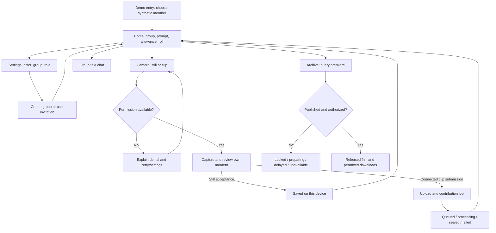

# Darkroom: current-state audit and screen map

Local design working draft for Loi, issue #189. Selected direction: **B — Darkroom**,
confirmed by Loi. Baseline: `cfb9dc7e56e17ea0faed475d0baca0239e9ce161`.
Branch: `ui-concept/loi-darkroom`. Reference: supplied
`rewind-home-iphone-en-preview.html` (A: Polaroid, B: Darkroom, C: Time Post).

This is an agent-assisted source audit and design proposal, not a human journey
observation, peer critique, agreed kickoff record, or test completion record.
Discovery-question ownership still needs agreement with the other contributors.
No implementation, public posting, deployment, or merge is part of this draft.

## Two rough directions for peer critique

Open [the interactive wireframes](darkroom-wireframes.html). These are local
design fixtures covering all seven surfaces, not Expo implementations. Screen
and state selectors are reviewer controls outside the proposed app UI.

| Decision             | B1: Roll dashboard                               | B2: Guided roll                                                   |
| -------------------- | ------------------------------------------------ | ----------------------------------------------------------------- |
| Home priority        | Roll status and countdown, then prompt/allowance | Prompt, allowance and next task, then roll status                 |
| Navigation           | Home, Camera, Chat, Archive, Settings tabs       | Roll, Conversation, Settings; capture/reveal nested in Roll       |
| Capture entry        | Persistent Camera tab and Home action            | Capture stage inside the current roll                             |
| Reveal entry         | Persistent Archive tab and contextual action     | View release stage inside the current roll                        |
| Structural trade-off | Familiar destinations but more competing choices | Fewer main destinations but Archive is less directly discoverable |
| Implementation scope | Primarily presentation and hierarchy             | Additional route/back/focus handling; no domain changes intended  |

**Provisional recommendation: B1**, because it preserves the supplied Home
direction and current navigation while the new sealed/local-save copy resolves
the audit finding. This is an agent recommendation, not Loi's final selection or
peer approval. B2 is a deliberately different alternative for comparison.

Both sets cover entry, create/join setup, Home, still/clip review, Chat, Archive
and Settings. The state selector exposes representative loading, empty, denied,
failed, processing, released and offline treatments; it is not an exhaustive
model of legal app transitions. Form persistence, real media, permission APIs,
message delivery, trimming and downloads remain represented rather than built.

Use the same tasks shown alongside each preview. Each peer should independently
identify the screen, observed hesitation, accessibility or truthful-state
challenge, and proposed revision. Record which alternative Loi advances only
after those observations are supplied. No peer feedback has been generated.

Wireframe verification: Edge 153.0.4234.48 headless; 336 screen/state/direction
combinations at widths 320, 390 and 1280 had no document horizontal overflow or
JavaScript page errors. Fixture still acceptance, clip queue representation and
reset cancellation passed interaction checks. These results apply only to the
HTML wireframe, not the Expo app, native platforms or the issue's test matrix.

## Scenario and design principles

A member briefly opens Rewind to understand the current group prompt, how much
they can contribute, and when their group's shared film will be available.
Darkroom makes the passage from collecting to sealed to released tangible using
a roll of film, a prominent countdown, warm dark surfaces and restrained type.

- Make the current group, synthetic actor and Demo nature visible.
- Explain the next action before decorative detail.
- Treat a sealed frame as an opaque placeholder, never a blurred media preview.
- Distinguish local saving, upload, contribution processing and film publication.
- Keep familiar named destinations and make status readable without colour.

## Source-grounded discovery: what is actually sealed?

All links below pin the inspected baseline, rather than moving `main`.

1. Home derives allowance from `cycle.contributionUsage` and quota, and chooses
   capture versus Archive through the reveal state:
   [CapsuleSummary.tsx](https://github.com/Collaboration95/rewind-app/blob/cfb9dc7e56e17ea0faed475d0baca0239e9ce161/src/capsule/CapsuleSummary.tsx#L116).
2. Opening Archive reads premiere and released media with the active session,
   group and cycle. With no runtime it explicitly becomes unavailable, not a
   playable fixture:
   [ArchiveScreen.tsx](https://github.com/Collaboration95/rewind-app/blob/cfb9dc7e56e17ea0faed475d0baca0239e9ce161/src/archive/ArchiveScreen.tsx#L120).
3. The server authorizes group access, then emits a playback path only for a
   `ready` premiere. Other states receive state/cycle data without that path:
   [http.ts](https://github.com/Collaboration95/rewind-app/blob/cfb9dc7e56e17ea0faed475d0baca0239e9ce161/server/src/http.ts#L1973).
4. Playback independently rechecks authorization and premiere readiness before
   resolving the file. A hidden player alone is not the enforcement mechanism:
   [http.ts](https://github.com/Collaboration95/rewind-app/blob/cfb9dc7e56e17ea0faed475d0baca0239e9ce161/server/src/http.ts#L2006).
5. Released-archive queries filter published cycles and ready media:
   [db.ts](https://github.com/Collaboration95/rewind-app/blob/cfb9dc7e56e17ea0faed475d0baca0239e9ce161/server/src/db.ts#L1563).
6. Still capture has a separate local preview/acceptance boundary; the screen
   explicitly says it uploads nothing. Do not describe local acceptance as a
   successful group submission:
   [CameraCaptureScreen.tsx](https://github.com/Collaboration95/rewind-app/blob/cfb9dc7e56e17ea0faed475d0baca0239e9ce161/src/capture/CameraCaptureScreen.tsx#L272).

**Constraint:** the owner's immediate pre-submission capture review is different
from viewing submitted group media before release. Darkroom must preserve the
review step while withholding submitted media previews until authorized release.
The supplied Home mockup's blurred image frames conflict with this treatment;
replace them with opaque film cells containing a lock symbol and explicit words.
This is a reference-design conflict, not evidence of a server defect.

**Still required:** a firsthand run of the same trace, network/UI observation of
locked and released paths, and a peer reproduction or challenge. No human
observation is inferred from source code or automated results.

## Current journey inventory and design implications

| Surface      | Current implementation                                                         | Darkroom treatment proposed                                                                           |
| ------------ | ------------------------------------------------------------------------------ | ----------------------------------------------------------------------------------------------------- |
| Demo entry   | Synthetic member chooser, pending and restore errors in `App.tsx`              | Plain “Local Demo — synthetic members”; retain chooser, retry and busy state                          |
| Group setup  | Settings owns group creation and invitation controls                           | Group name/prompt form; show ownership and preserve validation/drafts; join by existing invite path   |
| Home         | Session-scoped group, prompt, countdown, allowance, contribution/reveal status | Group/actor → current roll state/countdown → opaque roll → prompt → remaining allowance → next action |
| Still camera | Permission/capability checks, local preview, retake/discard/accept             | “Still / Clip” choice; review your capture; “Save on this device” language for local-only acceptance  |
| Clip camera  | Recording/review/trim and upload boundaries                                    | Show duration/remaining seconds, review/retake, upload progress, then actual job state                |
| Chat         | Runtime text timeline with loading, empty, denied and retry paths              | Quiet group conversation; author/time retained; no media attachments or sealed thumbnails             |
| Archive      | Runtime premiere status plus released films/clips and authorized downloads     | Rolls awaiting release are opaque; only ready premiere gets player; released collection below         |
| Settings     | Actor/group/role, invites, reminders, Demo controls, sign-out/reset            | Clearly named Settings destination; “Demo controls” grouping; honest local-data reset scope           |

The reference has four visible navigation items. Keep the existing fifth
Settings destination in the first implementation so actor/group and reset
controls remain discoverable. Do not add a tappable avatar route without a clear
accessible name and a deliberate navigation decision.

## Proposed flow and low-fidelity layout map

Phone layout proposals, top to bottom:

- **Entry:** Rewind wordmark / Local Demo explanation / member choices / error or pending message.
- **Setup:** Back / Create local group / name / prompt choices and custom field / validation / Create.
- **Home:** group and actor / collecting or release status / countdown and explicit target-time label / opaque filmstrip / prompt / remaining contributions and seconds / Add to the roll or Open Archive / five destinations.
- **Camera:** Back and mode / fixture or native source label / permission state or preview / duration and allowance where applicable / capture / review actions / result and recovery.
- **Chat:** group title / connection state / timestamped text timeline / reply context / preserved draft and Send.
- **Archive:** group title / current premiere state / published player only when ready / released films and clips / download feedback.
- **Settings:** synthetic identity / group and role / group/invite actions / reminders / Demo controls / sign-out / reset confirmation.

This is a screen map, not the detailed Android/iOS/narrow-web frames required by
the issue. The provided three Home concepts also do not by themselves establish
that each owner produced two complete end-to-end rough directions.

## State and actor matrix

| State                       | Screens and actor                     | Presentation/action                                                                       |
| --------------------------- | ------------------------------------- | ----------------------------------------------------------------------------------------- |
| Session loading             | Entry; restoring device session       | Checking Demo session; avoid exposing prior actor's content                               |
| Session missing/error       | Entry; no active actor                | Choose synthetic member or retry restoration                                              |
| Capsule loading/error       | Home; active member                   | Stable layout; loading words or actionable retry                                          |
| Invalid form                | Setup; permitted creating member      | Adjacent error; preserve name/prompt; no success claim                                    |
| Permission denied/blocked   | Camera; active member                 | Explain camera/microphone requirement, retry or device Settings guidance                  |
| Capture review              | Camera; capturing member              | Own pre-submission preview, retake/discard; accurate fixture/native source                |
| Still accepted locally      | Camera; capturing member              | Saved on this device; do not imply upload or group quota consumption                      |
| Upload/queued/processing    | Camera/Home; contributing member      | Separate progress and job status; media remains unavailable in group surfaces             |
| Retryable/permanent failure | Camera/Home; contributing member      | Retry only when supported; otherwise retake; preserve useful error context                |
| Collecting/locked           | Home/Archive; authorized group member | Opaque roll and explicit sealed text; no media URI, thumbnail or player                   |
| Film processing/delayed     | Home/Archive; authorized member       | Preparing/delayed copy and check-again action; countdown reaching zero is not publication |
| Released                    | Home/Archive; authorized member       | Open Archive; render actual ready player and authorized released entries                  |
| Empty archive/chat          | Archive/Chat; authorized member       | Explain absence with relevant next step; no invented content                              |
| Runtime absent/disconnected | Chat/Archive/Home; active member      | State unavailable/disconnected and recovery; no fake sent message or released film        |
| Membership denied           | Chat/Archive/capsule; denied actor    | Explain denied access without showing group media/message content                         |
| Reset pending/failure       | Settings confirmation; active member  | Explicit local-data scope; pending state and retryable error; benign cancel               |

## Reference adaptations and accessibility

- Retain the dark film aesthetic, large countdown and “Add to the roll” language.
- Replace “PRIVATE ROLL” with “LOCAL DEMO · SEALED” where appropriate: synthetic
  Demo access must not imply secure authentication or a privacy guarantee.
- Show “Collecting”, “Preparing film”, “Reveal delayed” and “Released” separately;
  “Developing” cannot truthfully describe every stage.
- Replace fixed “ROLL 036”, Sunday 8 PM, weekly labels, sample names and counts
  with available state. If no roll number exists, use “Current roll”.
- Quota is contributions plus seconds, not automatically “photos”. Prefer remaining
  allowance with used totals as supporting copy.
- Do not invent “4 of 5 friends contributed” from the Home reference without an
  aggregate source that actually supplies it.
- Preserve `src/theme.ts`/`DESIGN.md` semantic tokens first. Any changed palette
  needs measured text/focus contrast before acceptance; no contrast pass claimed.
- Body copy should remain comfortably readable, text should reflow with large
  font settings, controls target at least 44 points on phones, and scrollable
  content must clear navigation and safe areas.
- Keyboard order follows reading order. Use visible focus, accessible button
  names, text with status icons, and non-disruptive status announcements. Avoid
  announcing countdown updates every second.
- Phone/narrow web: one column. Desktop: bounded reading width, optionally split
  roll summary and supporting details without changing reading/navigation order.

## Local review script and remaining work

### Automated browser observations, 24 September 2026

Baseline commit above; Windows; Edge 153.0.4234.48 headless through Playwright;
390 × 844 viewport, with a Home overflow spot-check at 1280 × 800. Node
24.19.0 ran the export and browser scripts. These are agent-observed browser
results, not a human review or native iOS/Android test.

- `npm ci --ignore-scripts --no-audit --no-fund`: passed after a sandbox cache
  permission failure. Installation used the existing Node 23.9.0 and emitted
  engine warnings; export/browser execution used compatible Node 24.19.0.
- Expo web export with `EXPO_PUBLIC_CAMERA_MODE=demo`,
  `EXPO_PUBLIC_DEMO_ACCESS=entry`, and `EXPO_OFFLINE=1`: passed.
- Entered Amber through the explicit chooser. Home showed the sample group,
  prompt, 5 contributions/30 seconds remaining, sealed copy and three opaque
  locked Demo placeholders. Those placeholders are illustrative, not proof of
  three actual group contributions (`App.tsx`, HomeScreen).
- Navigated Camera, Chat, Archive and Settings successfully. Camera identified
  a fixture; Chat required the runtime; Archive showed premiere unavailable and
  retry; Settings displayed Amber, group and owner role.
- Took a fixture still, observed the labelled preview with Retake / Use this
  still / Discard, then accepted. UI reported “Saved locally. Metadata only is
  retained.” Home allowance remained 0 of 5 used and 0 of 30 seconds used.
  This supports the local-save versus group-submission distinction above.
- Desktop Home spot-check found no document-level horizontal overflow. This is
  not a full responsive, keyboard, contrast or large-text pass.
- Playwright's bundled Chromium was absent; installed Edge was used instead.
  Firefox/Safari, Android, iOS, denied-permission runs, connected runtime/release,
  invitation/group creation and the full `npm run check` remain **not tested**
  in this audit. No Darkroom implementation exists yet to validate.

Copy tension observed: Camera's general reveal-education text describes a moment
remaining sealed until group reveal, while the still result is local-only and
does not consume group allowance. The Darkroom proposal should explicitly state
which path actually submits to the group rather than carrying that ambiguity
into the new design. No runtime/domain behavior change is proposed.

At the cited commit, run the fixture app with `EXPO_PUBLIC_CAMERA_MODE=demo` and
`EXPO_PUBLIC_DEMO_ACCESS=entry`. Repeat permission checks with `demo-denied`.
Enter a synthetic member; locate group/prompt/allowance; review and accept a
fixture still; inspect Home, Chat, Archive and Settings. Repeat with the local
runtime for clip submission, processing and published-film behavior.

Record actual environment, commit, actions and results when executed. Human
reviewers must write their own observations. Android and iOS cannot be replaced
by browser viewport tests.

Next design work: firsthand current-build trace; two complete rough alternatives
within the selected Darkroom direction for peer discussion; six attributed
references from three products; detailed phone/narrow-web frames; peer feedback;
then presentation-layer implementation. Keep runtime/domain contracts unchanged.

No kickoff, critique or final agreement is claimed here. Related accessibility
issue #155 and cycle-history issue #156 remain separate scope.

## Implementation update — 25 September

The Expo Home now implements the Darkroom roll treatment: monospaced collection
countdown, opaque celluloid frames, larger prompt and apricot Add to the roll
control. Existing runtime and profile controls remain below the primary content.
Capture/clip/Chat typography and primary buttons follow the visual treatment;
Archive controls and reveal copy have readable contrast on dark surfaces.
The full UI is still subject to owner/peer visual review; this is not a claim
that the supplied Home-only reference covered every screen.

Verification: web export and TypeScript passed. Edge at 320, 390 and 1280 widths
navigated all five destinations without page errors or horizontal overflow;
Add to the roll opened fixture Camera. Jest initially passed 265/266 tests; the
remaining old-label assertion was updated and all 24 App tests then passed.
Changed UI files passed ESLint. Full `npm run check` stopped at formatting
warnings in 174 files, including untouched baseline files on this Windows
checkout; no blanket formatting was applied. Native visual review, Firefox,
connected runtime walkthrough and human critiques remain outstanding.
