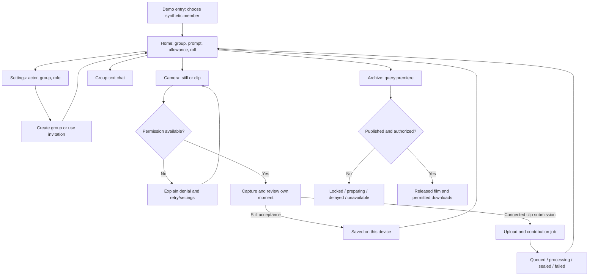

# Darkroom: current-state audit and screen map

Local design working draft for Loi, issue #189. Selected direction: **B — Darkroom**,
confirmed by Loi. Baseline: `cfb9dc7e56e17ea0faed475d0baca0239e9ce161`.
Branch: `ui-concept/loi-darkroom`. Reference: supplied
`rewind-home-iphone-en-preview.html` (A: Polaroid, B: Darkroom, C: Time Post).

This is an agent-assisted source audit and design proposal, not a human journey
observation, peer critique, agreed kickoff record, or test completion record.
Discovery-question ownership still needs agreement with the other contributors.
The original audit below is historical. Implementation and current verification
are recorded in the dated updates at the end; unfinished human checkpoints
remain pending.

## Two rough directions for peer critique

Open [the interactive wireframes](darkroom-wireframes.html). These are local
design fixtures covering all seven surfaces, not Expo implementations. Screen
and state selectors are reviewer controls outside the proposed app UI.

| Decision             | B1: Roll dashboard                               | B2: Guided roll                                                   |
| -------------------- | ------------------------------------------------ | ----------------------------------------------------------------- |
| Home priority        | Roll status and countdown, then prompt/allowance | Prompt, allowance and next task, then roll status                 |
| Navigation           | Home, Camera, Chat, Archive, Settings tabs       | Roll, Conversation, Settings; capture/reveal nested in Roll       |
| Capture entry        | Persistent Camera tab and Home action            | Capture stage inside the current roll                             |
| Reveal entry         | Persistent Archive tab and contextual action     | View release stage inside the current roll                        |
| Structural trade-off | Familiar destinations but more competing choices | Fewer main destinations but Archive is less directly discoverable |
| Implementation scope | Primarily presentation and hierarchy             | Additional route/back/focus handling; no domain changes intended  |

**Provisional recommendation: B1**, because it preserves the supplied Home
direction and current navigation while the new sealed/local-save copy resolves
the audit finding. This is an agent recommendation, not Loi's final selection or
peer approval. B2 is a deliberately different alternative for comparison.

Both sets cover entry, create/join setup, Home, still/clip review, Chat, Archive
and Settings. The state selector exposes representative loading, empty, denied,
failed, processing, released and offline treatments; it is not an exhaustive
model of legal app transitions. Form persistence, real media, permission APIs,
message delivery, trimming and downloads remain represented rather than built.

Use the same tasks shown alongside each preview. Each peer should independently
identify the screen, observed hesitation, accessibility or truthful-state
challenge, and proposed revision. Record which alternative Loi advances only
after those observations are supplied. No peer feedback has been generated.

Wireframe verification: Edge 153.0.4234.48 headless; 336 screen/state/direction
combinations at widths 320, 390 and 1280 had no document horizontal overflow or
JavaScript page errors. Fixture still acceptance, clip queue representation and
reset cancellation passed interaction checks. These results apply only to the
HTML wireframe, not the Expo app, native platforms or the issue's test matrix.

## Scenario and design principles

A member briefly opens Rewind to understand the current group prompt, how much
they can contribute, and when their group's shared film will be available.
Darkroom makes the passage from collecting to sealed to released tangible using
a roll of film, a prominent countdown, warm dark surfaces and restrained type.

- Make the current group, synthetic actor and Demo nature visible.
- Explain the next action before decorative detail.
- Treat a sealed frame as an opaque placeholder, never a blurred media preview.
- Distinguish local saving, upload, contribution processing and film publication.
- Keep familiar named destinations and make status readable without colour.

## Source-grounded discovery: what is actually sealed?

All links below pin the inspected baseline, rather than moving `main`.

1. Home derives allowance from `cycle.contributionUsage` and quota, and chooses
   capture versus Archive through the reveal state:
   [CapsuleSummary.tsx](https://github.com/Collaboration95/rewind-app/blob/cfb9dc7e56e17ea0faed475d0baca0239e9ce161/src/capsule/CapsuleSummary.tsx#L116).
2. Opening Archive reads premiere and released media with the active session,
   group and cycle. With no runtime it explicitly becomes unavailable, not a
   playable fixture:
   [ArchiveScreen.tsx](https://github.com/Collaboration95/rewind-app/blob/cfb9dc7e56e17ea0faed475d0baca0239e9ce161/src/archive/ArchiveScreen.tsx#L120).
3. The server authorizes group access, then emits a playback path only for a
   `ready` premiere. Other states receive state/cycle data without that path:
   [http.ts](https://github.com/Collaboration95/rewind-app/blob/cfb9dc7e56e17ea0faed475d0baca0239e9ce161/server/src/http.ts#L1973).
4. Playback independently rechecks authorization and premiere readiness before
   resolving the file. A hidden player alone is not the enforcement mechanism:
   [http.ts](https://github.com/Collaboration95/rewind-app/blob/cfb9dc7e56e17ea0faed475d0baca0239e9ce161/server/src/http.ts#L2006).
5. Released-archive queries filter published cycles and ready media:
   [db.ts](https://github.com/Collaboration95/rewind-app/blob/cfb9dc7e56e17ea0faed475d0baca0239e9ce161/server/src/db.ts#L1563).
6. Still capture has a separate local preview/acceptance boundary; the screen
   explicitly says it uploads nothing. Do not describe local acceptance as a
   successful group submission:
   [CameraCaptureScreen.tsx](https://github.com/Collaboration95/rewind-app/blob/cfb9dc7e56e17ea0faed475d0baca0239e9ce161/src/capture/CameraCaptureScreen.tsx#L272).

**Constraint:** the owner's immediate pre-submission capture review is different
from viewing submitted group media before release. Darkroom must preserve the
review step while withholding submitted media previews until authorized release.
The supplied Home mockup's blurred image frames conflict with this treatment;
replace them with opaque film cells containing a lock symbol and explicit words.
This is a reference-design conflict, not evidence of a server defect.

**Still required:** a firsthand run of the same trace, network/UI observation of
locked and released paths, and a peer reproduction or challenge. No human
observation is inferred from source code or automated results.

## Current journey inventory and design implications

| Surface      | Current implementation                                                         | Darkroom treatment proposed                                                                           |
| ------------ | ------------------------------------------------------------------------------ | ----------------------------------------------------------------------------------------------------- |
| Demo entry   | Synthetic member chooser, pending and restore errors in `App.tsx`              | Plain “Local Demo — synthetic members”; retain chooser, retry and busy state                          |
| Group setup  | Settings owns group creation and invitation controls                           | Group name/prompt form; show ownership and preserve validation/drafts; join by existing invite path   |
| Home         | Session-scoped group, prompt, countdown, allowance, contribution/reveal status | Group/actor → current roll state/countdown → opaque roll → prompt → remaining allowance → next action |
| Still camera | Permission/capability checks, local preview, retake/discard/accept             | “Still / Clip” choice; review your capture; “Save on this device” language for local-only acceptance  |
| Clip camera  | Recording/review/trim and upload boundaries                                    | Show duration/remaining seconds, review/retake, upload progress, then actual job state                |
| Chat         | Runtime text timeline with loading, empty, denied and retry paths              | Quiet group conversation; author/time retained; no media attachments or sealed thumbnails             |
| Archive      | Runtime premiere status plus released films/clips and authorized downloads     | Rolls awaiting release are opaque; only ready premiere gets player; released collection below         |
| Settings     | Actor/group/role, invites, reminders, Demo controls, sign-out/reset            | Clearly named Settings destination; “Demo controls” grouping; honest local-data reset scope           |

The reference has four visible navigation items. Keep the existing fifth
Settings destination in the first implementation so actor/group and reset
controls remain discoverable. Do not add a tappable avatar route without a clear
accessible name and a deliberate navigation decision.

## Proposed flow and low-fidelity layout map

```mermaid
flowchart TD
  Entry[Demo entry: choose synthetic member] --> Home[Home: group, prompt, allowance, roll]
  Home --> Settings[Settings: actor, group, role]
  Settings --> Setup[Create group or use invitation]
  Setup --> Home
  Home --> Camera[Camera: still or clip]
  Camera --> Permission{Permission available?}
  Permission -->|No| Recovery[Explain denial and retry/settings]
  Recovery --> Camera
  Permission -->|Yes| Review[Capture and review own moment]
  Review -->|Still acceptance| Local[Saved on this device]
  Review -->|Connected clip submission| Upload[Upload and contribution job]
  Upload --> Status[Queued / processing / sealed / failed]
  Status --> Home
  Local --> Home
  Home --> Chat[Group text chat]
  Home --> Archive[Archive: query premiere]
  Archive --> Gate{Published and authorized?}
  Gate -->|No| Wait[Locked / preparing / delayed / unavailable]
  Gate -->|Yes| Film[Released film and permitted downloads]
```

Phone layout proposals, top to bottom:

- **Entry:** Rewind wordmark / Local Demo explanation / member choices / error or pending message.
- **Setup:** Back / Create local group / name / prompt choices and custom field / validation / Create.
- **Home:** group and actor / collecting or release status / countdown and explicit target-time label / opaque filmstrip / prompt / remaining contributions and seconds / Add to the roll or Open Archive / five destinations.
- **Camera:** Back and mode / fixture or native source label / permission state or preview / duration and allowance where applicable / capture / review actions / result and recovery.
- **Chat:** group title / connection state / timestamped text timeline / reply context / preserved draft and Send.
- **Archive:** group title / current premiere state / published player only when ready / released films and clips / download feedback.
- **Settings:** synthetic identity / group and role / group/invite actions / reminders / Demo controls / sign-out / reset confirmation.

This is a screen map, not the detailed Android/iOS/narrow-web frames required by
the issue. The provided three Home concepts also do not by themselves establish
that each owner produced two complete end-to-end rough directions.

## State and actor matrix

| State                       | Screens and actor                     | Presentation/action                                                                       |
| --------------------------- | ------------------------------------- | ----------------------------------------------------------------------------------------- |
| Session loading             | Entry; restoring device session       | Checking Demo session; avoid exposing prior actor's content                               |
| Session missing/error       | Entry; no active actor                | Choose synthetic member or retry restoration                                              |
| Capsule loading/error       | Home; active member                   | Stable layout; loading words or actionable retry                                          |
| Invalid form                | Setup; permitted creating member      | Adjacent error; preserve name/prompt; no success claim                                    |
| Permission denied/blocked   | Camera; active member                 | Explain camera/microphone requirement, retry or device Settings guidance                  |
| Capture review              | Camera; capturing member              | Own pre-submission preview, retake/discard; accurate fixture/native source                |
| Still accepted locally      | Camera; capturing member              | Saved on this device; do not imply upload or group quota consumption                      |
| Upload/queued/processing    | Camera/Home; contributing member      | Separate progress and job status; media remains unavailable in group surfaces             |
| Retryable/permanent failure | Camera/Home; contributing member      | Retry only when supported; otherwise retake; preserve useful error context                |
| Collecting/locked           | Home/Archive; authorized group member | Opaque roll and explicit sealed text; no media URI, thumbnail or player                   |
| Film processing/delayed     | Home/Archive; authorized member       | Preparing/delayed copy and check-again action; countdown reaching zero is not publication |
| Released                    | Home/Archive; authorized member       | Open Archive; render actual ready player and authorized released entries                  |
| Empty archive/chat          | Archive/Chat; authorized member       | Explain absence with relevant next step; no invented content                              |
| Runtime absent/disconnected | Chat/Archive/Home; active member      | State unavailable/disconnected and recovery; no fake sent message or released film        |
| Membership denied           | Chat/Archive/capsule; denied actor    | Explain denied access without showing group media/message content                         |
| Reset pending/failure       | Settings confirmation; active member  | Explicit local-data scope; pending state and retryable error; benign cancel               |

## Reference adaptations and accessibility

- Retain the dark film aesthetic, large countdown and “Add to the roll” language.
- Replace “PRIVATE ROLL” with “LOCAL DEMO · SEALED” where appropriate: synthetic
  Demo access must not imply secure authentication or a privacy guarantee.
- Show “Collecting”, “Preparing film”, “Reveal delayed” and “Released” separately;
  “Developing” cannot truthfully describe every stage.
- Replace fixed “ROLL 036”, Sunday 8 PM, weekly labels, sample names and counts
  with available state. If no roll number exists, use “Current roll”.
- Quota is contributions plus seconds, not automatically “photos”. Prefer remaining
  allowance with used totals as supporting copy.
- Do not invent “4 of 5 friends contributed” from the Home reference without an
  aggregate source that actually supplies it.
- Preserve `src/theme.ts`/`DESIGN.md` semantic tokens first. Any changed palette
  needs measured text/focus contrast before acceptance; no contrast pass claimed.
- Body copy should remain comfortably readable, text should reflow with large
  font settings, controls target at least 44 points on phones, and scrollable
  content must clear navigation and safe areas.
- Keyboard order follows reading order. Use visible focus, accessible button
  names, text with status icons, and non-disruptive status announcements. Avoid
  announcing countdown updates every second.
- Phone/narrow web: one column. Desktop: bounded reading width, optionally split
  roll summary and supporting details without changing reading/navigation order.

## Local review script and remaining work

### Automated browser observations, 24 September 2026

Baseline commit above; Windows; Edge 153.0.4234.48 headless through Playwright;
390 × 844 viewport, with a Home overflow spot-check at 1280 × 800. Node
24.19.0 ran the export and browser scripts. These are agent-observed browser
results, not a human review or native iOS/Android test.

- `npm ci --ignore-scripts --no-audit --no-fund`: passed after a sandbox cache
  permission failure. Installation used the existing Node 23.9.0 and emitted
  engine warnings; export/browser execution used compatible Node 24.19.0.
- Expo web export with `EXPO_PUBLIC_CAMERA_MODE=demo`,
  `EXPO_PUBLIC_DEMO_ACCESS=entry`, and `EXPO_OFFLINE=1`: passed.
- Entered Amber through the explicit chooser. Home showed the sample group,
  prompt, 5 contributions/30 seconds remaining, sealed copy and three opaque
  locked Demo placeholders. Those placeholders are illustrative, not proof of
  three actual group contributions (`App.tsx`, HomeScreen).
- Navigated Camera, Chat, Archive and Settings successfully. Camera identified
  a fixture; Chat required the runtime; Archive showed premiere unavailable and
  retry; Settings displayed Amber, group and owner role.
- Took a fixture still, observed the labelled preview with Retake / Use this
  still / Discard, then accepted. UI reported “Saved locally. Metadata only is
  retained.” Home allowance remained 0 of 5 used and 0 of 30 seconds used.
  This supports the local-save versus group-submission distinction above.
- Desktop Home spot-check found no document-level horizontal overflow. This is
  not a full responsive, keyboard, contrast or large-text pass.
- Playwright's bundled Chromium was absent; installed Edge was used instead.
  Firefox/Safari, Android, iOS, denied-permission runs, connected runtime/release,
  invitation/group creation and the full `npm run check` remain **not tested**
  in this audit. No Darkroom implementation exists yet to validate.

Copy tension observed: Camera's general reveal-education text describes a moment
remaining sealed until group reveal, while the still result is local-only and
does not consume group allowance. The Darkroom proposal should explicitly state
which path actually submits to the group rather than carrying that ambiguity
into the new design. No runtime/domain behavior change is proposed.

At the cited commit, run the fixture app with `EXPO_PUBLIC_CAMERA_MODE=demo` and
`EXPO_PUBLIC_DEMO_ACCESS=entry`. Repeat permission checks with `demo-denied`.
Enter a synthetic member; locate group/prompt/allowance; review and accept a
fixture still; inspect Home, Chat, Archive and Settings. Repeat with the local
runtime for clip submission, processing and published-film behavior.

Record actual environment, commit, actions and results when executed. Human
reviewers must write their own observations. Android and iOS cannot be replaced
by browser viewport tests.

Next design work: firsthand current-build trace; two complete rough alternatives
within the selected Darkroom direction for peer discussion; six attributed
references from three products; detailed phone/narrow-web frames; peer feedback;
then presentation-layer implementation. Keep runtime/domain contracts unchanged.

No kickoff, critique or final agreement is claimed here. Related accessibility
issue #155 and cycle-history issue #156 remain separate scope.

## Implementation update — 25 September

The Expo Home now implements the Darkroom roll treatment: monospaced collection
countdown, opaque celluloid frames, larger prompt and apricot Add to the roll
control. Existing runtime and profile controls remain below the primary content.
Capture/clip/Chat typography and primary buttons follow the visual treatment;
Archive controls and reveal copy have readable contrast on dark surfaces.
The full UI is still subject to owner/peer visual review; this is not a claim
that the supplied Home-only reference covered every screen.

Verification: web export and TypeScript passed. Edge at 320, 390 and 1280 widths
navigated all five destinations without page errors or horizontal overflow;
Add to the roll opened fixture Camera. Jest initially passed 265/266 tests; the
remaining old-label assertion was updated and all 24 App tests then passed.
Changed UI files passed ESLint. Full `npm run check` stopped at formatting
warnings in 174 files, including untouched baseline files on this Windows
checkout; no blanket formatting was applied. Native visual review, Firefox,
connected runtime walkthrough and human critiques remain outstanding.

## Submission checkpoint — 25 September 2026

Implemented direction: B1, preserving five destinations with the supplied
Darkroom visual language. Loi selected Darkroom and iteratively reviewed the
filmstrip width, camera icon, perforations and gradient. These owner decisions
are not substitutes for the issue's independent peer critiques.

Implementation commit: `62e8b94`; integration with current main: `9676a43`.
The merge preserves contribution-ledger, unread-chat and accessibility changes.
Loi confirmed the merged app works. No concept merge into main is intended.

| Environment                                                     | Evidence and result                                                                                                                     | Remaining limitations                                                                                                                    |
| --------------------------------------------------------------- | --------------------------------------------------------------------------------------------------------------------------------------- | ---------------------------------------------------------------------------------------------------------------------------------------- |
| Android Medium_Phone emulator, Expo Go; OS version not recorded | Loi reported launch, still capture, permission recovery, large text and normal text passed; merged build smoke test passed at `9676a43` | Full connected capture-to-release journey, OS version and final screenshots still pending                                                |
| Chromium: Edge 153.0.4234.48, Windows                           | Earlier implementation review at 320/390/1280 widths passed navigation and overflow checks                                              | Full keyboard/focus script and post-merge browser retest pending; earlier review was of the working tree, not a separately pinned commit |
| iOS iPhone 14+ simulator                                        | Not tested                                                                                                                              | No macOS/iOS simulator available in this Windows workspace; teammate execution needed                                                    |
| Firefox or Safari                                               | Not tested                                                                                                                              | Second-engine review has not been performed                                                                                              |

Android defects and retests: enabled the configured virtual camera instead of
rejecting emulators; made capture content scroll above navigation; corrected
Archive's short offline layout; switched navigation to two rows for large text.
Loi subsequently reported permission recovery, still capture, and both text
sizes passed. Expo Camera deliberately generates a timestamp still on Android
emulators; the review now identifies that limitation. A physical device is
needed to verify actual scene photography. Offline Chat/Archive correctly state
that the runtime is unavailable; this does not verify connected functionality.

Automated merge verification: 348/349 Jest tests passed initially. The one
failure was an ambiguous Amber label in Settings after adding the actor header;
the assertion was scoped to the identity card and all 10 tests in that suite
passed on rerun. TypeScript, affected-file ESLint and architecture checks passed.
Submission rerun of `npm run check` stopped at Prettier warnings in 200 files,
including untouched incoming files; later stages did not run through that
command. No repository-wide formatting change was made.

Still pending for #189: six attributed inspiration references, confirmed
discovery-question ownership, firsthand peer challenge, recorded synchronous
kickoff and rough-direction critique, both peers' cross-use reviews, complete
cross-platform matrix and final visual captures, and the team's comparison and
explicit decision. No human feedback, agreement or sign-off is inferred.

## Browser owner retest — 26 September 2026

Loi reported “all passed” for the supplied Chromium checklist at phone
(390 × 844) and desktop (1280 × 800) sizes: Demo entry/Home, prompt and
allowance, sealed frames, five-tab navigation and scrolling, group-form
validation/cancellation, applicable camera permission/fallback and review
actions, Chat/Archive state messaging, and keyboard navigation including
reset-dialog cancellation. This is owner-reported testing. The checklist
referenced `6c2ebd8`; the exact installed browser (Chrome or Edge), its version
and the running checkout were not independently confirmed. The report does
not distinguish offline from connected-runtime paths, so a complete connected
capture-to-release pass is not inferred.

CI at `6c2ebd8` passed baseline checks, web-shell validation and responsive
browser checks: [successful Actions run](https://github.com/Collaboration95/rewind-app/actions/runs/36157834467).
The prior responsive failure was an uppercase wordmark assertion; all three
offline shell assertions now ignore casing while retaining reload/deep-link
coverage. This supersedes the earlier CI status, not the historical Windows
formatting observations.

Android [owner demo recording](https://github.com/Collaboration95/rewind-app/pull/201#issuecomment-5835259972)
is attached to the PR in place of separate screenshots. Firefox 155 installed
but failed to launch on Windows with a side-by-side configuration error;
Firefox UI tests therefore remain blocked, not passed. iOS and independent
peer reviews remain pending.

## Peer-review revisions — 27 September 2026

Jiayu (`bibi45c`) supplied firsthand iPhone feedback in
[the PR discussion](https://github.com/Collaboration95/rewind-app/pull/201#issuecomment-5847385621).
`Big-Fat-Duck` supplied an explicitly Codex-assisted Android review; that is
retained as assisted evidence, not a human device sign-off.

| Feedback                                                      | Revision and verification                                                                                                                                                                                                                                                                                                                                |
| ------------------------------------------------------------- | -------------------------------------------------------------------------------------------------------------------------------------------------------------------------------------------------------------------------------------------------------------------------------------------------------------------------------------------------------- |
| iPhone camera unavailable before any permission prompt        | Native iOS no longer calls Expo's web-only availability probe. Physical iPhones reach the permission flow; iOS simulators remain explicitly unsupported unless a fixture is selected. Camera and microphone requests are sequential. Adapter regressions cover physical iOS and simulator behavior; a fresh iPhone permission/capture retest is pending. |
| Chat reconnecting and messages not received by another member | Merged main through `de9125d`, including the XHR-backed native EventSource fix. Native transport tests, 15 server realtime tests and a two-browser-member send/receive test passed. Two-iPhone connected retest remains pending.                                                                                                                         |
| Home too long and action below first viewport                 | Moved member selection and runtime diagnostics to Settings. Prompt, allowance and next action now precede the smaller filmstrip. A 390 × 844 browser regression verifies all three are in the initial viewport; large native text still permits scrolling.                                                                                               |
| Other screens lack Darkroom continuity                        | Added shared compact film-edge section markers to still/clip capture, Chat, Archive and Settings; released archive entries use film-card borders, own Chat messages use the celluloid surface, and the Settings member picker uses the same dark tokens and focus treatment. Existing names, permissions and truthful state copy are preserved.          |
| Released roll caption says sealed                             | Caption now follows the released state; both sealed and released caption/accessibility states have regression coverage.                                                                                                                                                                                                                                  |

Final local validation: all 42 Jest suites / 365 tests passed. All 13 targeted
Edge browser checks passed, including initial Home viewport, reset-dialog focus,
route keyboard navigation and two-member Chat delivery. All 15 server realtime
tests passed. TypeScript and affected-file lint passed. These results do not
replace native iPhone owner/peer retesting or the remaining Firefox/Safari and
joint-comparison requirements.

## Attributed reference study — 28 September 2026

These six references across three products were researched with AI assistance
after implementation, for owner review. They are not retroactive evidence of
Loi's original inspiration, personal app usage or an earlier peer meeting.
The adaptation and rejection columns are design analysis, not product claims.

| Product and source                                                                                                           | Documented principle                                                                       | Application to Darkroom                                                                       | Deliberately rejected                                                                                   |
| ---------------------------------------------------------------------------------------------------------------------------- | ------------------------------------------------------------------------------------------ | --------------------------------------------------------------------------------------------- | ------------------------------------------------------------------------------------------------------- |
| [Apple Photos: collections](https://support.apple.com/guide/iphone/browse-your-photo-collections-iph4f36c4148/ios)           | Frequently used collections can be pinned and reordered.                                   | Prioritize prompt, allowance and next action; put secondary Demo controls in Settings.        | Adding configurable dashboard ordering to this concept; it adds scope without proving the core journey. |
| [Apple Photos: Hidden album](https://support.apple.com/en-us/104987)                                                         | Hidden media has an explicit location and an unlock boundary.                              | Clearly distinguish sealed and released Archive states, with no preview before release.       | Suggesting biometric authentication or equivalent privacy guarantees for synthetic Demo access.         |
| [Signal: message status](https://support.signal.org/hc/en-us/articles/360009303072-Troubleshooting-sending-messages)         | Sending, sent, delivered and read are distinct statuses.                                   | Keep connection state and successful local POST separate; verify receipt in a second session. | Inventing delivered/read receipts when Rewind has no supporting contract.                               |
| [Signal: permissions](https://support.signal.org/hc/en-us/articles/360007062172-Signal-Permissions-OS-Notification-Settings) | Camera and microphone permissions are explained by the feature they enable.                | Explain capture access and recovery; distinguish OS permission from preview readiness.        | Copying permissions for contacts, phone identity or unrelated capabilities.                             |
| [Lapse: disposable camera listing](https://apps.apple.com/us/app/lapse-disposable-camera/id1636699256)                       | Capture is framed as taking a photo now and developing it later.                           | Filmstrip, collection countdown and delayed reveal communicate time and anticipation.         | Removing the capturing member's draft review; Rewind explicitly supports it before acceptance.          |
| [Lapse: product and account explanation](https://lapse.com/)                                                                 | Film photography informs a friends-oriented journal; account management lives in Settings. | Keep the current group visible and move actor-management controls off Home.                   | Claiming real accounts, private friend networks or public profiles for local synthetic members.         |

## Remaining human execution — ready-to-use sequence

1. **Physical iPhone retest:** use the updated branch and record its commit,
   device, iOS and Expo Go versions. Unset `EXPO_PUBLIC_CAMERA_MODE`, start Expo
   on LAN, open Camera, allow permissions, capture/review/discard, then verify
   denial and recovery through Settings. Do not reset unrelated phone data.
2. **Connected Chat:** start the local runtime using README instructions and
   its reachable LAN address. On two clients, enter different synthetic members
   in the same group. Send one unique message each way; both must appear without
   reload. Background/reopen a client and verify reconnect and no duplicates.
   Record connection status and any failed step; health alone is not a pass.
3. **iPhone 14+ simulator:** on a Mac run `npm ci`, then
   `npm start -- --ios --lan --clear`. Use explicit `demo` / `demo-denied`
   camera fixtures for simulator-only capture review and label them as such.
   Check all five routes, safe areas, forms, keyboard, large text, scroll bounds
   and sealed/revealed copy. The physical-iPhone report does not replace this
   explicitly required simulator environment.
4. **Firefox or Safari:** repeat the six-task browser script at 390 × 844 and
   1280 × 800, including Tab/Shift+Tab, visible focus, form cancellation and reset
   cancellation. Record browser/version, commit, actual state and pass/fail.
   Firefox's Windows launch remains blocked: `sxstrace` diagnostics also required
   unavailable administrator access. No browser-test pass is inferred.
5. **Independent cross-use:** each teammate posts their own findings, hesitation,
   accessibility/truthful-state challenge and setup result. Loi must likewise
   personally try both peer branches. Agent-generated critiques do not satisfy
   this checkpoint.
6. **Joint comparison:** use journey clarity, accessibility, phone/web fit,
   truthful Demo/sealed states and implementation cost as comparison rows.
   Link each person's evidence for each concept, then record preferred direction,
   retained ideas, open trade-offs, follow-up owners and each person's explicit
   agreement or dissent. Meeting dates, attendees and decisions remain unfilled
   until supplied by participants. Do not merge this concept into main.

The security revision renders the wireframe's selected-state label with
`textContent`; no selected text is interpolated as HTML. A browser regression
injects markup into an option, verifies it remains inert text, and confirms the
ordinary still-review interaction continues to work. CodeQL clearance must be
confirmed by the next remote scan.
