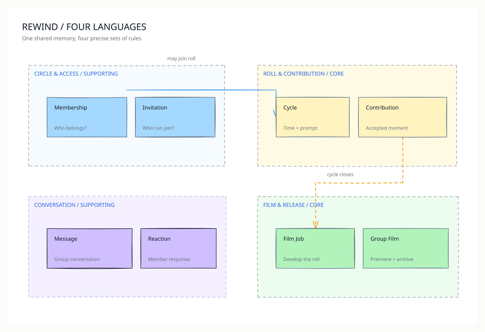
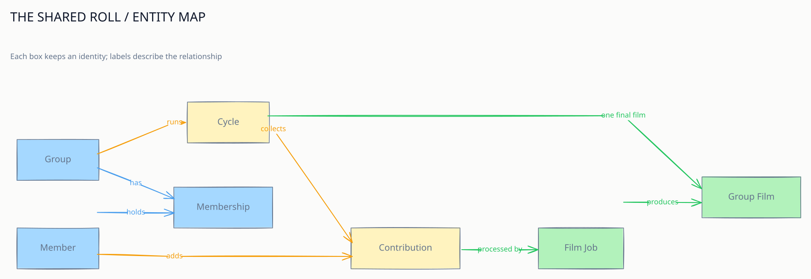

# Workshop 2 — Rewind's domain language and boundaries

> **A group makes a sealed roll; Rewind develops it into a film.**

This is a **Rewind adaptation** of Workshop 2 in *Reusable Assets and Frameworks*, p. 29. The course's actual exercise uses **Maid2Order** and its six scenarios (pp. 30–32). It asks for (1) domain entities and their relationships, (2) bounded contexts (BCs), and (3) names that follow a ubiquitous language (UL). The model below answers those same questions for the Rewind idea from [Workshop 1](../rewind-platform-thinking/README.md); it is not the Maid2Order sample solution.

## 1. Start with six concrete Rewind situations

| Situation | What the model must explain |
| --- | --- |
| A friend starts a private circle | A **Member** creates a **Group** and becomes its owner through a **Membership**. |
| The owner invites another friend | An **Invitation** belongs to one Group; accepting it creates a Membership, if allowed. |
| The group begins a new roll | A **Cycle** belongs to one Group and carries its **Prompt**, start/end times, status, and contribution policy. |
| A member leaves a moment | A **Contribution** belongs to one Cycle and one Member. Its allowance is checked for that member's current seven-day window; its media stays locked before reveal. |
| The roll closes | A **Film Job** processes eligible clips in capture order and produces one released **Group Film** for the Cycle, or records a delayed/failed outcome. |
| Friends return to watch | A **Premiere** is the Film's 24-hour viewing window. The released Film remains in the Group archive; Members can send **Messages**, **Replies**, and **Reactions** in the group's conversation. |

These are scenarios for modelling, not a claim that every proposed product feature is complete in the current demo.

## 2. Name the entities and relationships

An **entity** has an identity that matters over time. A **value object** describes a state or measurement and is replaced as a whole. An **event** records that something happened. This distinction stops the model from turning every field or technical file into an entity.

| Bounded context | Entity and identity | Main relationships and responsibility |
| --- | --- | --- |
| Circle & access | **Member** (`MemberId`) | A participant. The current local demo's Members are *synthetic actors*, not authenticated accounts. |
| Circle & access | **Group** (`GroupId`) | One private circle; has many Memberships, Invitations, and Cycles. |
| Circle & access | **Membership** (`GroupId`, `MemberId`) | Joins Member to Group, records role (`owner` or `member`) and acceptance. A Member can belong to several Groups in the product model. |
| Circle & access | **Invitation** (`InvitationId`) | Issued for a Group; acceptance may create a Membership. Its code, expiry, and used state are local runtime rules today. |
| Roll & contribution | **Cycle** (`CycleId`) | One Group's bounded collection period; owns its Prompt, time window, status, and lock rule. A Group has many Cycles over time, one current Cycle. |
| Roll & contribution | **Contribution** (`ContributionId`) | One Member's accepted submission to one Cycle. Its capture time, duration, deletion state, and processing reference matter after the upload attempt. |
| Roll & contribution | **Contribution allowance window** (Member + Cycle + seven-day boundary) | Tracks the member's weekly count and seconds. Treat the quota limit itself as a value/policy, rather than a separate social actor. |
| Film & release | **Film Job** (`JobId`) | Processes clips or compiles a Cycle's film; tracks retries, output, and failure. A job is not the finished Film. |
| Film & release | **Group Film** (`FilmId` conceptually) | The durable released memory for one Cycle; its premiere window and archive availability have different rules. In the demo, film output is represented through a `media_jobs` record rather than a separate Film table. |
| Conversation | **Message** (`MessageId`) | Sent by one Member in one Group. A Reply is a Message referencing a parent Message; the local contract permits one reply level. |
| Conversation | **Reaction** (`ReactionId`) | One Member's response to a Message. |

The **Prompt**, **ContributionQuota**, **ContributionUsage**, **CycleStatus**, **LockState**, **PremiereWindow**, and media duration/trim settings are values or policies. `CycleClosed`, `ContributionAccepted`, and `FilmReleased` are useful **domain events** for the model; they need not imply an event bus or separate services in this prototype. A **clip asset** is the processed media associated with a Contribution, not another name for the Contribution itself.

### The relationship sketch

```text
Member ──< Membership >── Group ──< Cycle ──< Contribution >── Member
                              │          │             │
                              │          │             └── processed by Film Job
                              │          └── produces one Group Film at release
                              ├──< Invitation
                              └──< Message ──< Reaction
                                      └── optional parent Message (Reply)
```

`──<` means “one to many” here. The Group Film is **one per completed Cycle** as a product rule; a missing or delayed film is a valid state while compilation is pending. Membership is checked before a Group-scoped contribution, message, film, or download is exposed.

## 3. Draw semantic boundaries

A bounded context is where a term has one precise meaning and one set of rules. It is a **model boundary**, not an instruction to deploy four services or databases. Rewind's current local runtime is a single application and SQLite database; this context map is a design vocabulary for keeping that application coherent.

| Context | Kind | Owns the language and rules | It provides to other contexts |
| --- | --- | --- | --- |
| **Circle & access** | Supporting | Member, Group, Membership, Invitation; owner and group access decisions | Stable `GroupId`/`MemberId`, membership and owner decisions |
| **Roll & contribution** | **Core** | Cycle, Prompt, Contribution, allowance window; time limits, acceptance, deletion, and pre-reveal lock | Accepted contribution references; cycle close/reveal facts |
| **Film & release** | **Core** | Film Job, processed clip, Group Film, premiere and archive availability | Film status and released-film references |
| **Conversation** | Supporting | Message, Reply relation, Reaction; group-scoped conversation | Messages/reactions and their group references |

The **core** is the sealed group roll and its eventual film: those two contexts carry Rewind's distinctive promise. Group access and chat are necessary supporting capabilities. Camera capture, FFmpeg, SQLite, HTTP, and notifications are delivery or infrastructure mechanisms; they are not bounded contexts just because they have code folders. Reminders are a policy over Cycle timing and Member/Group preferences; give them their own context only if their language and rules become substantial.

### How the contexts meet

1. **Circle & access → Roll & contribution:** a membership decision plus `MemberId` and `GroupId` lets the member act in a Cycle. The Roll context still owns whether the Cycle is collecting and whether allowance remains.
2. **Roll & contribution → Film & release:** a closed Cycle supplies eligible Contribution references, capture order, and lock/release facts. Film & release owns retries, processing, compilation, and publication.
3. **Film & release → Circle & access / Conversation:** a released Film is visible only through Group membership. The Group's conversation can discuss it, but Message does not own the film file.
4. **All Group-scoped reads:** access is checked at the entry boundary. Passing a `GroupId` is a resource selection, never proof of membership.

In a modular monolith these can be function calls and typed results. If they later become independently deployed services, the IDs, decisions, and events become explicit integration contracts. Avoid sharing another context's internal tables as a shortcut.

## 4. Use one language in speech, docs, and code

| Say this | Mean exactly this | Avoid conflating it with |
| --- | --- | --- |
| **Member** | A participant in a Group; synthetic in the present demo | A verified account or “user” with real authentication |
| **Group** | The private circle | A chat room alone or a Cycle |
| **Membership** | A Member's role and belonging in one Group | An Invitation or a Demo session |
| **Cycle** | A Group's bounded collection period | A seven-day allowance window; the default product Cycle is four weeks |
| **Prompt** | The Cycle's capture theme | A reminder notification |
| **Contribution** | An accepted Member submission to a Cycle | A raw MP4, processed clip, upload attempt, or Film Job |
| **Allowance window** | One Member's seven-day count/seconds budget within a Cycle | The entire Cycle or a global quota |
| **Locked** | Unrevealed media cannot be viewed or downloaded | Metadata being invisible; contribution metadata may be shown |
| **Group Film** | The compiled, released memory for one Cycle | A source clip, processing job, or another group's film |
| **Premiere** | The first 24 hours after release | Permanent archive availability; the Film remains in the archive afterward |
| **Reply** | A Message referencing a parent Message | A separate chat domain entity |

An example sentence in this language: **“A Member with an active Membership adds a Contribution to the Group's collecting Cycle; after the Cycle closes, a Film Job creates the Group Film for the Premiere.”** Everyone on the team can use that sentence to check API names, UI copy, documentation, and tests for accidental meaning changes.

## 5. Walk the six situations through the model

- **Start a circle:** create Group and owner Membership; no Cycle is implied until the first roll begins.
- **Invite:** Invitation is Group-scoped; accepting it adds a Membership once. A code is not an account credential.
- **Start a roll:** create Cycle with Prompt, schedule, allowance policy, and locked state.
- **Contribute:** verify Membership, collecting state, clip limits, and the Member's current allowance window; store Contribution and request media processing. A retry must not spend allowance twice.
- **Close and develop:** close the Cycle, select eligible processed clips, compile in capture order, and track Film Job status. Keep the Film unavailable on failure or while delayed.
- **Premiere and remember:** release the Film, begin its 24-hour Premiere, allow authorised chat and reactions, and keep the Film in the Group archive after the Premiere window.

## What is evidenced today

The [local domain contracts](../../../../docs/domain/contracts.md), [glossary](../../../../docs/domain/glossary.md), [invitation contract](../../../../docs/domain/invitation-contract.md), [clip contract](../../../../docs/domain/media-contract.md), and current [SQLite migration](../../../../server/migrations/001-initial.sql) support the Member, Group, Membership, Invitation, Cycle, Contribution, media-job, Message, and Reaction vocabulary. The [proposal](../../proposals/proposal-rewind.md) describes the longer-lived Film, 24-hour Premiere, archive, and future real-account product. The demo represents the Film through media-job output, so the separate `Group Film` identity and boundary above are a **conceptual target**, not a claim about today's schema. Local Demo access is synthetic and must not be described as secure authentication.

## Diagrams

The editable hand-drawn [context map](canvas/context-map/canvas/excalidraw/scene.excalidraw) shows who owns each idea and how the contexts meet. The editable [entity map](canvas/entity-map/canvas/excalidraw/scene.excalidraw) shows the important identities and relationships. Both were made with Codex Excalidraw. SVG previews appear below.





## Submission note

The course slide uses Maid2Order, so use this Rewind version as a **worked adaptation** unless the instructor has approved substituting the team project. The workshop submission location and team number, if required, still need to be added by the team.
