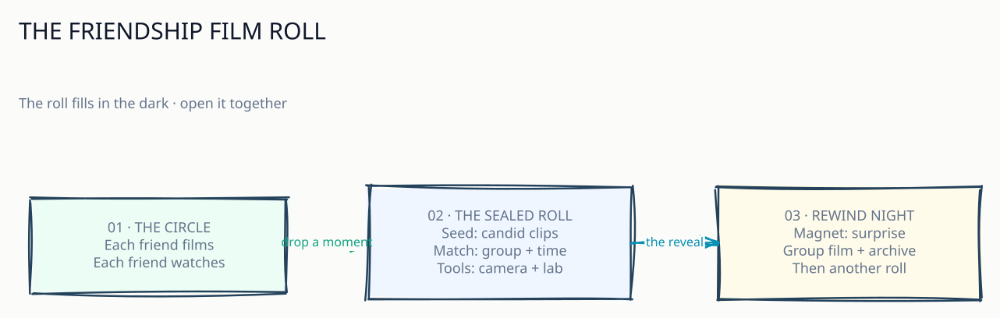

# Rewind: the group camcorder

> **A private roll of everyday life, developed into a group film you discover together.**

Workshop 1 asks us to think of a platform as a system that helps people create
and exchange value. Rewind makes a small social exchange feel like a ritual:
each friend leaves moments on the group's shared roll; Rewind keeps the roll
sealed; the friends meet again for the premiere.

## The idea in one scene

One friend films a rainy walk home. Another records the chaos of making dinner.
Someone else captures the first day in a new flat. The clips go into the same
private group roll. Nobody sees the others' footage while it is sealed. At the
end of the cycle, Rewind develops the roll into a chronological film. The
ordinary fragments become a story the group could not have made alone.

That shared roll is Rewind's seed: **short, candid moments that become a group
memory.**

## The six parts of the platform

### 1. Seed — a time postcard

The seed is a member's short video contribution, captured inside Rewind and
placed in its group cycle. Think of each clip as a tiny postcard from ordinary
life. A collection of postcards becomes the group's film.

For the proposed product, each member can contribute up to five clips and 30
seconds of video per week; a clip can be at most 15 seconds. A normal cycle
runs for four weeks. The classroom demo can shorten that cycle to one day.

### 2. Producers and consumers — the same friends, in turn

| Role | In Rewind |
| --- | --- |
| Producers | Friends who add their everyday moments to the shared roll |
| Consumers | Those same friends when they discover the finished group film |
| Group owner | Starts the roll, chooses a prompt, and invites the circle |

Members switch between camera and audience. The circle is small and invited:
the proposal targets groups of two to ten people, with five for the demo.

### 3. Interaction — from pocket moment to premiere

1. An owner creates a group, picks a prompt, and invites friends.
2. During the cycle, each member captures and submits short clips.
3. Rewind processes each clip and seals it. Members can check their
   contribution progress, while the unrevealed footage stays hidden.
4. At the cycle boundary, Rewind arranges the eligible clips by capture time
   and compiles them into a group film.
5. The group gets a 24-hour premiere, then the film remains in its private
   archive. The next cycle starts immediately.
6. Friends watch, react, talk, and begin leaving moments for the next roll.

### 4. Magnet — suspense with a reason to come back

- **The reveal:** friends are curious about what everyone captured. The sealed
  roll creates anticipation without asking members to post for public approval.
- **The small ask:** a short clip and a weekly time limit make participation
  feel manageable.
- **The shared ritual:** the premiere gives the group a moment to return to
  together, even when they live far apart.
- **The growing keepsake:** each cycle adds another chapter to the private
  archive.
- **The look and feel:** original camcorder-inspired treatment makes the film
  feel like a roll the group made, not a polished social feed.

Rewind's retention loop is the friendship ritual itself: contribute a little,
wonder about the rest, watch together, keep the film, and start another roll.

### A creative signature: the roll fills in the dark

Give each group a shared, blank filmstrip that slowly fills as clips arrive.
Show the group only the total progress; keep contributor names and footage
sealed until Rewind Night. At reveal, the blank frames become the film. This
turns the waiting period into a visible part of the experience and gives the
group a fresh reason to anticipate the premiere. It is a proposed product
flourish for discussion, beyond what the current demo promises.

### 5. Toolbox — the pocket camera and the darkroom

- **Pocket camera:** record, trim, and submit a short clip.
- **Roll card:** see the prompt, time remaining, and contribution allowance.
- **Sealed envelope:** show that a clip arrived without exposing its footage
  before the reveal.
- **Darkroom:** validate and process submitted media, then compile the group
  film in capture order.
- **Premiere room:** play the film and give members a place to chat and react.
- **Memory shelf:** keep released films and authorized downloads in the
  group's archive.
- **Projectionist's panel:** monitor processing and retries, and explain a
  delayed premiere clearly.

These are the product capabilities that make the social exchange possible.
The platform's value comes from coordinating the group roll, its reveal, and
the memories that follow.

### 6. Matchmaker — keep the right moments on the right roll

Rewind's matchmaker is a simple, explainable curator:

- **Who belongs:** invitations place members in the right private group.
- **Which roll:** group membership and cycle dates bind contributions to one
  shared time capsule.
- **What comes next:** eligible clips are ordered by capture time to make the
  film feel like a passage through the cycle.
- **What helps people join in:** a common prompt and visible contribution
  progress give members a shared starting point.

Rewind needs group membership, cycle and prompt details, clip duration,
contribution status, and capture time to coordinate this. Its workshop idea
does not need popularity scores or personality profiles; the curator's job is
to assemble this group's roll in a way members can understand.

## Why this is a platform

A camera can save one person's video. Rewind coordinates a private exchange
between friends, turns individual contributions into a group-owned memory,
and gives that group a reason to return for another cycle. Each member can
contribute and consume value, while the shared film becomes more meaningful
as the circle takes part.

**The creative hook:** Rewind is a camcorder for a whole friend group, with a
delayed-developing roll and a tiny premiere built into the way memories are
made.

## What exists now, and what is proposed

This workshop write-up uses the Rewind idea in this repository. The current
project is a local-first prototype/demo with synthetic members and data. Its
local runbook describes a synthetic end-to-end journey through joining,
submitting a generated clip, reveal, and archive. The wider proposal describes
the intended invite-only mobile/PWA product, with real capture, accounts,
cloud operations, and a four-week cycle. Keep those future product goals
separate from what the current demo proves.

Project sources: [README](../../../../README.md),
[proposal](../../proposals/proposal-rewind.md), and
[discovery handoff](../rewind-product-discovery-handoff.md).

## Diagram

The editable Excalidraw canvas tells the story as a hand-drawn sequence:
[open it in the local canvas](http://127.0.0.1:43220/). The SVG preview is
available at
[group-camcorder-storyboard.svg](canvas/excalidraw/exports/group-camcorder-storyboard.svg).

## Submission detail

The course slide asks for a Canvas team-folder submission named
`Platform Thinking-Teamxx`, with `xx` replaced by the team's number. Add that
number and any team-agreed changes before submission.
