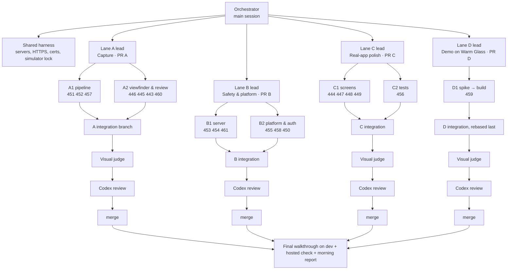

# Overnight run, 5–6 October 2026: 20 issues, 4 PRs

One unattended night. Many agents in parallel, four PRs to `dev`, one review
pass per PR, everything merged by morning with a decision log to read over
coffee. Nobody is asked anything during the run: when a choice comes up, the
agent takes the decision written here (or the smallest reasonable one), records
it, and keeps going.

## 1. Scope

### In: 20 issues

| #   | Issue                                                     | Lane | Kind                                        |
| --- | --------------------------------------------------------- | ---- | ------------------------------------------- |
| 329 | Show the captured video in the review screen              | A    | verify and close (already works since #440) |
| 443 | Photo review controls unreadable on a light photo         | A    | UI                                          |
| 445 | Video review controls overlap a landscape clip            | A    | UI                                          |
| 446 | Video mode opens without a camera preview                 | A    | bug                                         |
| 451 | Cancel does not stop a video upload                       | A    | bug, high                                   |
| 452 | Reading video metadata can hang                           | A    | bug, high                                   |
| 457 | Web upload converts the clip to base64 on the main thread | A    | perf                                        |
| 460 | **New:** selected look live in the viewfinder and review  | A    | feature                                     |
| 450 | Active users signed out after about 12 h                  | B    | auth, high                                  |
| 453 | Demo session route needs no sign-in on hosted             | B    | security, high                              |
| 454 | No per-account limits on writes and streams               | B    | security, high                              |
| 455 | Seven test files run nowhere                              | B    | CI, high                                    |
| 458 | Security headers                                          | B    | deploy                                      |
| 461 | **New:** keep moderation records; index safety tables     | B    | migration                                   |
| 444 | Film end screen buttons                                   | C    | UI                                          |
| 447 | Chat on a small phone with the keyboard open              | C    | UI                                          |
| 448 | Offline sign-in clears the password                       | C    | UI/auth                                     |
| 449 | Copy and number mismatches (D3, M1, countdown)            | C    | UI/server                                   |
| 456 | Settings deletion and report/block UI tests               | C    | tests, high                                 |
| 459 | **New:** Try Demo on the Warm Glass UI                    | D    | feature                                     |

### Out, and why

| #             | Why it is not in tonight                                                                           |
| ------------- | -------------------------------------------------------------------------------------------------- |
| 172, 230, 261 | AWS infrastructure and a database migration to PostgreSQL: real cost and data risk, Sprint 3.      |
| 348           | Needs a reminder to arrive on a physical iPhone (genuine device check). Code paths are already in. |
| 362           | Final report: `doc/planning/report/` is frozen.                                                    |

## 2. Rules for the run

These sit on top of `AGENTS.md` and `CLAUDE.md`, which still apply in full.

1. **No questions.** Every open choice is decided by an agent using §6 or the
   smallest reasonable option. Each decision goes in the decision log (§9) and
   the PR body's **Decisions** section.
2. **Genuine human needs only** stop work: a physical device, a password, or
   money (new paid AWS resources). Anything else, including "a human should
   look at this", is handled by a screenshot judge (§7).
3. **Definition of Done** per issue: core outcome works in the cheapest real
   environment, `npm run test:fast` passes, the PR's Quality check is green, one
   review pass done with blocking findings fixed, PR merged to `dev`, issue
   closed with `Shipped in #<pr>.`
4. **Two attempts** per problem, then record the blocker in the queue and move
   on. A blocked issue leaves the PR; the rest still ships.
5. **Never remove or weaken a test assertion.** When a screen is replaced
   (Lane D), rewrite the assertion against the new screen so it checks the same
   behaviour.
6. **Frozen and forbidden**: `doc/planning/report/`, `doc/planning/archive/`,
   `rewind-v1`, `rewind-v1-source.zip`. Never touch the main `rewind-app`
   checkout's branch; all work happens in worktrees.
7. **New dependencies**: none, unless a lane cannot ship without one; then the
   lead records why. No new CI workflows, environments or AWS resources.
8. **Merging**: Claude may merge every PR tonight (CLAUDE.md), including auth
   and migration, after Quality is green and the review's blocking findings are
   fixed. Never force-push `dev`/`main`; never enable auto-merge.
9. **Commits** follow the `git-commit` skill. No attribution lines.

## 3. Before you go to bed (5 minutes, the only human steps)

- [ ] Keep the Mac awake and plugged in (Claude Code app: keep-awake on).
- [ ] Simulator access granted for **iPhone 17 Pro** (done) and, for a second
      lane, **iPhone 17**: attach it in the simulator panel and click "Let
      Claude use it".
- [ ] `codex login status` is logged in and has quota for 4 reviews at
      `gpt-6.1-sol` medium.
- [ ] `gh auth status` is fine.
- [ ] At least 20 GB free disk (4 worktrees with `node_modules`, Playwright,
      screenshots).
- [ ] Paste the kickoff prompt from §12.

## 4. Topology

- **Orchestrator** (the session you start): sets up the harness, launches the
  four lane leads in parallel, watches the queue file, sequences merges (§8),
  runs the final walkthrough and writes the morning report. It does not write
  feature code.
- **Lane lead**: owns one PR. Creates the lane branch
  `guru/night-<lane>-<slug>` from `origin/dev` in its own worktree, splits its
  issues into sub-branches for workers when they don't touch the same files,
  merges the sub-branches into the lane branch, runs the lane's checks,
  screenshots and judge, opens the PR, runs the review, fixes, merges.
- **Worker**: one issue (or a tight group), on a sub-branch
  `guru/night-<lane>/<issue>` in its own worktree, with a ten-line brief
  (`ship-issues` step 3), not this whole document.
- **Visual judge**: a fresh agent given only screenshots, the design reference
  and the rubric (§7). Returns pass/fail per screen with reasons.
- **Reviewer**: Codex, one pass per PR (§8).

## 5. Shared harness

The walkthrough harness from the 5 October iPhone check, reused per lane.

| Lane  | API  | Metro | Web  | HTTPS | Data dir                  |
| ----- | ---- | ----- | ---- | ----- | ------------------------- |
| A     | 8801 | 8811  | 8821 | 8831  | `.local-data/night/a`     |
| B     | 8802 | 8812  | 8822 | 8832  | `.local-data/night/b`     |
| C     | 8803 | 8813  | 8823 | 8833  | `.local-data/night/c`     |
| D     | 8804 | 8814  | 8824 | 8834  | `.local-data/night/d`     |
| Final | 8805 | 8815  | 8825 | 8443  | `.local-data/night/final` |

- Server: `REWIND_PORT=… REWIND_METRO_PORT=… REWIND_WEB_PORT=…
REWIND_DATA_DIR=… node scripts/run-real-local.mjs` (10-minute cycles), from
  the lane's worktree. Lane D uses `make run` (Demo) on its ports instead.
- HTTPS: one `mkcert` cert for `localhost` (CA kept in the night folder, not
  installed on the Mac), trusted in each simulator with
  `xcrun simctl keychain <udid> add-root-cert rootCA.pem`. A ~30-line Node
  proxy per lane (`https://localhost:<HTTPS>` → web port, rewriting `Origin`
  and `Host`), because WebKit drops the Secure session cookie on plain HTTP.
- Accounts: generated once into the night folder's `accounts.txt` (one random
  password, usernames `n<lane>owner`, `n<lane>member`); never echoed into PRs
  or reports. Test accounts on local hosts only; never on hosted dev.
- **Simulator lock**: one file per device in the night folder. A lane takes the
  lock (write its name and time), does its simulator pass, releases it. Most
  checks use Playwright WebKit (iPhone 402×874 @3x and 375×667) and Chromium
  with `--use-fake-device-for-media-stream` for camera work; the simulator is
  for each PR's final acceptance and anything Playwright can't show (keyboard,
  safe areas, iOS video decode).
- Clean up: each lane stops its own server and proxy before its lead finishes.

## 6. Lanes, issue briefs and the decisions taken in advance

### Lane A: Capture (`src/capture/**`) → PR "Capture: live looks, reliable upload, readable review"

**A1 pipeline** (worker 1, sequential: 452 → 451 → 457; they share
`platform.ts` and the upload path)

- **#452 metadata timeout.** Race `readVideoMetadata` against a 10 s timeout;
  clear `video.src` on settle. For MediaRecorder output reporting
  `duration = Infinity`, use the seek-to-end trick (`currentTime = 1e101`, wait
  for `durationchange`) before failing. Error copy: "This video couldn't be
  read. Try recording again." Focused test with a video element that never
  fires `loadedmetadata`.
- **#451 cancel stops upload.** One `AbortController` per upload run in
  `ClipUploadSession`; pass its signal through `uploadClip` →
  `transferContribution`/`direct-transfer`; Cancel aborts, and if a job id
  already exists also sends the existing DELETE. Test: slow fake transfer,
  cancel mid-way, request aborted, no contribution registered.
- **#457 no base64 on web.** Web passes the recorded/picked `Blob` straight to
  `direct-transfer` (`source.kind: 'blob'` already exists). Native keeps its
  file-URI path. Delete web-only base64 helpers that become unused. Check: the
  injected-recording Playwright spec still passes; no long task over 200 ms in
  a Chromium performance trace of a 15 s upload.

**A2 viewfinder and review** (worker 2, sequential: 446 → 460 → 445 → 443;
all touch the capture screens and `camera-ui.tsx`)

- **#446 preview on video mode.** Find why switching to video doesn't start the
  stream (access state vs stream start in `VideoCaptureScreen`). "Restore
  camera preview" stays only for real interruptions (backgrounding, a track
  ending).
- **#460 live look (new).**
  - Web only (the iPhone PWA); native keeps today's behaviour.
  - Build the preview from the same `RETRO_LOOKS` spec that grades the file:
    - `filter` → CSS `filter` on the live `<video>` (and on the review
      image/video);
    - `tint` → an overlay with the matching `mix-blend-mode`;
    - `vignette` → a radial-gradient overlay;
    - `grain` → a tiled noise overlay, animated, static under Reduce Motion.
  - One helper `lookPreviewStyle(spec)` used by viewfinder and review, so they
    can't drift.
  - Look chips move into the viewfinder (above the shutter, same chip style as
    review) and stay in review. The selected look carries from viewfinder to
    review to upload.
  - Decision if CSS and canvas output differ visibly: canvas wins for the saved
    file; tune the preview overlay until the average colour of a viewfinder
    screenshot and the saved photo differ by ≤ 8/255 per channel on the fake
    camera's test pattern.
  - Tests: a unit test that every look's preview style comes from its spec, and
    a Playwright spec that screenshots each look in the viewfinder and asserts
    the colour-match bound against the sealed photo.
- **#445 review controls.** Back/play/forward and the time readout sit below
  the letterboxed picture for landscape clips; for portrait full-bleed they sit
  on a bottom scrim. Never drawn across the picture's edge.
- **#443 readable photo review.** Top and bottom scrims
  (`rgba(0,0,0,.45)` → 0, about 140 pt) behind Close, the counter, look chips,
  caption and Retake; chips get dark glass. Judge with a white-wall photo
  (fake camera with a white frame, or a white JPEG in the file fallback).
- **#329.** Verify the review player plays a recorded clip in Simulator Safari
  and WebKit; close with "Works since #440; re-verified in PR A." No code.

### Lane B: Safety & platform → PR "Safety: Demo hardening, rate limits, headers, moderation records, session expiry, all tests in CI"

**B1 server** (worker 1, sequential: 461 → 453 → 454; all in `server/src`)

- **#461 moderation records + indexes.**
  - Migration `030-moderation-records.sql`. SQLite can't alter a foreign key,
    so rebuild `member_reports` and `content_reports` with the existing
    rebuild-table pattern in `db.ts`.
  - Targets become `ON DELETE SET NULL`; reporter, reason and time are kept.
  - Add the indexes listed in the issue.
  - Bump the expected migration version in the tests that pin it.
  - Migration-chain test, plus a test that a report survives the reported
    account's deletion.
- **#453 Demo on hosted.** Decision: **keep Try Demo on hosted** (the owner
  wants it there) and harden it instead of switching it off:
  - per-IP limit on `POST /sessions/demo`, reusing the registration limiter
    pattern;
  - Demo staged uploads capped at 15 MB and 10 per Demo session per hour;
  - Demo reset at most once per 10 minutes per group;
  - `REWIND_DEMO_ENABLED` (default `true`) so it can be switched off without a
    deploy change later.

  Tests for each limit.

- **#454 per-account limits.**
  - In-process token buckets keyed by account (one host today; mark it with a
    `ponytail:` comment and the upgrade path):
    - chat 30/min;
    - group creation 5/day and 20 owned;
    - reports plus blocks 20 per 10 min;
    - open chat streams 5 per account.
  - Responses are `429 {error:'rate_limited', message}`; the client shows the
    message in its existing error slot.

  Server tests per limit.

**B2 platform and auth** (worker 2, parallel to B1, then sequential:
455 → 458 → 450)

- **#455 every test runs.**
  - `npm test` and `quality.yml` select node tests by glob
    (`tests/*.test.mjs`, `scripts/*.test.mjs`, minus `native-build`), so local
    and CI run the same set.
  - Fix whatever the seven newly running files surface.
  - If one is broken beyond two attempts, exclude it by name with a comment and
    a new issue. Never weaken it.
- **#458 headers.**
  - A shared nginx snippet included in every `location`:
    - `X-Content-Type-Options nosniff`;
    - `Referrer-Policy strict-origin-when-cross-origin`;
    - `X-Frame-Options DENY`;
    - `Strict-Transport-Security max-age=31536000`.
  - `Content-Security-Policy` with `frame-ancestors 'none'` enforced, and the
    rest of the policy as `Content-Security-Policy-Report-Only`, so Expo's
    inline styles can't break the app tonight.
  - No CloudFront or Terraform change.
  - Update `tests/web-deployment.test.mjs`.
  - After the merge, the orchestrator checks the deployed headers with
    `curl -I`.
- **#450 session expiry.** Remove the client idle-expiry timer; the app signs
  out on the server's 401 (already handled). Keep any absolute-expiry handling
  if the server sends one. Test: fake timers past the old expiry with
  successful requests, still signed in.

### Lane C: Real-app polish → PR "Real app: film end, small-phone chat, offline sign-in, copy fixes, Settings safety tests"

**C1 screens** (worker 1, sequential: 444 → 447 → 448 → 449)

- **#444 film end screen.** Buttons sit fully inside the bottom bar with the
  bar's padding; Replay and Save film use the standard secondary button (light
  glass), not grey.
- **#447 small-phone chat.** On the web, when the composer is focused and
  `visualViewport.height` drops by more than 150 pt, hide the dock and shrink
  the premiere banner into a one-line pill. Restore on blur. Check at
  375×667 with the composer focused (Playwright viewport shrink) and in the
  simulator with the real keyboard.
- **#448 offline sign-in.** The username and password stay filled; the message
  is "You're offline. Sign in again when you're connected."; Sign in stays
  enabled; "Retry session check" isn't shown on this path. The code is in
  `DemoAccessEntry` in `App.tsx`: keep the diff small, because Lane D also
  edits `App.tsx`.
- **#449 copy and numbers.**
  - D3: malformed codes are caught on the client as today. The server's
    unknown, expired and revoked codes all show "That code isn't valid or has
    expired." Don't separate unknown from expired: that would let people probe
    for valid codes.
  - M1: Your moments shows the sealed duration rounded to the nearest second,
    the same as Home.
  - Countdown: under 24 h show "N hours until our film", under 1 h
    "N minutes".

**C2 tests** (worker 2, parallel)

- **#456.** RNTL tests for:
  - Settings → Delete account: wrong password shows the error; confirm posts
    `/auth/account/delete` and returns to Welcome.
  - Members → person → Report and Block.
  - ReportSheet "Also block".

  New file `tests/real-settings-safety.test.tsx`.

### Lane D: Demo on Warm Glass (#459) → PR "Try Demo on the Warm Glass UI"

One lead, one worker, longest lane. Starts at once and merges last.

1. **Spike (≤ 45 min).** Inventory what the Demo shell renders and which
   clients the Warm Glass screens (`src/real/*`,
   `RealAccountGroupExperience`) need.
   - **Default:** a Demo adapter that implements those client interfaces over
     the Demo runtime client, so Try Demo renders the real screens.
   - **Fallback:** if the screens are too tied to real accounts, restyle the
     Demo screens with the `src/ui` primitives and tokens.

   Write the choice and the reason in the decision log.

2. **Build.** Cover every Demo-reachable surface:
   - Home, capture, Your moments, Settings, Chat, Archive and Film.
   - Settings shows only what the Demo can do. Demo-only notices (synthetic
     members, reset) appear as Warm Glass cards.
   - No new Demo-only features.
3. **Delete.** Remove the old Demo screens and `src/theme.ts` once nothing
   imports them, and move any remaining `COLORS` users (`PortraitGuard`,
   `BuildTag`, `RuntimeStatusCard`) to `WARM`/`DARK`.
4. **Tests.** Every Demo Jest/Playwright assertion is rewritten against the new
   screens to check the same behaviour; none removed. `test:slow` must pass.
5. **Rebase.** Rebase onto `dev` after PR C merges (shared `App.tsx`), then
   judge and review.

## 7. Visual acceptance: how agents "approve" UI

Every UI issue (443, 444, 445, 446, 447, 448, 449, 459, 460) needs a judge pass
before its PR leaves the lane.

1. **Shots.** The worker captures before (from `origin/dev`) and after for each
   affected screen code:
   - Playwright WebKit at 402×874 and 375×667;
   - Chromium fake camera for capture screens;
   - Simulator Safari for the PR's final pass (keyboard, safe areas, video
     decode).

   Names follow `<lane>-<code>-<before|after>-<device>.png`.

2. **Machine checks** on every after-shot, all of which must pass:
   - no horizontal overflow (`scrollWidth ≤ innerWidth`);
   - no clipped text (`scrollWidth > clientWidth` on text nodes);
   - interactive targets ≥ 44×44;
   - nothing under the dock or the Dynamic Island area.
3. **Design reference.** Render
   `rewind-ui-final-screens/docs/design/home-directions/index.html#final` with
   Playwright and screenshot the same screen codes.
4. **Judge.** A fresh judge agent gets after-shots, before-shots, the design
   shots and this rubric, and answers pass/fail per screen:
   - Is it readable on any background?
   - Does anything overlap or get clipped?
   - Do spacing and type match the design within about 4 pt?
   - Does it match the issue's Expected?
   - Did any other screen get worse?
5. **Iterate.** Fail → the worker fixes and re-shoots. Two failed judge rounds
   → ship the better of the two, record "judge not satisfied: <reason>" in the
   decision log, and open a follow-up issue.
6. **Commit.** Only the after-shots used in the PR body go to the
   `pr-assets/night-<lane>` branch; the rest stay in the night folder.

## 8. Review, PRs and merge order

- One PR per lane, four in all. Title as in §6; body has **What changed**,
  **Decisions**, **Checks run**, before/after table, and `Refs #…` lines (no
  closing keywords).
- **Checks before the PR**:
  - every lane runs `lint`, `typecheck`, `format:check`,
    `architecture:check` and `test:fast`;
  - lanes A, C and D also run `test:slow` and `test:a11y` (web, routing,
    accessibility);
  - lane B runs `test:slow` too (the CI test set changes).
- **Review**: one Codex pass per PR from the lane worktree, every PR treated as
  large or sensitive:
  `codex exec review --base origin/dev -m gpt-6.1-sol -c model_reasoning_effort="medium"`.
  - Fix P0/P1/P2 findings.
  - P3 and false positives go in one PR comment, with the reason for each.
  - If the review finds a new blocking problem in a fix, one more review pass,
    no more.
- **CI**: wait with `gh pr checks <n> --watch`. On a red check, read the failed
  log, fix, push; two attempts, then leave the PR open and say why in the
  morning report.
- **Merge order** (each when green):
  1. A and B as soon as each is ready (they share no files).
  2. C when ready.
  3. D last: rebase onto `dev` after C, rerun its checks, then review and merge.
- After every merge, the other open lanes sync with `dev` (the
  `sync_with_base_branch` tool where available, otherwise merge `origin/dev`),
  rerun `test:fast`, push.
- Close each issue after its PR merges: `Shipped in #<pr>.`; remove `doing`.

## 9. Decision log and morning report

- **Queue file** (`.local-data/night-2026-10-05/queue.md`, `ship-issues`
  format): `- [x] #451 → PR #470 merged`, `- [!] #447 blocked: <one line>`.
- **Decision log** (same folder, `decisions.md`), one entry per decision:
  `#issue · decision · options considered · why · how to reverse`.
  Copied into each PR's **Decisions** section.
- **Morning report**, written by the orchestrator and sent to the owner as a
  file:
  1. a table of every issue (status, PR, one line);
  2. the four PR links;
  3. every decision that changes behaviour or copy, especially #453 (Demo kept
     on hosted), #454 limits, #458 CSP mode, #459 adapter vs restyle and #460
     look placement;
  4. judge failures and follow-up issues;
  5. hosted dev check results;
  6. what still needs a real iPhone.

## 10. Final phase (after all merges)

1. Fresh `dev` worktree, final harness (§5), the two-lane walkthrough from
   `walkthrough/PLAN.md` (simulator Safari + Playwright) over every screen
   code, including Try Demo.
2. Hosted dev after the last deploy, with no accounts:
   - Welcome, Sign in with the keyboard up, legal pages, Try Demo end to end;
   - `curl -I` for the new headers;
   - `/api/health` migration version 30.
3. Any regression the walkthrough finds: fix it on one last small branch if it
   is clearly caused by tonight's work; otherwise file an issue.
4. Stop every server, proxy and worktree the run created.

## 11. Timeline (rough)

| Time      | Lane A                                          | Lane B                | Lane C            | Lane D                       |
| --------- | ----------------------------------------------- | --------------------- | ----------------- | ---------------------------- |
| 0:00–0:30 | Harness, briefs, worktrees                      |                       |                   |                              |
| 0:30–3:30 | A1 + A2 in parallel                             | B1 + B2               | C1 + C2           | Spike, then build            |
| 3:30–5:00 | Integrate, judge, PR                            | Integrate, PR, review | Judge, PR, review | Build                        |
| 5:00–6:30 | Review fixes, merge                             | Merge                 | Merge             | Delete old UI, tests         |
| 6:30–8:00 |                                                 |                       |                   | Rebase, judge, review, merge |
| 8:00–9:30 | Final walkthrough, hosted check, morning report |                       |                   |                              |

## 12. Kickoff prompt

> Run the overnight plan in
> `doc/planning/night-runs/2026-10-05-overnight-plan.md`. You are the
> orchestrator. Use a workflow (multi-agent orchestration approved): four lane
> leads in parallel with their workers, a visual judge per UI lane, one Codex
> review per PR, merge in the §8 order, then the §10 final phase and the
> morning report. Don't ask me anything; take the decisions in §6 or the
> smallest reasonable option and log them. Commit this plan in PR B.

## 13. Risks and fallbacks

| Risk                                            | Fallback                                                                                 |
| ----------------------------------------------- | ---------------------------------------------------------------------------------------- |
| Lane D adapter turns out too deep               | Restyle fallback (§6 D1); if still not done by 6:30, ship what renders and file the rest |
| Live look CSS can't match the canvas output     | Ship the preview with the closest match, log the measured gap, file a follow-up          |
| Newly running tests (#455) reveal real failures | Fix within two attempts or exclude by name with an issue, never weaken                   |
| CSP breaks the app on hosted                    | Enforced part is only `frame-ancestors`; the rest is report-only                         |
| Simulator lock contention                       | Playwright for everything but each PR's final pass; second device if granted             |
| Codex quota runs out                            | Claude `/code-review` at high effort as the review pass, noted in the PR                 |
| A PR stays red after two fix attempts           | Leave it open, skip its merge, say why in the morning report                             |
