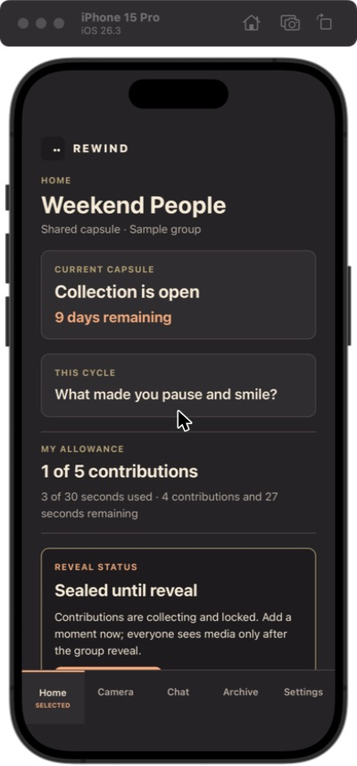
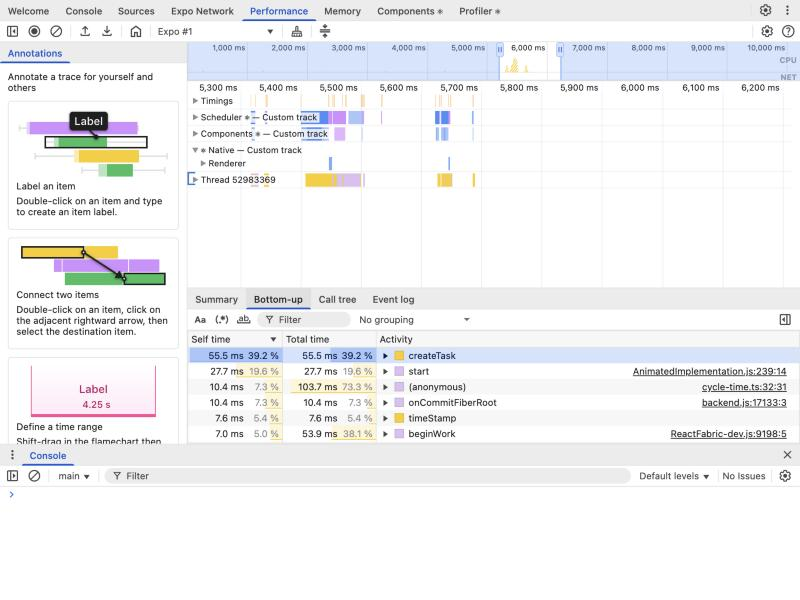
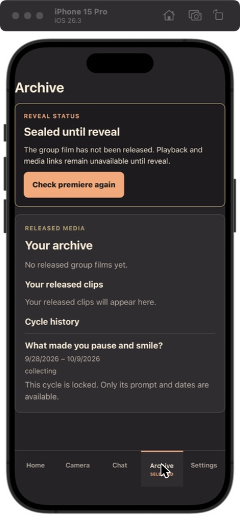

# Local performance profiling and before/after evidence

- **Issue:** [#267 — Research local performance profiling and before/after evidence](https://github.com/Collaboration95/rewind-app/issues/267)
- **Review status:** Jiayu Jiang has reviewed most of this report line by line. Long has reviewed the iOS sections, run the dev/production comparison and a live J1/J2 capture (see §16 and §17), and the open corrections below. **@Collaboration95 (Guru), please review the report content.**
- **Status:** Research recommendation. No profiling campaign, instrumentation, or optimization was run for this brief. Tool conclusions come from vendor documentation and have not yet been exercised on this repository.
- **Scope:** Rewind's three clients — web (PWA), iOS (Expo Go), Android (Expo Go, later the planned APK) — plus the local Node service (runtime, worker, FFmpeg subprocess).
  - **Round 1:** web, iOS, Node service.
  - **Round 2:** Android, after the S2-D04 APK is available.
- **Data rule:** Use synthetic accounts, groups, invitations, and media only. Raw traces, recordings, and HAR files stay on the capturing machine and are never committed.

---

## 1. Recommendation

No single tool covers every client and layer, so we combine tools by role:

| Role                                        | Question it answers                                                | Web                             | iOS                                      | Android (round 2)                              | Node service                                 |
| ------------------------------------------- | ------------------------------------------------------------------ | ------------------------------- | ---------------------------------------- | ---------------------------------------------- | -------------------------------------------- |
| **Show that it got faster**                 | When does the screen appear, before vs after?                      | sitespeed.io (video, filmstrip) | Maestro (fixed steps + screenshots)      | Maestro; Flashlight (performance curves)       | autocannon (endpoint p50/p95)                |
| **Find why it is slow**                     | Which component, JS path, or line is slow?                         | Chrome DevTools Performance     | React Native DevTools; Xcode Instruments | React Native DevTools; Android Studio Profiler | `--cpu-prof` flame graph                     |
| **See the whole request path** (X-Ray-like) | Is an upload slow in transfer, the DB write, the queue, or FFmpeg? | —                               | —                                        | —                                              | OpenTelemetry + Jaeger (**follow-up issue**) |

We also recommend minimal, opt-in timing instrumentation, gated in a follow-up. The discussion is in §13.2; the proposal is #321 _PROPOSAL: Add opt-in request timing logs and client User Timing marks for performance measurement_.

---

## 2. Current `dev` state that shapes this plan

As of `origin/dev` on 2026-09-30:

1. **All three clients are targets.**
   - The [Sprint 2 user journey plan](https://github.com/Collaboration95/rewind-app/blob/dev/doc/planning/sprints/sprint-2-user-journey-plan.md) (S2-D04) plans an Android APK and keeps iOS on Expo Go.
   - #310 fixed an Android Expo Go entry issue.
   - #243's acceptance covers web, iPhone, and Android.
2. **A reusable harness already exists.** `scripts/production-e2e-server.mjs` exports the production web build and starts the runtime with a fixed clock and synthetic seed. It serves both on `127.0.0.1:8083` (override with `REWIND_E2E_PORT`). Web and service measurements should build on it. It re-exports the web build on every start, so startup is slow; that time is not part of any measurement.
3. **iOS only runs in Expo Go today.** There is no `eas.json` and no `expo-dev-client`; `app.json` sets an iOS bundle identifier but no Android package. See §4.
4. **The database is `node:sqlite` `DatabaseSync` (synchronous).**
   - Synchronous queries block the event loop, so they stand out clearly in a `--cpu-prof` flame graph.
   - We found no OpenTelemetry instrumentation for `node:sqlite`; a third-party plugin exists only for `better-sqlite3`. Database spans would therefore have to be written by hand.
5. **The service runs as more than one process:** the runtime (`server:start`), the worker (`server:worker`), and FFmpeg subprocesses.
6. **Entry and screens are changing quickly** (#243, #320, #304, #313, #189). This does not block building the pipeline, but:
   - automation scripts must follow UI changes;
   - numbers from different dates are not comparable (see §6, rule 0).
7. **Known limits:**
   - #314: Video crashes the signed-in Expo Go app, so the video journey is measured at the service level for now.
   - Once #243 is implemented, cold launch shows a branded screen for at least 600 ms. That is a floor, not a regression.
8. **Logging today:** audit events and CLI output only; there is no per-request timing. See §13.2.
9. **A hosted environment exists.** https://d2m6kz76y4kuvm.cloudfront.net serves the hosted web (PWA) build.
   - According to `deploy/README.md` and the IaC plan, it is a single Lightsail instance behind a CDN. The instance runs the web container, which proxies `/api/` to the Node runtime. #318 routes sign-in traffic to this URL.
   - iOS and Android Expo Go can also use this HTTPS API (#243, #305).
   - **This plan is local-first; hosted runs are supplementary only:**

   |           | Local (`production-e2e-server`)                   | Hosted (CloudFront)                                                                                                     |
   | --------- | ------------------------------------------------- | ----------------------------------------------------------------------------------------------------------------------- |
   | Network   | No network latency; stable numbers                | Real network and CDN; closer to what users see                                                                          |
   | Control   | Fixed data, clock, and load                       | Small shared instance; noisy                                                                                            |
   | Data      | Synthetic only                                    | Includes real pilot accounts (#241); high privacy risk                                                                  |
   | Use for   | Baselines, before/after, load tests, flame graphs | An occasional J1 run for real-network load experience                                                                   |
   | **Never** | —                                                 | **Load testing** (it degrades the shared demo and incurs AWS cost), or capturing real accounts in screenshots or traces |

   Hosted monitoring belongs to #166. Get owner approval before any hosted run.

10. **The existing E2E config deliberately disables screenshots and tracing** (`playwright.e2e.config.ts`) and redacts invite codes, session IDs, and local paths. Performance capture must meet the same bar.

---

## 3. Tool comparison

Platforms: `Web` `iOS` `Android` `Node` (`Node` = the local Node service). Android-only tools belong to round 2.

| Tool                                                     | Platforms                    | What it shows (documented)                                                                                                                     | Fit for Rewind                                                                                                                                                         | Local / cost / export                                                                | Verdict                                  |
| -------------------------------------------------------- | ---------------------------- | ---------------------------------------------------------------------------------------------------------------------------------------------- | ---------------------------------------------------------------------------------------------------------------------------------------------------------------------- | ------------------------------------------------------------------------------------ | ---------------------------------------- |
| **sitespeed.io / Browsertime**                           | `Web`                        | Browser video, filmstrip, visual metrics, HAR waterfall, Core Web Vitals, User Timing, HTML report; scripted journeys via `measure.start/stop` | Best for visual before/after evidence. Web only. In-app SPA transitions need a short script                                                                            | Open source; runs via Docker or npm (npm needs a local browser and FFmpeg for video) | **Adopt**                                |
| **Chrome DevTools Performance / Memory**                 | `Web`                        | Main-thread, rendering, and network timeline; screenshots; heap snapshots; traces can be saved                                                 | Primary web diagnosis tool                                                                                                                                             | Free; keep traces local                                                              | **Adopt**                                |
| **Playwright Trace Viewer**                              | `Web`                        | Per-action timeline, DOM snapshots, screenshots, network                                                                                       | Already installed; good for repeatable steps and screenshots. Action durations include auto-waiting, so they are not benchmark numbers                                 | Free; `trace.zip` holds sensitive data and must never be committed                   | **Supporting**                           |
| **React Native DevTools (Performance + React Profiler)** | `iOS` `Android`              | Performance panel (since RN 0.83): JS execution, React tracks, network, User Timings; downloadable traces; heap snapshots                      | First choice for JS/React diagnosis on native. Interactive only. Expo notes that profiles work only in debug builds and are not yet source-map symbolicated            | Local, free                                                                          | **Adopt**                                |
| **Xcode Instruments / `xcrun xctrace`**                  | `iOS`                        | Launch, CPU, thread state, memory, hangs/hitches; `xctrace` can record and export from the command line                                        | Separates native cost from JS cost. When attached to Expo Go, results include Expo Go's own host overhead                                                              | Mac only, free                                                                       | **Adopt**                                |
| **Android Studio Profiler / Perfetto**                   | `Android`                    | CPU, memory, frame timing, system traces                                                                                                       | Native Android diagnosis; needs a debuggable or profileable build                                                                                                      | Free; Windows and macOS                                                              | **Supporting (round 2)**                 |
| **Flashlight**                                           | `Android`                    | FPS, CPU, RAM, JS thread; repeated runs combined into a visual report                                                                          | The closest thing to an out-of-the-box Android performance score; pairs with the APK. Android only; needs a device over adb                                            | Open source; Windows installer available                                             | **Alternative (round 2, after the APK)** |
| **Maestro**                                              | `iOS` `Android`              | YAML UI flows with screenshots                                                                                                                 | Makes every run perform identical steps and capture the same states. It is not a profiler                                                                              | Open source; supports Expo Go                                                        | **Adopt**                                |
| **Node `--cpu-prof` / `--heap-prof`**                    | `Node`                       | CPU flame graph, heap allocation                                                                                                               | First choice for the service; shows synchronous SQLite blocking directly                                                                                               | Built in, free                                                                       | **Adopt**                                |
| **autocannon**                                           | `Node`                       | Fixed-concurrency HTTP load; p50/p95/p99 latency and throughput                                                                                | Fills the load-testing gap in the draft; reusable for #175                                                                                                             | Open-source CLI                                                                      | **Adopt**                                |
| **OpenTelemetry + Jaeger**                               | `Node` (client optional)     | Distributed trace waterfall with per-span timing                                                                                               | Closest to AWS X-Ray. Jaeger v2 runs as one container with in-memory storage (UI on `:16686`, OTLP on `4317/4318`)                                                     | Open source, Docker                                                                  | **Adopt (follow-up issue)**              |
| **Aspire Dashboard (standalone)**                        | `Node`                       | OTel traces, metrics, and logs in one UI                                                                                                       | Drop-in alternative to Jaeger; the instrumentation stays the same                                                                                                      | Free, one container                                                                  | **Alternative**                          |
| **SigNoz (self-hosted)**                                 | `Node`                       | Traces, metrics, logs, dashboards                                                                                                              | The most complete option, but it needs at least 4 GB of Docker memory and five containers (ClickHouse, Keeper, Postgres, collector, UI), which is heavy for local work | Open source; resource-heavy                                                          | **Alternative**                          |
| **Sentry Spotlight**                                     | `Web` `iOS` `Android` `Node` | Local view of Sentry errors and traces                                                                                                         | Covers client and server, but requires adopting the Sentry SDK                                                                                                         | Local, free                                                                          | **Alternative**                          |
| **Expo Atlas**                                           | `Web` `iOS` `Android`        | JS bundle composition and size                                                                                                                 | Useful only for startup-bundle investigations                                                                                                                          | Local, free                                                                          | **Supporting**                           |

<details>
<summary>Not adopted (click to expand)</summary>

| Tool                   | Platforms       | Why not                                                                               |
| ---------------------- | --------------- | ------------------------------------------------------------------------------------- |
| Lighthouse             | `Web`           | Covered by sitespeed.io; cannot measure in-app SPA transitions                        |
| Clinic.js              | `Node`          | Its README states it is not actively maintained and may be inaccurate on current Node |
| Android Macrobenchmark | `Android`       | Requires a native Android project and a benchmark module; too costly now              |
| EAS Observe            | `iOS` `Android` | Hosted and usage-priced; outside this local-only scope                                |

</details>

---

## 4. Native build modes (how far to trust the numbers)

Context:

- [#232](https://github.com/Collaboration95/rewind-app/issues/232) defines today's run path: `make run`, then open the app in a compatible Expo Go runtime. It warns that public Expo Go may not match the project's SDK.
- Sprint 2 S2-D04 plans an Android APK while iOS stays on Expo Go.
- The formal measurement build should follow #232 and S2-D04 rather than introduce a separate path.

| Mode                               | Platforms       | How                                                                                                                                                                               | Trust                                                                                                      | Use                                                          |
| ---------------------------------- | --------------- | --------------------------------------------------------------------------------------------------------------------------------------------------------------------------------- | ---------------------------------------------------------------------------------------------------------- | ------------------------------------------------------------ |
| Expo Go, development mode          | `iOS` `Android` | `make run` (#232)                                                                                                                                                                 | Low: dev checks and unminified JS. Expo documents that development mode "slows your app down considerably" | Diagnosis only                                               |
| Expo Go, production mode           | `iOS` `Android` | `npx expo start --no-dev --minify`. Expo documents this for performance testing; compatibility with Expo Go on SDK 57 must be checked, because an Android issue existed on SDK 50 | Medium: `__DEV__=false` and minified, but still running inside the Expo Go host                            | Interim before/after                                         |
| Local Release build (simulator)    | `iOS`           | `npx expo run:ios --configuration Release`. This runs prebuild automatically and generates `ios/`, so do it in a throwaway `git worktree` to keep native output out of commits    | Higher                                                                                                     | Candidate for formal comparison; the simulator has no camera |
| Android APK (S2-D04, round 2)      | `Android`       | After S2-D04 configures the package name and build profile                                                                                                                        | Higher                                                                                                     | Formal Android comparison; pairs with Flashlight             |
| Release build on a physical device | `iOS` `Android` | iOS requires signing                                                                                                                                                              | Highest                                                                                                    | Capture journeys and final validation                        |

**Rule:** baseline and follow-up must use the same build mode, recorded in `run.json`. Simulator numbers show relative change only.

---

## 5. Candidate journeys

| #   | Journey                                                                    | Platforms                       | Notes                                                                                                                                           |
| --- | -------------------------------------------------------------------------- | ------------------------------- | ----------------------------------------------------------------------------------------------------------------------------------------------- |
| J1  | Cold launch to Welcome/Home                                                | `Web` `iOS` `Android`           | Record cold and warm launches separately; #243 is merged on `dev`, so the 600 ms branded cold-launch floor already applies, not a future change |
| J2  | Switch between Home and the primary tabs (Camera, Chat, Archive, Settings) | `Web` `iOS` `Android`           | Measure tap to stable screen; directly relevant to #309                                                                                         |
| J3  | Open Archive and page through it                                           | `Web` `Node`                    | Seed data using the approach in `server/tests/paging-performance.test.mjs` (55 archived cycles, 51 films)                                       |
| J4  | Take and submit a photo                                                    | `iOS` `Android` physical device | The simulator has no camera                                                                                                                     |
| J5  | Video upload to compiled film                                              | `Node`                          | Use the `npm run test:full-cycle` path; not in Expo Go until #314 is fixed                                                                      |

---

## 6. Repeatable before/after method

0. **"Before/after" means the base and head of the same optimization PR**, not two dates.
1. **Freeze the comparison.** Commit, build mode, device, OS, browser, and seed data are fixed and recorded; only the code under test may differ. The working tree must be clean. Use two `git worktree` checkouts (base and head) so both builds exist side by side.
2. **Stabilize the environment.** Close CPU-heavy applications and fix the power mode and network conditions. On Windows, copy the project outside OneDrive before measuring.
3. **Define start and end markers** for every journey, in writing.
4. **Warm up, repeat, interleave:**
   - run one unrecorded warm-up;
   - run **10** measured repetitions by default, and **20** for cold launch, noisy journeys, or whenever the verdict is _Inconclusive_;
   - **interleave base and head (A-B-A-B…)** rather than running all baseline runs first, so thermal and background drift affect both sides equally;
   - keep cold and warm results separate.
5. **Separate timing from diagnosis.** Collect timings with no profiler, trace, or recording attached; collect diagnostic traces in a separate pass.
6. **One owner per platform.** Numbers from different machines are never compared.
7. **Review.** Inspect outliers and confirm that the change did not alter the work the journey performs.

### Statistics

- **Do not trim the minimum and maximum; compare the median and the interquartile range (IQR).**
  - The median already ignores extremes, so trimming barely changes it.
  - The IQR (the middle 50% of values) excludes both tails by construction.
  - Trimming can hide real stalls.
- **Keep every raw row.** Exclude only failed runs (errors, or journeys that did not complete), and record the reason in `results.csv`.
- **Spread:**
  - fewer than 10 runs: report min–max;
  - 10 or more runs: report the IQR;
  - 20 or more runs: report P90 as well. With fewer samples, P90 is effectively the maximum.
- **Verdict:**
  - the after IQR lies entirely below the before IQR → **Faster**;
  - it lies entirely above → **Slower**;
  - the two ranges overlap → **Inconclusive**;
  - where practical, add a Mann-Whitney U test (p < 0.05) as supporting evidence.

### Presenting results

1. **Filmstrip comparison (most intuitive).** Align the before and after sitespeed.io filmstrips on the same time axis. On native, pair Maestro screenshots of the same step with the timing numbers.
2. **Dot plot (shows spread).** Draw one chart per journey: before and after on the x-axis, one dot per run, with the median line and IQR box. Avoid bar charts of averages, which hide variance.
3. **Pivot summary (most rigorous).** Generate it directly from `results.csv`; a spreadsheet pivot is enough:

| Journey       | Platform | Before median | After median | Δ       | Δ %  | IQR (before / after) | n     | Verdict      |
| ------------- | -------- | ------------- | ------------ | ------- | ---- | -------------------- | ----- | ------------ |
| J2 tab switch | `Web`    | 420 ms        | 260 ms       | −160 ms | −38% | 400–450 / 245–275 ms | 10/10 | Faster       |
| J2 tab switch | `iOS`    | …             | …            | …       | …    | …                    | …     | Inconclusive |

(The example numbers show the format only; they are not measurements.)

---

## 7. Metrics to collect later

| Layer                                        | Metrics                                                                                         | Caution                                          |
| -------------------------------------------- | ----------------------------------------------------------------------------------------------- | ------------------------------------------------ |
| Native launch and navigation `iOS` `Android` | Launch to first frame, launch to interactive, tap to stable screen, dropped frames, CPU, memory | Keep cold and warm separate                      |
| Web `Web`                                    | Navigation to content, action to stable state, long tasks, visual complete, transferred bytes   | Fixed browser, viewport, and network             |
| React/JS `Web` `iOS` `Android`               | JS execution, React commit durations, repeated renders, memory trend                            | The React Profiler does not see native rendering |
| Node service `Node`                          | Endpoint p50/p95, throughput, event-loop delay, CPU hotspots, job execution time, queue wait    | State whether load is single-user or concurrent  |
| Evidence quality                             | n, median, IQR, failures                                                                        | Keep raw rows                                    |

---

## 8. Evidence capture

### Linking to code

**Do not copy branch code;** reference commits instead:

- the app under test: the PR link plus base and head SHAs;
- the measurement scripts (sitespeed.io, Maestro, autocannon): their commit too, because a script change changes the numbers;
- the working tree must be clean.

### Folder layout (one per comparison, kept small)

```text
perf-evidence/pr-<number>-<topic>/   ← local or shared drive, never committed
├── run.json      shared metadata: PR, base/head SHA, harness SHA, device, OS, build mode, tool versions
├── results.csv   every run, one row each: journey, platform, condition, run_index, metrics…, notes
├── summary.md    pivot table + dot plot + verdict
├── shots/        one before/after pair per journey
└── traces/       one diagnostic file per condition (sitespeed.io report, .cpuprofile, .trace)
```

- **By default, post `summary.md` and a few screenshots in the PR description or a PR comment.** Commit them to the repository only if the owner asks. `AGENTS.md` says evidence folders are not required unless an issue makes them the deliverable.
- `run.json` is written once per comparison; values that change per run are columns in `results.csv`.
- Example names: `shots/j2-ios-baseline.png`, `shots/j2-ios-followup.png`, `traces/j2-web-baseline.cpuprofile`.

### `run.json` fields

```text
pr, base_sha, head_sha, harness_sha, date + timezone, owner
platform, device/simulator, OS version, browser version, build mode (§4)
Expo SDK, React Native, Node version, seed/fixture version
network/CPU throttling, warm-up count, repetitions, run order, tool versions
start/end marker definitions, known deviations, sanitization status
```

**Privacy:** raw traces, HAR files, and recordings are never committed. Use synthetic data only, and check redaction before sharing, following the rules in `tests/e2e/production-reset-to-reveal.spec.ts`.

---

## 9. Limits

- **Faster web does not mean faster iOS or Android;** report conclusions per platform.
- **Debug and release builds differ greatly;** formal numbers come from the production-like modes in §4.
- **Simulators are not devices,** and simulators have no camera.
- **Capture has overhead;** keep timing and diagnosis separate.
- **The app is changing fast;** write formal automation scripts after #320 lands on `dev`.
- **This report contains no measured data.**

---

## 10. Open decisions

1. Which 2–3 journeys go into round 1, and what exactly does "ready" mean for each?
2. Which native build mode is used for formal comparison? Should it wait for #232 and S2-D04 to settle?
3. Should we add tracing? Jaeger or Aspire? Should the client be instrumented as well?
4. Should the timing proposal (#321) stand alone or fold into #166?
5. May we run limited tests against the hosted environment? If so, with what scope and frequency?
6. Who sets performance targets? Where do raw artifacts live, and who checks redaction?

(Decided: Android is measured once the S2-D04 APK is available.)

---

## 11. Follow-up issues

1. **Web and service harness plus first baseline:** on `production-e2e-server`, using sitespeed.io and autocannon for J1–J3.
2. **Minimal instrumentation:** proposal #321, coordinated with #166.
3. **iOS production-like build:** a Release build, building on #232.
4. **iOS hotspot analysis:** DevTools, Instruments, and Maestro for J1 and J2.
5. **OpenTelemetry tracing of the upload-to-compile path**, planned with #166 and #164.
6. **First optimization with a before/after comparison.**
7. **Round 2, Android:** after the S2-D04 APK, use React Native DevTools, Android Studio Profiler, Maestro, and Flashlight for J1 and J2.

---

## 12. Work split

| Person              | Owns                                                                                                                           | Delivers                                                                        | Status                                                                                                 |
| ------------------- | ------------------------------------------------------------------------------------------------------------------------------ | ------------------------------------------------------------------------------- | ------------------------------------------------------------------------------------------------------ |
| **Jiayu** (Windows) | `Web` (sitespeed.io, Chrome DevTools, Playwright trace); `Node` (`--cpu-prof`, autocannon); tracing and instrumentation design | Web and Node rows in §3; 3–4 real tool screenshots; §13 and the timing proposal | ☐                                                                                                      |
| **Long** (Mac)      | `iOS` (build modes, React Native DevTools, Instruments, Maestro); journeys, metrics, and method                                | iOS rows in §3; §4; 2–3 screenshots; §5–8                                       | ☑️ partial — dev/prod and DevTools capture done (§16); Release build, Instruments, Maestro not yet run |
| **Both**            | Cross-review (Jiayu reviews the method, Long the tool table); resolve §10                                                      | Final report linked on #267                                                     | ☐                                                                                                      |

### Jiayu's steps

1. Start `production-e2e-server` on port 8083 and confirm it works as the target.
2. Run sitespeed.io once for J1 and capture the filmstrip.
3. Enable a Playwright trace locally for one run (not committed) and check it for sensitive data.
4. Run `test:full-cycle` with `--cpu-prof` and open the flame graph; run autocannon against `/archive`.
5. Derive job execution time and queue wait from audit events and job rows.
6. Review Jaeger, Aspire, and SigNoz; confirm the `node:sqlite` instrumentation gap.
7. Finalize the timing proposal with Long before filing it.

### Long's steps

1. Run iOS through #232, then compare development mode with `--no-dev --minify`.
2. Try `npx expo run:ios --configuration Release` in a throwaway worktree on the simulator.
3. Record J1 and J2 in the React Native DevTools Performance panel and download the traces.
4. Take one Instruments capture and a screenshot of it.
5. Write a Maestro flow for J2 with a screenshot at each step.
6. Review §5–8.

### Round 2 (Android, owner TBD)

- After the S2-D04 APK is available, measure J1 and J2 on an emulator or device.
- Use React Native DevTools, Android Studio Profiler, Maestro, and Flashlight.
- Either machine works; assign it to whoever has capacity.

---

## 13. Extended discussion: observability (follow-up issues)

Nothing in this section is round-1 work. It covers whether we should change code later.

### 13.1 X-Ray-like tracing

```text
upload video (client)
├── validate session
├── receive request body
├── write staged file
├── insert SQLite job (manual span)
├── wait in queue (runtime → worker)
├── FFmpeg probe/transcode (subprocess, manual span)
├── hash and integrity check
├── update SQLite state (manual span)
└── respond / notify completion
```

- **Backend:** Jaeger first; Aspire if the team wants traces, metrics, and logs in one UI. Both accept OTLP, so the instrumentation is written once and the backend can be swapped.
- **Client:** server-only instrumentation cannot see the client segment. Whether to instrument the client is an open decision.
- **Plan jointly with #166 and #164.**

### 13.2 Logging and instrumentation

#### Current state (`dev`)

| Exists                                                                                                                                                                    | Missing                                                       |
| ------------------------------------------------------------------------------------------------------------------------------------------------------------------------- | ------------------------------------------------------------- |
| Audit events (`server/src/audit`): session and job start/complete/fail with ISO-8601 millisecond timestamps, stored in SQLite, viewable with `npm run server:diagnostics` | Per-request HTTP timing                                       |
| CLI output: service start, worker start/stop, errors                                                                                                                      | Structured logs (#166 plans them for CloudWatch; not started) |
|                                                                                                                                                                           | Any client-side performance marks                             |

**Usable today:** the gap between `job.started` and `job.completed` (written by `runAuditedJob` in `server/src/jobs/index.ts`) gives job execution time without code changes. It **does not include queue wait**; queue wait can be derived from the job's `created_at` in `media_jobs`.

#### Is new instrumentation worth adding?

**Conclusion: minimal instrumentation is worth adding, behind a decision gate. A full logging system is out of scope here.**

What we can do without code changes:

| Need                  | Without code changes            | Gap                                                                  |
| --------------------- | ------------------------------- | -------------------------------------------------------------------- |
| Endpoint latency      | autocannon                      | One endpoint at a time; no per-endpoint timing inside a real journey |
| Finding hotspots      | `--cpu-prof`, DevTools          | High overhead; diagnosis only, not repeated timing                   |
| Web visual comparison | sitespeed.io video              | Measures when pixels appear, not when data is usable                 |
| Native tap to usable  | Manual DevTools or video review | Not repeatable; depends on human judgement                           |
| Job duration          | Audit event arithmetic          | Mostly sufficient                                                    |

**For:**

- cheap, repeatable numbers without attaching a profiler;
- "ready" is defined in code rather than judged from screenshots;
- the change is small, because every request passes through `createRuntimeServer` in `server/src/http.ts`;
- field names can follow the OpenTelemetry HTTP conventions, so they can be reused later.

**Against / cautions:**

- if sitespeed.io and autocannon are enough for round 1, it is unnecessary;
- logs can leak IDs and invite codes, so only normalized route templates may be logged;
- log volume and hosted enablement are #166's decision, so it is off by default;
- it must not become a second logging system alongside #166.

#### Proposed approach (written as a gated proposal)

1. **Server:** one JSON line per request, off by default and enabled by an environment variable. It records the method, normalized route template, status, and duration. Streaming media and long-lived realtime routes are tagged or excluded.
2. **Jobs:** export execution time and queue wait from existing audit events and job rows; no new event types.
3. **Client:** `performance.mark` / `performance.measure` at the start and end of J1–J3, enabled by a build-time flag so the marks also work in production-mode builds. React Native DevTools, Chrome Performance, and sitespeed.io all read User Timing.
4. **Gate:** this report is accepted, round-1 journeys are chosen, and at least one required start or end boundary cannot be observed with external tools.

Full proposal: #321 _PROPOSAL: Add opt-in request timing logs and client User Timing marks for performance measurement_ (links #267, #166, #164, #175, #309).

---

## 14. What we kept from the agent research

**A. Luna draft (drafted by subagent Godel, checked by subagent Dewey; on the PR #320 branch)**

- **Kept:** per-runtime tooling, separating timing from diagnosis, run metadata, privacy and evidence rules, and "no targets before a baseline".
- **Added:**
  - tracing (the draft omitted it, although it was the owner's original ask);
  - sitespeed.io visual comparison;
  - a load-testing tool;
  - Android as round 2;
  - native build modes linked to #232;
  - the current `dev` state and hosted-environment boundaries;
  - the logging and instrumentation discussion, plus a gated proposal;
  - result presentation (filmstrip, dot plot, pivot) and statistics rules (median + IQR, interleaved runs);
  - a leaner evidence layout;
  - "before/after = PR base vs head".
- **Changed:** journeys rewritten against features that exist on `dev`; Clinic.js downgraded to "not adopted"; one folder per comparison plus `results.csv` instead of one folder per run.

**B. A second agent research pass (consulted earlier by Jiayu)**

- **Kept:** sitespeed.io, the OpenTelemetry direction, the upload span tree, repeated runs reported as median and spread, and Flashlight as the round-2 Android option.
- **Rejected:** Android Macrobenchmark (needs a native project); SigNoz as the primary backend (now an alternative); Lighthouse (covered by sitespeed.io).
- **Added:** that pass did not address untrustworthy Expo Go numbers; §4 now does.

---

## 15. Provenance

- **First draft:** drafted by Luna subagent Godel and checked by Luna subagent Dewey (original on the PR #320 branch).
- **Revision:** Jiayu, assisted by Opus 5.5, revised this version using a second agent research pass and the current `dev` state.
- **Human review:**
  - [x] Jiayu (most content reviewed line by line)
  - [x] Long — reviewed the report, ran the iOS checks in §16, filed the corrections in §17
  - [ ] Guru
- This report contains no measured performance data.

## 16. Long's iOS verification (live, not vendor documentation)

Run today on this repo's `dev` HEAD, Mac, Xcode 26.3, iOS 26.3.1 simulator, iPhone 15 Pro, local `production-e2e`-style backend (`server:start` + `expo start`). Full raw numbers were posted on the issue; summarized here.

### Dev vs. production bundle (confirms §4's build-mode caution empirically, not just from Expo's docs)

| Mode                           | Metro bundle time | Modules | React Native DevTools attaches?                                                                        |
| ------------------------------ | ----------------- | ------- | ------------------------------------------------------------------------------------------------------ |
| `expo start` (development)     | 8.1 s             | 890     | Yes — confirmed via `/json/list` returning a live `host.exp.Exponent` target                           |
| `expo start --no-dev --minify` | 17.8 s            | 750     | **No** — `/json/list` returned `[]`; the inspector proxy does not register a production-mode JS target |

This is a concrete confirmation of §3's "profiles work only in debug builds" claim for this repo and this Expo SDK (57), not just the vendor doc. It also means RN DevTools timing numbers must never be read as production-equivalent, which the report should state explicitly rather than leave implicit in the build-mode table.

### J1 and J2 captured with React Native DevTools Performance panel

- **J1 (cold launch → Welcome → Try Demo → Home)**: completed and screenshotted. 
- **J2 (Home → Archive tab switch)**: recorded a live Performance trace ("Expo #1"). In the 1,003 ms window around the tap, Scripting time was 141 ms. Bottom-up breakdown:

  | Self time                       | %         | Function            | Location                        |
  | ------------------------------- | --------- | ------------------- | ------------------------------- |
  | 55.5 ms                         | 39.2%     | `createTask`        | `AnimatedImplementation.js:239` |
  | 27.7 ms                         | 19.6%     | `start`             | —                               |
  | 10.4 ms (103.7 ms total, 73.3%) | 7.3% self | `(anonymous)`       | **`cycle-time.ts:32`**          |
  | 10.4 ms                         | 7.3%      | `onCommitFiberRoot` | `backend.js:17133`              |
  | 7.0 ms (53.9 ms total, 38.1%)   | 5.0% self | `beginWork`         | `ReactFabric-dev.js:9198`       |

  `cycle-time.ts` is app code, not a React/Animated internal, and it dominates the total time in this window (73.3%). That is a concrete, named candidate for the "find why it is slow" column of §3's tool table and a reasonable first thing to look at in the "First optimization" follow-up issue (§11.6), rather than a generic "JS was busy" finding. 



### A real-account finding relevant to §2's "current `dev` state"

Project 11 (#320, merged) replaced the old Demo-only entry chooser with a real Welcome/Sign-in/Create-account screen. Attempting Sign-in from `expo start` (Expo Go, `http://` Metro) is explicitly refused client-side: _"Sign-in is unavailable until this app is connected to its same-origin HTTPS service."_ "Try Demo" still works and is the only path into Home/Camera/Chat/Archive from a plain Expo Go dev session. §2 should say this plainly: **local J1/J2/J3 captures from `expo start` can only exercise the Demo path, not the real-account path**, until the client is served from the same HTTPS origin as the API (i.e., from `production-e2e-server`, matching §2 point 2's own recommendation). This also means any future client-side instrumentation (§13.2 item 3, `performance.mark`) on the real sign-in flow cannot be exercised from a bare `expo start` session.

### Tooling reliability note for §8 (evidence capture)

The iOS Simulator automation available in this environment intermittently served stale screenshots (several consecutive captures returning an identical, frozen frame — detectable because the simulator's own clock had stopped advancing in the image) while taps were in fact being delivered. Driving the real `Simulator.app` window directly (macOS Accessibility API clicks against the actual window, not the simulator automation's synthetic touch path) was reliable throughout. Anyone automating screenshot evidence for this report — including a future Maestro run — should verify each capture against a changing on-screen element (e.g., the status-bar clock) rather than trusting a single screenshot, or drive the real Simulator.app window.

## 17. Corrections from review (Long)

1. **§5, J1 — fixed above.** The 600 ms cold-launch floor from #243 already applies on `dev` (#243 is merged); it is not a future change. Original wording said "applies once implemented."
2. **§2 point 6 and this section** — #243, #313, #320 are all merged/closed, not open-and-changing; §2's "changing quickly" framing should be dated or softened so a later reader does not assume these are still open.
3. **§3/§4 should say explicitly** that React Native DevTools timings (debug-build only, per the empirical result in §16) must never substitute for a formal before/after number taken from a production-like build (§4's Release/APK rows). The report implies this via the build-mode table but never states the rule directly.
4. **§2's "current `dev` state" is missing the real-account/HTTPS constraint** described in §16 — local Expo Go sessions can only reach the Demo path, not real sign-in, which bounds what J1–J3 can actually cover until a same-origin HTTPS local setup is used.
5. **Maestro's fit for this app is still unverified** (§3 lists it as "Adopt" based on vendor docs that it "supports Expo Go"). Not disproven, just not yet tried here — worth a line in §9 (Limits) or §10 (Open decisions) until someone runs it once.

## References

- [Expo — Debugging and profiling tools](https://docs.expo.dev/debugging/tools/)
- [Expo — Development and production modes](https://docs.expo.dev/workflow/development-mode/)
- [Expo CLI (run:ios, prebuild)](https://docs.expo.dev/more/expo-cli/)
- [React Native DevTools](https://reactnative.dev/docs/react-native-devtools)
- [Expo Atlas](https://docs.expo.dev/guides/analyzing-bundles/)
- [Apple — Reducing your app's launch time](https://developer.apple.com/documentation/xcode/reducing-your-app-s-launch-time)
- [Android Studio — Profile your app performance](https://developer.android.com/studio/profile)
- [Flashlight](https://docs.flashlight.dev/)
- [Chrome DevTools — Performance reference](https://developer.chrome.com/docs/devtools/performance/reference)
- [Playwright — Trace Viewer](https://playwright.dev/docs/trace-viewer)
- [sitespeed.io — Measurement commands](https://www.sitespeed.io/documentation/sitespeed.io/scripting/measurement-commands)
- [sitespeed.io — Testing a single-page application](https://www.sitespeed.io/documentation/sitespeed.io/spa/)
- [Maestro — React Native](https://docs.maestro.dev/platform-support/react-native)
- [Node.js — CLI (`--cpu-prof`)](https://nodejs.org/api/cli.html)
- [autocannon](https://github.com/mcollina/autocannon)
- [MDN — User Timing](https://developer.mozilla.org/en-US/docs/Web/API/Performance_API/User_timing)
- [OpenTelemetry JavaScript](https://opentelemetry.io/docs/languages/js/)
- [Jaeger — Getting started](https://www.jaegertracing.io/docs/latest/getting-started/)
- [Aspire Dashboard standalone (OTLP example)](https://learn.microsoft.com/en-us/dotnet/core/diagnostics/observability-otlp-example)
- [SigNoz — Docker install and requirements](https://signoz.io/docs/install/docker/)
- [Sentry Spotlight (Expo)](https://docs.sentry.io/platforms/react-native/guides/expo/integrations/spotlight/)
- [Clinic.js (maintenance notice)](https://github.com/clinicjs/node-clinic)
- [Expo — EAS Observe](https://docs.expo.dev/eas/observe/)
