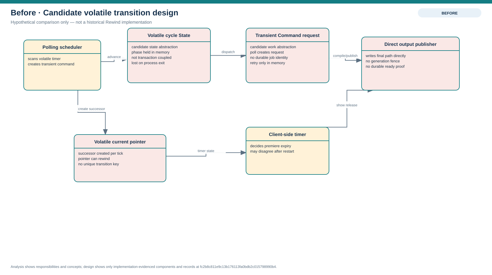
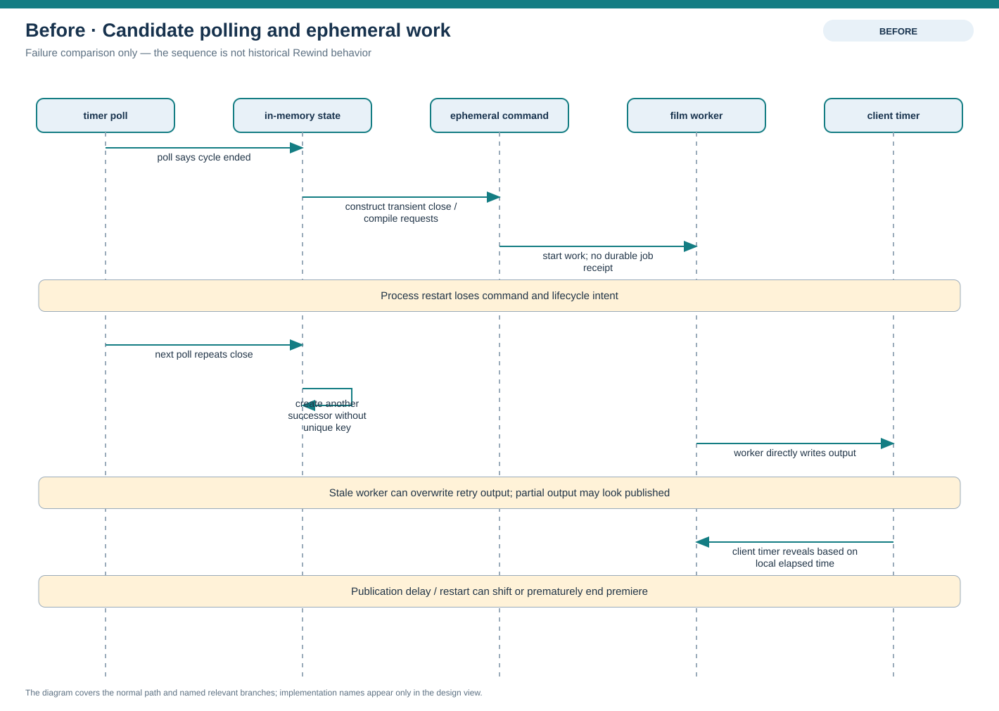
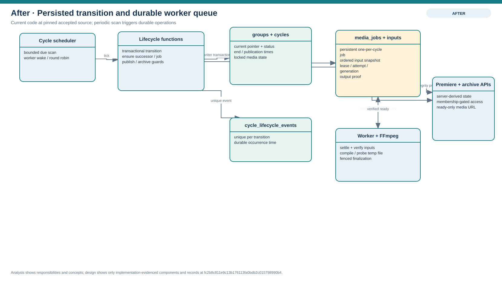
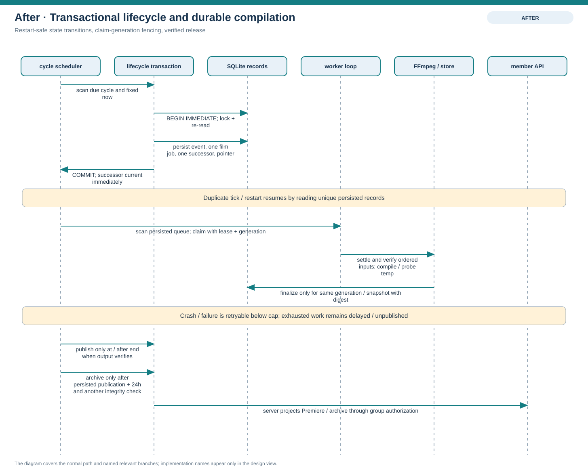

# Design problem — timed transitions and durable retries

## Problem

A cycle end and a film compilation are two coupled but independently recoverable operations. Closing too late leaves contribution intake open; closing without opening the successor blocks new capture. Publishing before all accepted clips settle or before the film is verified can expose incomplete media. A worker crash or duplicate scheduler tick must not create duplicate successor cycles/jobs, lose the retry, rewind the current-cycle pointer, or publish output from a stale worker. The 24-hour premiere begins at publication, which may be delayed beyond the cycle boundary.

The source implementation shows a functional lifecycle operation coordinated by a periodic scheduler and durable SQLite state. This is a design consistency and recovery problem; this package does not claim a production incident or user-visible data loss.

## Before — candidate in-memory pattern composition

These diagrams show a plausible but fragile alternative for explaining the design pressure. They are **not** a description of historical Rewind code. In the candidate, cycle state is held in scheduler memory, a poll constructs transient Command objects, and a client/scheduler timer decides when to reveal/archive. A crash loses transition intent, duplicate ticks can create duplicate successors/jobs, and a stale worker can publish after a retry unless durable fencing is added.

## Candidates

| Candidate                                              | Useful idea                                                                                      | Fit and trade-off against this source                                                                                                                                                                                                                                                  |
| ------------------------------------------------------ | ------------------------------------------------------------------------------------------------ | -------------------------------------------------------------------------------------------------------------------------------------------------------------------------------------------------------------------------------------------------------------------------------------- |
| State                                                  | Make allowed lifecycle states and transitions explicit.                                          | The lifecycle already has a small state model (`collecting`, `revealing`, `archived`) and checks transitions in a functional transaction. Introducing one object per state would duplicate persisted status and transaction rules without evidence of a need for runtime polymorphism. |
| Command                                                | Package work as an executable/retryable request.                                                 | A persisted `media_jobs` row plus ordered `compilation_job_inputs` already supplies durable work identity, status, retries and recovery. A transient Command object alone would not survive restart; wrapping every operation in a class would add no durable behavior.                |
| Scheduler polling                                      | Periodically discover due cycles and claimable jobs.                                             | This is used as a wake-up/scanning mechanism. Polling alone does not provide exactly-once state changes, durable retries, fencing, or publication safety; the database transaction, uniqueness constraints and claim generations provide those properties.                             |
| Persisted transition + durable job queue (implemented) | Keep cycle state and work intent in database records; use short transactions and fenced workers. | Fits the actual code. It keeps state/replay visible in SQLite and lets processing happen outside the writer lock. It remains tied to the current local SQLite/storage boundary; managed PostgreSQL/queue configuration is future work.                                                 |

## After — implemented persisted transition and queue

The scheduler scans due real-group cycles and invokes a transaction that locks the old cycle, writes a unique transition receipt, ensures one cycle-scoped film job, creates or finds the successor, and conditionally moves the group pointer. The film job and ordered input rows survive process restart. A worker claim records an attempt, lease timestamp, and monotonically changing claim generation; a stale worker cannot finalize over a later claim. FFmpeg compiles to a generation-specific temporary output. The current claim may commit `ready` only after the inputs, result and digest are verified. A separate lifecycle gate records publication time, and archive transition checks 24 hours from that time.

No formal State or Command class hierarchy appears in this decision. The design uses persisted state plus functions and a durable queue; periodic scanning triggers work but is not the consistency model.

## Implementation decisions in the pinned source

1. The real-group scheduler scans persisted end times and revealing/archived cycles in bounded batches. A shared tick captures one `now` value for its cycle transitions and worker selection.
2. Lifecycle mutation occurs under a SQLite writer transaction. The old cycle is locked in `revealing`; the event key is unique by `(cycle_id, transition)`; the successor is found by `previous_cycle_id`; the group pointer changes only when it still points to the old cycle.
3. `ensureCompilationJob` creates or returns one film job for a group/cycle and persists its ordered clip inputs. A worker claims pending/failed work or an expired processing lease, increments the claim generation and respects the bounded attempt cap.
4. Film work waits for accepted clips to settle, verifies source digests, compiles/probes a temporary result, and atomically persists a ready output only if the same generation and input snapshot still hold.
5. Release publication is a separate guarded transition: the cycle must be revealing, the persisted time must be at/after cycle end, and the ready output proof must still verify. Premiere time uses `release_published_at`; archive retains the old cycle while its successor may collect.
6. Future managed OIDC ([#363](https://github.com/Collaboration95/rewind-app/issues/363), [#364](https://github.com/Collaboration95/rewind-app/issues/364)), PostgreSQL ([#261](https://github.com/Collaboration95/rewind-app/issues/261)), managed backups ([#175](https://github.com/Collaboration95/rewind-app/issues/175)), and pre-upload retro work ([#365](https://github.com/Collaboration95/rewind-app/issues/365), [#366](https://github.com/Collaboration95/rewind-app/issues/366), [#367](https://github.com/Collaboration95/rewind-app/issues/367)) are not represented as implemented architecture. These remain scheduled Sprint 3 work.

## Pinned implementation references

All links resolve at accepted source commit `fc2b8c811e9c13b176113fa0bdb2c015798990b4`.

- Scheduler scan and worker handoff: [`scheduler.ts`](https://github.com/Collaboration95/rewind-app/blob/fc2b8c811e9c13b176113fa0bdb2c015798990b4/server/src/cycles/scheduler.ts#L45).
- Lifecycle transaction and successor creation: [`lifecycle.ts`](https://github.com/Collaboration95/rewind-app/blob/fc2b8c811e9c13b176113fa0bdb2c015798990b4/server/src/cycles/lifecycle.ts#L276), [`advanceCycleLifecycleVerified`](https://github.com/Collaboration95/rewind-app/blob/fc2b8c811e9c13b176113fa0bdb2c015798990b4/server/src/cycles/lifecycle.ts#L325).
- Durable compilation job/input creation and claim: [`jobs/index.ts`](https://github.com/Collaboration95/rewind-app/blob/fc2b8c811e9c13b176113fa0bdb2c015798990b4/server/src/jobs/index.ts#L502), [`claimCompilationJob`](https://github.com/Collaboration95/rewind-app/blob/fc2b8c811e9c13b176113fa0bdb2c015798990b4/server/src/jobs/index.ts#L599).
- Fenced finalization and compile workflow: [`publishCompilationOutput`](https://github.com/Collaboration95/rewind-app/blob/fc2b8c811e9c13b176113fa0bdb2c015798990b4/server/src/jobs/index.ts#L895), [`processCompilationJobInternal`](https://github.com/Collaboration95/rewind-app/blob/fc2b8c811e9c13b176113fa0bdb2c015798990b4/server/src/jobs/index.ts#L963).
- Publication and 24-hour archive transition: [`lifecycle.ts`](https://github.com/Collaboration95/rewind-app/blob/fc2b8c811e9c13b176113fa0bdb2c015798990b4/server/src/cycles/lifecycle.ts#L216), [`PREMIERE_DURATION_MS`](https://github.com/Collaboration95/rewind-app/blob/fc2b8c811e9c13b176113fa0bdb2c015798990b4/server/src/cycles/lifecycle.ts#L38).
