# Rewind project report draft

Evidence cut: accepted dev `25d5d83c3302491d5ea6796f31afd4a3593789a3`, 4 October 2026 SGT. This is a Sprint 2 draft; final compliance, team attribution and assessment sign-off remain pending under #362. The supplied Practice Module template defines the section order. The primary workspace's owner plan defines the current Safari/Home Screen release and retains Sprint 3 OIDC, PostgreSQL, managed backups and pre-upload retro obligations.

## 1 Introduction

### 1.1 Background

Rewind is a private shared-memory application for close friend groups whose members may live apart. Members contribute short ordinary moments to a time capsule. Submissions become sealed metadata; a server-driven cycle later compiles and reveals a chronological film, which remains in the group Archive. The submitted proposal frames delayed reveal as a way to reduce pressure to curate every contribution. That expected benefit has not been established by a measured user study in this draft.

### 1.2 Business Needs

The system coordinates trusted membership, bounded contributions, timed reveal and reliable media delivery. A group needs confidence that only members can access its conversation and released film, that quotas and corrections remain consistent across devices, and that an interrupted process can recover without duplicate contributions or lost accepted media. These needs drive explicit authorization, transactional rules, durable jobs and honest client states.

### 1.3 Stakeholders

The five proposal members are Gopal Guruprasath, Nguyen Kim Long, Sang Haoxiang, Phan Mai Tan Loi and Jiang Jiayu. Their individual model ownership, contributions and effort require factual confirmation. Other stakeholders are private-group owners and invited members, authorized operators and the module assessors. There is no recorded commercial sponsor or lecturer approval of the pilot exceptions.

### 1.4 Project Scope

Sprint 2 develops a usable private-group web journey. The current release clients are desktop web, iPhone Safari and the installed Home Screen web app. The codebase also contains Expo/native adapters; Android/APK and compiled iOS obligations remain visible but are deferred for this overnight goal. The final proposal still requires managed OIDC, PostgreSQL, recoverable managed backups and retro processing before upload in Sprint 3. A working password/SQLite/server-processing pilot does not satisfy those final obligations.

#### 1.4.1 Functionality in Scope

UC01–UC03 cover account/session, private group and invitation access. UC04–UC06 cover video review/trim/submission, photo contributions and quota/correction. UC07–UC08 cover automatic cycle rollover, compilation/retry/publication and archival. UC09–UC11 cover owner prompt/timezone, opt-in reminders and private text/reply/reaction/reconnect. UC12–UC14 cover premiere/Archive playback, own-clip/group-film download and client install/update/invite delivery. Five packages organize these fourteen use cases; they do not cap the number of major-flow diagrams.

#### 1.4.2 Functionality out of Scope

The first delivery excludes public feeds/profiles/discovery, followers, hashtags, licensed music, owner transfer, member removal, leaving/rejoining and account deletion/recovery. Chat editing/deletion, read receipts, typing and attachments are excluded. Public-store approval and a commercial SLA are not promised. The membership exclusions are privacy/retention limitations, not complete production account management.

#### 1.4.3 Quality Attributes

The proposal requires server-enforced privacy, least privilege, authenticated HTTPS, idempotent writes, source-audio preservation, valid portrait video, bounded retries, clear failure states and repeatable delivery. Its performance targets include API p95 at most two seconds and a 25-clip/150-second compilation workload within ten minutes. Measured results must name build, fixture, hardware and controls; green tests alone are not those measurements. Real storage semantics, provider receipt, physical camera and installed-client lifecycle evidence remain distinct.

## 2 Project Conduct

### 2.1 Project Plan

Sprint names are zero-based: Sprint 0 foundation; Sprint 1 13–26 September; Sprint 2 27 September–10 October; Sprint 3 11–24 October 2026. The owner execution plan estimates 211–365 focused hours for Sprint 2 and 76–132 for the deferred compliance tranche. These are planning estimates, not recorded effort. The WBS groups entry/access, capture/media, cycle/compilation, participation/reminders, authorized delivery, operations and five report packages. Actual member responsibility for at least one use case and one pattern problem is pending; agent task ownership is not human contribution evidence.

### 2.2 Project Status

Accepted dev contains the password/SQLite pilot, private groups/invites, capture review, contribution policy, persisted chat, cycle processing, authorized Archive delivery and the public-only PWA shell. PR #387 repairs the photo group label; #388 repairs chat API prefixes; #392 adds web portrait guidance. Two local HTTPS chat journeys and two group-switching journeys under #396 passed. #251/#252 retain broader acceptance. Safari/Home Screen #329/#350, physical orientation #327, hosted/S3 #344 and installed playback/download #345 remain open. #352 aggregates the journey; it is not another implementation closure.

Newly recorded Sprint 2 [#399](https://github.com/Collaboration95/rewind-app/issues/399) identifies an unsafe Demo/reset path that deletes shared media before restoreFixture when real-account data exists. The fail-closed fix is reviewed in batch bb3b089 and awaits dev integration. Worker validation reported 26 focused, 452 server, 612 frontend and 6 accessibility checks; these were not rerun for this report. At this source cut, no hosted reset/restore pass or final private-data boundary acceptance is claimed. This risk was identified after the supplied evidence cut; no unmerged fix is attributed to that baseline.

### 2.3 Project Metrics

The fresh baseline was fc2b8c811e9c13b176113fa0bdb2c015798990b4 with successful Quality and CodeQL runs. PR #387 tested head 64c6e40e56da31ab602bd6c82384b5d9241b7251 and merged as f1d74c510ecff566a25b1449daa8352befa9f00c with an identical Git tree. Its fast checks passed 148 root tests with one existing skip, 443 server tests and 605 frontend tests. These counts describe that exact run; they are not human productivity or time spent. Actual Sprint meeting decisions, burndown data and per-member hours remain pending where no verified record supplies them.

## 3 System Design

### 3.1 Software Architecture

The current implementation uses a TypeScript Expo/React client, React Native web/PWA output, a modular Node HTTP service, SQLite metadata and FFmpeg media processing. The web shell and API share an HTTPS origin with an /api proxy boundary. Browser authority uses an HttpOnly cookie; native adapters use a securely stored opaque token. Real and synthetic Demo identities are separate. Public shell caching never authorizes or caches private API/media responses.

Capture, group, chat, reminder and Archive UI modules call typed adapters. The server establishes the principal, selected group and membership before domain operations. SQLite transactions persist quota, invitation, contribution and lifecycle changes. Durable jobs/leases coordinate processing and retries; released-media capabilities recheck session, selected group, release and exact media integrity. Private S3/direct-upload code and isolated Terraform roots are prepared; actual hosted S3 semantics and live inventory remain separate gates. This source description does not assert every prepared adapter is activated in the hosted pilot.

The final target replaces pilot password verification with managed OIDC and SQLite with reviewed PostgreSQL, adds managed recovery, and processes retro treatment before upload. Provider notifications, final native packaging and live storage acceptance require their own verified boundaries. Target architecture is labelled separately from current implementation.

### 3.2 Transition from Analysis to Design

Six strategies guide the complete journey. T1 trusted identity maps conceptual Account/Member to session resolution, request-boundary adapters and transaction-bound membership predicates. T2 platform capture maps a conceptual Recording to camera/file/store/review contracts and explicit ownership/disposal. T3 transactional contribution maps Budget/Correction to durable contribution/job/quota records and idempotency keys. T4 persisted lifecycle maps Cycle/Film to recorded state transitions, successors, leases and retryable jobs. T5 asynchronous participation maps Conversation/Reminder to ordered events, reconnect cursors, per-session destinations and durable outbox/provider adapters. T6 authorized delivery maps ReleasedMedia to fresh session/group-bound capabilities, client players/download adapters and public-only asset caching.

#### 3.2.1 Static and dynamic transition guidance

For T1, keep principals distinct from client resource IDs; validate session before membership/owner query, then mutate within the authorized transaction. For T2, create a platform adapter and owned local media handle; review precedes submission and retake/success disposes content. For T3, bind a retry key to one contribution and apply both quota dimensions atomically. For T4, persist cycle closure/successor and durable work before execution; publication must observe ready output and maintain the 24-hour premiere. For T5, separate durable facts from live transport; reconnect uses a watermark and notification delivery is not inferred from scheduling. For T6, refresh temporary access at each play/download and clear stale protected media on group/session change. The package model pairs show these concrete static/dynamic mappings; the incorporated plates in §§3.4–3.5 retain the accepted model cuts and a refreshed source crosswalk.

### 3.3 Use Case Model

#### 3.3.1 Overall use case diagram

The overall model groups UC01–UC14 under the private Rewind boundary, with owner/member, invitee, clock/worker and platform roles. Excluded public-social and account-management cases are outside the boundary. Managed OIDC is a future provider role. Package-specific diagrams refine the same boundary.

#### 3.3.2 Use case descriptions

Each package's use-cases.md declares normal and relevant exceptional major flows: access rejection/expiry/replay; unsupported capture/permission, invalid media, upload interruption; quota and correction boundaries; scheduler/processing failure and restart; chat reconnect/denial and reminder expiry; sealed/unavailable/offline media and client updates. A flow catalogue must enumerate every required paired sequence; a single happy-path sequence does not cover all major flows.

### 3.4 Analysis and Design Models

#### 3.4.1 Package models and ownership

ACCESS UC01–UC03, CAPTURE UC04–UC06, CYCLE UC07–UC08, PARTICIPATION UC09–UC11 and ARCHIVE UC12–UC14 are separate source packages. Analysis class views describe domain responsibilities; design views name implemented modules/interfaces/persistence. Each major flow requires one analysis and one design sequence. This draft embeds all 137 accepted package models: 28 use-case class views, 88 sequence views for 44 major-flow pairs, 20 before/after pattern views and the ACCESS use-case overview. The figure register maps each plate to its unchanged SVG, package model text, issue and source cut. Real human ownership remains pending. No member is assigned a use case from commit counts.

Detailed model sources: [ACCESS](packages/access/README.md), [CAPTURE](packages/capture/README.md), [CYCLE](packages/cycle/README.md), [PARTICIPATION](packages/participation/README.md), [ARCHIVE](packages/archive/README.md).

Complete-model plates preserve every accepted SVG and all relationships. The original A4 portrait body resumes after each model block. A3 landscape foldouts are used for most figures; 18 unusually tall or dense figures use 22 by 16.54 inch landscape foldouts. Principal 14 px labels print at least 8.4 pt; 12 px annotations print at least 7.2 pt. The smallest accepted 11 px notes print at least 6.6 pt. Captions are 9 pt. Native SVG and lossless PNG fallback preserve readable zoom without semantic redrawing.

**ACCESS complete model plates — issue #357**

Accepted model source cut: `fc2b8c811e9c13b176113fa0bdb2c015798990b4`; baseline code/source crosswalk: `25d5d83c3302491d5ea6796f31afd4a3593789a3`. Source text: [use-cases.md](packages/access/use-cases.md), [models.md](packages/access/models.md), [design-problem.md](packages/access/design-problem.md).

Refreshed code trace:

- [src/auth/RealAccountProvider.tsx:55](https://github.com/Collaboration95/rewind-app/blob/25d5d83c3302491d5ea6796f31afd4a3593789a3/src/auth/RealAccountProvider.tsx#L55)
- [src/auth/real-account-client.ts:103](https://github.com/Collaboration95/rewind-app/blob/25d5d83c3302491d5ea6796f31afd4a3593789a3/src/auth/real-account-client.ts#L103)
- [server/src/auth/index.ts:122](https://github.com/Collaboration95/rewind-app/blob/25d5d83c3302491d5ea6796f31afd4a3593789a3/server/src/auth/index.ts#L122)
- [server/src/http.ts:4141](https://github.com/Collaboration95/rewind-app/blob/25d5d83c3302491d5ea6796f31afd4a3593789a3/server/src/http.ts#L4141)
- [server/src/groups/real.ts:15](https://github.com/Collaboration95/rewind-app/blob/25d5d83c3302491d5ea6796f31afd4a3593789a3/server/src/groups/real.ts#L15)
- [server/src/groups/real.ts:40](https://github.com/Collaboration95/rewind-app/blob/25d5d83c3302491d5ea6796f31afd4a3593789a3/server/src/groups/real.ts#L40)
- [server/src/groups/real.ts:45](https://github.com/Collaboration95/rewind-app/blob/25d5d83c3302491d5ea6796f31afd4a3593789a3/server/src/groups/real.ts#L45)
- [server/src/http.ts:3516](https://github.com/Collaboration95/rewind-app/blob/25d5d83c3302491d5ea6796f31afd4a3593789a3/server/src/http.ts#L3516)
- [server/src/groups/settings.ts:5](https://github.com/Collaboration95/rewind-app/blob/25d5d83c3302491d5ea6796f31afd4a3593789a3/server/src/groups/settings.ts#L5)
- [server/src/groups/settings.ts:44](https://github.com/Collaboration95/rewind-app/blob/25d5d83c3302491d5ea6796f31afd4a3593789a3/server/src/groups/settings.ts#L44)
- [server/src/groups/settings.ts:70](https://github.com/Collaboration95/rewind-app/blob/25d5d83c3302491d5ea6796f31afd4a3593789a3/server/src/groups/settings.ts#L70)
- [server/src/http.ts:3783](https://github.com/Collaboration95/rewind-app/blob/25d5d83c3302491d5ea6796f31afd4a3593789a3/server/src/http.ts#L3783)
- [src/groups/RealAccountGroupExperience.tsx:659](https://github.com/Collaboration95/rewind-app/blob/25d5d83c3302491d5ea6796f31afd4a3593789a3/src/groups/RealAccountGroupExperience.tsx#L659)
- [src/reminders/RealGroupSettings.tsx:131](https://github.com/Collaboration95/rewind-app/blob/25d5d83c3302491d5ea6796f31afd4a3593789a3/src/reminders/RealGroupSettings.tsx#L131)
- [src/reminders/RealGroupSettings.tsx:184](https://github.com/Collaboration95/rewind-app/blob/25d5d83c3302491d5ea6796f31afd4a3593789a3/src/reminders/RealGroupSettings.tsx#L184)
- [server/src/reminders/schedule.ts:3](https://github.com/Collaboration95/rewind-app/blob/25d5d83c3302491d5ea6796f31afd4a3593789a3/server/src/reminders/schedule.ts#L3)
- [server/src/reminders/schedule.ts:55](https://github.com/Collaboration95/rewind-app/blob/25d5d83c3302491d5ea6796f31afd4a3593789a3/server/src/reminders/schedule.ts#L55)
- [server/src/db.ts:219](https://github.com/Collaboration95/rewind-app/blob/25d5d83c3302491d5ea6796f31afd4a3593789a3/server/src/db.ts#L219)
- [server/migrations/025-real-group-reminders.sql:3](https://github.com/Collaboration95/rewind-app/blob/25d5d83c3302491d5ea6796f31afd4a3593789a3/server/migrations/025-real-group-reminders.sql#L3)
- [server/src/cycles/lifecycle.ts:276](https://github.com/Collaboration95/rewind-app/blob/25d5d83c3302491d5ea6796f31afd4a3593789a3/server/src/cycles/lifecycle.ts#L276)
- [server/src/groups/invites.ts:124](https://github.com/Collaboration95/rewind-app/blob/25d5d83c3302491d5ea6796f31afd4a3593789a3/server/src/groups/invites.ts#L124)
- [src/groups/RealAccountGroupExperience.tsx:688](https://github.com/Collaboration95/rewind-app/blob/25d5d83c3302491d5ea6796f31afd4a3593789a3/src/groups/RealAccountGroupExperience.tsx#L688)
- [src/invites/deep-links.ts:52](https://github.com/Collaboration95/rewind-app/blob/25d5d83c3302491d5ea6796f31afd4a3593789a3/src/invites/deep-links.ts#L52)
- [server/src/policy.ts:28](https://github.com/Collaboration95/rewind-app/blob/25d5d83c3302491d5ea6796f31afd4a3593789a3/server/src/policy.ts#L28)
- [server/src/http.ts:312](https://github.com/Collaboration95/rewind-app/blob/25d5d83c3302491d5ea6796f31afd4a3593789a3/server/src/http.ts#L312)
- [server/src/groups/real.ts:121](https://github.com/Collaboration95/rewind-app/blob/25d5d83c3302491d5ea6796f31afd4a3593789a3/server/src/groups/real.ts#L121)
- [server/src/http.ts:348](https://github.com/Collaboration95/rewind-app/blob/25d5d83c3302491d5ea6796f31afd4a3593789a3/server/src/http.ts#L348)

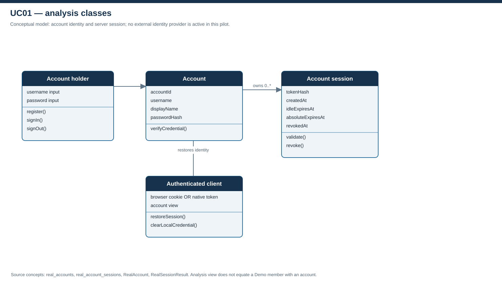

Figure M005. Complete accepted model, cut `fc2b8c81`; SVG SHA256 `83d6b350129ef3c168cab6ef53d0557224b51a771af6dcdd06f872f0027e7ea7`. DOCX/PDF uses one A3 landscape foldout plate. Package text supplies flow exceptions and code mapping.

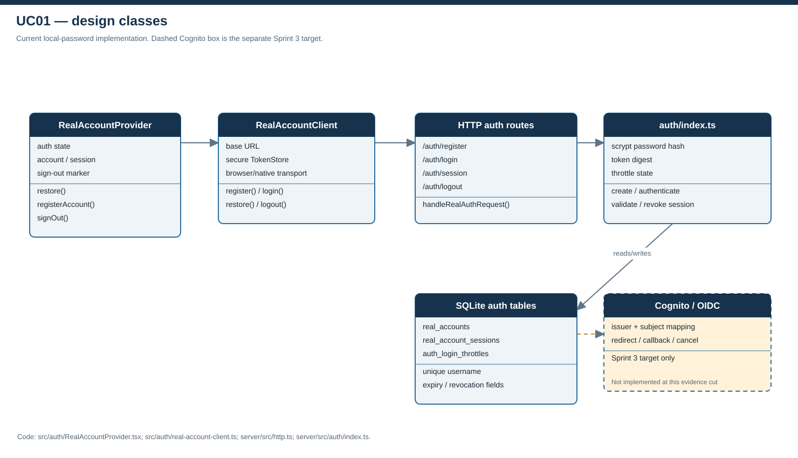

Figure M006. Complete accepted model, cut `fc2b8c81`; SVG SHA256 `82ff7dde73c91d325d39b8a041c0ae71b2c8a8a2004f03be529dcf4d06e5bf57`. DOCX/PDF uses one A3 landscape foldout plate. Package text supplies flow exceptions and code mapping.

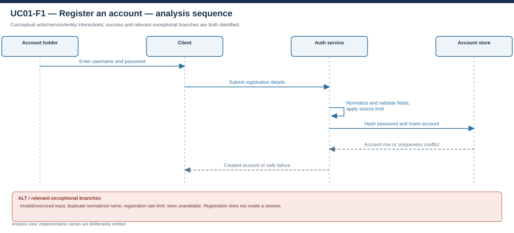

Figure M007. Complete accepted model, cut `fc2b8c81`; SVG SHA256 `bb9067244fd2ddcccee0f1ca222994fa516484103b12358c4500168701f97076`. DOCX/PDF uses one A3 landscape foldout plate. Package text supplies flow exceptions and code mapping.

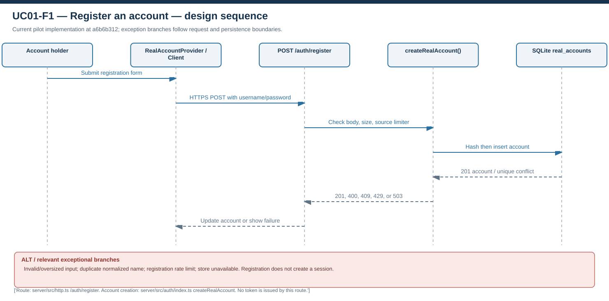

Figure M008. Complete accepted model, cut `fc2b8c81`; SVG SHA256 `c32b4de3fc35874f1f10d8596b3ce2e3f9080b43e4f998fcb5854949e4ed979f`. DOCX/PDF uses one A3 landscape foldout plate. Package text supplies flow exceptions and code mapping.

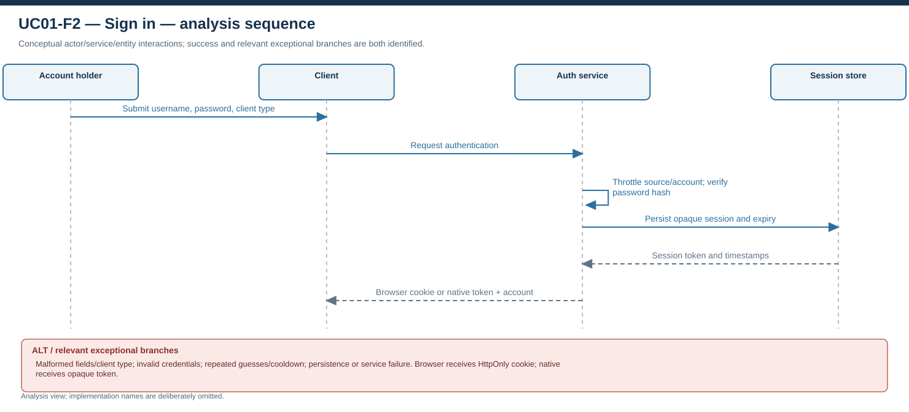

Figure M009. Complete accepted model, cut `fc2b8c81`; SVG SHA256 `193b520f79cbe5f3e5f3cf92a53e85b63481053adf06f0c70306224eb475a14b`. DOCX/PDF uses one A3 landscape foldout plate. Package text supplies flow exceptions and code mapping.

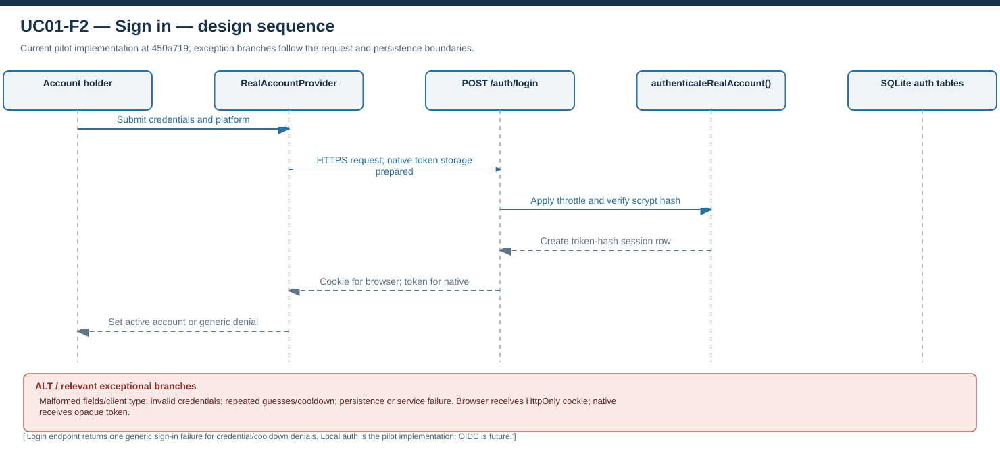

Figure M010. Complete accepted model, cut `fc2b8c81`; SVG SHA256 `f4eef39393026dc387f5ff67cac5fa4f78f371275d5c109c735ba9c10e7bb224`. DOCX/PDF uses one A3 landscape foldout plate. Package text supplies flow exceptions and code mapping.

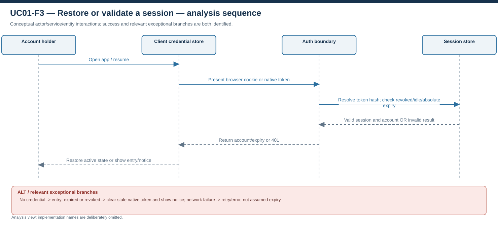

Figure M011. Complete accepted model, cut `fc2b8c81`; SVG SHA256 `a079e443c415d31086f0832f278bad488487d1cce2a0514f89cf007362835ce9`. DOCX/PDF uses one A3 landscape foldout plate. Package text supplies flow exceptions and code mapping.

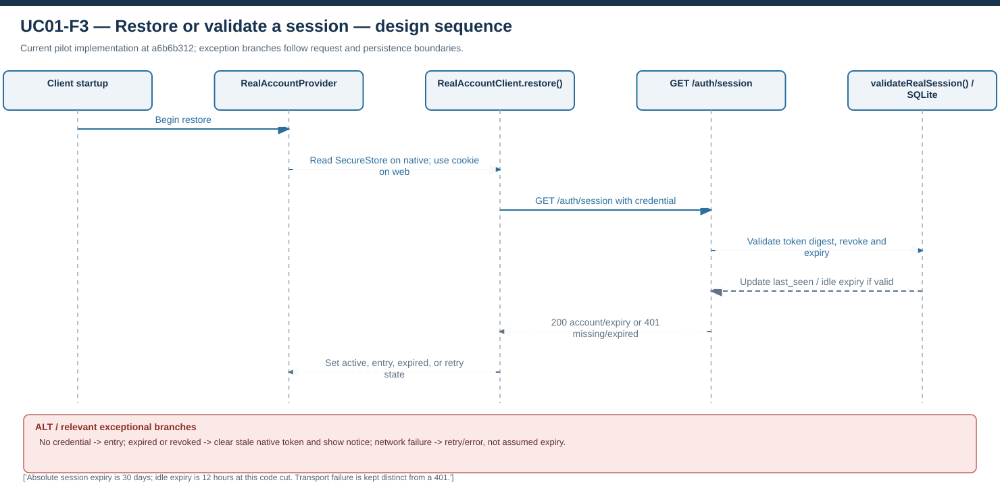

Figure M012. Complete accepted model, cut `fc2b8c81`; SVG SHA256 `83e0ee2be1c7128061469eec830d311e3d357fbaf6d0897413ceaa7897d1d96e`. DOCX/PDF uses one A3 landscape foldout plate. Package text supplies flow exceptions and code mapping.

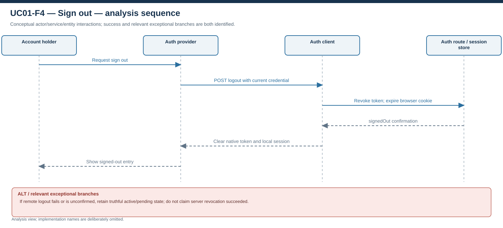

Figure M013. Complete accepted model, cut `fc2b8c81`; SVG SHA256 `aca6847c619d588288c47fe3d569420cb9cf2b20b3626aac0756ef77bf61ac70`. DOCX/PDF uses one A3 landscape foldout plate. Package text supplies flow exceptions and code mapping.

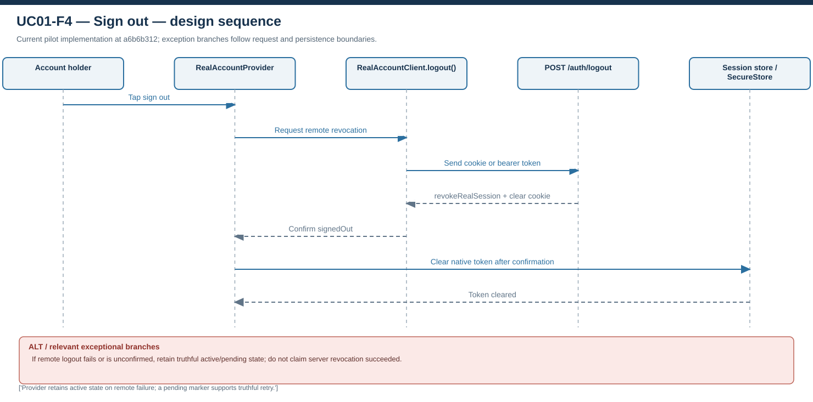

Figure M014. Complete accepted model, cut `fc2b8c81`; SVG SHA256 `61623f462b9a28e6e207ce321ece7607bf435b4c0dfa442ecd64318bbf3cedc0`. DOCX/PDF uses one A3 landscape foldout plate. Package text supplies flow exceptions and code mapping.

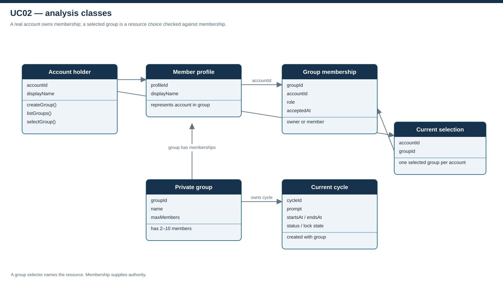

Figure M015. Complete accepted model, cut `fc2b8c81`; SVG SHA256 `09683a93ce71570e100b5e10e4b41b307a5dce68b169bd6319a19a7e9916570e`. DOCX/PDF uses one A3 landscape foldout plate. Package text supplies flow exceptions and code mapping.

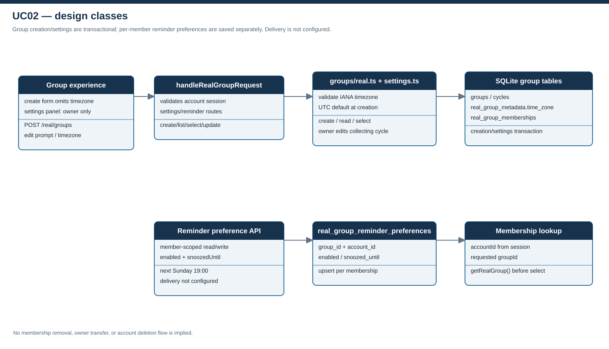

Figure M016. Complete accepted model, cut `fc2b8c81`; SVG SHA256 `2065539fec068cfa2468b364ce5bf5df3a9cb3ed55718ed42a50ecc8267067c1`. DOCX/PDF uses one A3 landscape foldout plate. Package text supplies flow exceptions and code mapping.

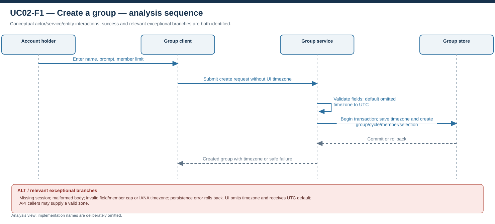

Figure M017. Complete accepted model, cut `fc2b8c81`; SVG SHA256 `00867a295ee5a1361622e17f33e424447f0881136a64f6b1b0be90621e13f558`. DOCX/PDF uses one A3 landscape foldout plate. Package text supplies flow exceptions and code mapping.

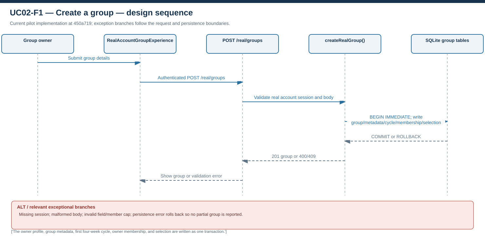

Figure M018. Complete accepted model, cut `fc2b8c81`; SVG SHA256 `8826546e05e268d2b2b5eec022e28c817271da814e7cabbd8083b1b80c0bbb64`. DOCX/PDF uses one A3 landscape foldout plate. Package text supplies flow exceptions and code mapping.

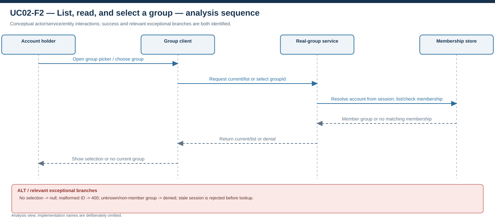

Figure M019. Complete accepted model, cut `fc2b8c81`; SVG SHA256 `3d753c4f2b105e63c5204b030b7213fce36835435169fec2a9a95c79793ce9a7`. DOCX/PDF uses one A3 landscape foldout plate. Package text supplies flow exceptions and code mapping.

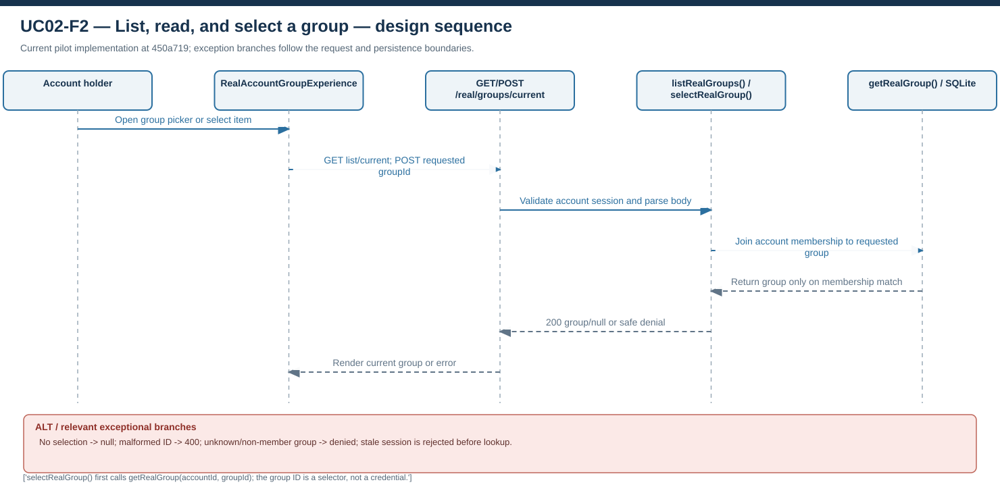

Figure M020. Complete accepted model, cut `fc2b8c81`; SVG SHA256 `342860e172414e096128465eea93c457bd25b190de78ffb3c5498117caf544fc`. DOCX/PDF uses one A3 landscape foldout plate. Package text supplies flow exceptions and code mapping.

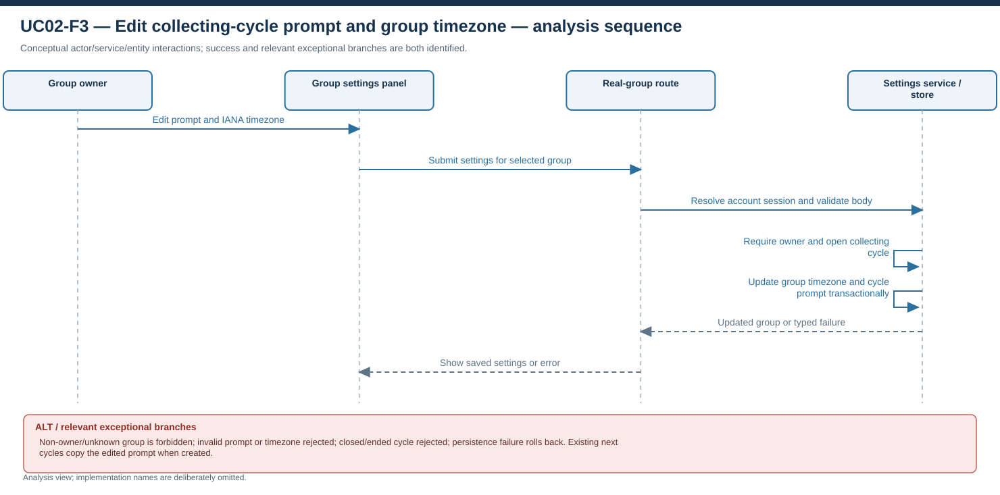

Figure M021. Complete accepted model, cut `fc2b8c81`; SVG SHA256 `040454443486a412224e0a9d5ea1a274c76d52deaf1dd9acf3bcb06a7490e542`. DOCX/PDF uses one A3 landscape foldout plate. Package text supplies flow exceptions and code mapping.

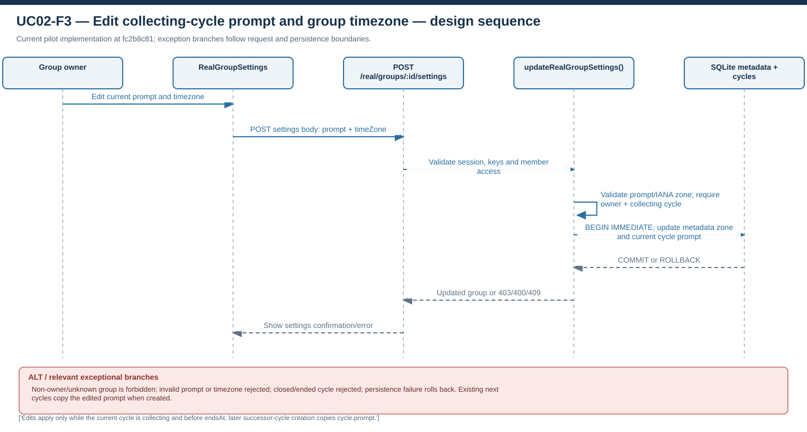

Figure M022. Complete accepted model, cut `fc2b8c81`; SVG SHA256 `16b89cf1af57a9618edd718ba1cf2ef9639ae5222659a04d90bf7b4fd747e50d`. DOCX/PDF uses one A3 landscape foldout plate. Package text supplies flow exceptions and code mapping.

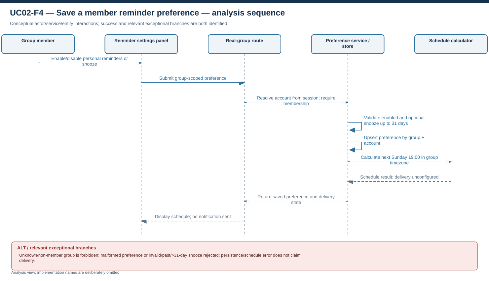

Figure M023. Complete accepted model, cut `fc2b8c81`; SVG SHA256 `63f5e7a811e1de25537619a5970e2c02ac28c951d1e5634f2c38c5be2aacbe17`. DOCX/PDF uses one A3 landscape foldout plate. Package text supplies flow exceptions and code mapping.

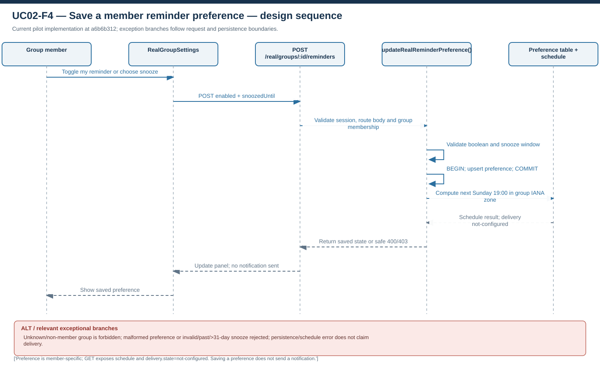

Figure M024. Complete accepted model, cut `fc2b8c81`; SVG SHA256 `390e77847bbf59fe0c6b1dc4e78db9c7cd05e156dc436cddbb488fff7fd8d09b`. DOCX/PDF uses one A3 landscape foldout plate. Package text supplies flow exceptions and code mapping.

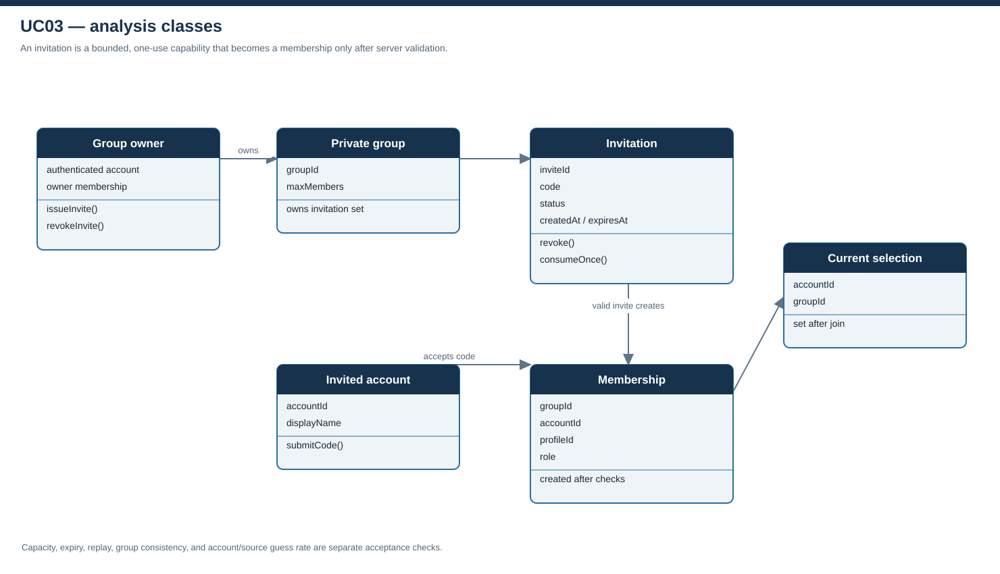

Figure M025. Complete accepted model, cut `fc2b8c81`; SVG SHA256 `e3710e269f13717f79b86fa6a08ec419a5ec39e15fd71dc640a9ed4bc2f5e27d`. DOCX/PDF uses one A3 landscape foldout plate. Package text supplies flow exceptions and code mapping.

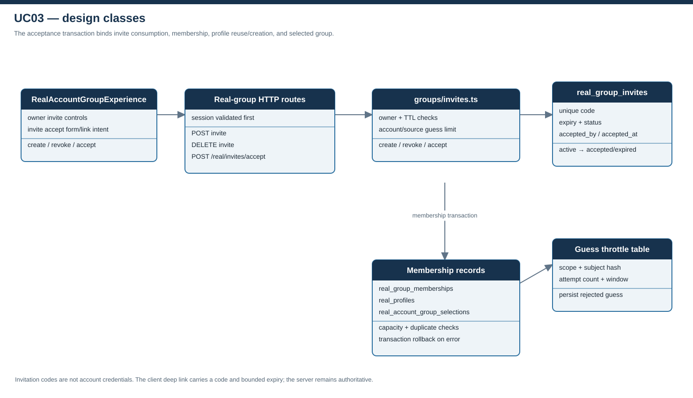

Figure M026. Complete accepted model, cut `fc2b8c81`; SVG SHA256 `f7f3aa2f265e8f9ea0a4a31a944db6b64090089c09596abf77373820bbd807bb`. DOCX/PDF uses one A3 landscape foldout plate. Package text supplies flow exceptions and code mapping.

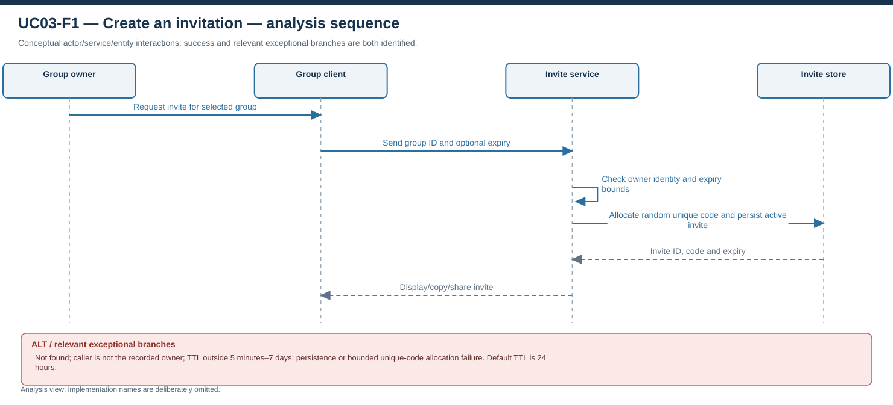

Figure M027. Complete accepted model, cut `fc2b8c81`; SVG SHA256 `4cf45f167cd406279ec6a3bf33eba66b2a31093ee3209b439238c2bfe8ed343b`. DOCX/PDF uses one A3 landscape foldout plate. Package text supplies flow exceptions and code mapping.

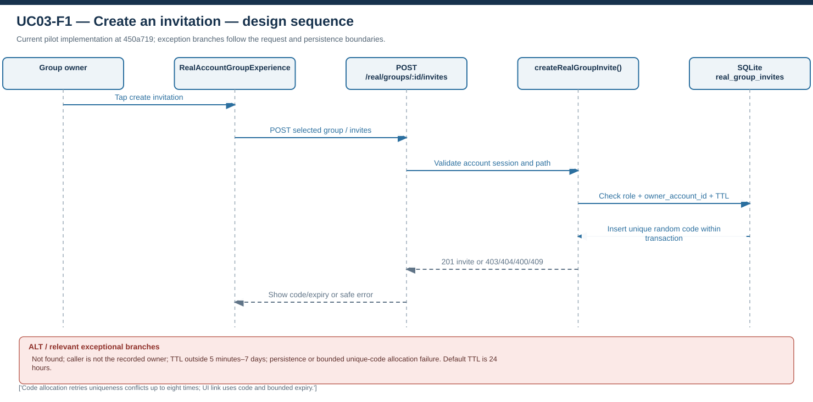

Figure M028. Complete accepted model, cut `fc2b8c81`; SVG SHA256 `83669fa0d20880bb4345a8728aa5b547fba6af095f373390816c7da9563dc408`. DOCX/PDF uses one A3 landscape foldout plate. Package text supplies flow exceptions and code mapping.

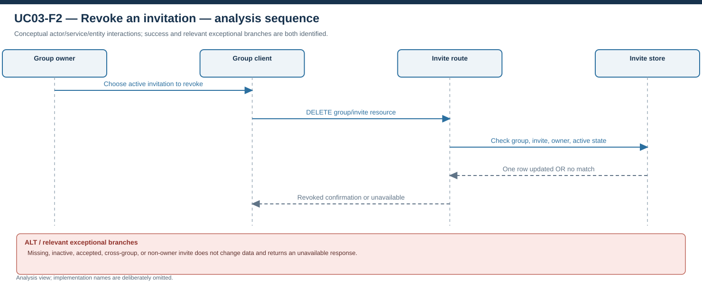

Figure M029. Complete accepted model, cut `fc2b8c81`; SVG SHA256 `266d75ab1ab792d603450f311d5a70af3f430c074c375cfd5095f058bf5ba417`. DOCX/PDF uses one A3 landscape foldout plate. Package text supplies flow exceptions and code mapping.

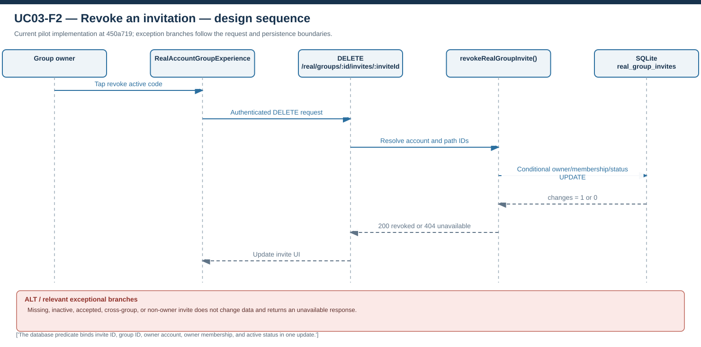

Figure M030. Complete accepted model, cut `fc2b8c81`; SVG SHA256 `114d47921093812de0b86e74417fba2a0a2d3a44e5a1bb937a038b4db787115c`. DOCX/PDF uses one A3 landscape foldout plate. Package text supplies flow exceptions and code mapping.

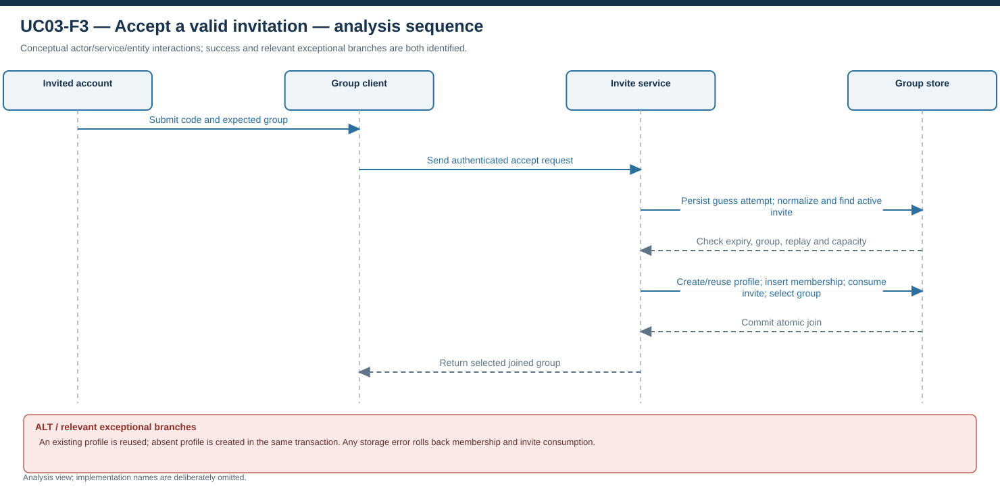

Figure M031. Complete accepted model, cut `fc2b8c81`; SVG SHA256 `17b7d91a67ed9e5e1e69546efae47056ae1d1d762700170af1f5693506b957ab`. DOCX/PDF uses one A3 landscape foldout plate. Package text supplies flow exceptions and code mapping.

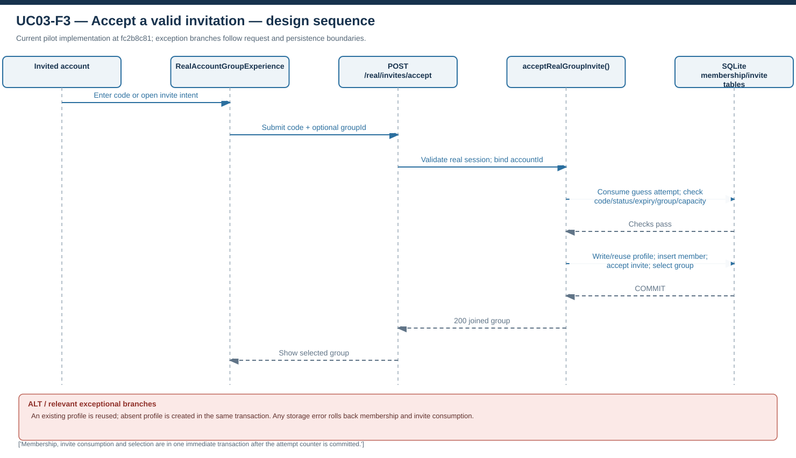

Figure M032. Complete accepted model, cut `fc2b8c81`; SVG SHA256 `fbb84a05c137fb59f939900ae94a2386b044704ffb1226fc7740c618294bbe08`. DOCX/PDF uses one A3 landscape foldout plate. Package text supplies flow exceptions and code mapping.

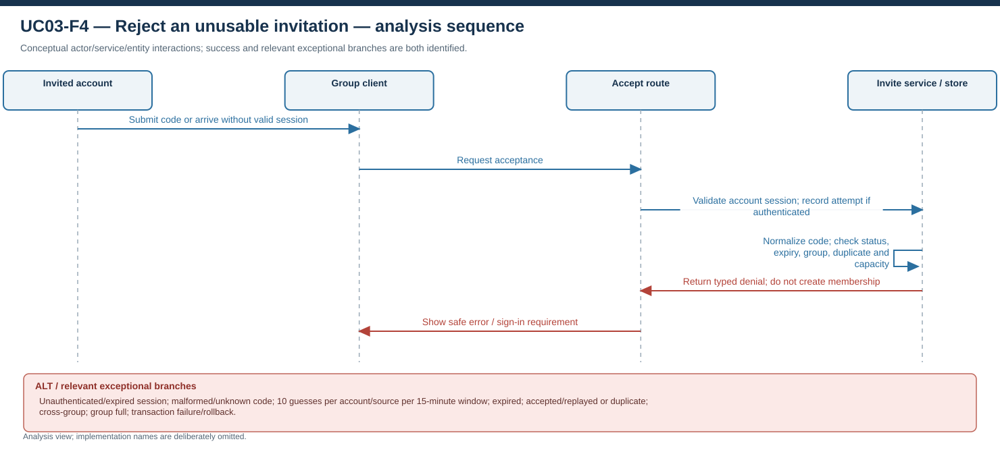

Figure M033. Complete accepted model, cut `fc2b8c81`; SVG SHA256 `31467125d2a5b90ad8f4416f5737d55fc8c004be66c213d044c0ff62f191d58a`. DOCX/PDF uses one A3 landscape foldout plate. Package text supplies flow exceptions and code mapping.

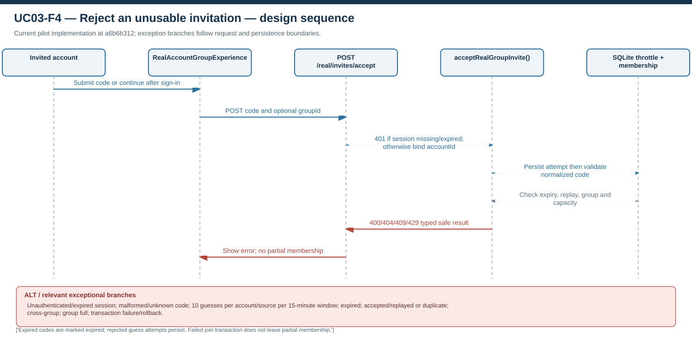

Figure M034. Complete accepted model, cut `fc2b8c81`; SVG SHA256 `20eb42a0598fea8fbd21d720354eb10001c95a1675d9e91ecfb68ae8e55d866d`. DOCX/PDF uses one A3 landscape foldout plate. Package text supplies flow exceptions and code mapping.

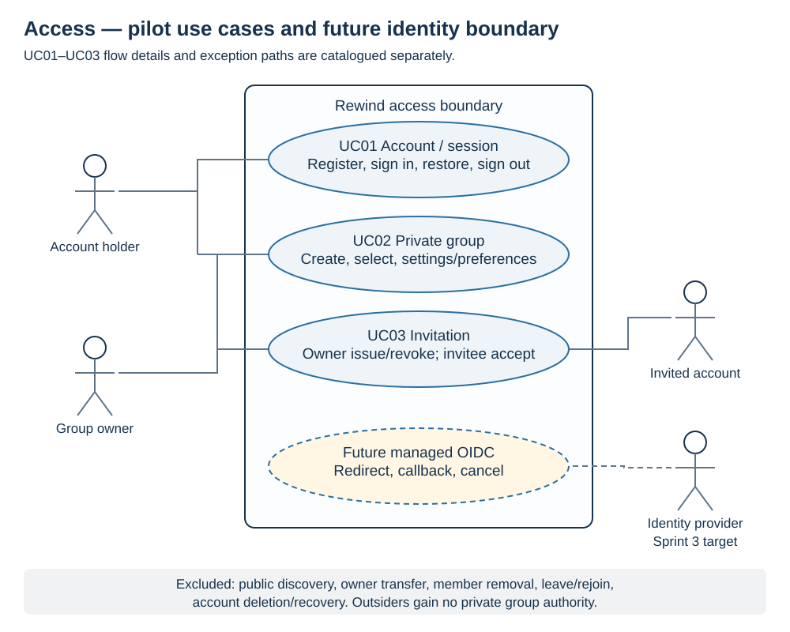

Figure M035. Complete accepted model, cut `fc2b8c81`; SVG SHA256 `423ff525086ec205af0e5ab7624ef8d5c2da6700f725208567b557bce4dc96a4`. DOCX/PDF uses one A3 landscape foldout plate. Package text supplies flow exceptions and code mapping.

**CAPTURE complete model plates — issue #358**

Accepted model source cut: `fc2b8c811e9c13b176113fa0bdb2c015798990b4`; baseline code/source crosswalk: `25d5d83c3302491d5ea6796f31afd4a3593789a3`. Source text: [use-cases.md](packages/capture/use-cases.md), [models.md](packages/capture/models.md), [design-problem.md](packages/capture/design-problem.md).

Refreshed code trace:

- [src/capture/VideoCaptureScreen.tsx:562](https://github.com/Collaboration95/rewind-app/blob/25d5d83c3302491d5ea6796f31afd4a3593789a3/src/capture/VideoCaptureScreen.tsx#L562)
- [src/capture/video-review.ts:124](https://github.com/Collaboration95/rewind-app/blob/25d5d83c3302491d5ea6796f31afd4a3593789a3/src/capture/video-review.ts#L124)
- [src/capture/contracts.ts:76](https://github.com/Collaboration95/rewind-app/blob/25d5d83c3302491d5ea6796f31afd4a3593789a3/src/capture/contracts.ts#L76)
- [src/groups/RealAccountGroupExperience.tsx:360](https://github.com/Collaboration95/rewind-app/blob/25d5d83c3302491d5ea6796f31afd4a3593789a3/src/groups/RealAccountGroupExperience.tsx#L360)
- [src/capture/real-account-video-runtime.ts:46](https://github.com/Collaboration95/rewind-app/blob/25d5d83c3302491d5ea6796f31afd4a3593789a3/src/capture/real-account-video-runtime.ts#L46)
- [src/capture/direct-transfer.ts:337](https://github.com/Collaboration95/rewind-app/blob/25d5d83c3302491d5ea6796f31afd4a3593789a3/src/capture/direct-transfer.ts#L337)
- [src/capture/CameraCaptureScreen.tsx:147](https://github.com/Collaboration95/rewind-app/blob/25d5d83c3302491d5ea6796f31afd4a3593789a3/src/capture/CameraCaptureScreen.tsx#L147)
- [src/capture/still-image-session.ts:48](https://github.com/Collaboration95/rewind-app/blob/25d5d83c3302491d5ea6796f31afd4a3593789a3/src/capture/still-image-session.ts#L48)
- [src/capture/file-store.ts:96](https://github.com/Collaboration95/rewind-app/blob/25d5d83c3302491d5ea6796f31afd4a3593789a3/src/capture/file-store.ts#L96)
- [server/src/contributions/index.ts:77](https://github.com/Collaboration95/rewind-app/blob/25d5d83c3302491d5ea6796f31afd4a3593789a3/server/src/contributions/index.ts#L77)
- [server/src/contributions/index.ts:240](https://github.com/Collaboration95/rewind-app/blob/25d5d83c3302491d5ea6796f31afd4a3593789a3/server/src/contributions/index.ts#L240)
- [server/src/contributions/ledger.ts:575](https://github.com/Collaboration95/rewind-app/blob/25d5d83c3302491d5ea6796f31afd4a3593789a3/server/src/contributions/ledger.ts#L575)
- [server/src/ffmpeg.ts:206](https://github.com/Collaboration95/rewind-app/blob/25d5d83c3302491d5ea6796f31afd4a3593789a3/server/src/ffmpeg.ts#L206)
- [src/capture/contracts.ts:101](https://github.com/Collaboration95/rewind-app/blob/25d5d83c3302491d5ea6796f31afd4a3593789a3/src/capture/contracts.ts#L101)
- [src/capture/platform.ts:340](https://github.com/Collaboration95/rewind-app/blob/25d5d83c3302491d5ea6796f31afd4a3593789a3/src/capture/platform.ts#L340)
- [server/src/media/upload-intents.ts:386](https://github.com/Collaboration95/rewind-app/blob/25d5d83c3302491d5ea6796f31afd4a3593789a3/server/src/media/upload-intents.ts#L386)
- [server/src/media/store.ts:45](https://github.com/Collaboration95/rewind-app/blob/25d5d83c3302491d5ea6796f31afd4a3593789a3/server/src/media/store.ts#L45)

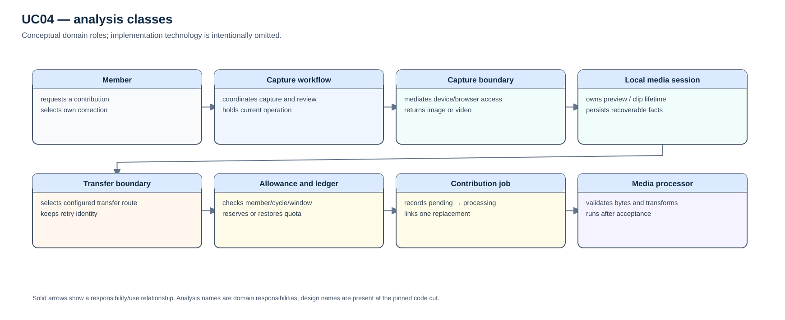

Figure M040. Complete accepted model, cut `fc2b8c81`; SVG SHA256 `c45a7dfe7d4866ff6c0a1d97030214ad56f5c4dac1e8a5764a73b3ba73e07873`. DOCX/PDF uses one A3 landscape foldout plate. Package text supplies flow exceptions and code mapping.

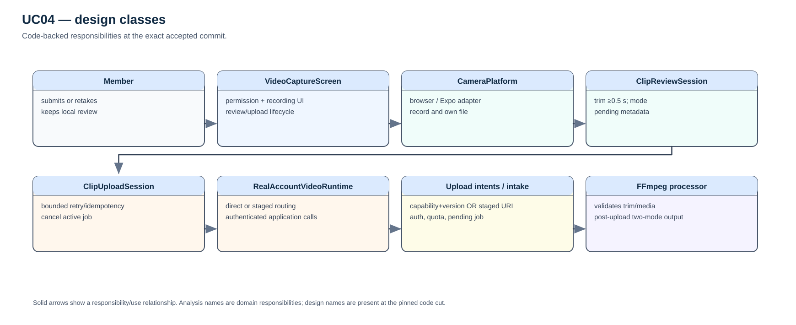

Figure M041. Complete accepted model, cut `fc2b8c81`; SVG SHA256 `a469f54cb03f74c8833841c26368d63a52eedc0e4d3bbae0e5bb9ecaab6b9f69`. DOCX/PDF uses one A3 landscape foldout plate. Package text supplies flow exceptions and code mapping.

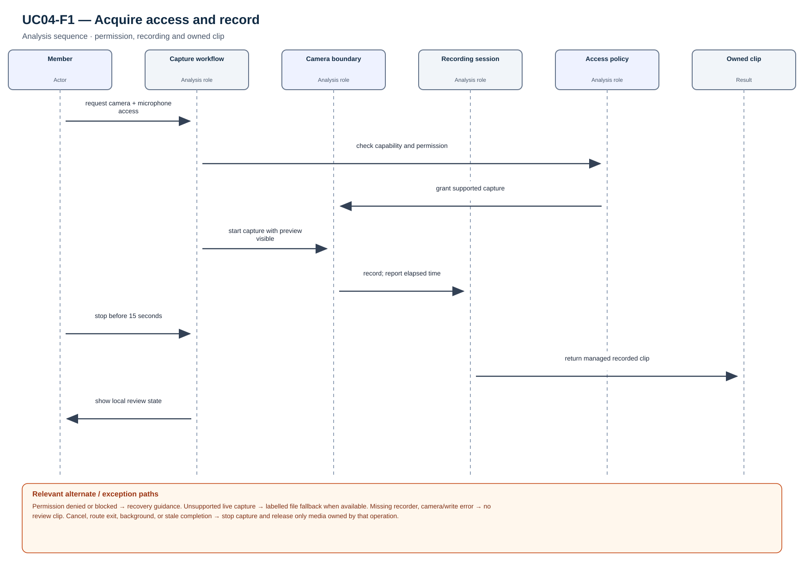

Figure M042. Complete accepted model, cut `fc2b8c81`; SVG SHA256 `6aea4db6b35ab471e932603b6b4f000a761167480c62019c95dbb3733eb63d9c`. DOCX/PDF uses one Large landscape foldout foldout plate. Package text supplies flow exceptions and code mapping.

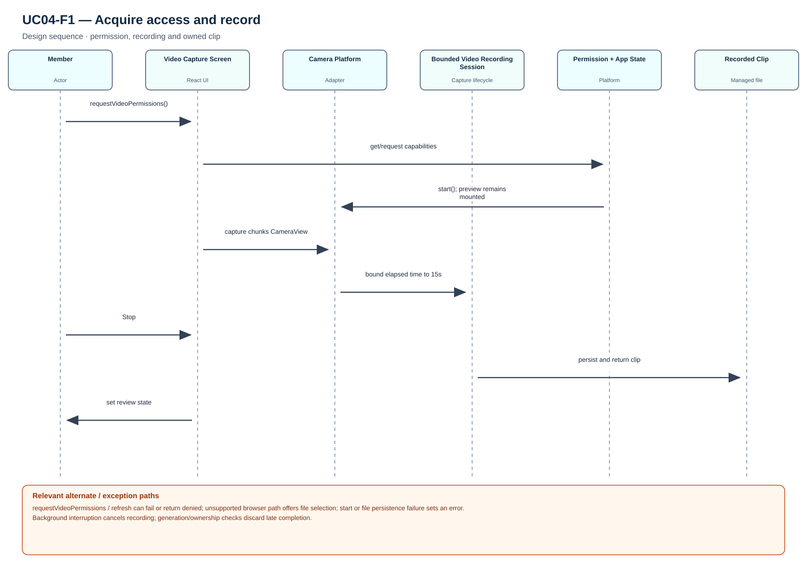

Figure M043. Complete accepted model, cut `fc2b8c81`; SVG SHA256 `5593ae2a3173bd84359a8471511fdc54211556ee0ca5d9c08dd402be9b33abed`. DOCX/PDF uses one Large landscape foldout foldout plate. Package text supplies flow exceptions and code mapping.

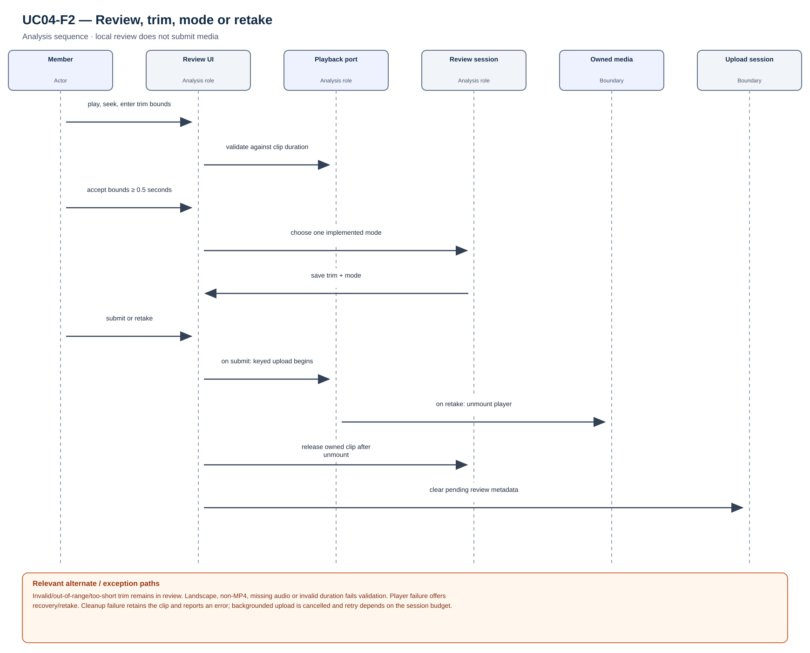

Figure M044. Complete accepted model, cut `fc2b8c81`; SVG SHA256 `ac70cd9023ee393218dbca005c702fad946c2f69672c9e98678aebc46826973b`. DOCX/PDF uses one Large landscape foldout foldout plate. Package text supplies flow exceptions and code mapping.

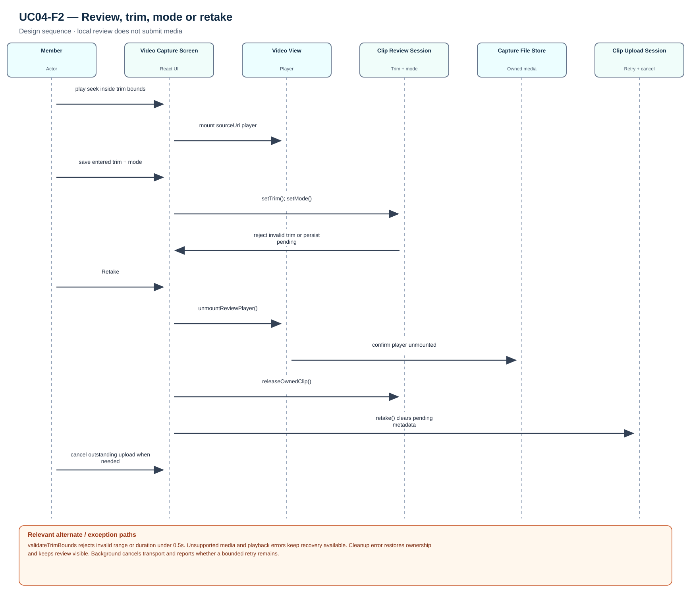

Figure M045. Complete accepted model, cut `fc2b8c81`; SVG SHA256 `305283827b29185846c82243b51ef897c55d78dd0cc7bedbd81017dc9d137eff`. DOCX/PDF uses one Large landscape foldout foldout plate. Package text supplies flow exceptions and code mapping.

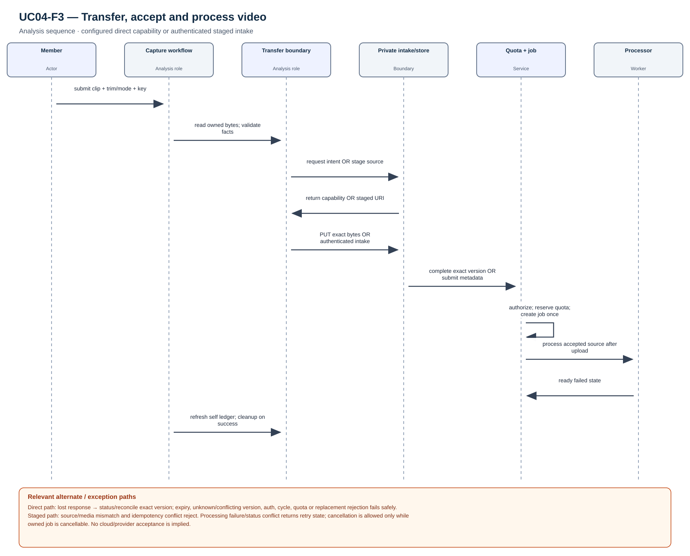

Figure M046. Complete accepted model, cut `fc2b8c81`; SVG SHA256 `cba4e6be9d014cb575d32180199b5bbff26229b39ee9cf96aabf32b3f0d31e96`. DOCX/PDF uses one Large landscape foldout foldout plate. Package text supplies flow exceptions and code mapping.

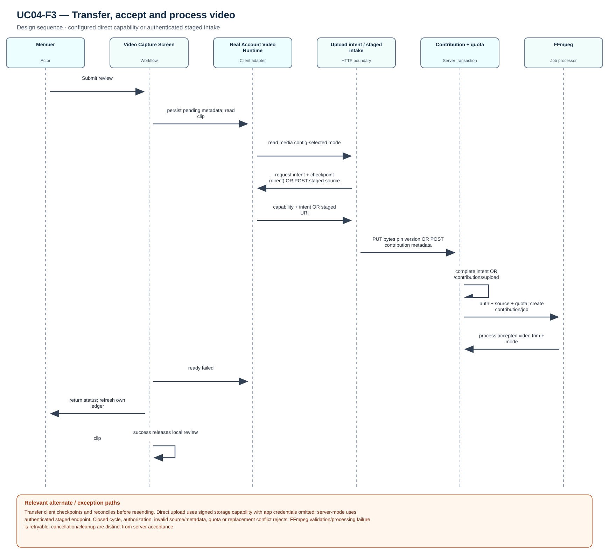

Figure M047. Complete accepted model, cut `fc2b8c81`; SVG SHA256 `df430b9768c6d557a3897c7807093d6c9ea21e2a567197c35cff518f1ff48d7a`. DOCX/PDF uses one Large landscape foldout foldout plate. Package text supplies flow exceptions and code mapping.

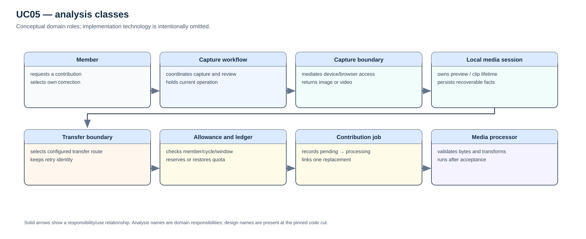

Figure M048. Complete accepted model, cut `fc2b8c81`; SVG SHA256 `c557ed036c6ca41d71155c391c5c4088b826ded4dea159e82448971f47c3b1c7`. DOCX/PDF uses one A3 landscape foldout plate. Package text supplies flow exceptions and code mapping.

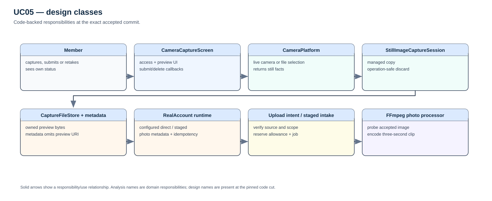

Figure M049. Complete accepted model, cut `fc2b8c81`; SVG SHA256 `eecc6075ca5f6d571725eaf04036470a10bf1ce13655600072cf58c1401d537d`. DOCX/PDF uses one A3 landscape foldout plate. Package text supplies flow exceptions and code mapping.

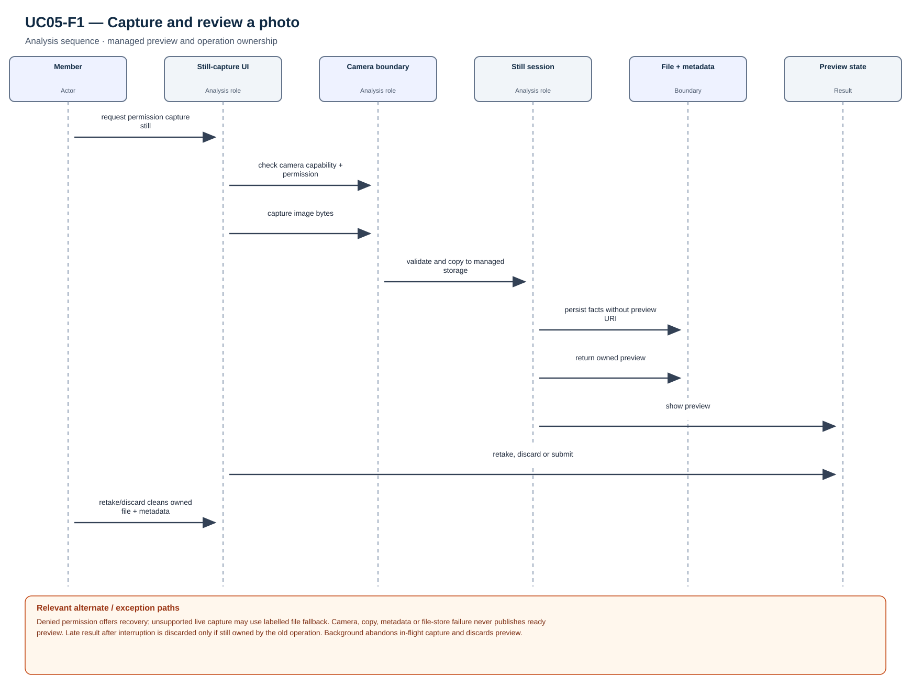

Figure M050. Complete accepted model, cut `fc2b8c81`; SVG SHA256 `fc76fbbb9838e309dee4d18c15f67645c18cc865d8efdb6d5cdf52528aef5d30`. DOCX/PDF uses one Large landscape foldout foldout plate. Package text supplies flow exceptions and code mapping.

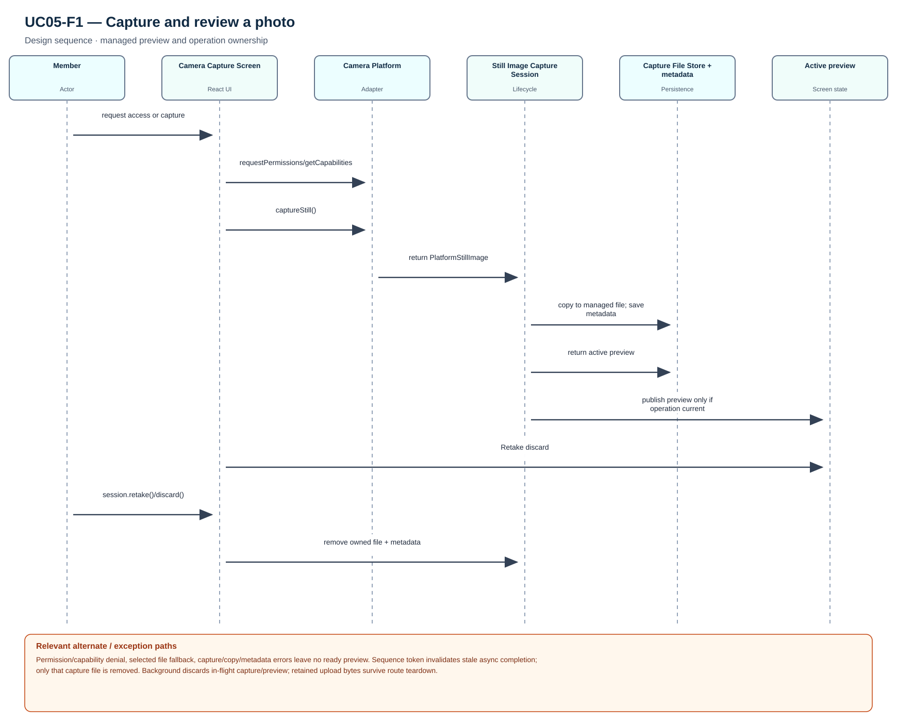

Figure M051. Complete accepted model, cut `fc2b8c81`; SVG SHA256 `8ea9f06f167cb1133789cee70427c2110a7a0a2901e0de337b312b6ff6d284b7`. DOCX/PDF uses one Large landscape foldout foldout plate. Package text supplies flow exceptions and code mapping.

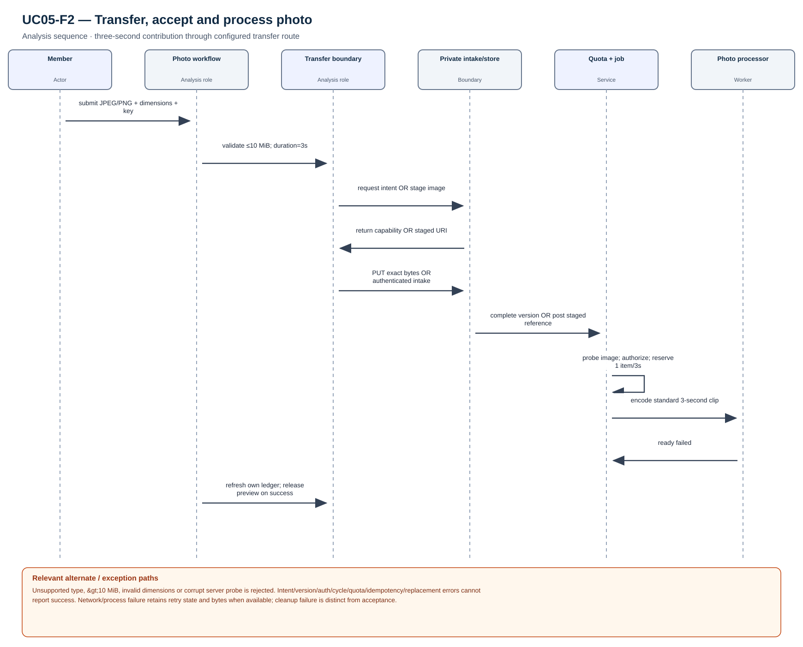

Figure M052. Complete accepted model, cut `fc2b8c81`; SVG SHA256 `3f367d18a1b93af027103f7bc8cc50dde2364670b6a58161ac0583efa1305e4e`. DOCX/PDF uses one Large landscape foldout foldout plate. Package text supplies flow exceptions and code mapping.

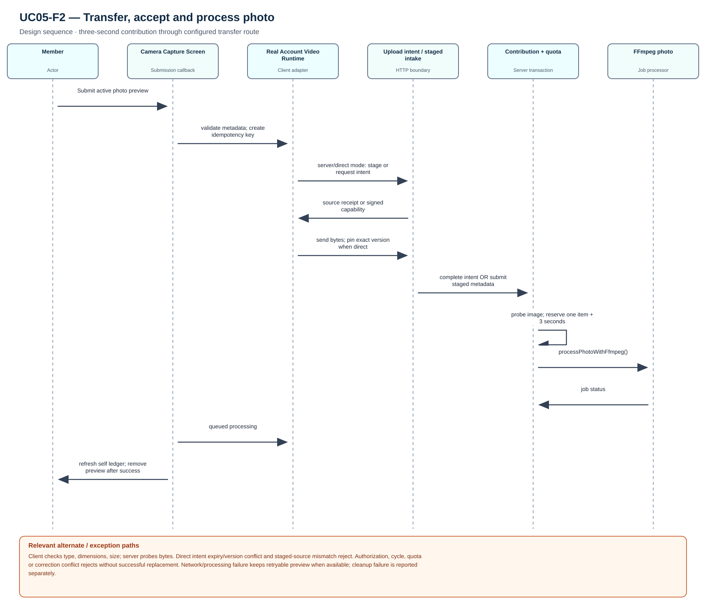

Figure M053. Complete accepted model, cut `fc2b8c81`; SVG SHA256 `48fe0f347895d8670384c94a6811a89ef9c209b0c077c3305e79ea0d2267baa9`. DOCX/PDF uses one Large landscape foldout foldout plate. Package text supplies flow exceptions and code mapping.

Figure M054. Complete accepted model, cut `fc2b8c81`; SVG SHA256 `67d7f97b0e57ae88991307e02a351608b122f44900446af4002bee763cb29266`. DOCX/PDF uses one A3 landscape foldout plate. Package text supplies flow exceptions and code mapping.

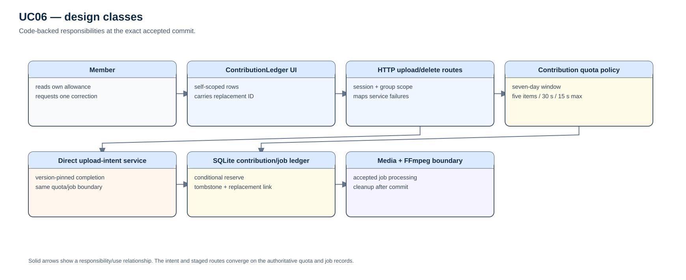

Figure M055. Complete accepted model, cut `fc2b8c81`; SVG SHA256 `9dcdb3f2827d36964e34e544fef82ba6893a123a0652e796b431a1ce2511283a`. DOCX/PDF uses one A3 landscape foldout plate. Package text supplies flow exceptions and code mapping.

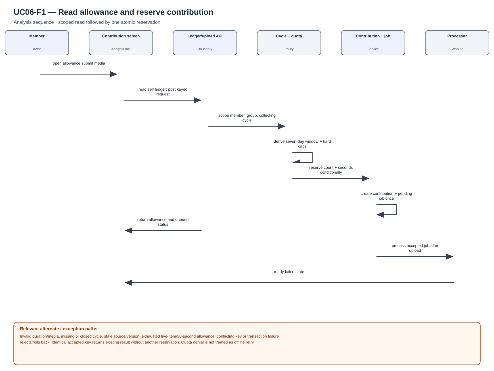

Figure M056. Complete accepted model, cut `fc2b8c81`; SVG SHA256 `fd562bf08c9ea7a2cb0f8d96ea76a02bb76e3038e2782ae1866536ba5a1b09d2`. DOCX/PDF uses one Large landscape foldout foldout plate. Package text supplies flow exceptions and code mapping.

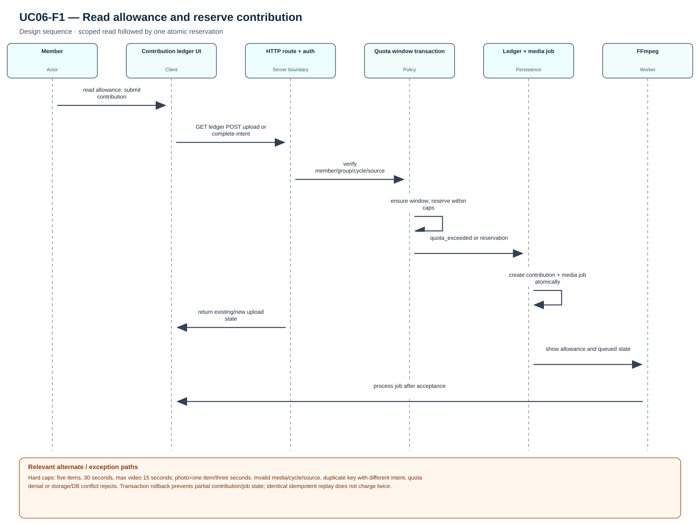

Figure M057. Complete accepted model, cut `fc2b8c81`; SVG SHA256 `3a67fe039a7fe64a24b7052398e1e908c26a1bfe164cdab2b64ccb8ad14a4f72`. DOCX/PDF uses one Large landscape foldout foldout plate. Package text supplies flow exceptions and code mapping.

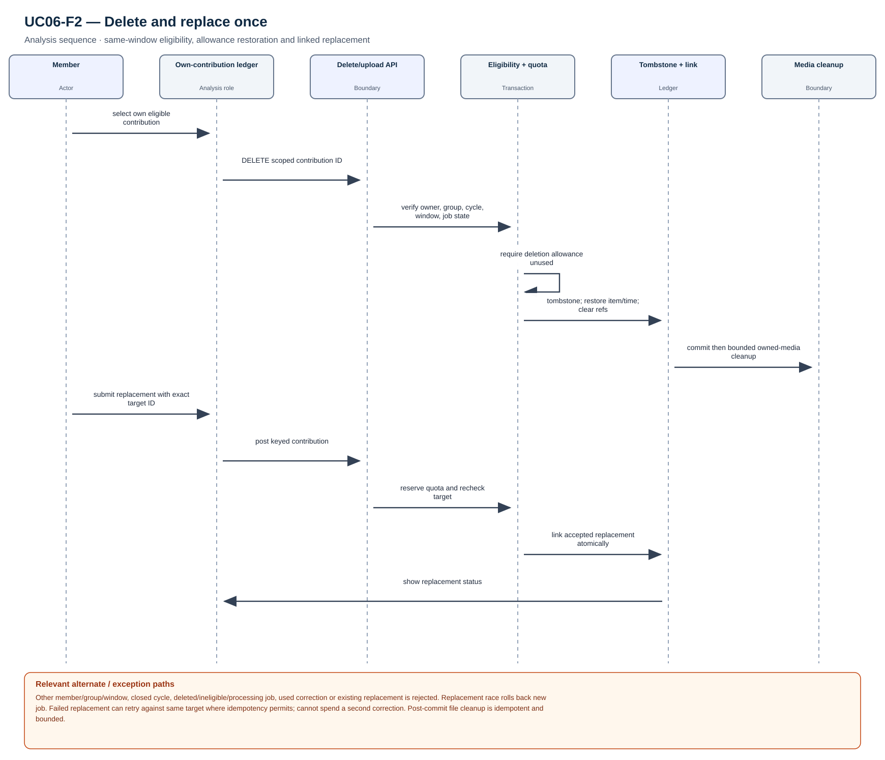

Figure M058. Complete accepted model, cut `fc2b8c81`; SVG SHA256 `bed013016ba4474af3ce645339ee3a90b5c7daf13b4ccf67b11d6b7ecd3040f9`. DOCX/PDF uses one Large landscape foldout foldout plate. Package text supplies flow exceptions and code mapping.

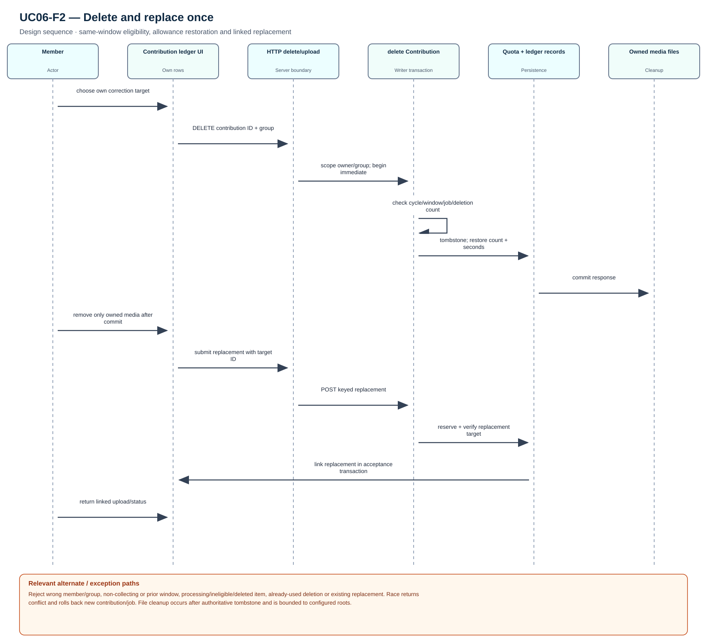

Figure M059. Complete accepted model, cut `fc2b8c81`; SVG SHA256 `73bf978bb1d58b7e4de6a080fb37c0226733ad027d92c7de50090532641a27e0`. DOCX/PDF uses one Large landscape foldout foldout plate. Package text supplies flow exceptions and code mapping.

**CYCLE complete model plates — issue #359**

Accepted model source cut: `fc2b8c811e9c13b176113fa0bdb2c015798990b4`; baseline code/source crosswalk: `25d5d83c3302491d5ea6796f31afd4a3593789a3`. Source text: [use-cases.md](packages/cycle/use-cases.md), [models.md](packages/cycle/models.md), [design-problem.md](packages/cycle/design-problem.md).

Refreshed code trace:

- [server/src/cycles/scheduler.ts:45](https://github.com/Collaboration95/rewind-app/blob/25d5d83c3302491d5ea6796f31afd4a3593789a3/server/src/cycles/scheduler.ts#L45)
- [server/src/cycles/lifecycle.ts:200](https://github.com/Collaboration95/rewind-app/blob/25d5d83c3302491d5ea6796f31afd4a3593789a3/server/src/cycles/lifecycle.ts#L200)
- [server/src/cycles/lifecycle.ts:325](https://github.com/Collaboration95/rewind-app/blob/25d5d83c3302491d5ea6796f31afd4a3593789a3/server/src/cycles/lifecycle.ts#L325)
- [server/src/cycles/lifecycle.ts:276](https://github.com/Collaboration95/rewind-app/blob/25d5d83c3302491d5ea6796f31afd4a3593789a3/server/src/cycles/lifecycle.ts#L276)
- [server/src/cycles/lifecycle.ts:216](https://github.com/Collaboration95/rewind-app/blob/25d5d83c3302491d5ea6796f31afd4a3593789a3/server/src/cycles/lifecycle.ts#L216)
- [server/src/jobs/index.ts:502](https://github.com/Collaboration95/rewind-app/blob/25d5d83c3302491d5ea6796f31afd4a3593789a3/server/src/jobs/index.ts#L502)
- [server/src/db.ts:1071](https://github.com/Collaboration95/rewind-app/blob/25d5d83c3302491d5ea6796f31afd4a3593789a3/server/src/db.ts#L1071)
- [server/src/jobs/index.ts:599](https://github.com/Collaboration95/rewind-app/blob/25d5d83c3302491d5ea6796f31afd4a3593789a3/server/src/jobs/index.ts#L599)
- [server/src/jobs/worker.ts:148](https://github.com/Collaboration95/rewind-app/blob/25d5d83c3302491d5ea6796f31afd4a3593789a3/server/src/jobs/worker.ts#L148)
- [server/src/jobs/index.ts:131](https://github.com/Collaboration95/rewind-app/blob/25d5d83c3302491d5ea6796f31afd4a3593789a3/server/src/jobs/index.ts#L131)
- [server/src/jobs/index.ts:134](https://github.com/Collaboration95/rewind-app/blob/25d5d83c3302491d5ea6796f31afd4a3593789a3/server/src/jobs/index.ts#L134)
- [server/src/jobs/index.ts:380](https://github.com/Collaboration95/rewind-app/blob/25d5d83c3302491d5ea6796f31afd4a3593789a3/server/src/jobs/index.ts#L380)
- [server/src/jobs/index.ts:546](https://github.com/Collaboration95/rewind-app/blob/25d5d83c3302491d5ea6796f31afd4a3593789a3/server/src/jobs/index.ts#L546)
- [server/src/jobs/index.ts:785](https://github.com/Collaboration95/rewind-app/blob/25d5d83c3302491d5ea6796f31afd4a3593789a3/server/src/jobs/index.ts#L785)
- [server/src/ffmpeg.ts:463](https://github.com/Collaboration95/rewind-app/blob/25d5d83c3302491d5ea6796f31afd4a3593789a3/server/src/ffmpeg.ts#L463)
- [server/src/jobs/index.ts:895](https://github.com/Collaboration95/rewind-app/blob/25d5d83c3302491d5ea6796f31afd4a3593789a3/server/src/jobs/index.ts#L895)
- [server/src/jobs/index.ts:963](https://github.com/Collaboration95/rewind-app/blob/25d5d83c3302491d5ea6796f31afd4a3593789a3/server/src/jobs/index.ts#L963)
- [server/src/db.ts:963](https://github.com/Collaboration95/rewind-app/blob/25d5d83c3302491d5ea6796f31afd4a3593789a3/server/src/db.ts#L963)
- [server/src/groups/real.ts:142](https://github.com/Collaboration95/rewind-app/blob/25d5d83c3302491d5ea6796f31afd4a3593789a3/server/src/groups/real.ts#L142)
- [src/domain/premiere.ts:1](https://github.com/Collaboration95/rewind-app/blob/25d5d83c3302491d5ea6796f31afd4a3593789a3/src/domain/premiere.ts#L1)
- [server/src/http.ts:2995](https://github.com/Collaboration95/rewind-app/blob/25d5d83c3302491d5ea6796f31afd4a3593789a3/server/src/http.ts#L2995)
- [server/src/http.ts:3146](https://github.com/Collaboration95/rewind-app/blob/25d5d83c3302491d5ea6796f31afd4a3593789a3/server/src/http.ts#L3146)
- [docs/domain/cycle-control-contract.md:1](https://github.com/Collaboration95/rewind-app/blob/25d5d83c3302491d5ea6796f31afd4a3593789a3/docs/domain/cycle-control-contract.md#L1)
- [docs/architecture/hosted-demo-persistence.md:21](https://github.com/Collaboration95/rewind-app/blob/25d5d83c3302491d5ea6796f31afd4a3593789a3/docs/architecture/hosted-demo-persistence.md#L21)
- [server/src/cycles/lifecycle.ts:38](https://github.com/Collaboration95/rewind-app/blob/25d5d83c3302491d5ea6796f31afd4a3593789a3/server/src/cycles/lifecycle.ts#L38)

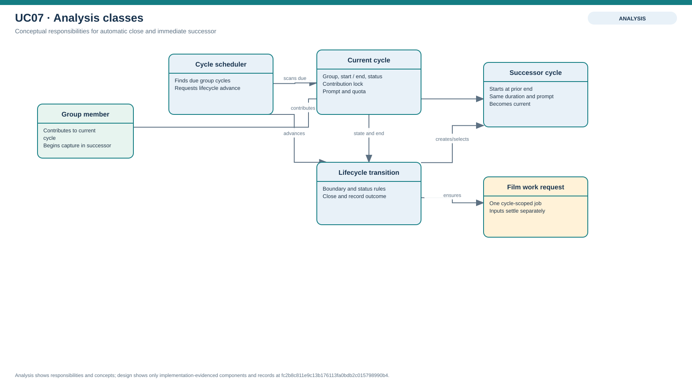

Figure M064. Complete accepted model, cut `fc2b8c81`; SVG SHA256 `7c1b75c1f21cb5aebc94813e2158525467aef1261b28166d867bea85ba19daae`. DOCX/PDF uses one A3 landscape foldout plate. Package text supplies flow exceptions and code mapping.

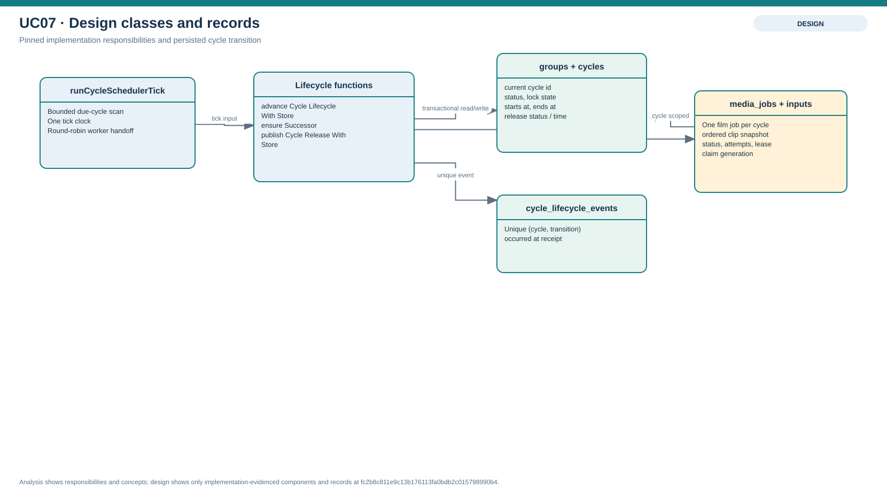

Figure M065. Complete accepted model, cut `fc2b8c81`; SVG SHA256 `6f2bf5958993293e1b4b0a38c62c534794e8f21a39a71115aa441bed6ecec6a3`. DOCX/PDF uses one A3 landscape foldout plate. Package text supplies flow exceptions and code mapping.

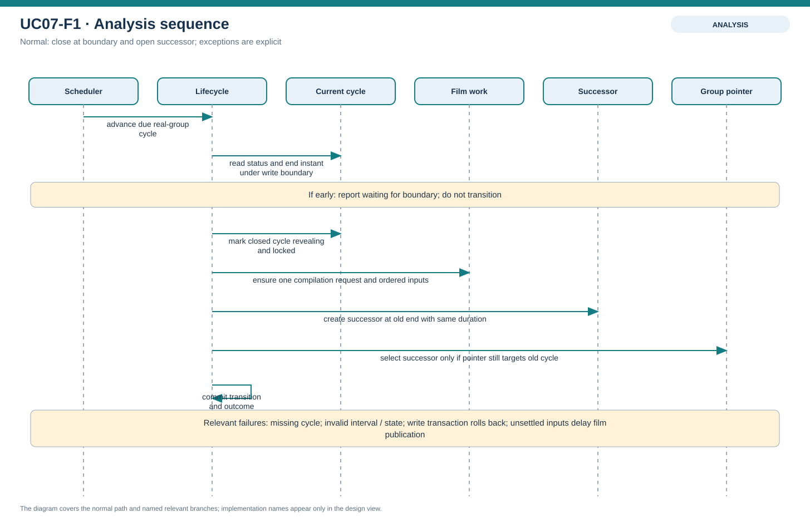

Figure M066. Complete accepted model, cut `fc2b8c81`; SVG SHA256 `0cb8a3604193890cf1cf4f4d1467833a498b0af787e7c78364b6d467a93be9ff`. DOCX/PDF uses one A3 landscape foldout plate. Package text supplies flow exceptions and code mapping.

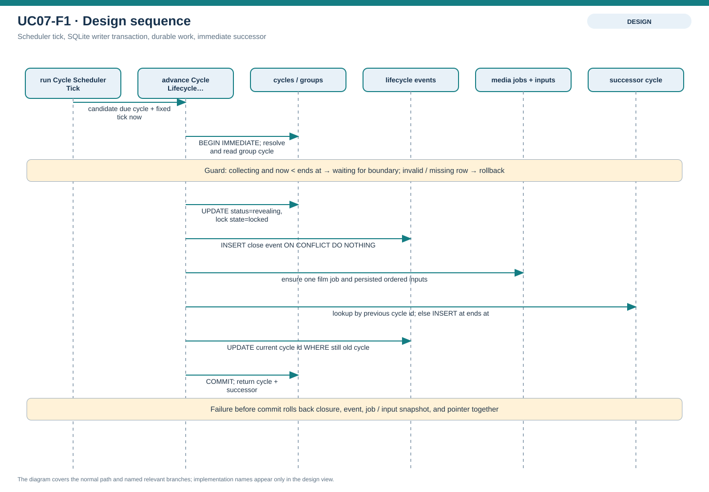

Figure M067. Complete accepted model, cut `fc2b8c81`; SVG SHA256 `5a2a258ba0c439a5687142d24df794259382499d0873af715ace7a3e6afce0fc`. DOCX/PDF uses one A3 landscape foldout plate. Package text supplies flow exceptions and code mapping.

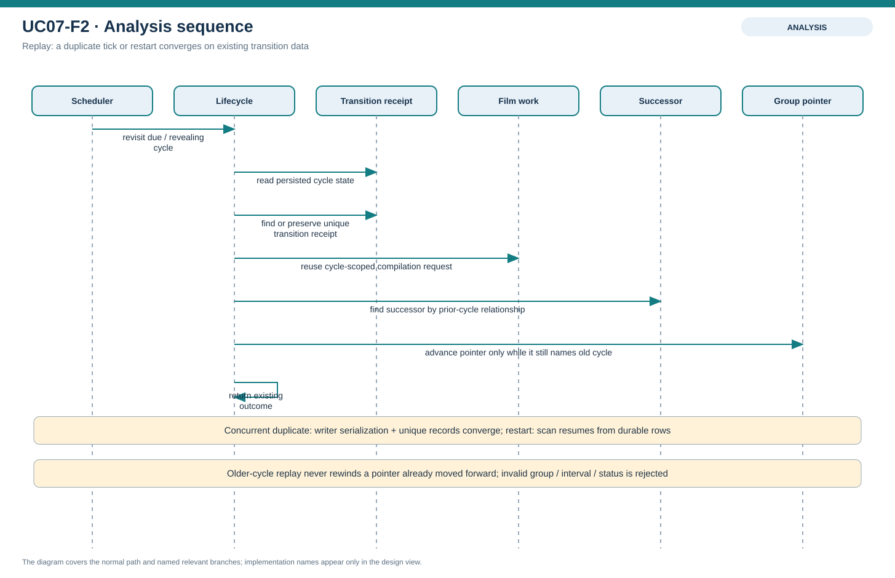

Figure M068. Complete accepted model, cut `fc2b8c81`; SVG SHA256 `5e4ecc4c43bd7ef6ed8f77c9b09537d13dd09ff4c8af4e6446039b2601f568ed`. DOCX/PDF uses one A3 landscape foldout plate. Package text supplies flow exceptions and code mapping.

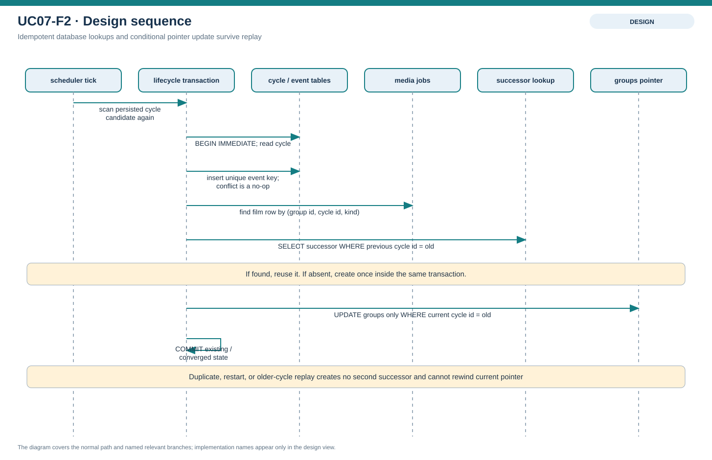

Figure M069. Complete accepted model, cut `fc2b8c81`; SVG SHA256 `f743b0b7bcde7c854d2884869a664431523afafb995d1e098165b7cb05e5579b`. DOCX/PDF uses one A3 landscape foldout plate. Package text supplies flow exceptions and code mapping.

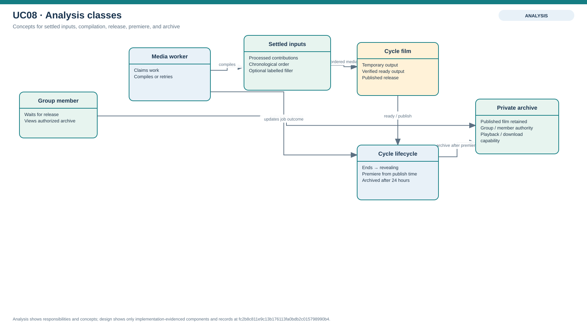

Figure M070. Complete accepted model, cut `fc2b8c81`; SVG SHA256 `f11535a48c80fbcff4ad491c02d62ce0e6ec47de0d9dccc7c7a7e34ab961df44`. DOCX/PDF uses one A3 landscape foldout plate. Package text supplies flow exceptions and code mapping.

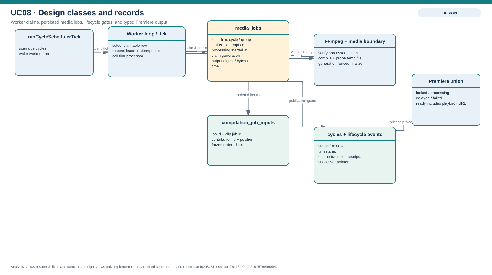

Figure M071. Complete accepted model, cut `fc2b8c81`; SVG SHA256 `d08d9ec5126fd753b20af7fbdb2374f8679dba88525afce75c3846c725f755a7`. DOCX/PDF uses one A3 landscape foldout plate. Package text supplies flow exceptions and code mapping.

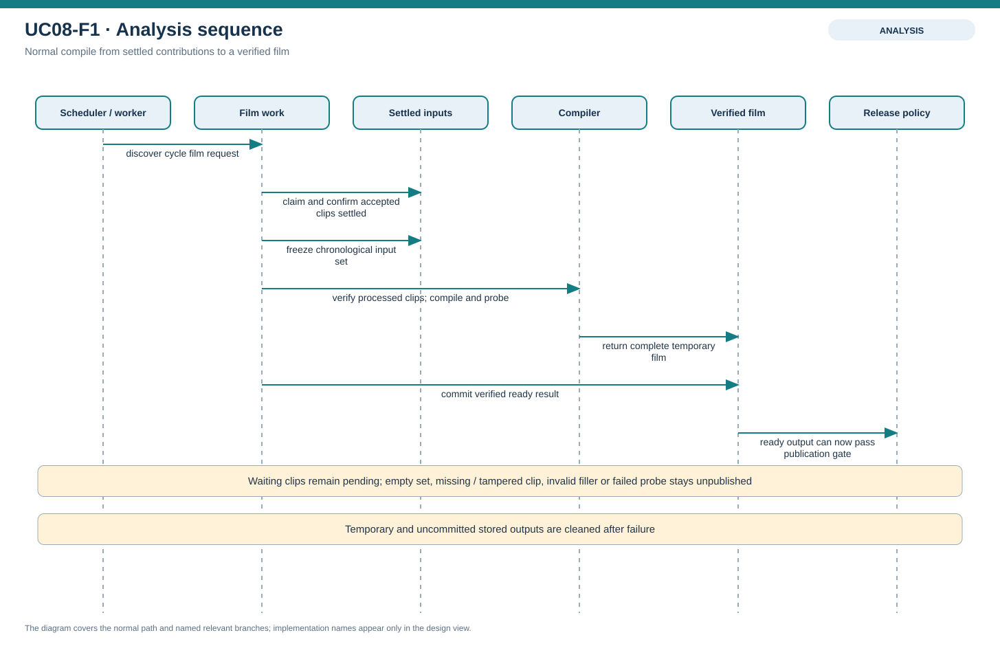

Figure M072. Complete accepted model, cut `fc2b8c81`; SVG SHA256 `479177a979f2bc118b771248014373231a818d30e215f04f55e51bb6bec41946`. DOCX/PDF uses one A3 landscape foldout plate. Package text supplies flow exceptions and code mapping.

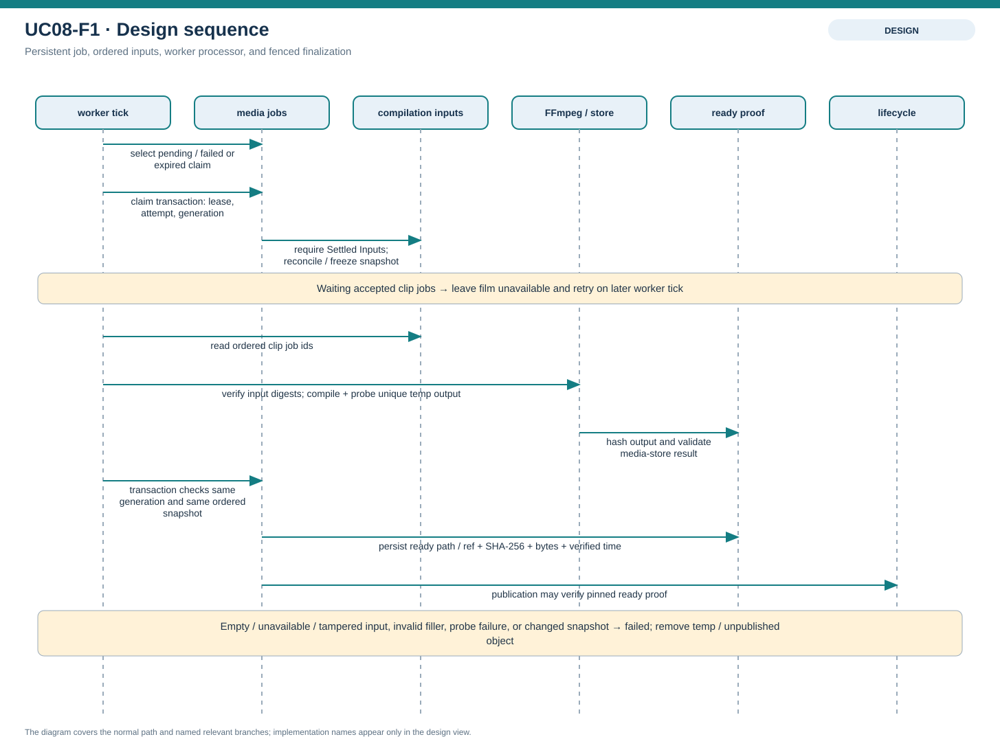

Figure M073. Complete accepted model, cut `fc2b8c81`; SVG SHA256 `2f7923ba5d61ff6f195669b3f5915940f1fdc08905a3e727526957604865f26d`. DOCX/PDF uses one Large landscape foldout foldout plate. Package text supplies flow exceptions and code mapping.

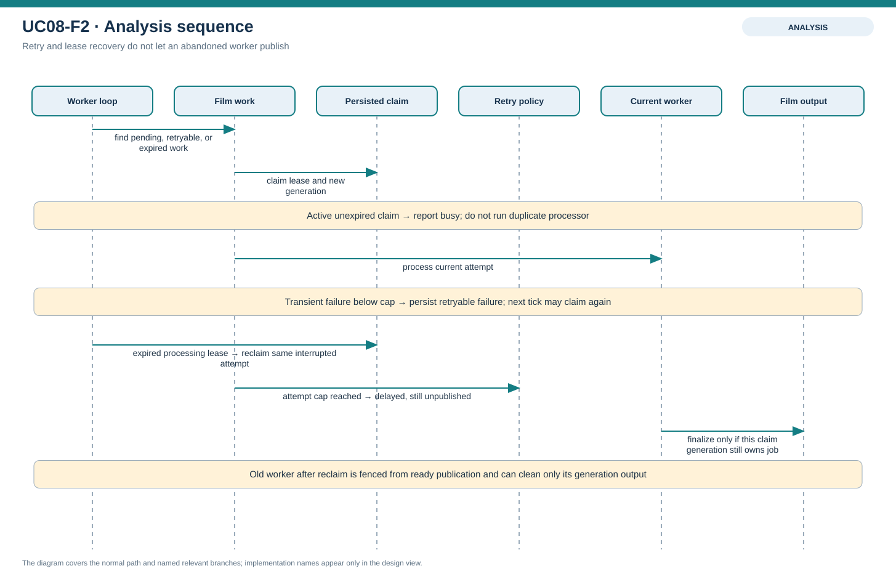

Figure M074. Complete accepted model, cut `fc2b8c81`; SVG SHA256 `cf07f28594c3bdfec69112167c92c1744083677202c24e7315e2fd3492157bff`. DOCX/PDF uses one A3 landscape foldout plate. Package text supplies flow exceptions and code mapping.

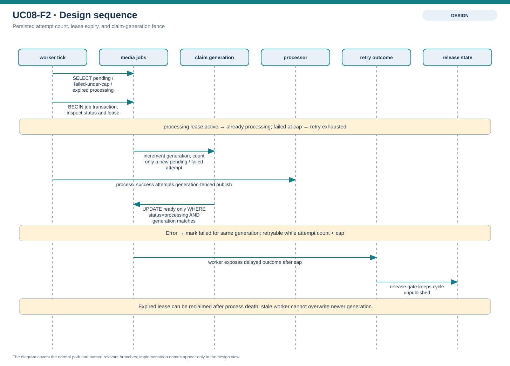

Figure M075. Complete accepted model, cut `fc2b8c81`; SVG SHA256 `c117de9ebc7f459c8b98300562e6bd81b3bcdcffdcdac8c3cbdeaff5a4d9cedc`. DOCX/PDF uses one Large landscape foldout foldout plate. Package text supplies flow exceptions and code mapping.

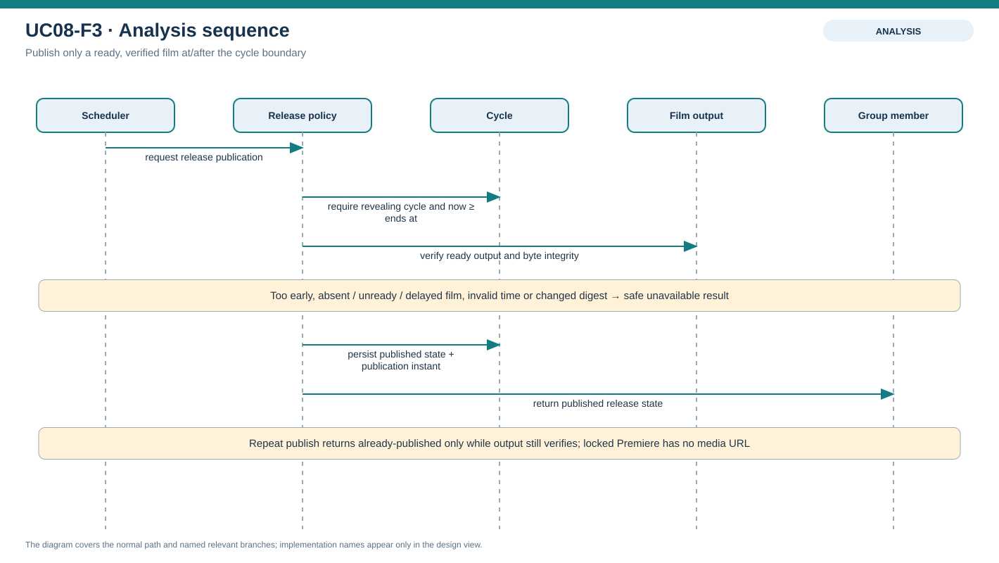

Figure M076. Complete accepted model, cut `fc2b8c81`; SVG SHA256 `0f61592e0c72ee70384dbb9b2f419ef52f4013930561662781bcad7f648542f0`. DOCX/PDF uses one A3 landscape foldout plate. Package text supplies flow exceptions and code mapping.

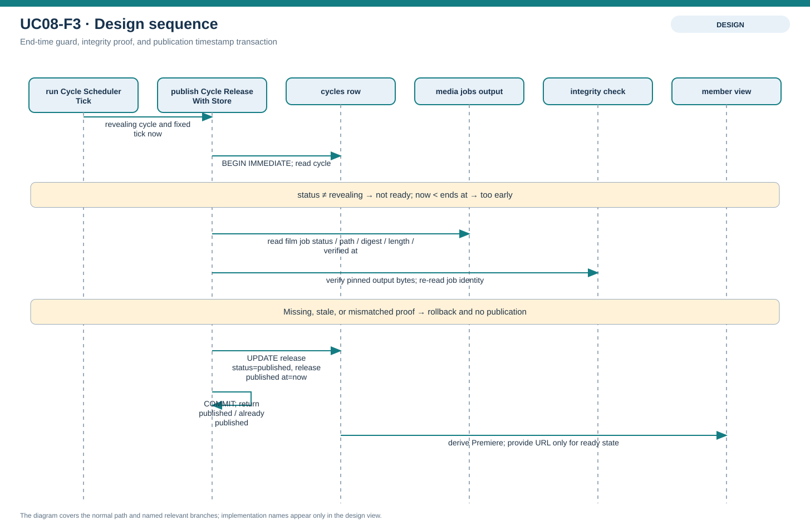

Figure M077. Complete accepted model, cut `fc2b8c81`; SVG SHA256 `6cfa5fa385da6cba9a6c88a56e27e9edda9fa5f4b1258884143be7b08f022819`. DOCX/PDF uses one A3 landscape foldout plate. Package text supplies flow exceptions and code mapping.

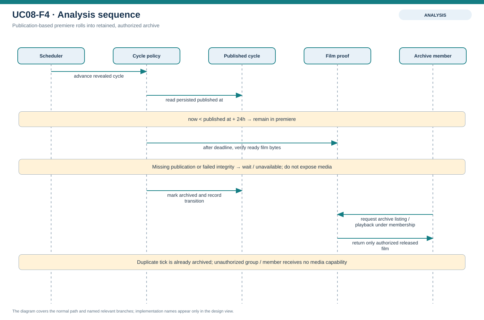

Figure M078. Complete accepted model, cut `fc2b8c81`; SVG SHA256 `3e400214c4136db14ef152edfcf1859e23187d84a09fc64fdb9a77abe097576a`. DOCX/PDF uses one A3 landscape foldout plate. Package text supplies flow exceptions and code mapping.

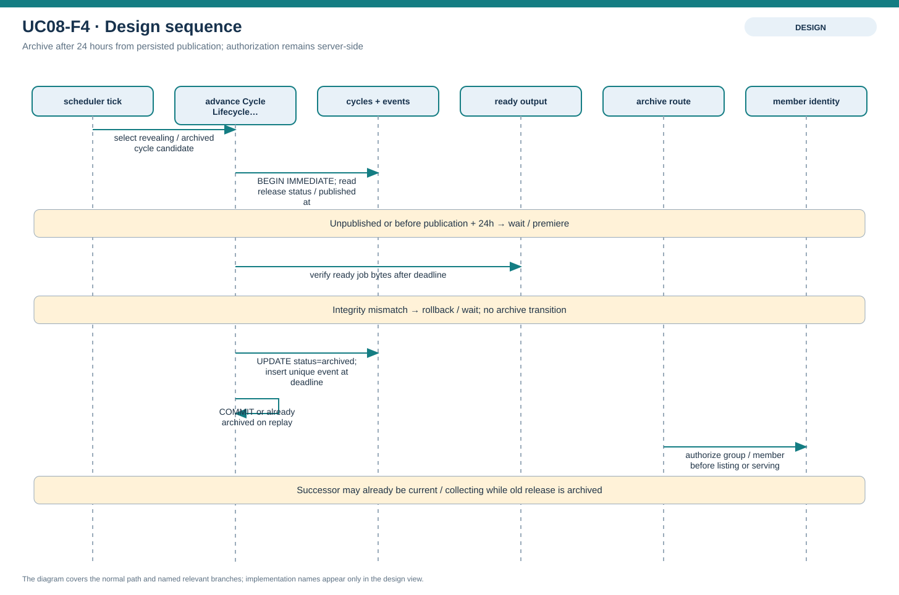

Figure M079. Complete accepted model, cut `fc2b8c81`; SVG SHA256 `bbfb18d89ea999023986e4727abd1fc541ddd391aa7bffd0b27731103319ec4a`. DOCX/PDF uses one A3 landscape foldout plate. Package text supplies flow exceptions and code mapping.

**PARTICIPATION complete model plates — issue #360**

Accepted model source cut: `1128b6a68985cf68215beb4a7a80fd00ec4242fa`; baseline code/source crosswalk: `25d5d83c3302491d5ea6796f31afd4a3593789a3`. Source text: [use-cases.md](packages/participation/use-cases.md), [models.md](packages/participation/models.md), [design-problem.md](packages/participation/design-problem.md).

Refreshed code trace:

- [src/reminders/RealGroupSettings.tsx:20](https://github.com/Collaboration95/rewind-app/blob/25d5d83c3302491d5ea6796f31afd4a3593789a3/src/reminders/RealGroupSettings.tsx#L20)
- [server/src/groups/settings.ts:5](https://github.com/Collaboration95/rewind-app/blob/25d5d83c3302491d5ea6796f31afd4a3593789a3/server/src/groups/settings.ts#L5)
- [server/src/http.ts:3783](https://github.com/Collaboration95/rewind-app/blob/25d5d83c3302491d5ea6796f31afd4a3593789a3/server/src/http.ts#L3783)
- [server/src/reminders/schedule.ts:55](https://github.com/Collaboration95/rewind-app/blob/25d5d83c3302491d5ea6796f31afd4a3593789a3/server/src/reminders/schedule.ts#L55)
- [server/src/groups/settings.ts:44](https://github.com/Collaboration95/rewind-app/blob/25d5d83c3302491d5ea6796f31afd4a3593789a3/server/src/groups/settings.ts#L44)
- [server/src/groups/settings.ts:70](https://github.com/Collaboration95/rewind-app/blob/25d5d83c3302491d5ea6796f31afd4a3593789a3/server/src/groups/settings.ts#L70)
- [server/migrations/025-real-group-reminders.sql:3](https://github.com/Collaboration95/rewind-app/blob/25d5d83c3302491d5ea6796f31afd4a3593789a3/server/migrations/025-real-group-reminders.sql#L3)
- [src/reminders/private-reminder-client.ts:39](https://github.com/Collaboration95/rewind-app/blob/25d5d83c3302491d5ea6796f31afd4a3593789a3/src/reminders/private-reminder-client.ts#L39)
- [src/reminders/push-platform.ts:43](https://github.com/Collaboration95/rewind-app/blob/25d5d83c3302491d5ea6796f31afd4a3593789a3/src/reminders/push-platform.ts#L43)
- [server/src/http.ts:3569](https://github.com/Collaboration95/rewind-app/blob/25d5d83c3302491d5ea6796f31afd4a3593789a3/server/src/http.ts#L3569)
- [server/src/reminders/outbox.ts:158](https://github.com/Collaboration95/rewind-app/blob/25d5d83c3302491d5ea6796f31afd4a3593789a3/server/src/reminders/outbox.ts#L158)
- [server/src/reminders/outbox.ts:274](https://github.com/Collaboration95/rewind-app/blob/25d5d83c3302491d5ea6796f31afd4a3593789a3/server/src/reminders/outbox.ts#L274)
- [server/src/cli.ts:676](https://github.com/Collaboration95/rewind-app/blob/25d5d83c3302491d5ea6796f31afd4a3593789a3/server/src/cli.ts#L676)
- [server/src/reminders/outbox.ts:303](https://github.com/Collaboration95/rewind-app/blob/25d5d83c3302491d5ea6796f31afd4a3593789a3/server/src/reminders/outbox.ts#L303)
- [server/src/reminders/outbox.ts:440](https://github.com/Collaboration95/rewind-app/blob/25d5d83c3302491d5ea6796f31afd4a3593789a3/server/src/reminders/outbox.ts#L440)
- [server/src/reminders/providers.ts:122](https://github.com/Collaboration95/rewind-app/blob/25d5d83c3302491d5ea6796f31afd4a3593789a3/server/src/reminders/providers.ts#L122)
- [server/src/reminders/providers.ts:194](https://github.com/Collaboration95/rewind-app/blob/25d5d83c3302491d5ea6796f31afd4a3593789a3/server/src/reminders/providers.ts#L194)
- [server/migrations/027-reminder-outbox.sql:3](https://github.com/Collaboration95/rewind-app/blob/25d5d83c3302491d5ea6796f31afd4a3593789a3/server/migrations/027-reminder-outbox.sql#L3)
- [src/chat/RealAccountChatScreen.tsx:50](https://github.com/Collaboration95/rewind-app/blob/25d5d83c3302491d5ea6796f31afd4a3593789a3/src/chat/RealAccountChatScreen.tsx#L50)
- [src/chat/realtime-client.ts:171](https://github.com/Collaboration95/rewind-app/blob/25d5d83c3302491d5ea6796f31afd4a3593789a3/src/chat/realtime-client.ts#L171)
- [src/chat/realtime-client.ts:208](https://github.com/Collaboration95/rewind-app/blob/25d5d83c3302491d5ea6796f31afd4a3593789a3/src/chat/realtime-client.ts#L208)
- [src/chat/realtime-client.ts:329](https://github.com/Collaboration95/rewind-app/blob/25d5d83c3302491d5ea6796f31afd4a3593789a3/src/chat/realtime-client.ts#L329)
- [src/chat/native-event-source.ts:229](https://github.com/Collaboration95/rewind-app/blob/25d5d83c3302491d5ea6796f31afd4a3593789a3/src/chat/native-event-source.ts#L229)
- [server/src/chat/index.ts:156](https://github.com/Collaboration95/rewind-app/blob/25d5d83c3302491d5ea6796f31afd4a3593789a3/server/src/chat/index.ts#L156)
- [server/src/chat/index.ts:206](https://github.com/Collaboration95/rewind-app/blob/25d5d83c3302491d5ea6796f31afd4a3593789a3/server/src/chat/index.ts#L206)
- [server/src/chat/index.ts:282](https://github.com/Collaboration95/rewind-app/blob/25d5d83c3302491d5ea6796f31afd4a3593789a3/server/src/chat/index.ts#L282)
- [server/src/chat/index.ts:426](https://github.com/Collaboration95/rewind-app/blob/25d5d83c3302491d5ea6796f31afd4a3593789a3/server/src/chat/index.ts#L426)
- [server/src/http.ts:1626](https://github.com/Collaboration95/rewind-app/blob/25d5d83c3302491d5ea6796f31afd4a3593789a3/server/src/http.ts#L1626)
- [server/src/http.ts:1667](https://github.com/Collaboration95/rewind-app/blob/25d5d83c3302491d5ea6796f31afd4a3593789a3/server/src/http.ts#L1667)
- [server/src/http.ts:1811](https://github.com/Collaboration95/rewind-app/blob/25d5d83c3302491d5ea6796f31afd4a3593789a3/server/src/http.ts#L1811)
- [server/src/http.ts:1868](https://github.com/Collaboration95/rewind-app/blob/25d5d83c3302491d5ea6796f31afd4a3593789a3/server/src/http.ts#L1868)
- [server/src/realtime/index.ts:42](https://github.com/Collaboration95/rewind-app/blob/25d5d83c3302491d5ea6796f31afd4a3593789a3/server/src/realtime/index.ts#L42)

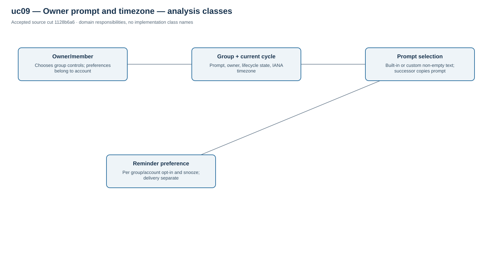

Figure M084. Complete accepted model, cut `1128b6a6`; SVG SHA256 `f9d400f6f0697cc5990b8477dbc7833746a79c7d9e4122002fc8b5718a87cb96`. DOCX/PDF uses one A3 landscape foldout plate. Package text supplies flow exceptions and code mapping.

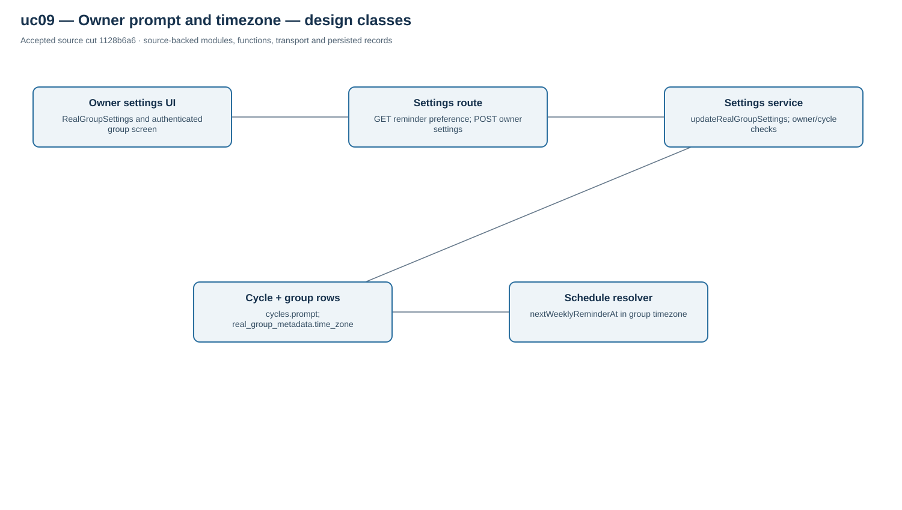

Figure M085. Complete accepted model, cut `1128b6a6`; SVG SHA256 `045360348ccbdffdc2b67dfd737fdaacf0fabde6dd596a7bde46f6e2af44c914`. DOCX/PDF uses one A3 landscape foldout plate. Package text supplies flow exceptions and code mapping.

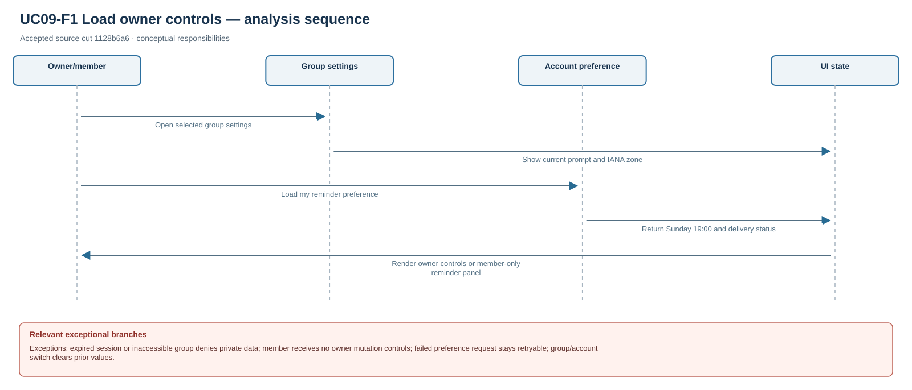

Figure M086. Complete accepted model, cut `1128b6a6`; SVG SHA256 `4e40b04101b62aaab5d571e7fb0c6bb40356161ea7d72cf510905f30174672ad`. DOCX/PDF uses one A3 landscape foldout plate. Package text supplies flow exceptions and code mapping.

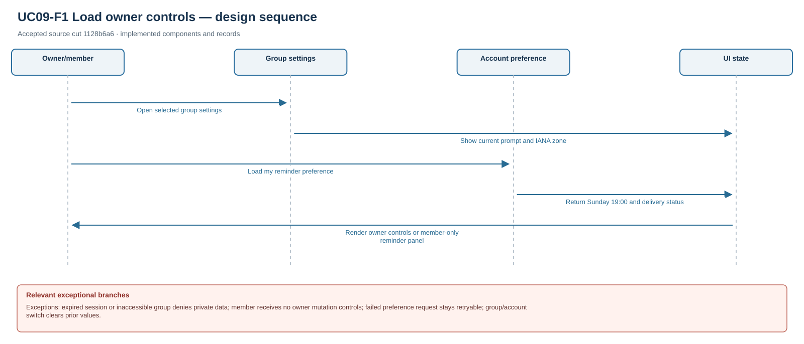

Figure M087. Complete accepted model, cut `1128b6a6`; SVG SHA256 `d6615ed27c26d81fb34ee8d86450426debecb627894dc7fb68891c77054e10ae`. DOCX/PDF uses one A3 landscape foldout plate. Package text supplies flow exceptions and code mapping.

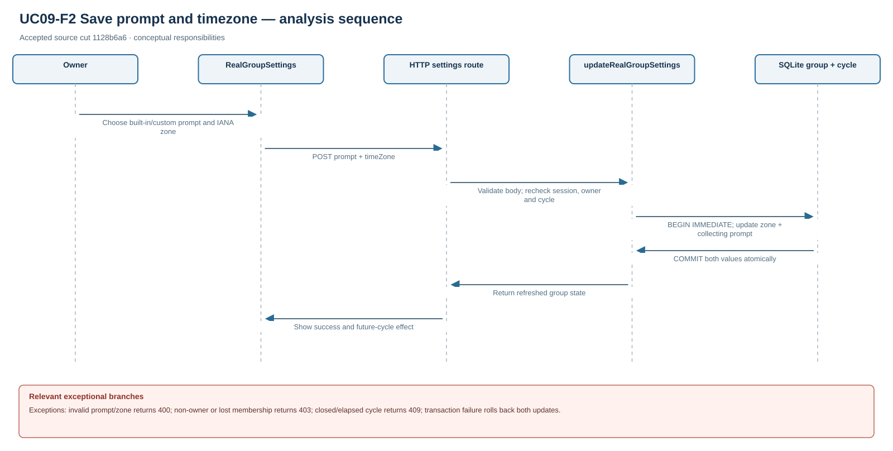

Figure M088. Complete accepted model, cut `1128b6a6`; SVG SHA256 `779127a1dcff092d2d98916c52c1ff2904ca02e7faca019d1931b9cee7aeb4ab`. DOCX/PDF uses one A3 landscape foldout plate. Package text supplies flow exceptions and code mapping.

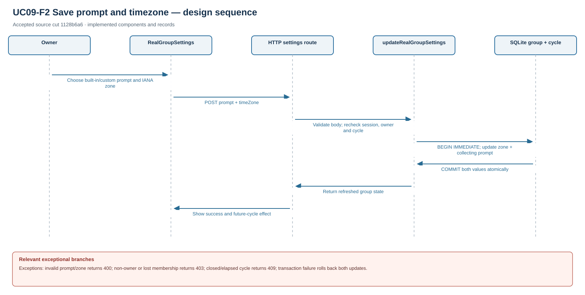

Figure M089. Complete accepted model, cut `1128b6a6`; SVG SHA256 `e287b5b5a96be91c760e5a21b785a1e00b8376b216969db61db46eeb21606efe`. DOCX/PDF uses one A3 landscape foldout plate. Package text supplies flow exceptions and code mapping.

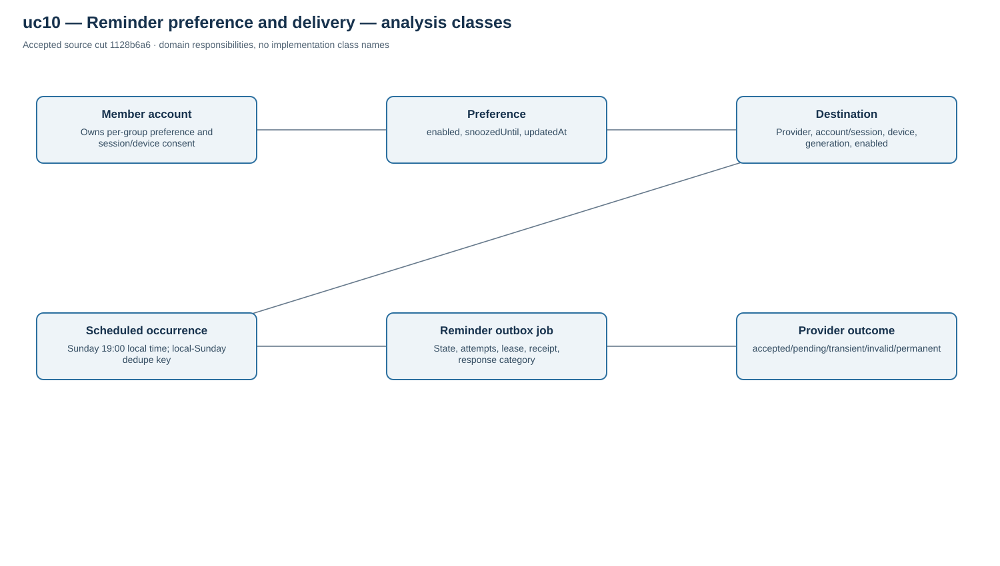

Figure M090. Complete accepted model, cut `1128b6a6`; SVG SHA256 `6732c1b5c43239393c757568c0c2173775e0bd37ded1b87065e26903ecd6b5d3`. DOCX/PDF uses one A3 landscape foldout plate. Package text supplies flow exceptions and code mapping.

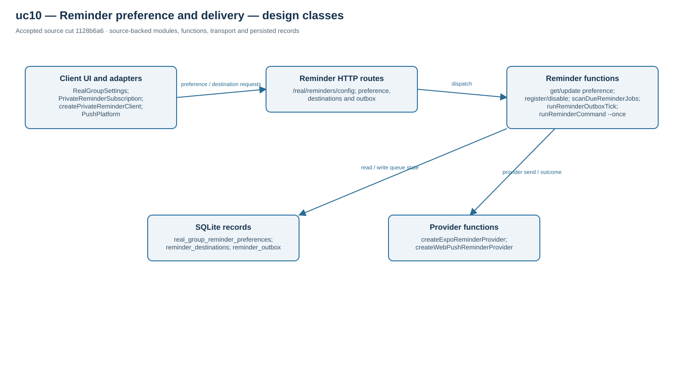

Figure M091. Complete accepted model, cut `1128b6a6`; SVG SHA256 `2e8e9ac97e112b75388b08a3f02c3657f072e2b40005f119f578c16913f07a60`. DOCX/PDF uses one A3 landscape foldout plate. Package text supplies flow exceptions and code mapping.

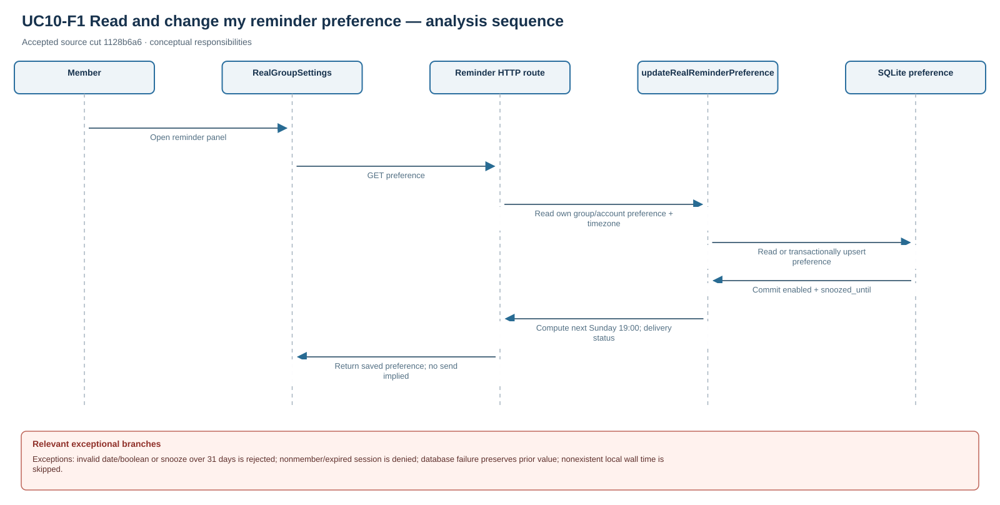

Figure M092. Complete accepted model, cut `1128b6a6`; SVG SHA256 `d943b6f533c255dae3e4decbd2eb34a5db98ae20cb30f551dc79b07202c06719`. DOCX/PDF uses one A3 landscape foldout plate. Package text supplies flow exceptions and code mapping.

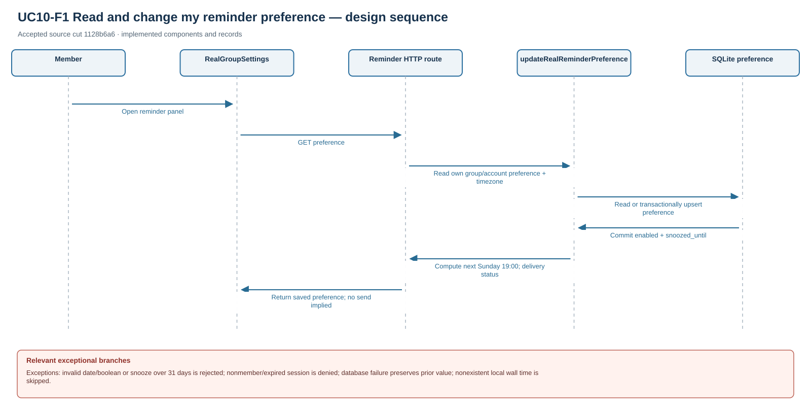

Figure M093. Complete accepted model, cut `1128b6a6`; SVG SHA256 `b3cc30d50dcc1803b71ad0d45a176d5fdd61fdaf106a813ac084ec049a53a376`. DOCX/PDF uses one A3 landscape foldout plate. Package text supplies flow exceptions and code mapping.

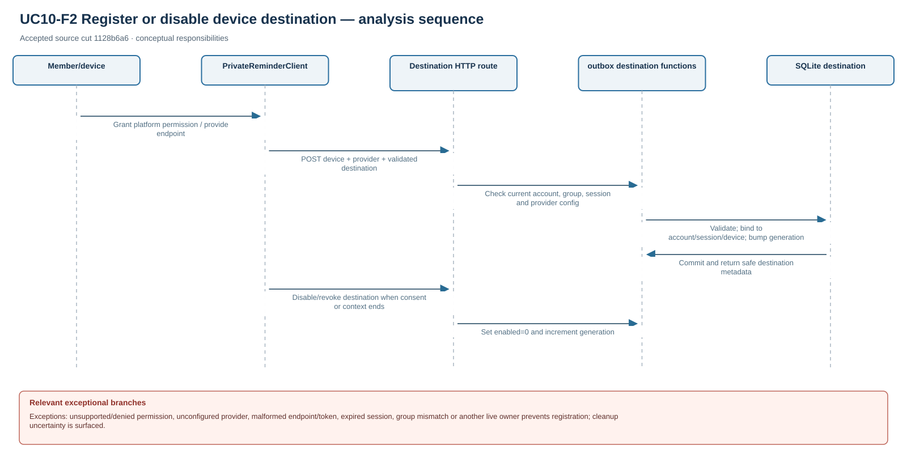

Figure M094. Complete accepted model, cut `1128b6a6`; SVG SHA256 `04d816e4bd8a9947e3f269f3773f99bd071968440f5506df6bc286cb7139f4c6`. DOCX/PDF uses one A3 landscape foldout plate. Package text supplies flow exceptions and code mapping.

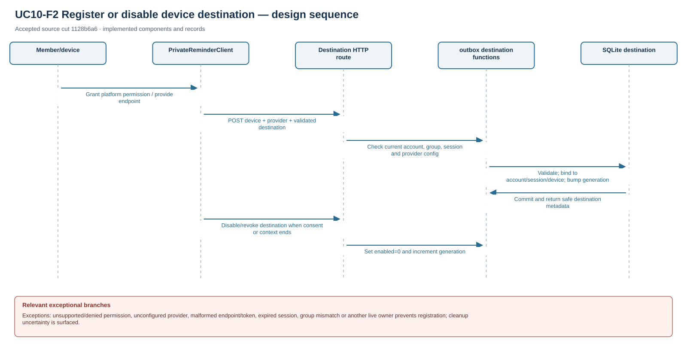

Figure M095. Complete accepted model, cut `1128b6a6`; SVG SHA256 `040a898951929cf8e707d05a65da191f4955eecbb10edec1ba8d96a254c44a9b`. DOCX/PDF uses one A3 landscape foldout plate. Package text supplies flow exceptions and code mapping.

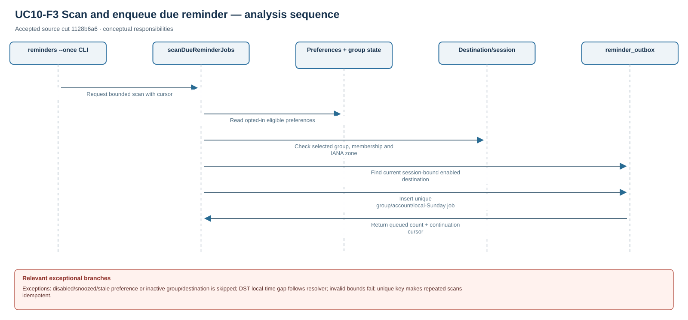

Figure M096. Complete accepted model, cut `1128b6a6`; SVG SHA256 `6eaa990ea59fcd6d6bbb30ed97f65eb245c692db1d4590ee1f02bc378a9dc8a2`. DOCX/PDF uses one A3 landscape foldout plate. Package text supplies flow exceptions and code mapping.

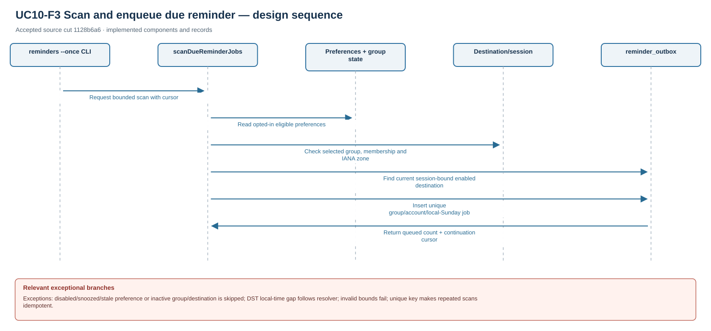

Figure M097. Complete accepted model, cut `1128b6a6`; SVG SHA256 `73441dfeab64602c6c59e590631e25783483caeda9af0c03bb6967637448d377`. DOCX/PDF uses one A3 landscape foldout plate. Package text supplies flow exceptions and code mapping.

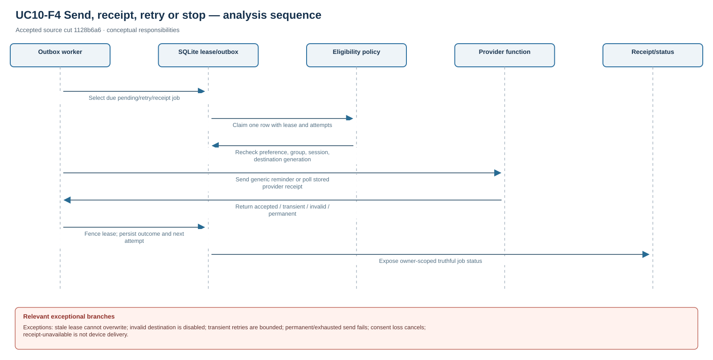

Figure M098. Complete accepted model, cut `1128b6a6`; SVG SHA256 `dd4e68267a2e9469e4c618d721f49c1fc34083f2067388ae12fb74d7e4021d95`. DOCX/PDF uses one A3 landscape foldout plate. Package text supplies flow exceptions and code mapping.

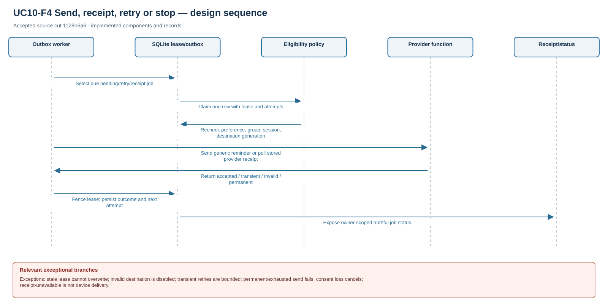

Figure M099. Complete accepted model, cut `1128b6a6`; SVG SHA256 `a4205c8826699a7f769930f1fc8c25864351f035cb56d16e03a093842a215e2d`. DOCX/PDF uses one A3 landscape foldout plate. Package text supplies flow exceptions and code mapping.

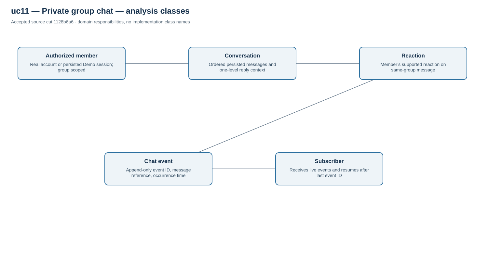

Figure M100. Complete accepted model, cut `1128b6a6`; SVG SHA256 `761a940af2ded815002699846437d7bac70304ef5f501ba18deabce30831feb8`. DOCX/PDF uses one A3 landscape foldout plate. Package text supplies flow exceptions and code mapping.

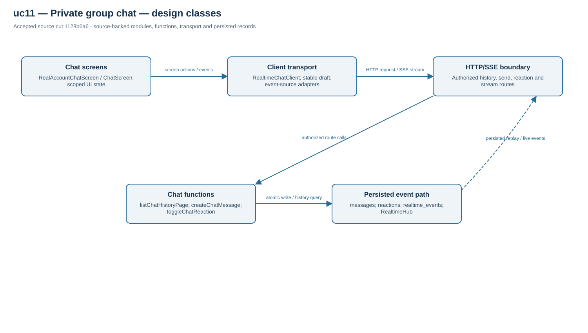

Figure M101. Complete accepted model, cut `1128b6a6`; SVG SHA256 `cf5c0bd96bd97e72faa9e5ede33e4bc96c260c078f14896af67f8687d72519d7`. DOCX/PDF uses one A3 landscape foldout plate. Package text supplies flow exceptions and code mapping.

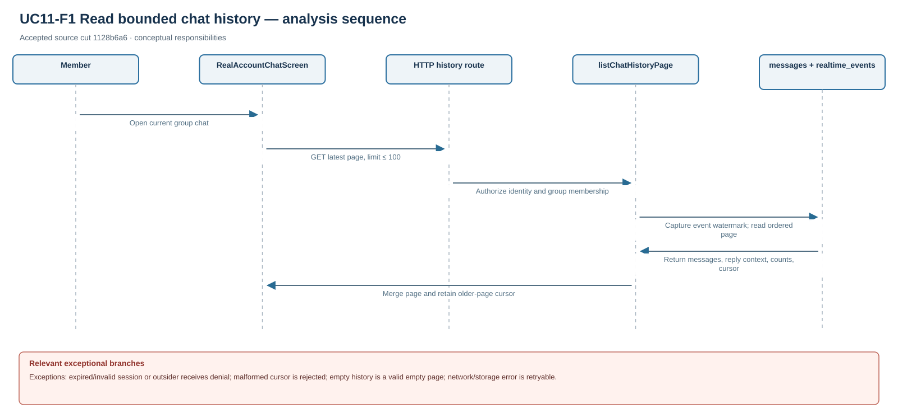

Figure M102. Complete accepted model, cut `1128b6a6`; SVG SHA256 `c7eabb6665fb5274c85ba9245e3bef722126c6156d9d129ac02601f30570bd65`. DOCX/PDF uses one A3 landscape foldout plate. Package text supplies flow exceptions and code mapping.

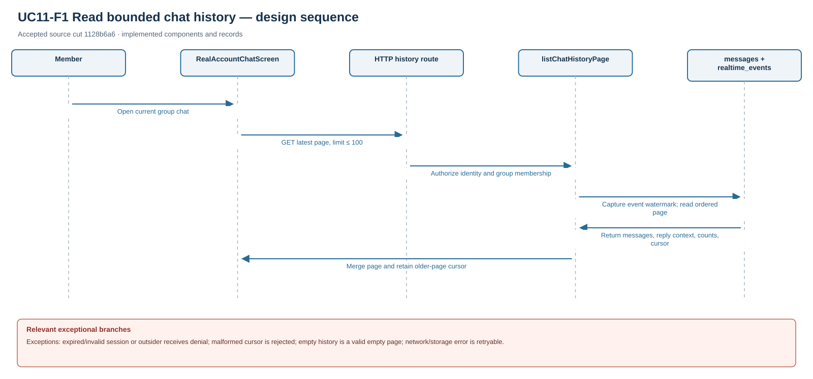

Figure M103. Complete accepted model, cut `1128b6a6`; SVG SHA256 `b4a61e954ecce86c42df5503a199ac073d6f57dec87e3250bcd5a2d7dcd24cbf`. DOCX/PDF uses one A3 landscape foldout plate. Package text supplies flow exceptions and code mapping.

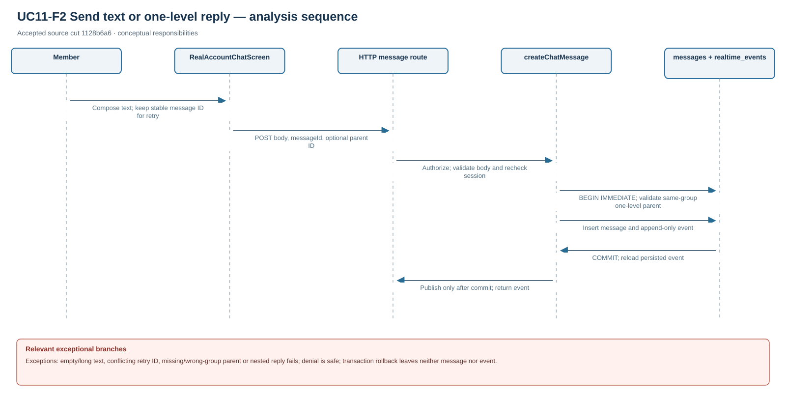

Figure M104. Complete accepted model, cut `1128b6a6`; SVG SHA256 `86e999f6f967124aedb1056179b149d348da62ed4ae741cf6f70af5f2fa444a8`. DOCX/PDF uses one A3 landscape foldout plate. Package text supplies flow exceptions and code mapping.

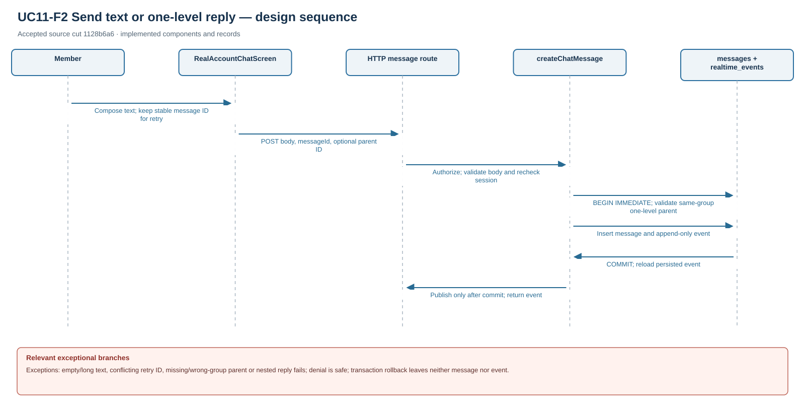

Figure M105. Complete accepted model, cut `1128b6a6`; SVG SHA256 `c7e1c0bae929a8e2283ee574689229802b63d1d0ede169cab85ef4ed3dc9859c`. DOCX/PDF uses one A3 landscape foldout plate. Package text supplies flow exceptions and code mapping.

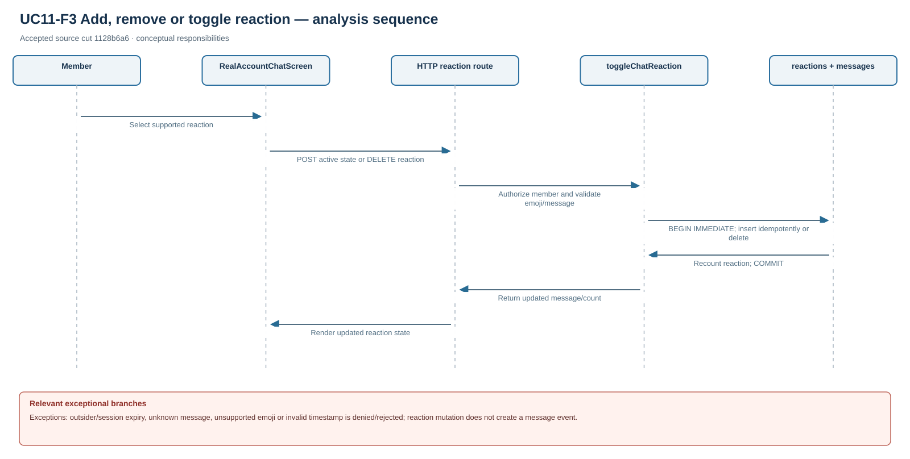

Figure M106. Complete accepted model, cut `1128b6a6`; SVG SHA256 `ff802c570a17c126ca647196a13b02e948b0847020e8ab5cc9e399c986fdee2e`. DOCX/PDF uses one A3 landscape foldout plate. Package text supplies flow exceptions and code mapping.

Figure M107. Complete accepted model, cut `1128b6a6`; SVG SHA256 `3f66ac67da8ad3c4694cddecfba3f2f2b53e5f17e40e6a6b4a38a413a400a689`. DOCX/PDF uses one A3 landscape foldout plate. Package text supplies flow exceptions and code mapping.

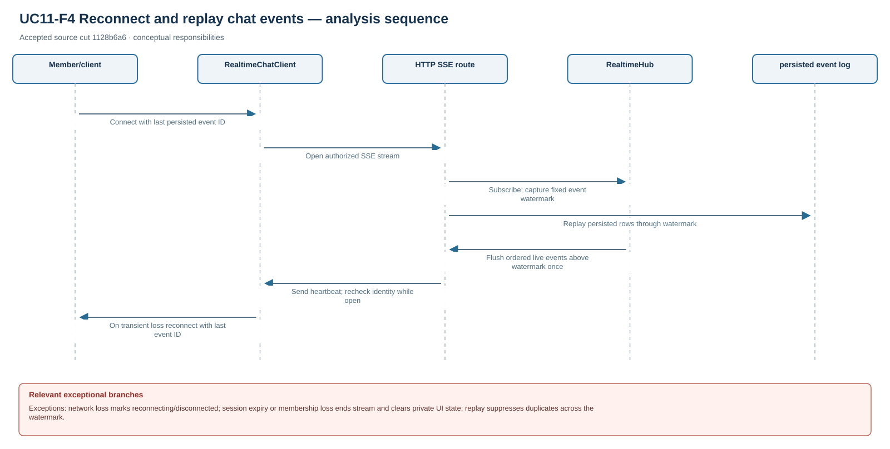

Figure M108. Complete accepted model, cut `1128b6a6`; SVG SHA256 `b3c46b8a7e34483c95dfc70bc83f029a7c4e3e72fc7c9cbc8f61625d22695dc5`. DOCX/PDF uses one A3 landscape foldout plate. Package text supplies flow exceptions and code mapping.

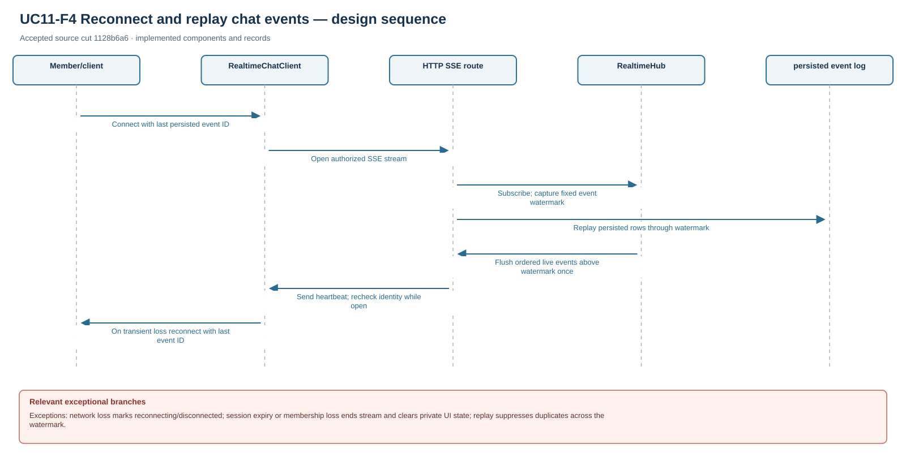

Figure M109. Complete accepted model, cut `1128b6a6`; SVG SHA256 `4e03b5a1948f3df2c8d02f81386d23a52b392f2e2c1cd507e935cf51db92c1a2`. DOCX/PDF uses one A3 landscape foldout plate. Package text supplies flow exceptions and code mapping.

**ARCHIVE complete model plates — issue #361**

Accepted model source cut: `1128b6a68985cf68215beb4a7a80fd00ec4242fa`; baseline code/source crosswalk: `25d5d83c3302491d5ea6796f31afd4a3593789a3`. Source text: [use-cases.md](packages/archive/use-cases.md), [models.md](packages/archive/models.md), [design-problem.md](packages/archive/design-problem.md).

Refreshed code trace:

- [server/src/archive/capabilities.ts:21](https://github.com/Collaboration95/rewind-app/blob/25d5d83c3302491d5ea6796f31afd4a3593789a3/server/src/archive/capabilities.ts#L21)
- [server/src/http.ts:2995](https://github.com/Collaboration95/rewind-app/blob/25d5d83c3302491d5ea6796f31afd4a3593789a3/server/src/http.ts#L2995)
- [server/src/archive/store-serving.ts:14](https://github.com/Collaboration95/rewind-app/blob/25d5d83c3302491d5ea6796f31afd4a3593789a3/server/src/archive/store-serving.ts#L14)
- [src/auth/real-account-client.ts:471](https://github.com/Collaboration95/rewind-app/blob/25d5d83c3302491d5ea6796f31afd4a3593789a3/src/auth/real-account-client.ts#L471)
- [src/archive/ArchiveScreen.tsx:251](https://github.com/Collaboration95/rewind-app/blob/25d5d83c3302491d5ea6796f31afd4a3593789a3/src/archive/ArchiveScreen.tsx#L251)
- [src/archive/archive-download.ts:54](https://github.com/Collaboration95/rewind-app/blob/25d5d83c3302491d5ea6796f31afd4a3593789a3/src/archive/archive-download.ts#L54)
- [src/invites/deep-links.ts:52](https://github.com/Collaboration95/rewind-app/blob/25d5d83c3302491d5ea6796f31afd4a3593789a3/src/invites/deep-links.ts#L52)
- [App.tsx:162](https://github.com/Collaboration95/rewind-app/blob/25d5d83c3302491d5ea6796f31afd4a3593789a3/App.tsx#L162)
- [tests/e2e-real-account/group-switch-verification.mjs:3](https://github.com/Collaboration95/rewind-app/blob/25d5d83c3302491d5ea6796f31afd4a3593789a3/tests/e2e-real-account/group-switch-verification.mjs#L3)
- [public/sw.js:64](https://github.com/Collaboration95/rewind-app/blob/25d5d83c3302491d5ea6796f31afd4a3593789a3/public/sw.js#L64)
- [app.json:1](https://github.com/Collaboration95/rewind-app/blob/25d5d83c3302491d5ea6796f31afd4a3593789a3/app.json#L1)
- [tests/real-account-archive-client.test.ts](https://github.com/Collaboration95/rewind-app/blob/25d5d83c3302491d5ea6796f31afd4a3593789a3/tests/real-account-archive-client.test.ts)
- [tests/archive-download.test.ts](https://github.com/Collaboration95/rewind-app/blob/25d5d83c3302491d5ea6796f31afd4a3593789a3/tests/archive-download.test.ts)
- [tests/deep-link-invites.test.ts](https://github.com/Collaboration95/rewind-app/blob/25d5d83c3302491d5ea6796f31afd4a3593789a3/tests/deep-link-invites.test.ts)
- [tests/pwa.test.mjs](https://github.com/Collaboration95/rewind-app/blob/25d5d83c3302491d5ea6796f31afd4a3593789a3/tests/pwa.test.mjs)
- [server/src/http.ts:3263](https://github.com/Collaboration95/rewind-app/blob/25d5d83c3302491d5ea6796f31afd4a3593789a3/server/src/http.ts#L3263)

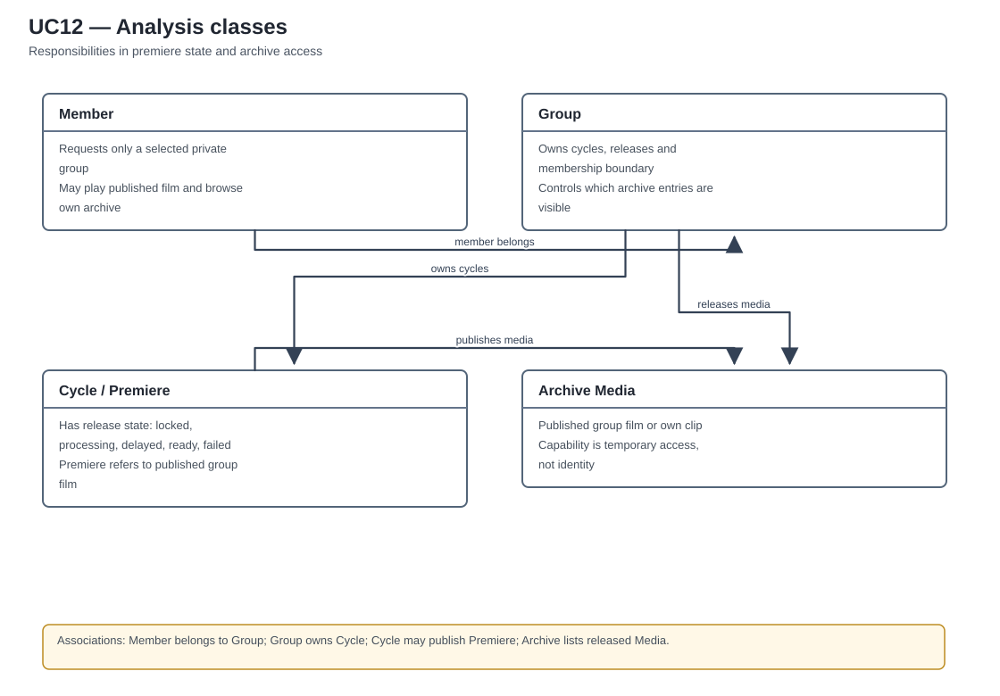

Figure M114. Complete accepted model, cut `1128b6a6`; SVG SHA256 `1e6dd936aa783e6f4c8866bfba5fcef3c1f7c74f8eb7afdb2169cdfbe7c97821`. DOCX/PDF uses one A3 landscape foldout plate. Package text supplies flow exceptions and code mapping.

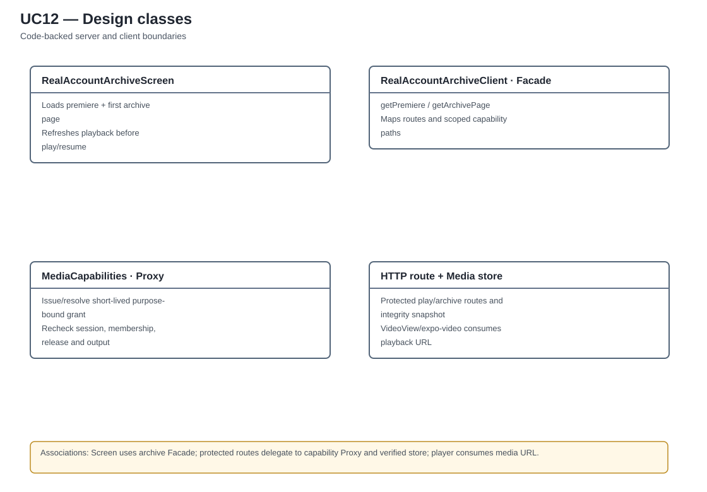

Figure M115. Complete accepted model, cut `1128b6a6`; SVG SHA256 `0ccf27966dfe17258c7086aefd0791f7351866e6c389564cc7ce1f0d1e16b4db`. DOCX/PDF uses one A3 landscape foldout plate. Package text supplies flow exceptions and code mapping.

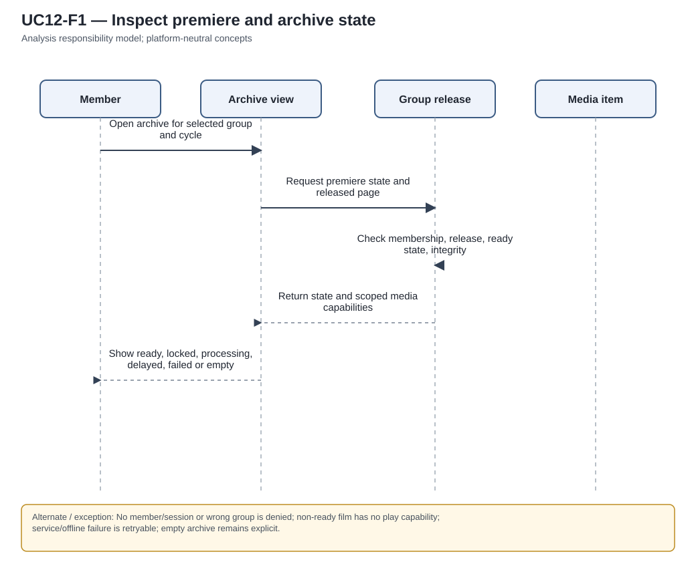

Figure M116. Complete accepted model, cut `1128b6a6`; SVG SHA256 `cbd0f044c9ad850ad964ed538469cc4a1154daeff3052ac83012a6915e099b9c`. DOCX/PDF uses one A3 landscape foldout plate. Package text supplies flow exceptions and code mapping.

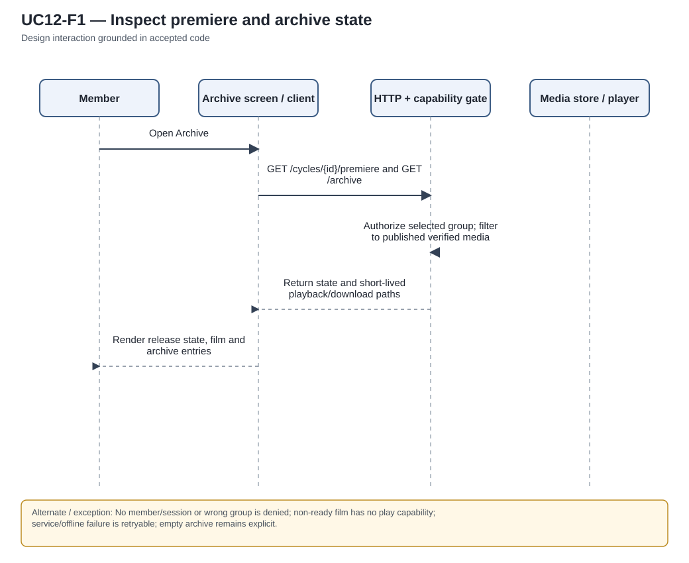

Figure M117. Complete accepted model, cut `1128b6a6`; SVG SHA256 `3b0d76fb2119034a67da9cf3c5b3f9f065dd6c694fb48c1bcee3f45e7e076802`. DOCX/PDF uses one A3 landscape foldout plate. Package text supplies flow exceptions and code mapping.

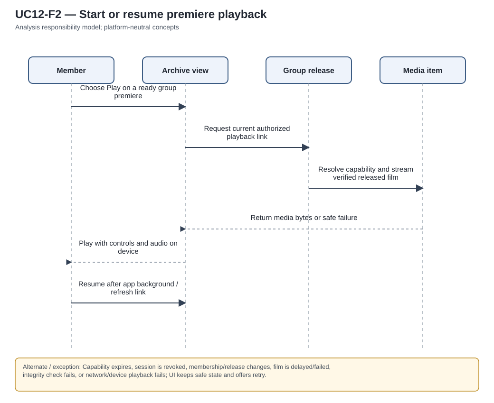

Figure M118. Complete accepted model, cut `1128b6a6`; SVG SHA256 `a601bb18992ce882e6386bb5133018991771508d8146bb077f26a02b7f2f197e`. DOCX/PDF uses one A3 landscape foldout plate. Package text supplies flow exceptions and code mapping.

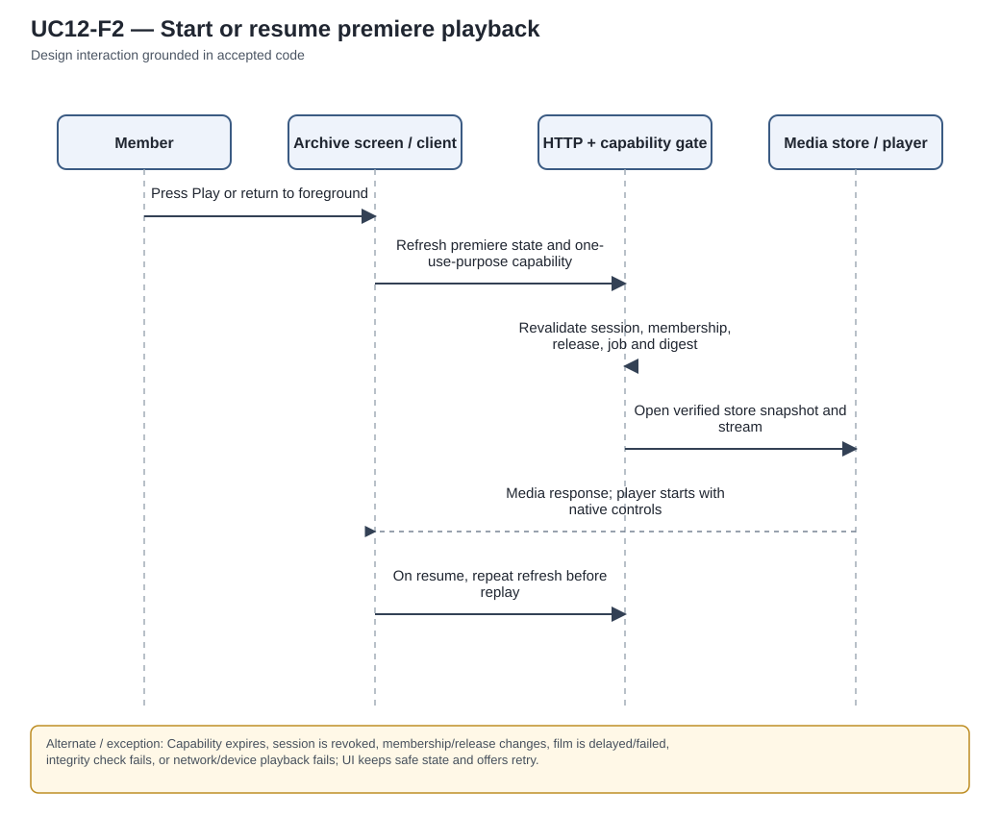

Figure M119. Complete accepted model, cut `1128b6a6`; SVG SHA256 `6fe0347dfa111896b2a7953820fb393610defae5ed43d88ab2da176f33109c93`. DOCX/PDF uses one A3 landscape foldout plate. Package text supplies flow exceptions and code mapping.

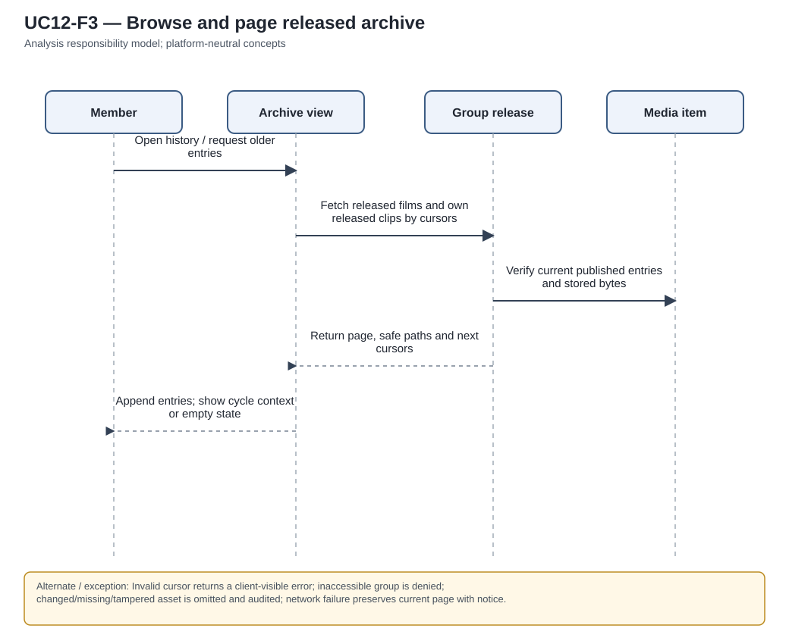

Figure M120. Complete accepted model, cut `1128b6a6`; SVG SHA256 `243709f460274a85d982a5a3c2a5ef465009ef532f9254d0f6d10c30512af026`. DOCX/PDF uses one A3 landscape foldout plate. Package text supplies flow exceptions and code mapping.

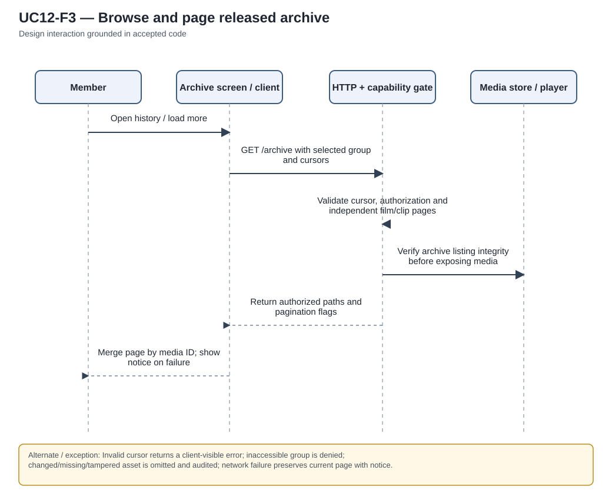

Figure M121. Complete accepted model, cut `1128b6a6`; SVG SHA256 `18146f730709bfbb5f5e50c3c094def221a8a92eb842e4b45d92fae0e9393e88`. DOCX/PDF uses one A3 landscape foldout plate. Package text supplies flow exceptions and code mapping.

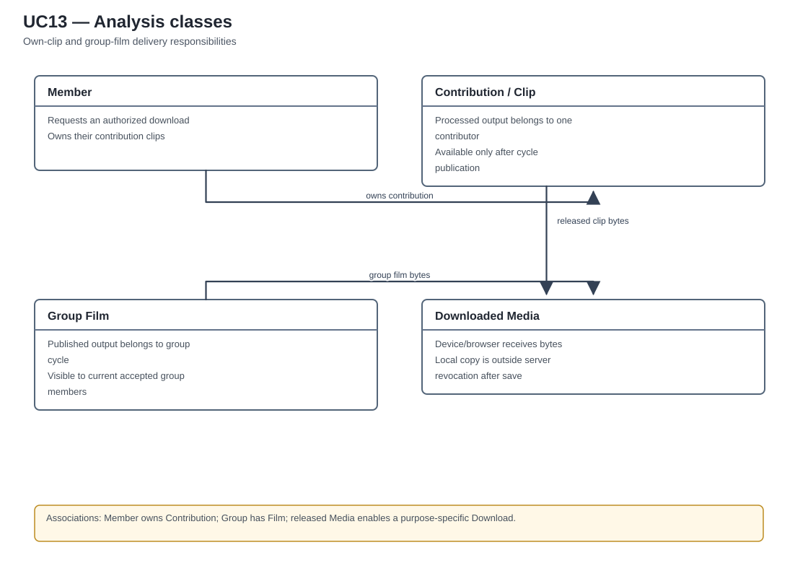

Figure M122. Complete accepted model, cut `1128b6a6`; SVG SHA256 `f9dfa09556ab48a6d39f6fd0def8d03b14fd9b6db8b927c87c15050065fae662`. DOCX/PDF uses one A3 landscape foldout plate. Package text supplies flow exceptions and code mapping.

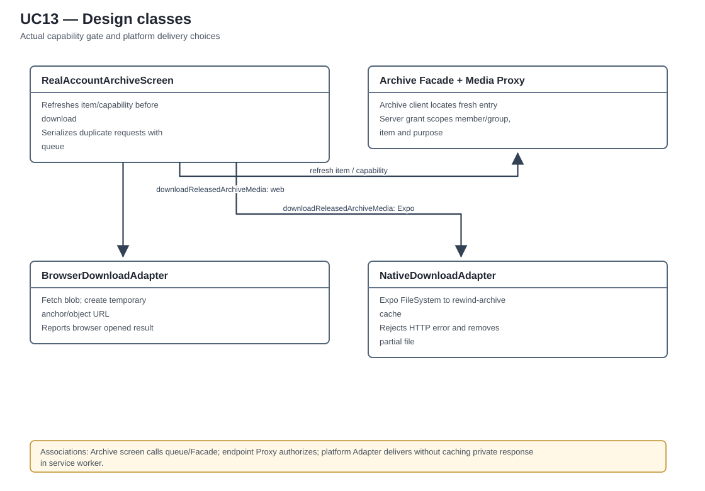

Figure M123. Complete accepted model, cut `1128b6a6`; SVG SHA256 `cac18f7b23cfdc0feefe5938d134a0a06471608bb57d9198201c705b209bd7ce`. DOCX/PDF uses one A3 landscape foldout plate. Package text supplies flow exceptions and code mapping.

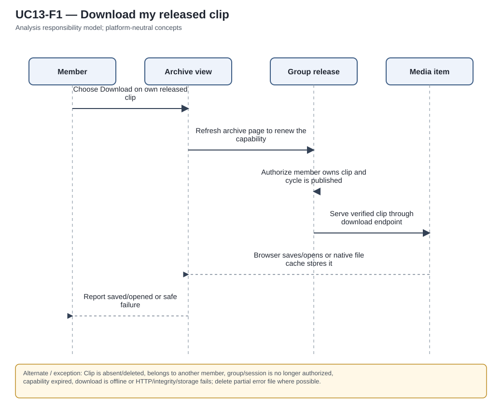

Figure M124. Complete accepted model, cut `1128b6a6`; SVG SHA256 `d955ba472b0f783adcc0bce82456784e32ba30c70468404de0ad90d36a4f8ced`. DOCX/PDF uses one A3 landscape foldout plate. Package text supplies flow exceptions and code mapping.

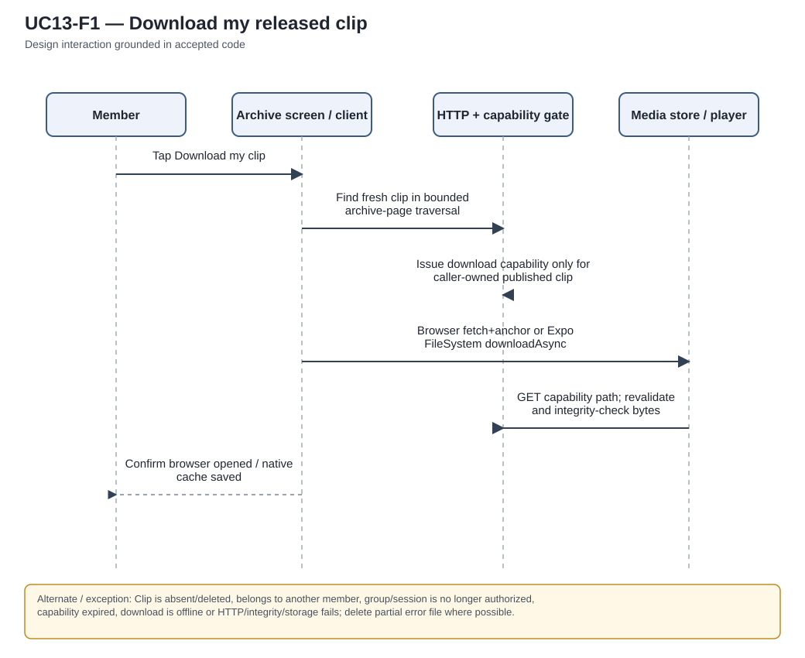

Figure M125. Complete accepted model, cut `1128b6a6`; SVG SHA256 `847ac3e7bdcb6b96ca2d7d4d17f8267344c2dcf45532f8d895144bb70ce098d9`. DOCX/PDF uses one A3 landscape foldout plate. Package text supplies flow exceptions and code mapping.

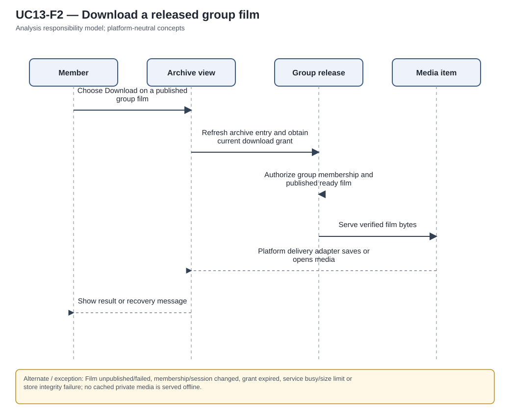

Figure M126. Complete accepted model, cut `1128b6a6`; SVG SHA256 `ae1b2aa30d07e81cf175519a028d429ba48173b3275c8fe99dac851c46bc5f19`. DOCX/PDF uses one A3 landscape foldout plate. Package text supplies flow exceptions and code mapping.

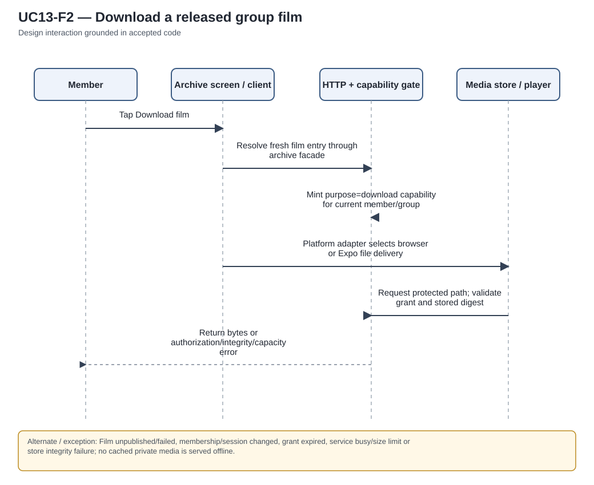

Figure M127. Complete accepted model, cut `1128b6a6`; SVG SHA256 `04801637e55df51c357b21e6d5612abc07fab364127c98f3b12f3b7f56f8a61d`. DOCX/PDF uses one A3 landscape foldout plate. Package text supplies flow exceptions and code mapping.

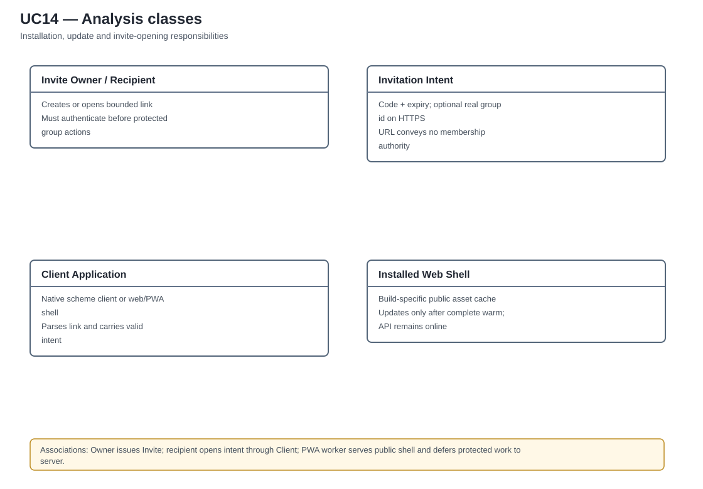

Figure M128. Complete accepted model, cut `1128b6a6`; SVG SHA256 `a17ee39f8a61127b494e417bcd76ead4a569b06db73d4350bf8916fe45dbf6b7`. DOCX/PDF uses one A3 landscape foldout plate. Package text supplies flow exceptions and code mapping.

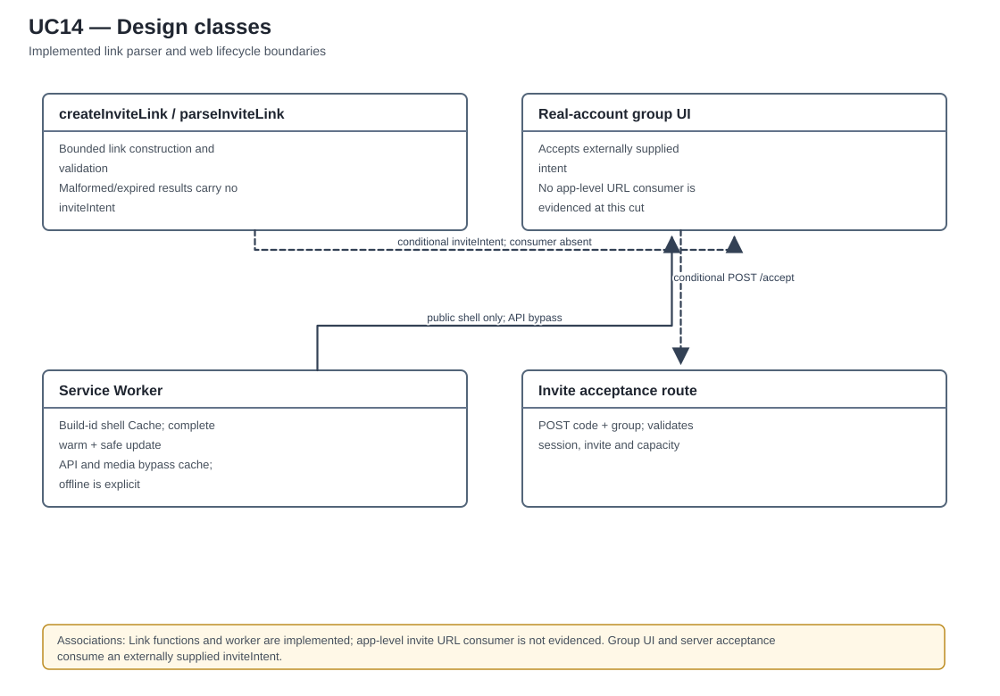

Figure M129. Complete accepted model, cut `1128b6a6`; SVG SHA256 `c93da8617337f208351eef7acff52ef97534ecdacddeee695d241fbb0be614e7`. DOCX/PDF uses one A3 landscape foldout plate. Package text supplies flow exceptions and code mapping.

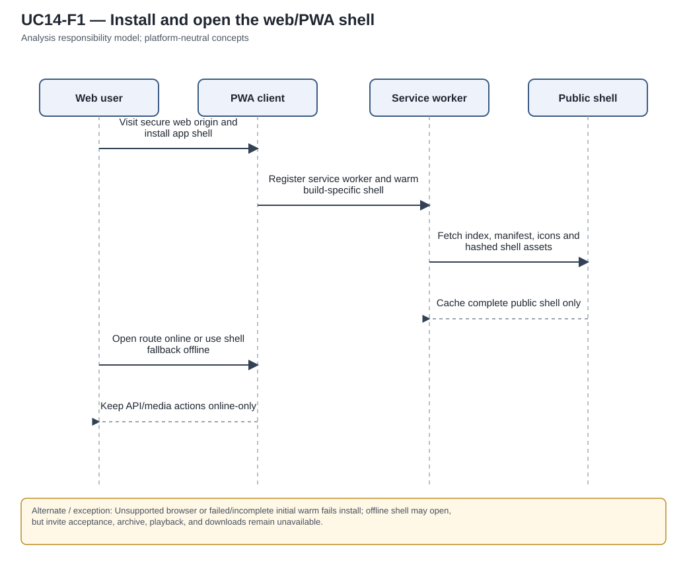

Figure M130. Complete accepted model, cut `1128b6a6`; SVG SHA256 `e6a4ed376315c260d4652f0a7ec91ff161d2df6f56c789f654130b936192a3cc`. DOCX/PDF uses one A3 landscape foldout plate. Package text supplies flow exceptions and code mapping.

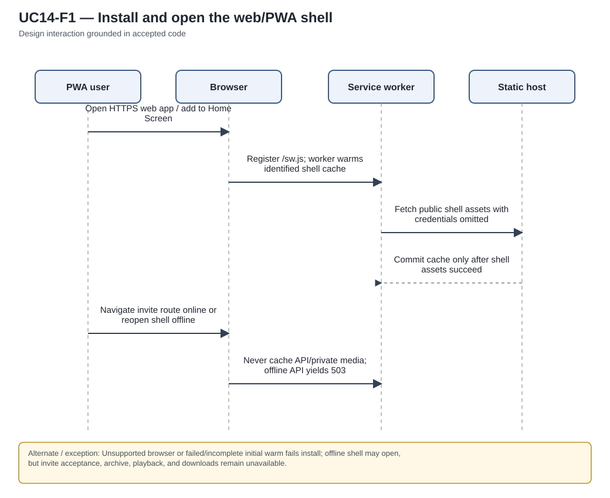

Figure M131. Complete accepted model, cut `1128b6a6`; SVG SHA256 `6edf90c67101351f0d640fe5a1c7efe4668356bfdf3c3546712549200b269c3b`. DOCX/PDF uses one A3 landscape foldout plate. Package text supplies flow exceptions and code mapping.

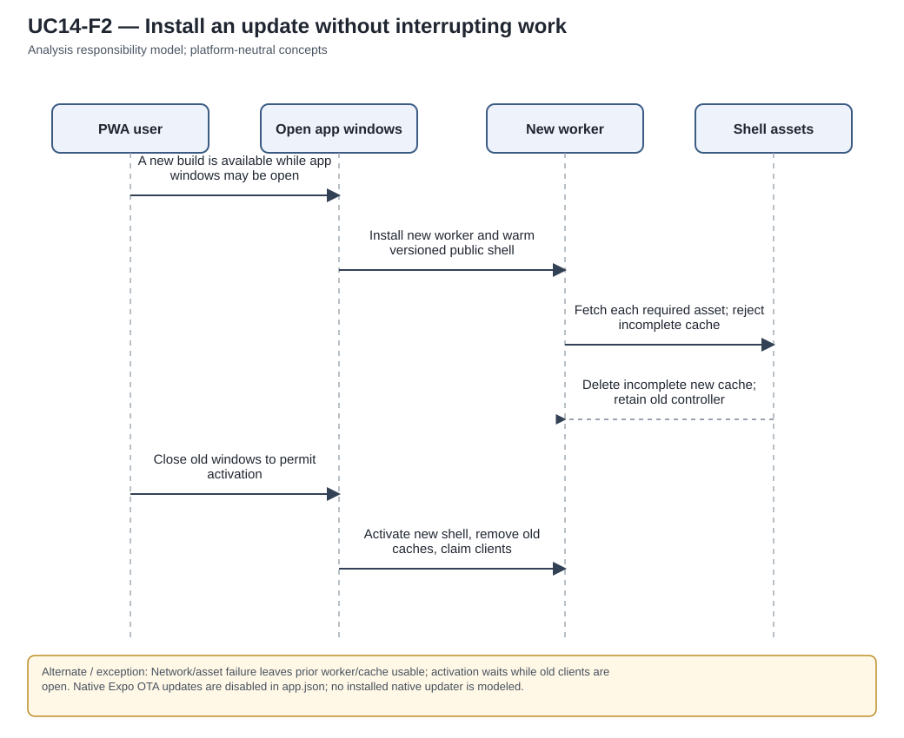

Figure M132. Complete accepted model, cut `1128b6a6`; SVG SHA256 `e5d000722d87dcbf498d69a2db606912c8b0446b2a750fb2dce3674126140cd7`. DOCX/PDF uses one A3 landscape foldout plate. Package text supplies flow exceptions and code mapping.

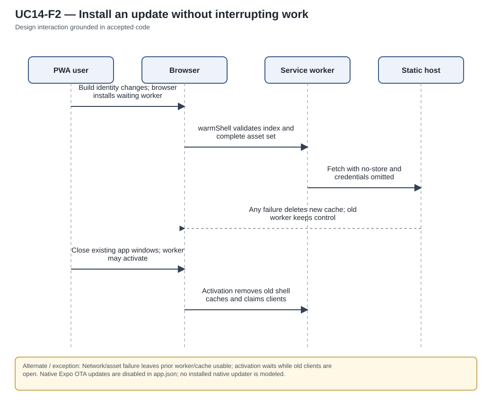

Figure M133. Complete accepted model, cut `1128b6a6`; SVG SHA256 `7c92d5da881028efcbd41ea4db5c381cec9ca699d676cee8978813e53a77de88`. DOCX/PDF uses one A3 landscape foldout plate. Package text supplies flow exceptions and code mapping.

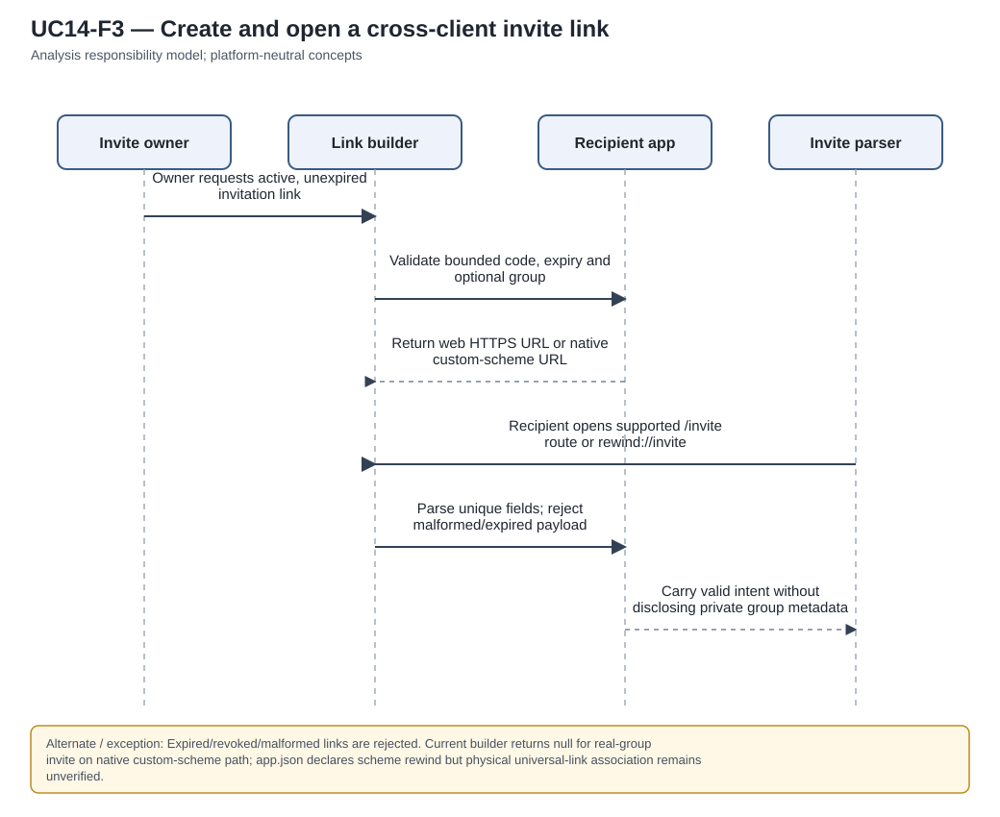

Figure M134. Complete accepted model, cut `1128b6a6`; SVG SHA256 `9541e2062edd20bddb4f3c94ed6a0b0d3ff854be5f2991f368dd54090f3ae437`. DOCX/PDF uses one A3 landscape foldout plate. Package text supplies flow exceptions and code mapping.

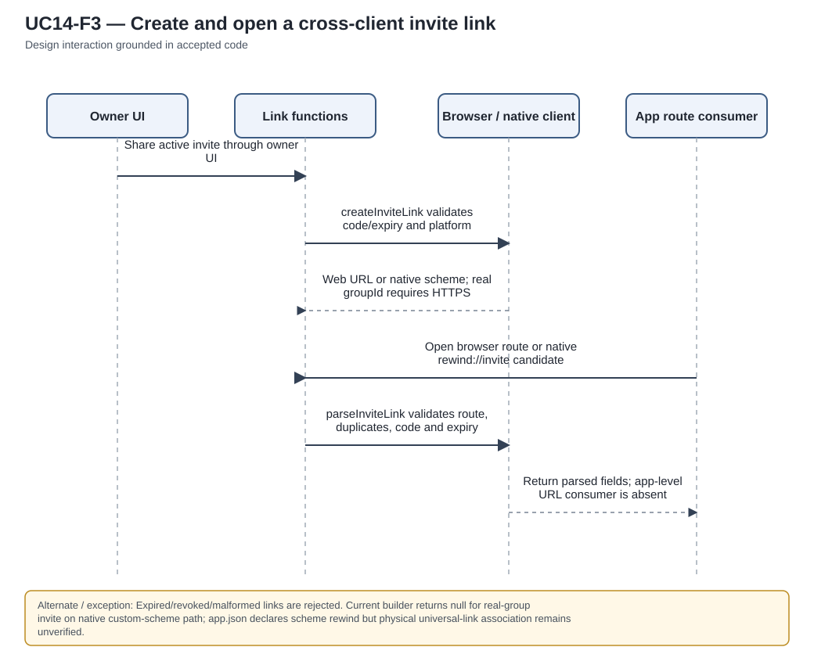

Figure M135. Complete accepted model, cut `1128b6a6`; SVG SHA256 `69872785fd094949b58fe87df1eecac0f1b7e7003cd692ad2655027a96aca425`. DOCX/PDF uses one A3 landscape foldout plate. Package text supplies flow exceptions and code mapping.

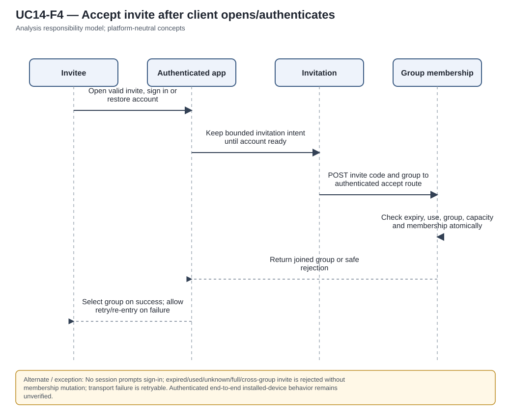

Figure M136. Complete accepted model, cut `1128b6a6`; SVG SHA256 `6e93e444b31308d3c5ec3a88e82ea5fec0b6b8a1b0f8a51c4c4e867cb90b3a55`. DOCX/PDF uses one A3 landscape foldout plate. Package text supplies flow exceptions and code mapping.

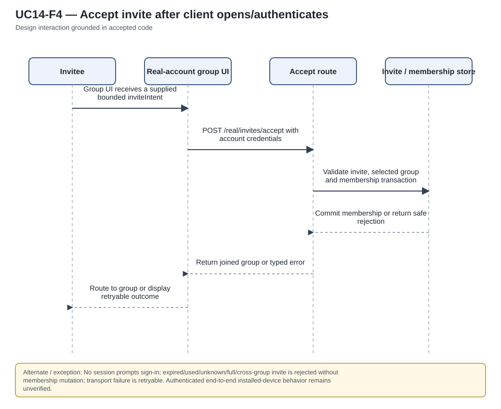

Figure M137. Complete accepted model, cut `1128b6a6`; SVG SHA256 `29ca902271d7b3fd93cb37de531a6816414b7f827f7be7fe83b38828b0f94fcc`. DOCX/PDF uses one A3 landscape foldout plate. Package text supplies flow exceptions and code mapping.

### 3.5 Design Problems and Patterns

#### 3.5.1 Five code backed design problems

ACCESS compares Policy/Strategy with Chain of Responsibility for mixed identity and membership boundaries; actual implementation uses explicit adapters and function policy, with real-account predicates distinct from Demo. CAPTURE compares Adapter/Strategy/Template Method for platform/file/upload/processing variation. CYCLE compares State/Command/polling against functional persisted transitions and durable queue/leases. PARTICIPATION compares Observer/Adapter/Strategy for events, reconnect and provider/outbox coordination. ARCHIVE compares Proxy/Adapter/Facade for private capabilities and portable player/download delivery. Before figures are explicit design alternatives, not invented historical vulnerabilities. Current function-centered code must not be described as an unimplemented pattern class hierarchy. The package discussions supply candidate rationale, before/after class and sequence views and exact source pins; the incorporated before/after plates retain their accepted source identities, with baseline code links refreshed in the source crosswalk. Human pattern attribution remains pending.

**ACCESS complete model plates — issue #357**

Accepted model source cut: `fc2b8c811e9c13b176113fa0bdb2c015798990b4`; baseline code/source crosswalk: `25d5d83c3302491d5ea6796f31afd4a3593789a3`. Source text: [use-cases.md](packages/access/use-cases.md), [models.md](packages/access/models.md), [design-problem.md](packages/access/design-problem.md).

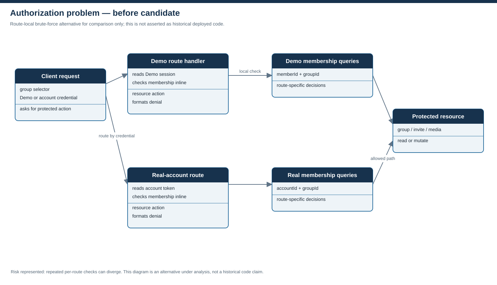

Figure M003. Complete accepted model, cut `fc2b8c81`; SVG SHA256 `63d5c77e6d7033bc8eae11f27832917cd4786448ae060f2a079727483207722b`. DOCX/PDF uses one A3 landscape foldout plate. Package text supplies flow exceptions and code mapping.

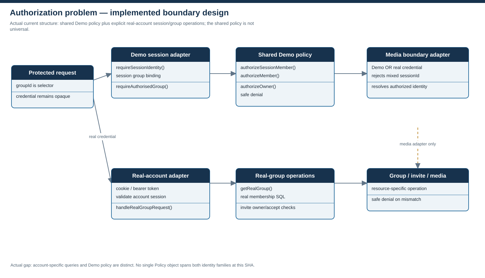

Figure M001. Complete accepted model, cut `fc2b8c81`; SVG SHA256 `886f2b7441e8bbb23a9186ca52b1f6e3e26bf19a5c98cca74bb25cf33b294abf`. DOCX/PDF uses one A3 landscape foldout plate. Package text supplies flow exceptions and code mapping.

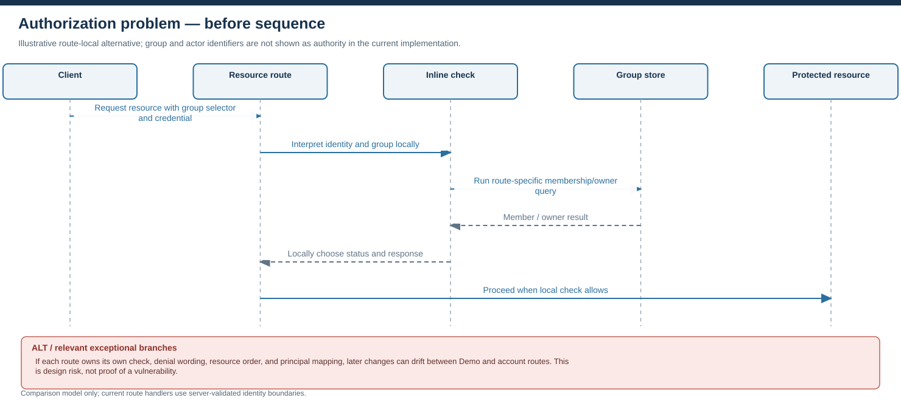

Figure M004. Complete accepted model, cut `fc2b8c81`; SVG SHA256 `3eba5a6f992edf02bda6147dd8a58d06220c77fc19ac681c127013876adbcc1f`. DOCX/PDF uses one A3 landscape foldout plate. Package text supplies flow exceptions and code mapping.

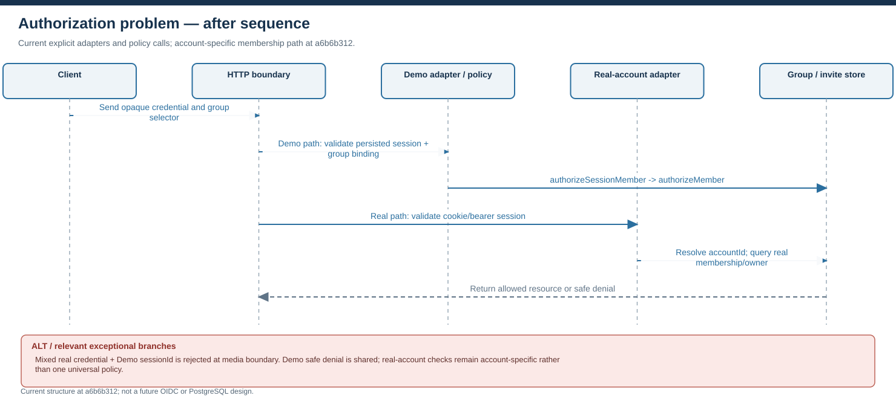

Figure M002. Complete accepted model, cut `fc2b8c81`; SVG SHA256 `da5bd929a35949c5df356c097b7bcab74db1903de3d70d04793bdd2aa689f93c`. DOCX/PDF uses one A3 landscape foldout plate. Package text supplies flow exceptions and code mapping.

**CAPTURE complete model plates — issue #358**

Accepted model source cut: `fc2b8c811e9c13b176113fa0bdb2c015798990b4`; baseline code/source crosswalk: `25d5d83c3302491d5ea6796f31afd4a3593789a3`. Source text: [use-cases.md](packages/capture/use-cases.md), [models.md](packages/capture/models.md), [design-problem.md](packages/capture/design-problem.md).

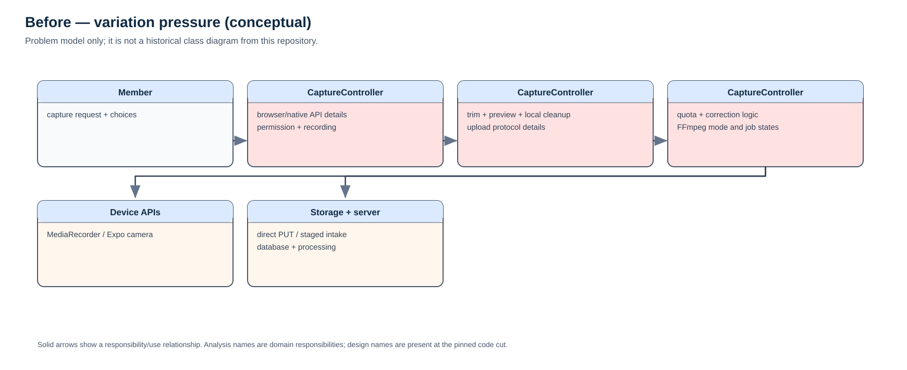

Figure M038. Complete accepted model, cut `fc2b8c81`; SVG SHA256 `fab7a0e707ee8fd502834825de6cd312e370d48d4a573528fc55f8bd86a419a1`. DOCX/PDF uses one A3 landscape foldout plate. Package text supplies flow exceptions and code mapping.

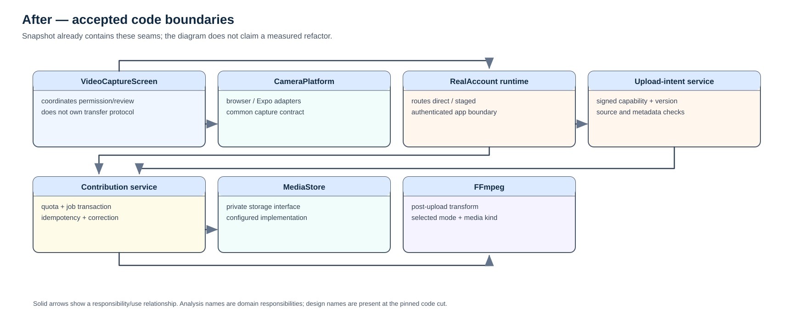

Figure M036. Complete accepted model, cut `fc2b8c81`; SVG SHA256 `3941e123e913e6daaa4d3a8b8ec28a6ca76289449737fa872ca6b1685b4ffcac`. DOCX/PDF uses one A3 landscape foldout plate. Package text supplies flow exceptions and code mapping.

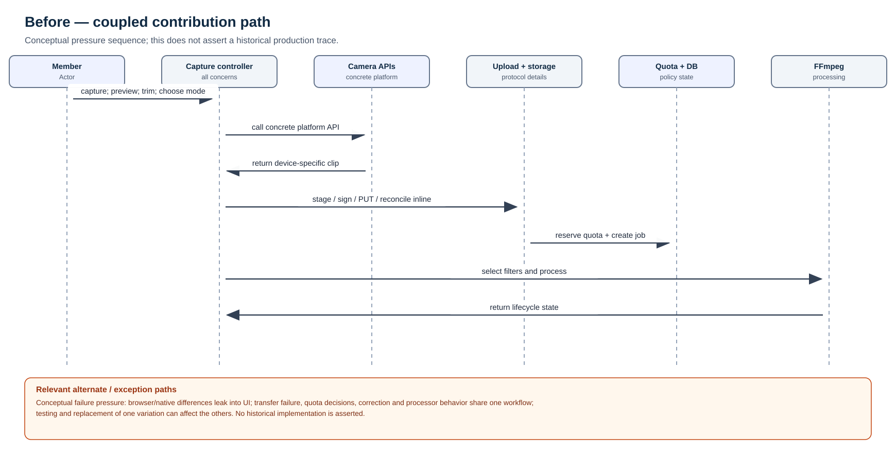

Figure M039. Complete accepted model, cut `fc2b8c81`; SVG SHA256 `caad826aaf4fb8dcb1fb558d10da644cc9a3fab6175d5d4ec2d17293494d0196`. DOCX/PDF uses one A3 landscape foldout plate. Package text supplies flow exceptions and code mapping.

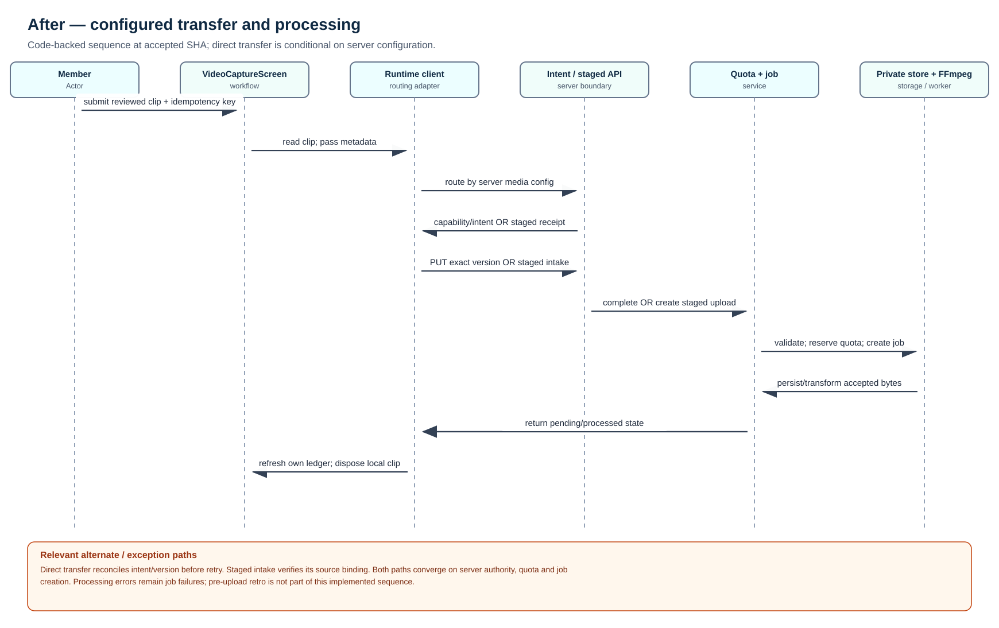

Figure M037. Complete accepted model, cut `fc2b8c81`; SVG SHA256 `cdc562627994b441b378c2be9c79882617d147508a9f9c222caf4b9b95bb8d73`. DOCX/PDF uses one Large landscape foldout foldout plate. Package text supplies flow exceptions and code mapping.

**CYCLE complete model plates — issue #359**

Accepted model source cut: `fc2b8c811e9c13b176113fa0bdb2c015798990b4`; baseline code/source crosswalk: `25d5d83c3302491d5ea6796f31afd4a3593789a3`. Source text: [use-cases.md](packages/cycle/use-cases.md), [models.md](packages/cycle/models.md), [design-problem.md](packages/cycle/design-problem.md).

Figure M062. Complete accepted model, cut `fc2b8c81`; SVG SHA256 `99dc99947bdf3f4d5fe0127f4c91036a644f897d1272acdb70202971ba01e0ca`. DOCX/PDF uses one A3 landscape foldout plate. Package text supplies flow exceptions and code mapping.

Figure M060. Complete accepted model, cut `fc2b8c81`; SVG SHA256 `4ee3a78eba66ec8deb073dd6bb17d83fcea0f7e36f18d85fb46c719d6c5fad7b`. DOCX/PDF uses one A3 landscape foldout plate. Package text supplies flow exceptions and code mapping.

Figure M063. Complete accepted model, cut `fc2b8c81`; SVG SHA256 `9a57b14fdd1e561bac7c12742fd6c4b759cd2b9e47189ac0a1fef1887b7ca7ea`. DOCX/PDF uses one A3 landscape foldout plate. Package text supplies flow exceptions and code mapping.

Figure M061. Complete accepted model, cut `fc2b8c81`; SVG SHA256 `d87b616fb333fd2ab05f9b9f0839e21794046c45a932b7680cccb9b3309a3c14`. DOCX/PDF uses one Large landscape foldout foldout plate. Package text supplies flow exceptions and code mapping.

**PARTICIPATION complete model plates — issue #360**

Accepted model source cut: `1128b6a68985cf68215beb4a7a80fd00ec4242fa`; baseline code/source crosswalk: `25d5d83c3302491d5ea6796f31afd4a3593789a3`. Source text: [use-cases.md](packages/participation/use-cases.md), [models.md](packages/participation/models.md), [design-problem.md](packages/participation/design-problem.md).

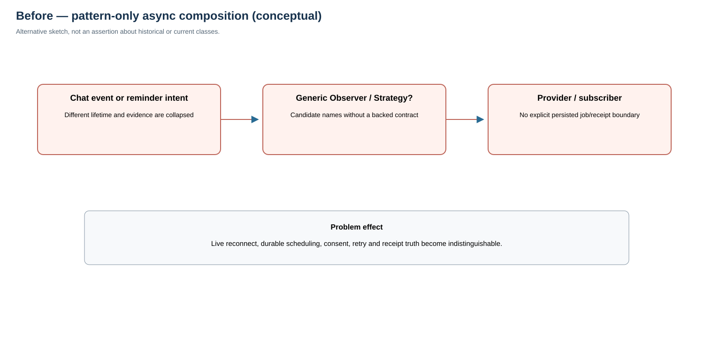

Figure M082. Complete accepted model, cut `1128b6a6`; SVG SHA256 `6810f96c09f845bd92babfe3e4e4346e97e041a37989c2b95481f05b31083943`. DOCX/PDF uses one A3 landscape foldout plate. Package text supplies flow exceptions and code mapping.

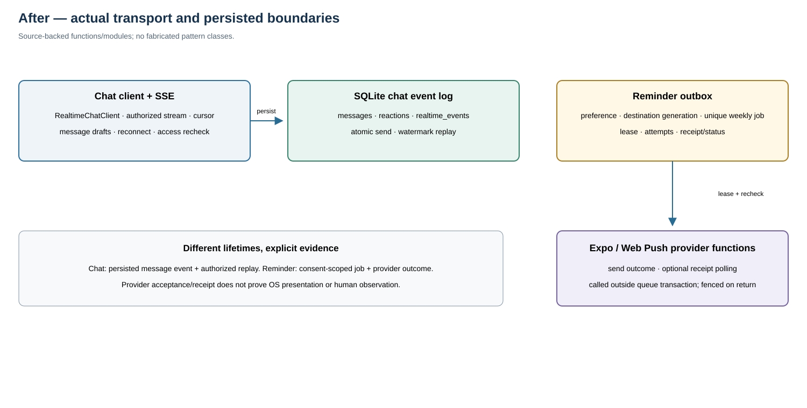

Figure M080. Complete accepted model, cut `1128b6a6`; SVG SHA256 `7eea0b5a17c877e0b28e0d88cbefe0e5fe29eff592f21c50c85084eb75e7a8e2`. DOCX/PDF uses one A3 landscape foldout plate. Package text supplies flow exceptions and code mapping.

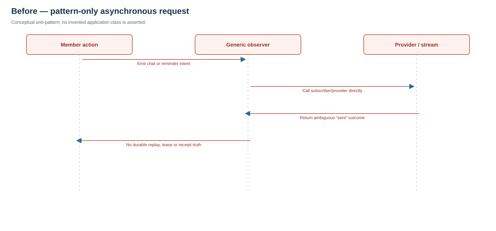

Figure M083. Complete accepted model, cut `1128b6a6`; SVG SHA256 `e7664115aa5ff8667b1e3765ac06a29c7ad9f77bbee277d99f219273a813ecde`. DOCX/PDF uses one A3 landscape foldout plate. Package text supplies flow exceptions and code mapping.

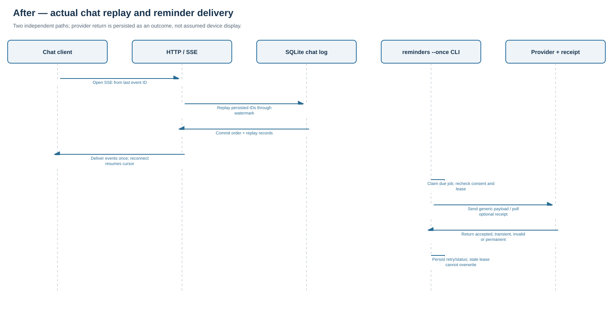

Figure M081. Complete accepted model, cut `1128b6a6`; SVG SHA256 `62d01c1d0b6b714186925f122cad92f07b0bdfdc56f12cdd807e6d4db40f3dcc`. DOCX/PDF uses one A3 landscape foldout plate. Package text supplies flow exceptions and code mapping.

**ARCHIVE complete model plates — issue #361**

Accepted model source cut: `1128b6a68985cf68215beb4a7a80fd00ec4242fa`; baseline code/source crosswalk: `25d5d83c3302491d5ea6796f31afd4a3593789a3`. Source text: [use-cases.md](packages/archive/use-cases.md), [models.md](packages/archive/models.md), [design-problem.md](packages/archive/design-problem.md).

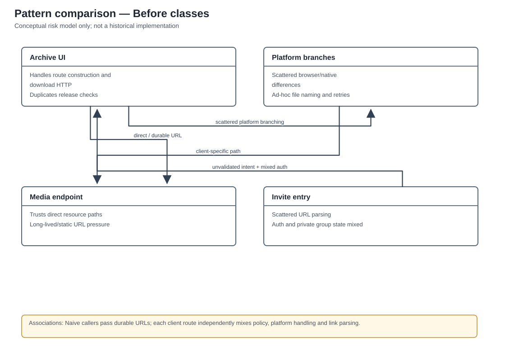

Figure M112. Complete accepted model, cut `1128b6a6`; SVG SHA256 `81816f3006cb59fb590f400555f2fc72c2e43381c816d88e0906686bb48fd8fd`. DOCX/PDF uses one A3 landscape foldout plate. Package text supplies flow exceptions and code mapping.

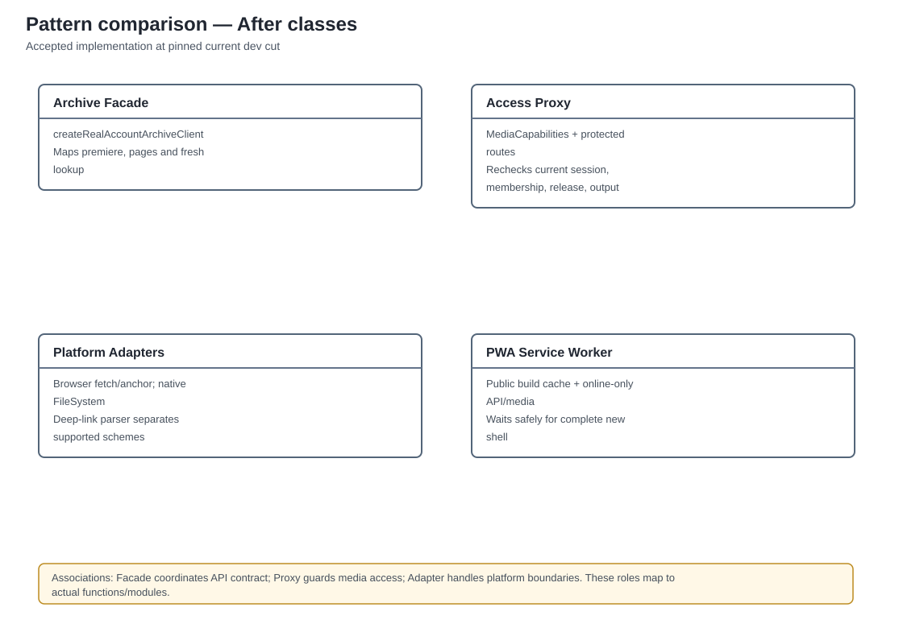

Figure M110. Complete accepted model, cut `1128b6a6`; SVG SHA256 `e19b2d71ffec6ce686a2e7ee0d7e0d1c60fd1a8df2cf3358fa6283bdd756e404`. DOCX/PDF uses one A3 landscape foldout plate. Package text supplies flow exceptions and code mapping.

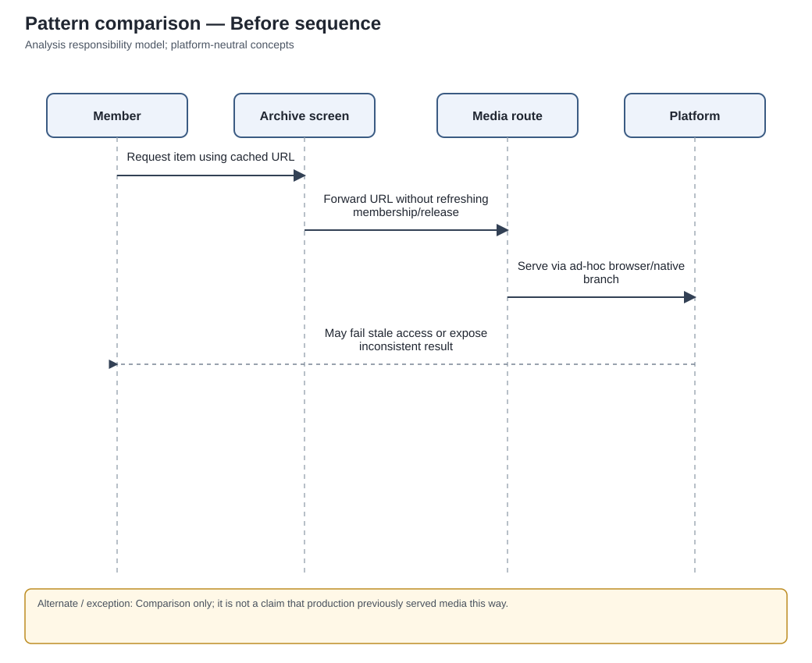

Figure M113. Complete accepted model, cut `1128b6a6`; SVG SHA256 `afec1b4a3f58b9d3f22e720451d90c2828b2ce6026dec2f5cd8a2a2000670dc6`. DOCX/PDF uses one A3 landscape foldout plate. Package text supplies flow exceptions and code mapping.

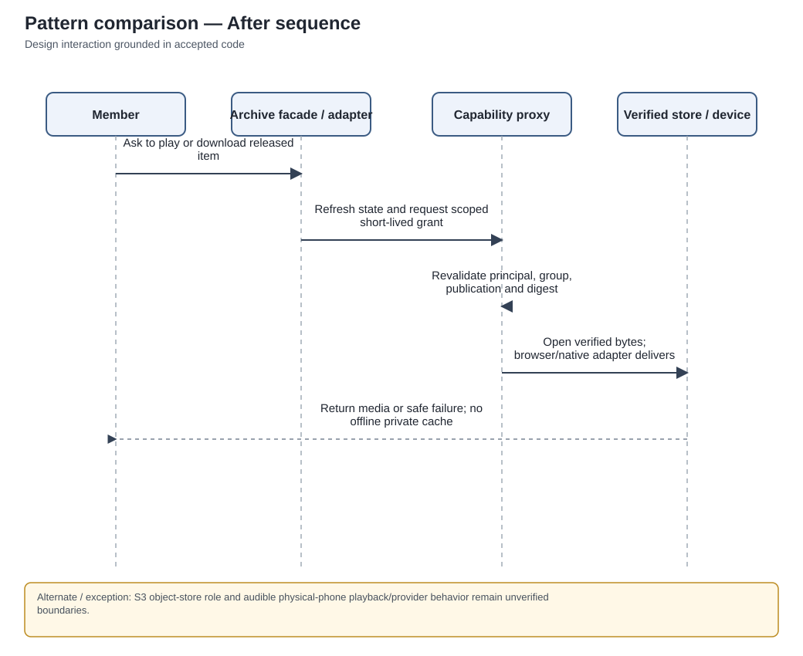

Figure M111. Complete accepted model, cut `1128b6a6`; SVG SHA256 `c7dd342df1ff81b43420a227e674050c6760c1a8d0454ae045240a5052c7fcf4`. DOCX/PDF uses one A3 landscape foldout plate. Package text supplies flow exceptions and code mapping.

### 3.6 Database Schemas

The current schema is SQLite through versioned migrations. Real accounts/sessions/profiles, group metadata/memberships/selections/invites stay separate from Demo identities. Group/cycle/contribution/quota/correction records connect to persisted media jobs, lifecycle events, films, chat/events and reminder preferences/destinations/outbox. Upload intents bind account/profile/group/cycle to exact object versions and final contribution/jobs. Foreign keys, unique retry identities and transaction boundaries enforce these relations. The current schema diagrams are selected logical views, with full DDL in server/migrations. PostgreSQL parity, data reconciliation, controlled cutover and managed restore are future #175/#261/#172 obligations; no live PostgreSQL schema or restore is claimed.

## 4 DevSecOps and Development Lifecycle

### 4.1 Source Control Strategy

rewind-app is the authoritative repository for code, backlog and planning. Issue branches start from refreshed dev under guru/ and focused PRs target dev with Refs references. Routine dev integration requires up-to-date green aggregate Quality and resolved conversations; auth/private-media/migration/deployment/infra changes need human review. main remains the reviewed release branch. A merge is not deployment or user acceptance. Dirty primary Terraform/planning work and archived workspace boundaries remain protected. GitHub access in this run uses authenticated gh exclusively.

### 4.2 Continuous Integration

Quality classifies the exact diff and runs relevant format, lint, architecture, typecheck, production audit, root/infra, server/coverage, frontend/coverage, web/browser and cloud-free deployment lanes. The aggregate required check reports each lane truthfully; docs-only or unchanged browser lanes may be skipped by the accepted scope rules. Frontend statements have a 70 percent gate; server coverage is measured separately without a percentage gate. CodeQL, GitGuardian and release image/IaC scans supply distinct security evidence. Pending or absent scans are not a clean result. Local focused/fast checks precede relevant slower browser/media verification.

### 4.3 Continuous Delivery

Deploy dev requires successful Quality, verifies a release bundle and activates it after runtime/web health checks, with compatible rollback. On 4 October 2026 SGT, the authorized cleanup under [#166](https://github.com/Collaboration95/rewind-app/issues/166) recovered 5,117,467,648 B (4.77 GiB), leaving 5,771,624,448 B (5.37 GiB) free. Only verified duplicate runtime/web archives in 13 inactive release directories were removed. Every exact bundle was retained; current/previous files and pointers, containers and media hashes were unchanged. Runtime/web readiness passed; schema remained 27. No database, configuration, backup, port or resource mutation or restart occurred. The active accepted release remains b806286…; latest failed Deploy run 37164653853 stopped before activation. No new deployment has occurred. Subsequent deployment and health verification remain pending. Main promotion, deployment and hosted acceptance remain distinct.

## 5 Individual members activity contribution summary

The proposal names the five members listed in §1.3. For each, the final report must record actual work, evidence, owned use case, owned design problem and rough effort supplied or confirmed by that person. These fields are pending. Jiayu and Long's research/review comments under [#267](https://github.com/Collaboration95/rewind-app/issues/267) remain attributed observations. Issue #267 was independently accepted and closed through explicitly authorized substituted agent review after the source cut; this does not establish that the named researchers agreed or that feedback was timely. The closed unmerged #325 revision is not accepted code or document content. Agent-generated model drafts and automated test counts do not establish a member's hours, design judgment or lecturer approval.

Baseline refresh: accepted dev 25d5d83c3302491d5ea6796f31afd4a3593789a3 includes PR #398, a numeric filesystem-capacity signal. It does not recover capacity, establish inode/quota availability or prove a deployment. The accepted package cuts remain fc2b8c811e9c13b176113fa0bdb2c015798990b4 (ACCESS/CAPTURE/CYCLE) and 1128b6a68985cf68215beb4a7a80fd00ec4242fa (PARTICIPATION/ARCHIVE). Later photo-label (#387), chat API-prefix (#388) and portrait-guidance (#392) fixes change client presentation/transport without changing the accepted model responsibilities.

## References and final draft gates

Issue #362 owns final assembly. Source packages are under packages/access, capture, cycle, participation and archive. The submitted proposal and report template are named retained sources; their SHA-256 identities are recorded in template-contract.md. Required final gates are factual member ownership/effort, actual Scrum/review records, final OIDC/PostgreSQL/backups/pre-upload retro, relevant hosted/device/provider acceptance, and final assessment sign-off. The draft preserves these outcomes without claiming completion.

The package index is [report workspace](README.md). Editable current and future architecture, overall use case and selected schema figures are in [diagrams](diagrams/). The full paired models and source pins stay in each package; all 137 package SVGs are now incorporated as model plates within System Design. Remaining gates concern factual contributions, Scrum, final compliance, delivery and assessment.
