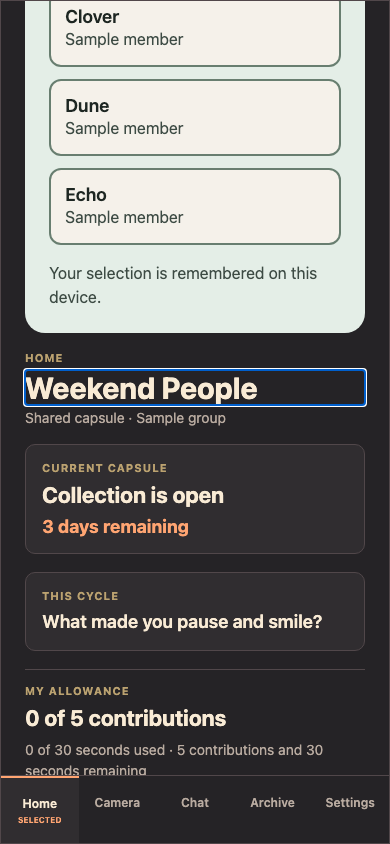
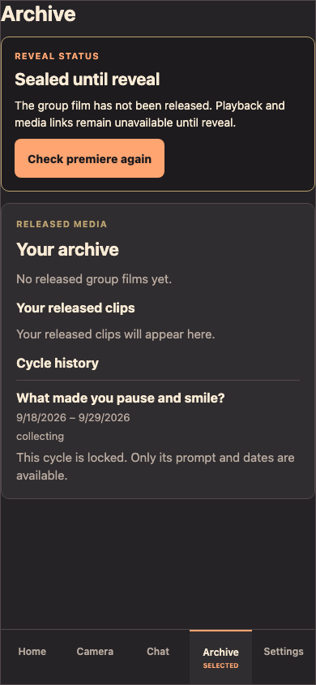
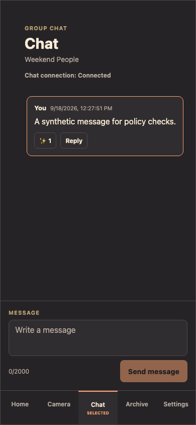

# Sprint 2 submission status — 26 September 2026

**Live Demo:** <https://d3ito43l174cl7.cloudfront.net/>  
**Release:** `df2de03dbc5211c281be5034fde8be04c8718fa7`  
**Scope:** synthetic Demo; real accounts and remote reminders are next sprint.

| Check | Status | Evidence |
|---|---|---|
| Main code and security PR #224 | ✅ Merged | Main Quality, CodeQL and release-security scans green; no open Dependabot or CodeQL alerts |
| Issue #199 | ✅ Done | Merged-main fixture, simulator, focused tests and production E2E evidence |
| HTTPS origin #200 | ✅ Done | Public `/` and `/api/health` each 200 with valid TLS; host runtime stays loopback-only |
| Backup and live restore | ✅ Passed with manual recovery | Verified 21 Sep SQLite/media backup restored; SQLite integrity `ok`; active amd64 release healthy |
| Hosted surface smoke | ✅ Passed | Chromium Home, Archive sealed state, Chat connected; screenshots below |
| Full hosted acceptance #145 | ⬜ Open | Two clean reset-to-reveal runs, restart/rollback and non-author run still needed |
| Lifecycle #190 | ⬜ Open | Wake succeeded; OFF automation and two deployment-script fixes remain |
| Sprint tracker #203 | ⬜ Open | Close only after the remaining acceptance evidence or explicit scope decision |

The [full Sprint 2 progress report](rewind-sprint-2-progress-report-2026-09-26.pdf) covers the midpoint audit. The [live deployment evidence](2026-09-26-evidence/hosted-live-2026-09-26.md) records what changed tonight, including the failed first build, guarded restore, verification, and remaining limits. No complete hosted journey or physical-device acceptance is claimed by the smoke test.
