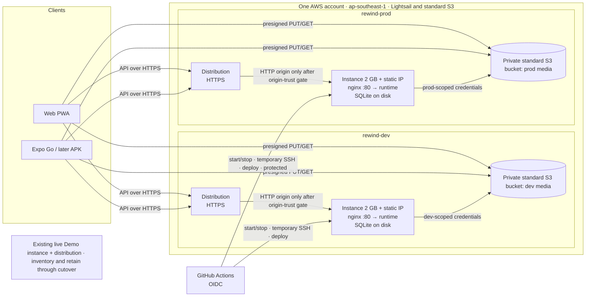

# Rewind base plan

This is the technical plan for transitioning the currently hosted Rewind Demo
to two environments, **dev** and **prod**, and for the platform changes the
Sprint 2 features depend on. It covers architecture, data, media, uploads,
HTTPS, deployment, operations, isolation, transition sequencing, and cost
controls. The existing live Demo instance and distribution are the starting
point; their current state must be inventoried rather than inferred from old
planning or Terraform state. SQLite remains the database architecture in this
plan. Conditional PostgreSQL evaluation is tracked separately in [#261](https://github.com/Collaboration95/rewind-app/issues/261); no migration is
approved unless separately authorized after that evaluation.

It deliberately leaves out:

- final pricing and budget values (a cost estimate and approved budget revision
  are nevertheless required before provisioning; see §2.2);
- the final domain and hostnames;
- exact variable and resource names;
- team process.

Sources: this repository, its GitHub issues, and the official AWS references linked below.

This document is a plan; it does not itself authorize provisioning, code changes, or AWS operations.

---

## 1. Summary

- **Two independent Lightsail environments:** `rewind-dev` and `rewind-prod`,
  each a 2 GB instance with its own static IP and its own HTTPS Lightsail
  distribution, subject to the origin-security gate in §6. No EC2, VPC, or
  RDS/Aurora in this plan.
- **Live Demo first:** inventory its instance, distribution, data, hostname
  dependencies, Terraform state, credential path, and actual costs before
  replacement or retirement; retain it through validated cutover.
- **Data:**
  - **SQLite** stays on each instance's disk, so there is no database
    rewrite;
  - photos and videos live in a **standard private Amazon S3 bucket** for each
    environment, with public access blocked, encryption, exact-origin CORS,
    lifecycle cleanup, and environment-scoped credential delivery (§5.8);
  - there are **no backups or snapshots.**
- **Uploads go straight from the phone or browser to the bucket through a
  short-lived presigned URL.** It is replayable and a PUT can overwrite its key
  while valid; immutable object identity and race-safe completion are required
  (§5).
  - The video bytes never pass through the distribution, nginx, or the
    runtime.
  - The API only authorizes the upload beforehand and registers it
    afterwards.
  - This removes the hosted upload failure at its source.
- **Playback and downloads** use short-lived presigned URLs as well.
- **Accounts** are administered in the AWS console, through Lightsail's
  browser SSH into an admin command.
- **Operations are manual GitHub Actions buttons that sign in to AWS with
  OIDC:** `start_dev`, `stop_dev`, `start_prod`, `stop_prod`, `deploy_dev`,
  `deploy_prod`, plus `status`, `infra_plan`, `infra_apply`, and
  `isolation_smoke`. Stopping **never deletes anything**, and nothing shuts
  down automatically.
- **Real login through the distribution is gated:** required cookies and
  `Authorization` must be forwarded, and the origin must authenticate or
  restrict distribution requests before the server trusts forwarded HTTPS
  metadata (§6).
- **Try Demo exists only on dev.**

## 2. Current state and defects

**Repository-observed baseline (not proof of live AWS state):**

- one Terraform application root ([`infra/terraform/demo`](../../../infra/terraform/demo))
  with one state and fixed names;
- that root mixes Demo compute with shared account resources (CloudTrail, the
  budget, the audit and backup buckets) and two Lambdas (the power controller
  and the cost-safety audit);
- one Lightsail host running Docker Compose ([compose.yaml](../../../deploy/compose.yaml)):
  nginx `web` on port 80 and the Node `runtime` internally;
- SQLite and media on the host disk;
- an optional Lightsail distribution for HTTPS;
- a repository lifecycle of backup → verify → **delete** or recreate
  ([destroy-demo.sh](../../../infra/scripts/destroy-demo.sh),
  [wake-demo.sh](../../../infra/scripts/wake-demo.sh)), run from one
  operator machine over SSH that only allows that machine's IP address;
- no deploy workflow and no AWS access from GitHub.

The read-only AWS check on 28 September 2026 found `rewind-demo` running with
its static IP, `rewind-demo-web` deployed, and no Lightsail object-storage
buckets in Singapore. This is a dated snapshot, not a complete inventory of
application data or Terraform state. Complete §2.1 before importing, changing,
stopping, replacing, or deleting anything.

**Defects and assumptions found in the review.** Each one is addressed below.

| #   | Defect                                                                                                                                                                                                                                               | Addressed in |
| --- | ---------------------------------------------------------------------------------------------------------------------------------------------------------------------------------------------------------------------------------------------------- | ------------ |
| F1  | The distribution forwards no cookies, and forwards only the `Accept` and `Origin` headers ([web-distribution.tf](../../../infra/terraform/demo/web-distribution.tf)). Web session cookies and native `Authorization` headers never reach the server. | §6           |
| F2  | The server sees plain HTTP from the distribution, so it can't tell whether the viewer used HTTPS.                                                                                                                                                    | §6           |
| F3  | Deleting and recreating a distribution changes its hostname, which breaks invite links and client configuration.                                                                                                                                     | §6, §9       |
| F4  | Hosted video uploads fail in the proxy chain (§5.1).                                                                                                                                                                                                 | §5           |
| F5  | Images built on the Mac were arm64; the host needs amd64. An image-ID check didn't survive `docker load` ([#190](https://github.com/Collaboration95/rewind-app/issues/190)).                                                                         | §8           |
| F6  | Host scripts failed because of file ownership and permissions when run as `ubuntu` ([#190](https://github.com/Collaboration95/rewind-app/issues/190)).                                                                                               | §8           |
| F7  | The lifecycle depends on one person's machine and IP address. | §7, §8 |
| F8 | Presigned PUTs are replayable and can overwrite the key; declaring a size does not itself prove strict size enforcement. | §5, §14 |
| F9 | A directly reachable HTTP origin can receive a forged forwarded-HTTPS header. | §6, §14 |
| F10 | The plan excluded cost despite target resources and live-Demo overlap. | §2.2, §12, §13 |

### 2.1 Live Demo inventory before retirement

The first infrastructure activity is read-only discovery. Reconcile AWS state
with Terraform state and the deployed application before import, replacement,
stop, or deletion. Record evidence and date in the implementation issue; do
not put secrets, presigned URLs, password hashes, or unredacted state in this
document.

| Inventory area | Record before transition |
| --- | --- |
| Lightsail instance | Resource ID/name, region, state, bundle, static IP, firewall, disks/snapshots, image/OS, tags, health, and deployed version |
| Distribution and DNS | ID/domain, origin, TLS, cache behaviors, forwarded methods/headers/cookies/query strings, certificates/DNS/TTL, health, and all hostname consumers |
| Runtime and data | SQLite location/size/schema, media location/count/size, current jobs, Demo fixtures/reset behavior, deployed configuration and secret locations (never values) |
| Control plane | Terraform backend/workspace/state, drift/resource addresses, IAM/OIDC roles/policies, workflows, credential owner and rotation path |
| Cost | Month-to-date and prior full-month charges by service/resource, stopped-resource billing, transfer, snapshots, credits, budget and alert thresholds |
| Consumers | API base URLs, invite links, app configuration, CORS origins, health checks, bookmarks and external dependencies on the hostname |

Inventory is not permission to alter live resources. Treat command output and
state as sensitive; redact before retaining evidence.

### 2.2 Cost estimate and budget gate

The current AWS budget is US$15/month, with actual-cost alerts at US$10 and
US$15. Before provisioning any replacement or additional environment, estimate
monthly costs for the target resources **and the live Demo during overlap**. Include
Lightsail instances/distributions, static-IP behavior, S3 storage and requests,
transfer and included allowances, shared services, snapshots/backups if any,
taxes/credits, and the overlap window. Compare with the current account budget;
revise the budget and actual/forecast alerts, confirm recipients, and record
assumptions, source date, and approval in the implementation issue. AWS Budgets
monitors costs but does not cap spending, and billing data may lag. Verify
current [Lightsail pricing](https://aws.amazon.com/lightsail/pricing/) and
[S3 pricing](https://aws.amazon.com/s3/pricing/) before the gate.

Planning floor only: public pricing lists a 2 GB Linux Lightsail bundle at
about US$12/month and a small distribution at about US$2.50/month, so two of
each begin around **US$29/month**. This excludes Demo overlap, S3, shared
services, variable transfer, taxes, and other charges. Confirm regional rates
and stopped-instance billing before relying on the estimate.

## 3. Decisions

### 3.1 How the decisions evolved

1. **Initial review:**
   - keep SQLite on Lightsail;
   - HTTPS through a proxy on the instance;
   - a backup-gated off state that deletes compute, with dev off at night;
   - SSM for host access;
   - 1 GB instances.
2. **First answers:**
   - there is budget headroom, so use existing AWS features and keep things
     simple;
   - **no automatic shutdown;**
   - start/stop buttons in GitHub Actions that **never delete** resources;
   - 2 GB for both instances;
   - the simplest HTTPS;
   - **media in standard Amazon S3 buckets, one private bucket per environment;**
   - names `rewind-dev` and `rewind-prod`;
   - both environments are real, with separate data;
   - operations run from GitHub Actions only;
   - emergency stop on both;
   - manual deploy buttons;
   - the APK is tabled;
   - the current live Demo state must be inventoried; its host is not presumed gone without current AWS evidence.
3. **Follow-ups:**
   - **no backups or snapshots**, because data loss is acceptable;
   - **Try Demo on dev only**, temporarily;
   - one AWS account, with GitHub OIDC ([#174](https://github.com/Collaboration95/rewind-app/issues/174))
     this sprint and no Organizations ([#167](https://github.com/Collaboration95/rewind-app/issues/167));
   - account editing from the AWS console;
   - Aurora proposed as the database.
4. **Aurora explored:**
   - it needed EC2 in a VPC, a Postgres rewrite, and on-demand-only database
     access;
   - the hosted upload failure was found in the same pass.
5. **Aurora, EC2, and hosted networking dropped:**
   - back to SQLite on Lightsail;
   - the first upload fix was to repair the proxy chain (nginx limits,
     streaming, timeouts).
6. **Upload approach changed:**
   - **direct-to-bucket uploads with presigned URLs** replace the proxy-chain
     fix as the upload design (§5);
   - final domain, exact resource names, and team process remain out of scope;
     cost estimation and budget revision are required gates (§2.2).

### 3.2 Final technical decisions

| Area                   | Decision                                                                                                                                                                                                              | Replaces                                                                                         |
| ---------------------- | --------------------------------------------------------------------------------------------------------------------------------------------------------------------------------------------------------------------- | ------------------------------------------------------------------------------------------------ |
| Compute                | One 2 GB Lightsail instance per environment, with its own static IP                                                                                                                                                   | One 1 GB Demo instance                                                                           |
| Database               | SQLite on the instance disk, as implemented today; conditional PostgreSQL evaluation is in [#261](https://github.com/Collaboration95/rewind-app/issues/261), which depends on [#175](https://github.com/Collaboration95/rewind-app/issues/175); migration requires separate approval | Aurora (dropped) |
| Media                  | One standard private Amazon S3 bucket per environment ([#165](https://github.com/Collaboration95/rewind-app/issues/165)); inventory and explicitly disposition existing Demo media before cutover | Media on disk |
| Uploads                | **Client → bucket through a short-lived presigned PUT URL**; replayable and able to overwrite its key until expiry; immutable object identity and race-safe completion required | One large POST through distribution → nginx → runtime |
| Playback and downloads | Authorized API request → redirect to a presigned GET URL                                                                                                                                                              | Bytes streamed by the runtime                                                                    |
| Backups                | None                                                                                                                                                                                                                  | Backup scripts, timer, manifests, and restore                                                    |
| HTTPS                  | A Lightsail distribution per environment, retained for hostname stability, subject to a verified origin-authentication/restriction gate before real login | Optional distribution deleted when "off" |
| Hostnames              | The distribution's default hostname until a custom domain is attached later                                                                                                                                           | —                                                                                                |
| Lifecycle              | Stop and start only; never delete; no automatic shutdown                                                                                                                                                              | Delete-based hibernation ([#190](https://github.com/Collaboration95/rewind-app/issues/190))      |
| Operations             | GitHub Actions + OIDC; prod workflows run in a protected GitHub environment                                                                                                                                           | Scripts on the operator's machine                                                                |
| Host access from CI    | Short-lived SSH: a temporary key from the Lightsail API, and port 22 opened only to the runner's IP for the duration of the job                                                                                       | SSH from one allowed IP address                                                                  |
| Images                 | Built on GitHub's amd64 runners and streamed to the host over that SSH session; no registry                                                                                                                           | Mac-built bundles                                                                                |
| Accounts               | An admin command (plus `sqlite3` for simple edits) through Lightsail's browser SSH in the AWS console                                                                                                                 | —                                                                                                |
| Demo                   | Enabled on dev and local only; retain existing hosted Demo through inventory and verified cutover                                                                                                                                                                                         | Everywhere                                                                                       |
| AWS accounts           | One account                                                                                                                                                                                                           | Organizations plan                                                                               |

**Database boundary:** SQLite remains the architecture in this plan. Conditional PostgreSQL evaluation is tracked in [#261](https://github.com/Collaboration95/rewind-app/issues/261); it does not authorize a migration.

## 4. Architecture



### 4.1 Request paths

**API calls (JSON, small bodies):**

1. The client calls the environment's distribution hostname over HTTPS.
2. The distribution forwards required cookies and `Authorization`; protocol
   metadata is trusted only after the origin-authentication gate in §6 passes.
3. nginx serves the static Expo web build and proxies `/api/*` to the runtime,
   as today.
4. The runtime reads and writes SQLite on the local disk.

**Media bytes:** these never pass through the distribution, nginx, or the
runtime on the way in or out.

- **Upload:** the API issues a presigned PUT URL, the client sends the file
  straight to the bucket, and then the client tells the API the upload is
  complete (§5).
- **Processing:** the runtime downloads the uploaded object to scratch space,
  validates it, runs FFmpeg, and writes the processed output back to the
  bucket.
- **Playback and download:** the API checks membership and release state,
  then redirects to a short-lived presigned GET URL. This works for web
  `<video>`, native players, and downloads without sending auth headers to
  the bucket. Sealed media is never given a URL before release.

### 4.2 Identity

- Password hashes (a slow hash with a unique salt) and session-token hashes
  live in that environment's SQLite.
- Web clients use an `HttpOnly`, `Secure`, `SameSite` cookie for the
  distribution host.
- Native clients keep the token in SecureStore and send it as a bearer
  `Authorization` header.
- Login and secure-cookie decisions may rely on viewer-protocol metadata only
  after §6 proves direct callers cannot forge a trusted distribution request.
- Sessions can never cross environments: separate databases and separate
  hosts.
- Presigned URLs are **not** sessions. Each is a replayable bearer capability
  for its signed operation/key until it expires; PUT may overwrite that key.
- Details: [#241](https://github.com/Collaboration95/rewind-app/issues/241),
  [#242](https://github.com/Collaboration95/rewind-app/issues/242), and
  [#243](https://github.com/Collaboration95/rewind-app/issues/243).

### 4.3 Data on the instance

- SQLite (WAL mode) and the runtime's scratch space live on the instance
  disk, owned by the runtime user.
- The data survives stop and start, and is lost only if the instance itself
  is lost. That is accepted.
- Migrations keep the existing forward-only runner; the "backup before
  migrate" wrapper goes away.

### 4.4 Worker

Media processing and film compilation stay inside the runtime process, as
today. There is no separate worker service and no queue service.

## 5. Uploads: direct to the bucket with presigned URLs

### 5.1 Why the current path fails when hosted

Today the client reads the whole video as **base64**, decodes it in
JavaScript memory, and POSTs it as **one body** (`stageClipSource` in
[local-runtime-client.ts](../../../src/runtime/local-runtime-client.ts)),
with the session in the URL query. When hosted, that body passes through
**distribution → nginx → runtime** (`stageSourceBody` in
[http.ts](../../../server/src/http.ts): 50 MiB cap, 120 s total timeout).

| #   | Cause                                                                                                                                | Effect                                                                                        |
| --- | ------------------------------------------------------------------------------------------------------------------------------------ | --------------------------------------------------------------------------------------------- |
| U1  | [nginx.conf](../../../deploy/nginx.conf) sets no body limit, so nginx's **1 MB default** applies.                                    | Nearly every clip is rejected with 413.                                                       |
| U2  | nginx buffers the whole body into a **32 MB tmpfs** in the read-only web container ([compose.yaml](../../../deploy/compose.yaml)).   | Bodies bigger than about 32 MB fail even with a higher limit.                                 |
| U3  | Timeouts disagree: the client gives up at 75 s, nginx at 60 s, the server at 120 s, and the distribution has its own origin timeout. | Slow mobile uploads fail at whichever layer times out first.                                  |
| U4  | Proxy errors are HTML pages, but the client expects JSON.                                                                            | Vague failures (related to [#258](https://github.com/Collaboration95/rewind-app/issues/258)). |
| U5  | The whole file sits in JavaScript memory as base64 plus bytes.                                                                       | Large library videos are slow or crash in Expo Go.                                            |
| U6  | The session is in the URL query.                                                                                                     | Not acceptable for real sessions.                                                             |

Production-shaped tests use a Node stand-in proxy
([production-web-proxy.mjs](../../../scripts/production-web-proxy.mjs)), not
nginx, so none of this is caught.

### 5.2 Is direct-to-bucket viable? Yes, and it is the chosen design

**Why it works here:**

- Standard Amazon S3 buckets provide the required S3 API. Verify the selected
  SDK, endpoint and credentials for presigned PUT and GET; presigning grants a
  replayable bearer capability, not one-time access.
- The target media store is an S3 bucket (§3.2). The current hosted media is on
  the instance disk, so inventory and an explicit cutover disposition are needed
  before treating existing media as present in S3.
- Expo can PUT a file straight from its URI, and browsers can PUT a
  `File`/`Blob`. Both work over HTTPS to the bucket endpoint.

**What it removes:**

- U1, U2, and U3 go away, because the bytes never touch nginx, the
  distribution, or the runtime.
- The 2 GB instance no longer holds long upload connections open.
- The S3 single-PUT capability is not the application size policy; verify actual
  object length server-side and do not claim presigning enforces an exact maximum.

**What it adds:**

- A **three-step flow**: request, then PUT, then complete. Uploads that are
  never completed have to be cleaned up.
- **Bucket CORS** for web uploads. Native uploads don't need CORS.
- **Validation happens after the upload,** so a bad file costs one upload
  before it is rejected. The pre-checks in §5.5 keep this rare.
- **A presigned URL is a replayable bearer capability** until it expires. A
  repeated PUT can overwrite the key. Keep it short-lived, scope it to one key
  and method, redact it from logs, and pin the immutable accepted object identity.
- **Local development needs an equivalent,** because the filesystem media
  store can't presign. See §5.7.

### 5.3 Flow

```mermaid
sequenceDiagram
  participant C as Client (phone or PWA)
  participant A as API (runtime, via distribution)
  participant B as Bucket
  C->>A: 1. Request upload: kind, content type, size, duration, idempotency key
  A->>A: Check session, membership, open cycle, quota, type and size limits
  A-->>C: Upload ID + short-lived presigned PUT (replayable; one key; no assumed strict size bound)
  C->>B: 2. PUT bytes (replayable; overwrites same key while URL valid)
  B-->>C: Success + object/version identity when supported
  C->>A: 3. Complete upload (upload ID + returned VersionId/object identity)
  A->>B: HEAD the exact pinned object version; verify actual length and metadata
  A->>A: Atomically claim intent, pin identity, re-check quota and register once
  A-->>C: Contribution queued
  A->>B: GET the pinned immutable object identity to scratch
  A->>A: Validate (duration, format, orientation, audio), run FFmpeg
  A->>B: Store processed output
  Note over C,A: The ledger shows processing → sealed, or failed with a reason
```

1. **Request.**
   - The client sends: media kind (video or photo), content type, byte size,
     measured duration where known, target group, and an idempotency key.
   - The server authorizes the request from the real session and group
     membership, checks the cycle is open and quota remains, and checks the
     declared type, size, and duration against the limits.
   - It then records an **upload intent** (pending), picks a random object
     key under an incoming prefix, and returns the upload ID plus a
     presigned PUT URL.
   - The URL is valid for a few minutes, allows only a PUT to that one key,
     and signs required headers where supported. Do not rely on a signed Content-Length as a strict size control for browser/native uploads. Verify actual S3 object length at completion; the client declaration is advisory.
2. **Upload.** The client PUTs the file straight to the bucket (§5.5) and captures the returned version/object identity where supported.
3. **Complete.**
   - The client calls the API with the upload ID and the exact VersionId/object
     identity returned by the PUT response. If the chosen upload path cannot
     expose a stable identity, stop and use a proven immutable finalization
     design before release.
   - The server atomically claims completion, verifies that exact immutable
     identity and actual length/metadata, re-checks quota authoritatively, and
     registers the contribution once. Processing reads only the pinned identity,
     never the latest contents of an overwriteable key.
   - Processing continues inside the runtime:
     - download to scratch;
     - run the existing validation (duration ≤ 15 s, portrait, audio track
       for video, image checks for photos);
     - run FFmpeg;
     - store processed output under a distinct final key;
     - update the ledger to processing, then sealed, or failed with a
       specific reason.
   - Invalid objects are deleted.

### 5.4 Idempotency, retries, and cleanup

- **One intent per idempotency key.** Repeating the request returns the same
  upload ID. Query intent/object status before issuing another URL or PUT; never
  race an overwriteable key against completion or processing.
- **Retrying the upload** first resolves ambiguous prior PUT status. PUT is
  replayable and can overwrite its key; use a new key or a verified immutable
  finalize protocol when identity may already be processing. The 50 MiB app limit
  does not remove the need to verify actual length (§18).
- **Complete can be repeated safely.** An atomic intent state transition
  returns the existing outcome and cannot create a duplicate or change the
  pinned object identity.
- **Orphans:**
  - intents that are never completed expire, and are marked expired the next
    time they are touched;
  - lifecycle expires incoming objects after the retention window; if versioning
    is enabled, it also handles noncurrent versions and delete markers; test this
    behavior against real S3;
  - deleting a contribution (delete-and-recapture) removes its objects.
- **Photos** ([#248](https://github.com/Collaboration95/rewind-app/issues/248))
  use exactly the same flow with a different media kind and limits.

### 5.5 Client changes

- **One upload module** shared by video and photo, with separate adapters for
  native and web.
  - **Native:** Expo's file-system upload does a PUT straight from the
    file's URI, with the signed content-type header. It streams from disk,
    so nothing is held in JavaScript memory (U5), and it reports progress.
  - **Web:** a `File`/`Blob` PUT (XHR or fetch) with upload progress
    ([#249](https://github.com/Collaboration95/rewind-app/issues/249)
    recordings).
- **Pre-check before anything is sent:** compare size, duration, and type
  with the limits the server publishes in its client-configuration response.
  Show a precise message ("This video is too large", "longer than 15
  seconds") before starting ([#258](https://github.com/Collaboration95/rewind-app/issues/258)).
- **Reduce size at the source:** keep native recording at 480p (or 720p),
  and ask the library picker to export at up to 720p where the platform
  supports it.
- **States:**
  - requesting;
  - uploading, with a percentage;
  - finalizing;
  - queued, processing, then sealed;
  - failed, with a readable reason and a **Retry** button that reuses the
    same idempotency key.
- **Errors:**
  - the bucket answers with XML errors (for example an expired or mismatched
    signature), and these map to "try again";
  - API errors are JSON;
  - offline and timeout are detected on the client.
- **Session:** only on API calls, in the cookie or `Authorization` header,
  never in a URL (U6). The bucket PUT carries no session.

### 5.6 Server changes

- **New endpoints** for requesting an upload and completing an upload, plus
  an intents table (upload ID, member, group, kind, key, declared size and
  type, status, expiry).
- **Media store interface:** put, get-to-file, presign-put, presign-get,
  head, and delete, with bucket and local implementations (§5.7).
- **Validation and processing** reuse the existing validators and FFmpeg
  pipeline. Their input is the file downloaded from the bucket instead of the
  staged request body.
- **Limits:** one definition of maximum size, maximum duration, and accepted
  types. It is used when authorizing an upload and when validating it, and
  published in the client configuration.
- **The large-body upload endpoint is removed** from the hosted API. Every
  remaining API body is small JSON.
- **nginx** keeps its default small body limit, which is now correct. It
  gains **JSON error bodies** for the `/api` errors it generates itself
  (413, 502, 503, 504), so the client never gets an HTML error page.
- **Presigned URLs** are never written to logs or audit records. Only the
  upload ID and the object key's prefix class are recorded.

### 5.7 Local development

- The local media store is a directory on disk. To keep **one client flow**,
  the local runtime issues its own short-lived signed upload URL that points
  at itself.
- The client doesn't know or care whether the URL points at a bucket or the
  local runtime: it PUTs to whatever URL it is given.
- `make run` stays Docker-free.

### 5.8 Bucket configuration and credential delivery

- Use one **standard Amazon S3 general purpose bucket** per environment; do not use Lightsail object storage for this plan.
- Enable all four bucket-level Block Public Access settings, bucket-owner-enforced ownership with ACLs disabled, a TLS-only bucket policy, and default SSE-S3 encryption. S3 encrypts new objects by default; explicit configuration records the intended baseline.
- Enable versioning if it is used to pin the exact accepted upload identity. Persist the VersionId and read/process that version, never the latest object by key.
- **CORS:** allow only the exact web origin for that environment and required methods/headers. Include PUT and only the HEAD/GET operations actually used by a browser. Expose only response metadata required to capture identity (including VersionId where supported; an ETag alone is not assumed to be an immutable version identity). CORS is not authorization.
- A lifecycle rule expires incoming objects after the agreed short retention; if versioning is enabled, handle noncurrent versions and delete markers as well. Abort incomplete multipart uploads. Do not expire retained processed objects.
- Runtime credentials and policies are per environment, scoped to that bucket and the required incoming/final prefixes and actions: presign/put, inspect and read the pinned version, write processed output, and delete only application-owned objects.
- First verify whether Lightsail supports an appropriate short-lived instance identity. If it does not, use a dedicated per-environment IAM principal with least-privilege access; deliver its credential through the protected GitHub environment/deploy path, write it to a root-owned mode-0600 file, expose it only to the runtime, and document rotation/revocation. Never use account-wide/shared credentials or put secrets in source, command arguments, plans, logs, or build artifacts. Test rotation and cross-environment denial before release.

### 5.9 Tests

- **Server:**
  - rejects an upload request with a bad session, a non-member, a closed
    cycle, exhausted quota, or a size or type over the limit;
  - a repeated upload request returns the same intent;
  - complete is idempotent;
  - an object that is missing, has no pinned identity, or has the wrong actual
    size/metadata is rejected at complete;
  - an invalid object is deleted and the ledger shows the reason;
  - intents expire.
- **Race/replay tests:** overwrite before completion, overwrite between HEAD and processing, replay after completion, simultaneous completion, and lost PUT response. Only the pinned immutable identity may be accepted or processed.
- **Non-production real AWS S3 integration:** verify PUT/HEAD/version semantics, pinned-version GET, CORS, encryption, public-block settings, lifecycle including old versions/delete markers, and cross-environment credential denial. Emulators alone do not prove AWS service behavior.
- **CI flow test against an S3-compatible service container:**
  - request, then a real PUT to the presigned URL, then complete, then
    processed;
  - a declared/actual length mismatch is rejected by the API after checking actual object metadata; do not assert S3 rejects length merely because the intent declared it;
  - an expired URL is refused.
- **Client unit tests:**
  - the pre-checks;
  - both adapters (native file-URI PUT and web Blob PUT);
  - progress and state transitions;
  - error mapping, including XML bucket errors and HTML proxy errors;
  - retry reusing the same idempotency key after querying intent/object state; it must not issue
  a replay that can overwrite an accepted or processing object.
- **Live dev, on hardware:**
  - record on a physical iPhone and Android phone and upload;
  - upload a full-resolution library video;
  - run a web PWA recording (checks CORS);
  - repeat each on a slow network
    ([#247](https://github.com/Collaboration95/rewind-app/issues/247)–[#250](https://github.com/Collaboration95/rewind-app/issues/250)).

## 6. HTTPS, origin trust, and hostnames

Each environment has one Lightsail distribution, retained to keep its hostname stable. The current live Demo distribution and all hostname consumers must be inventoried before any replacement or cutover (§2.1). Verify actual Lightsail support and current settings for origins, methods, cookies, Authorization, query strings, protocol metadata, caching, and origin restrictions; do not assume CloudFront feature parity.

### 6.1 Authenticated traffic and spoofing threat

The distribution may terminate viewer HTTPS and forward plain HTTP to the instance. If the origin is reachable directly, a caller can send a forged forwarded-protocol header claiming that the viewer used HTTPS. An application that trusts this header may accept login, issue Secure cookies, or construct security-sensitive URLs as if the viewer-to-edge path were verified. A forwarded header alone is not proof that the distribution sent the request.

**Mandatory gate before real login or HTTPS-derived security decisions:** choose and verify one of these controls:

1. Restrict origin network access so only the distribution can reach it, if Lightsail supports a reliable restriction for this origin; or
2. Require an origin-only secret header that the distribution overwrites on every origin request and the origin verifies, proving direct requests without it fail; or
3. Select another architecture providing authenticated/encrypted origin requests, and include its operational and cost impact in the estimate.

Verify the exact capability against Lightsail and test direct-origin requests carrying forged forwarded-HTTPS values. Do not assume a custom origin header or network restriction is supported. If no workable control is demonstrated, stop at this design gate and revise architecture before launching authenticated traffic. Do not accept “clients use HTTPS” as mitigation for an exposed origin.

### 6.2 Distribution behavior and hostname transition

After the gate passes, configure required methods; disable caching for API paths and `index.html`; forward required cookies, `Authorization`, query strings, `Origin`/`Accept`, and only verified protocol metadata. Static assets may remain cached. Test SSE/chat heartbeat against actual distribution timeouts. Retain the live Demo hostname through planned cutover. A later custom domain requires a Lightsail certificate, DNS changes, client configuration updates, and bucket CORS updates.

## 7. GitHub Actions and host access

### 7.1 Authentication

- GitHub OIDC is set up in the bootstrap Terraform root. There are no stored
  AWS keys in GitHub.
- Each workflow assumes a role that matches the repository and GitHub
  environment exactly.

| Role             | Can                                                                                                                                                                                    | Cannot                   |
| ---------------- | -------------------------------------------------------------------------------------------------------------------------------------------------------------------------------------- | ------------------------ |
| Plan (read-only) | Read Lightsail state, read Terraform state, and write only Terraform lock objects                                                                                                      | Change anything          |
| Infra apply      | Apply the Terraform roots (protected environment)                                                                                                                                      | Organizations or billing |
| Dev operations   | On the dev instance only (resource ARN or tag): start and stop, get temporary SSH access details, open port 22 and restore the baseline firewall, read instance and distribution state | Touch any prod resource  |
| Prod operations  | The same, on the prod instance only (protected environment)                                                                                                                            | Touch any dev resource   |

### 7.2 Temporary SSH (how CI reaches a host)

Lightsail provides this natively, so there is no stored SSH key, no open port
at rest, and no extra AWS service.

1. The workflow finds the runner's public IP address.
2. It opens port 22 **only to that /32** on its environment's instance.
3. It requests **temporary access details** from the Lightsail API. These are
   a short-lived private key plus certificate, and the host's keys, which are
   used for `known_hosts`.
4. It runs its commands over SSH as the default user, with `sudo` for
   anything privileged (F6).
5. **Always, including after a failure:** it restores the instance's baseline
   firewall (the same rule set Terraform declares: 80 open, 22 limited to
   Lightsail's browser-connect service) and deletes the key files.

All operations on one environment run one at a time, so two jobs can never
fight over the firewall rule.

The Lightsail console's **browser SSH** keeps working for people. That is how
an administrator reaches the admin command (§10).

### 7.3 Workflows

All workflows are started by hand, except `infra_plan`, which also runs on
pull requests that change infrastructure. No provisioning/apply runs until the
Demo inventory (§2.1), cost estimate and revised budget approval (§2.2), origin
security gate (§6), and state/import plan are recorded and reviewed.

| Workflow                   | Inputs                           | What it does                                                                                                                                                                                                                                                                      |
| -------------------------- | -------------------------------- | --------------------------------------------------------------------------------------------------------------------------------------------------------------------------------------------------------------------------------------------------------------------------------- |
| `start_dev` / `start_prod` | —                                | Start the instance → wait until it's running → the containers restart on their own → poll `/api/health` through the distribution until it's OK and reports the right environment and version. On failure, collect `docker compose ps` and recent runtime logs over temporary SSH. |
| `stop_dev` / `stop_prod`   | `emergency`                      | Normal: stop the instance, which shuts the OS down cleanly, so Docker stops the containers and SQLite is left consistent. Emergency: force-stop. Then wait until it's stopped and confirm health no longer answers. Already stopped counts as success.                            |
| `deploy_dev`               | branch or commit (default `dev`) | §8                                                                                                                                                                                                                                                                                |
| `deploy_prod`              | commit (default `main`)          | §8; the commit must be on `main`                                                                                                                                                                                                                                                  |
| `status`                   | dev, prod, or both               | Instance state, distribution state, public health and deployed version                                                                                                                                                                                                            |
| `infra_plan`               | root                             | init, format check, validate, plan; summary in the job and PR                                                                                                                                                                                                                     |
| `infra_apply`              | root                             | Plan and keep the plan file → after approval, apply **exactly** that file                                                                                                                                                                                                         |
| `isolation_smoke`          | —                                | §11                                                                                                                                                                                                                                                                               |

- The four start/stop workflows are thin wrappers around one reusable
  workflow, so they behave identically. They never retire or delete resources.
- Deploy, start, stop, and apply are serialized per environment.
- Prod workflows run in a protected GitHub environment that requires
  approval and allows only `main`.

A stopped environment leaves its bucket untouched. Previously issued PUT URLs
may still be usable until their URL or signing credentials expire; the stopped
API/runtime cannot complete or process the upload. Recovery must query intent
state and honor the immutable identity rules in §5.

## 8. Deploy

1. **Resolve and check:** resolve the input to a commit. That commit must
   have passed the aggregate Quality check. `deploy_prod` also requires it to
   be on `main`.
2. **Build** the runtime and web images on the GitHub runner for
   **linux/amd64** (F5), labelled with the commit.
3. **Require a running instance.** Otherwise fail with "Run start_<env>
   first."
4. **Open temporary SSH** (§7.2).
5. **Ship:**
   - stream both images with `docker save | gzip | ssh … sudo docker load`;
   - copy the Compose file and the deploy script into a release directory
     named by the commit;
   - deliver only the environment-scoped S3 credential through the protected secret
     path; pass it on **stdin**, never as arguments.
6. **The host deploy script** (root-owned, run with `sudo`):
   - writes the private environment file (mode 0600);
   - checks the loaded images' **commit label** instead of the image ID (F5);
   - runs migrations;
   - runs `docker compose up -d`;
   - checks health locally;
   - records the current and previous release;
   - prunes images older than the last few releases.
7. **Public check:** `/api/health` through the distribution reports the new
   version.
8. **Rollback** means redeploying the previous commit. Migrations are
   forward-only, so a breaking schema change is split into an "expand" step
   and a later "contract" step.

The instance's first-boot script only prepares the host: Docker, directories
with the runtime user's ownership, and log rotation. Everything else comes
from the deploy.

## 9. Environments, configuration, and Demo mode

| Setting                                         | local                                           | dev                   | prod                                        |
| ----------------------------------------------- | ----------------------------------------------- | --------------------- | ------------------------------------------- |
| Environment name reported by the API            | local                                           | dev                   | prod                                        |
| Public origin (invite links, CORS, cookies)     | LAN URL                                         | dev distribution host | prod distribution host                      |
| API CORS                                        | any (local only)                                | dev origin            | prod origin; wildcard refused outside local |
| Demo                                            | on                                              | **on**                | **off**                                     |
| Media store                                     | local directory with runtime-signed URLs (§5.7) | standard private S3 dev bucket | standard private S3 prod bucket |
| Bucket CORS origin                              | —                                               | exact dev web origin; required methods/headers | exact prod web origin; required methods/headers |
| Trust the distribution's viewer-protocol header | no                                              | only after origin-authentication gate | only after origin-authentication gate |
| Version                                         | local                                           | deployed commit       | deployed commit                             |

**Endpoints:**

- `/api/health` returns environment and version.
- A client-configuration endpoint returns environment, whether Demo is on,
  version, and the **upload limits** (maximum size, maximum duration, and
  accepted types for video and photo).

**Live Demo transition:** keep the existing instance and distribution through
inventory, replacement validation, client/config cutover, and the agreed
stabilization window. Do not copy its data implicitly. Retire its resources only
through the separate reviewed plan in §12/§13 after hostname, data, and rollback
dependencies are resolved.

**Demo mode:**

- On prod, the Demo session, fixture, and reset routes are disabled and never
  seeded. The client hides **Try Demo** when the configuration says Demo is
  off ([#240](https://github.com/Collaboration95/rewind-app/issues/240)).
- Demo principals can never become real principals. The Demo synthetic-clip
  path keeps working on dev through the same media store.

**Test data:**

- Dev has real team test accounts plus the Demo fixture.
- Prod has real accounts only.
- Nothing is ever copied between environments.

**Clients:**

- The web build is identical everywhere, because the API is same-origin
  (`/api`) and the bucket URLs come from the API.
- A make target runs Expo against the dev HTTPS API, for testing real login
  and uploads on phones.
- `make run` stays fully local.

## 10. Accounts

Accounts are administered from the AWS console: Lightsail → the instance →
**Connect (browser SSH)**.

| Task                                  | How                                                                                                                                                                      |
| ------------------------------------- | ------------------------------------------------------------------------------------------------------------------------------------------------------------------------ |
| Create an account                     | Admin command in the runtime container. It asks for the password without showing it, so the password never appears in arguments, shell history, logs, or the repository. |
| Reset a password                      | The same command in reset mode. It also revokes that account's sessions.                                                                                                 |
| Disable or enable                     | The admin command, or a direct `sqlite3` update of the status. Session checks include account status, so the change takes effect on the next request.                    |
| Rename, or list accounts and sessions | `sqlite3` against the live database file. WAL mode and the busy timeout make small concurrent edits safe. Only hashes are stored.                                        |
| Revoke sessions                       | The admin command, or an `sqlite3` update.                                                                                                                               |

Each environment has its own accounts.

## 11. Isolation between dev and prod

**Structural separation:**

- separate instances, disks, and SQLite files;
- separate distributions, hostnames, and cookies;
- separate buckets, each with environment-scoped least-privilege credentials and CORS limited to
  its own origin;
- separate Terraform states;
- separate operations roles;
- prod workflows only in the protected environment.

A presigned URL is signed with one environment's scoped credentials and
addresses only that environment's bucket/key/action. It remains a replayable
bearer capability until expiry; see §5 for overwrite and race handling.

**`isolation_smoke` passes only if prohibited access is denied and own-environment health checks succeed:**

1. **The dev operations role** tries to start or stop the prod instance, get
   its SSH access details, or change its ports → denied.
2. **The dev-scoped S3 credential** tries to list, read, or write the prod bucket →
   denied.
3. **A dev session token** is sent to the prod API → 401. The dev cookie is
   never sent to the prod host, because the hosts differ.
4. **Cross-bucket upload:** an upload URL issued by dev is used to PUT under
   the prod bucket's name → refused.
5. Each environment's `/api/health` reports its own environment name.
6. Anonymous bucket access and a forged forwarded-HTTPS request sent directly
   to the origin are denied.

## 12. Lifecycle

| Transition     | Trigger                        | Preconditions                                                | Irreversible                                                      | Recovery                                                                 |
| -------------- | ------------------------------ | ------------------------------------------------------------ | ----------------------------------------------------------------- | ------------------------------------------------------------------------ |
| Inventory      | Read-only discovery            | AWS and state access available                                | None                                                               | Reconcile until all live Demo resources/consumers are accounted for      |
| Cost approval   | Before provisioning            | Inventory complete and estimate documented                    | Budget/alert configuration changes                                 | Update estimate and approval before apply                               |
| Provision      | `infra_apply`                  | Inventory, budget, origin-security and state gates passed; reviewed plan | Target resources are created; live Demo is preserved | Re-apply reviewed plan without destroying Demo                          |
| Cutover         | Explicit transition            | Dev accepted; dependencies and rollback/stabilization planned | Client/hostname changes may affect users                           | Return traffic to retained Demo during agreed rollback window            |
| Deploy         | `deploy_<env>`                 | Instance running; commit passed Quality; for prod, on `main` | Schema migrations                                                 | Redeploy the previous commit; fix forward if the schema isn't compatible |
| Stop           | `stop_<env>`                   | —                                                            | Nothing (disk, static IP, distribution, and bucket are kept)      | `start_<env>`                                                            |
| Emergency stop | `stop_<env>` with emergency    | —                                                            | In-flight API requests fail; an already issued S3 PUT may still work until URL/credential expiry | `start_<env>`; query upload intent and safely resume or expire it |
| Start          | `start_<env>`                  | Instance stopped                                             | Nothing                                                           | Diagnostics in the run; redeploy                                         |
| Account admin  | Browser SSH (§10)              | Console access                                               | Deleting account rows                                             | Recreate the account                                                     |
| Retire Demo / tear down | Separate deliberate destroy plan | Inventory reconciled, replacement accepted, cutover/retention signed off | **All resources/data named in reviewed plan** | Recovery only from data/assets retained outside retired resources |

The #190 "OFF" state is no longer part of the routine lifecycle. "Off" means
the instance is stopped. Demo retirement is a separate destructive operation
after inventory and verified cutover; its absence must never be presumed.

## 13. Terraform structure

| Root                                                          | Contents                                                                                                                                                                                                      |
| ------------------------------------------------------------- | ------------------------------------------------------------------------------------------------------------------------------------------------------------------------------------------------------------- |
| [`bootstrap`](../../../infra/terraform/bootstrap) (existing)  | State bucket, human roles, **the GitHub OIDC provider and the GitHub roles** (§7.1)                                                                                                                           |
| `shared` (new)                                                | Account-level resources only after live inventory and reviewed import/ownership plan: CloudTrail and its bucket, the budget                                                                                                                         |
| `env` (from `demo`; one code base, one state per environment) | Instance (2 GB), static IP, firewall, distribution (§6), **standard private S3 bucket** with public block, encryption, versioning/lifecycle, scoped credentials and CORS (§5.8) |

- The `env` root takes `dev` or `prod`. Every name and tag derives from that
  value, so a dev plan cannot address prod resources.
- Every root checks that it is running in the expected account before
  planning.
- Security-critical standard S3 settings must use supported S3/Terraform resources
  or a documented reviewed mechanism with drift checks; do not configure standard
  S3 buckets through the Lightsail API.

**Retiring `demo` only after verified cutover:**

1. Complete and reconcile the live inventory in §2.1. Do not infer resource existence or absence from old state files.
2. Import shared resources only after reviewing ownership/configuration; mark resources removed from the old root without destroying them where appropriate.
3. Create and validate dev after cost/budget and origin-security gates; keep the live Demo running through cutover and the agreed stabilization window.
4. Produce a separate destroy plan naming only inventoried, approved Demo resources. Review every deletion and data consequence before applying it.
5. Destroy the power controller, cost audit, schedules, roles, backup bucket, compute, or distribution only if inventory confirms each exists and retirement is approved. Preserve state/evidence needed for accounting and recovery.

## 14. Known limitations (accepted)

- **No backups.** If an instance's disk is lost, that environment's accounts,
  groups, and chat are lost. Media survives in the bucket, but nothing
  references it any more.
- **Origin header spoofing is a release gate, not an accepted limitation.** A
  direct caller may forge forwarded HTTPS metadata if the HTTP origin is reachable.
  Keep real login disabled until §6 mitigation is implemented and tested.
- **A presigned PUT can be replayed** by anyone holding it until expiry and may
  overwrite its key. Scope it to one key/method, redact it from logs, verify
  actual length, and pin immutable identity. Do not assume exact-size enforcement.
- **Validation happens after the upload,** so a file that passes the client
  pre-checks but fails server validation has used one upload's bandwidth
  before being rejected.
- **SQLite means one writer on one instance.** That is fine for this pilot's
  scale.
- **A stopped environment is API-unavailable.** Uploads cannot be requested or
  completed while stopped, though an already-issued S3 PUT may still work until
  expiry; the runtime cannot process it until restarted.
- **Temporary SSH depends on the job cleaning up.** Every job restores the
  baseline firewall on exit, and jobs on the same environment are
  serialized.

## 15. Local development and CI

**Local development:**

- SQLite, the local directory media store with runtime-signed upload and
  download URLs (§5.7), and Demo on.
- `make run` needs no Docker.
- A make target runs Expo against the hosted dev API.

**CI changes:**

- a new **direct-upload flow** job with an S3-compatible service container
  (§5.9);
- API JSON-error tests covering nginx-generated errors, using the real nginx
  image;
- the production-shaped test proxy is aligned with the real nginx
  configuration;
- `fmt` and `validate` for `bootstrap`, `shared`, and `env`;
- the [tests/terraform](../../../tests/terraform) policy tests rewritten for
  the new roots. They check:
  - exact OIDC trust;
  - permissions scoped to one environment;
  - no public port 22 at rest;
  - distribution forwarding/cache settings and authenticated origin trust;
    direct forged-protocol requests are denied;
  - bucket public-block controls, encryption, lifecycle/versioning, scoped
    credentials, and CORS limited to that environment's own origin;
- backup, restore, and lifecycle fixture tests removed.

## 16. What may be removed after transition

- **Infra scripts:** [infra/scripts](../../../infra/scripts) — destroy, wake,
  stop, emergency-stop, and lifecycle guards, only after inventory confirms they
  are superseded and the Demo retirement plan is approved.
- **Lambdas:** the power controller and cost-safety audit, plus Terraform and
  tests, only if live inventory confirms they exist and retirement is approved.
- **[deploy/](../../../deploy):**
  - backup, backup manifest, restore, recovery selection;
  - migrate-with-backup, reset-with-backup, pause;
  - the backup service and timer;
  - the release-bundle builder and host release script (replaced by §8);
  - the lifecycle smoke;
  - the related `tests/deploy` and `deploy/tests` fixtures and `package.json`
    scripts.
- **Upload path:**
  - the large-body source upload endpoint and its staging-from-request code
    (replaced by §5);
  - the client's base64 upload path.
- **Documentation updated to match:**
  - [deploy/README.md](../../../deploy/README.md);
  - [infra/terraform/README.md](../../../infra/terraform/README.md);
  - [infra/terraform/MULTI_ACCOUNT_PLAN.md](../../../infra/terraform/MULTI_ACCOUNT_PLAN.md)
    (single account);
  - [docs/architecture/hosted-demo-persistence.md](../../../docs/architecture/hosted-demo-persistence.md)
    (no backups; media in buckets);
  - [docs/domain/media-contract.md](../../../docs/domain/media-contract.md)
    (upload intents and presigned access).

## 17. Build order (technical dependencies and gates)

1. **Read-only live Demo inventory (§2.1).** Reconcile instance, distribution,
   data, hostname consumers, state, credentials path and actual charges.
2. **Cost estimate and revised budget approval (§2.2).** Include the live Demo
   overlap; do not provision before this gate.
3. **Origin-trust design (§6).** Demonstrate rejection of direct forged HTTPS
   headers before enabling real login.
4. **State/import plan.** Reconcile ownership; the first apply must preserve Demo.
5. **Bootstrap OIDC and GitHub roles.** Everything in GitHub Actions depends
   on it.
6. **`shared` and `env` roots,** dev first, including standard S3 controls,
   scoped credential delivery, CORS and incoming-prefix lifecycle.
7. **Deploy path and workflows (§7–§8).** Dev becomes deployable and
   controllable from GitHub.
8. **Distribution forwarding and origin verification (§6).** Required before real login
   ([#242](https://github.com/Collaboration95/rewind-app/issues/242),
   [#243](https://github.com/Collaboration95/rewind-app/issues/243)) can be
   accepted on live dev.
9. **Media store and direct uploads** ([#165](https://github.com/Collaboration95/rewind-app/issues/165),
   §5): the media store interface, upload intents, presigned PUT/GET, the
   client upload module, and the local signed-URL equivalent. Real capture
   ([#247](https://github.com/Collaboration95/rewind-app/issues/247)–[#250](https://github.com/Collaboration95/rewind-app/issues/250))
   and archive playback build on this.
10. **Dev acceptance and staged Demo cutover.** Preserve rollback and the
    stabilization window.
11. **Prod environment and `isolation_smoke`.** Budget must cover both.
12. **Demo retirement and obsolete code (§16).** Separate reviewed plan after
    cutover and retention sign-off.

The feature epics [#168](https://github.com/Collaboration95/rewind-app/issues/168)
and [#239](https://github.com/Collaboration95/rewind-app/issues/239) build on
the environment, deployment, and media steps above and are accepted on live dev.

## AWS references for revised decisions

- [Lightsail pricing](https://aws.amazon.com/lightsail/pricing/)
- [Amazon S3 pricing](https://aws.amazon.com/s3/pricing/)
- [S3 presigned URL behavior and expiry](https://docs.aws.amazon.com/AmazonS3/latest/userguide/using-presigned-url.html)
- [S3 Block Public Access](https://docs.aws.amazon.com/AmazonS3/latest/userguide/access-control-block-public-access.html)
- [S3 default encryption](https://docs.aws.amazon.com/AmazonS3/latest/userguide/default-bucket-encryption.html)
- [S3 CORS](https://docs.aws.amazon.com/AmazonS3/latest/userguide/ManageCorsUsing.html)
- [AWS Budgets best practices](https://docs.aws.amazon.com/cost-management/latest/userguide/budgets-best-practices.html)

## 18. Later

- Backups and restore ([#172](https://github.com/Collaboration95/rewind-app/issues/172)).
- Logs and alarms ([#166](https://github.com/Collaboration95/rewind-app/issues/166)).
- A custom domain.
- The EAS Android APK and native push notifications.
- Automatic cycle end and film release.
- Resumable multipart presigned uploads, if 50 MiB single PUTs prove
  unreliable on slow networks.
- Checksums signed into the upload URL, so the bucket verifies integrity
  during the PUT.
- Removing Demo mode.
- Conditional PostgreSQL evaluation/live inspection ([#261](https://github.com/Collaboration95/rewind-app/issues/261)); migration only after separate explicit approval.
- Another database later if requirements outgrow SQLite and migration is approved.
