# Identity, groups and invitations

## Scope and use cases

Issue #538 developer reference, statically inspected at source revision `40ebeb5673d103b4b6950d095192aae744980769` (local HEAD matches the supplied origin/dev revision). Diagram IDs are stable link targets. Analysis participants describe responsibilities; design participants name implementation modules, functions or types. They do not imply an object-oriented runtime.

Scope: web/PWA identity, local/dev password access, group creation and selection, membership summaries, owner invitations, private invitation confirmation and acceptance, and owner prompt/timezone management. Account deletion, moderation, capture, reminders and cycle processing are separate concerns; reminder revocation appears only because it gates group-context changes. Release uses Cognito Managed Login; compiled native iOS is outside product scope.

| UC                                               | Actor and precondition                                   | Normal numbered scenario                                                                                                                                                                                                                                                                                            | Major exceptions and resulting state                                                                                                                                                                                                                                                                                              |
| ------------------------------------------------ | -------------------------------------------------------- | ------------------------------------------------------------------------------------------------------------------------------------------------------------------------------------------------------------------------------------------------------------------------------------------------------------------- | --------------------------------------------------------------------------------------------------------------------------------------------------------------------------------------------------------------------------------------------------------------------------------------------------------------------------------- |
| **UC-I1 Managed sign-in and naming**             | Visitor; Cognito configured.                             | 1. Choose Cognito. 2. Server starts a browser-bound authorization-code/PKCE attempt. 3. Provider authenticates; server exchanges code and verifies identity. 4. Find/create local account by `sub`, issue Rewind session, return to safe starting path. 5. If name is empty, save a display name before group use.  | Denial, missing/expired transaction, wrong/reused state, invalid token/nonce or unverified email: no session from that attempt; return with safe error. Invalid name: stay at naming form. Pending invitation survives a matched-state return.                                                                                    |
| **UC-I2 Developer registration/sign-in**         | Visitor; password access enabled in local/dev.           | 1. Register username/password if needed. 2. Server creates account without membership. 3. Submit credentials. 4. Validate password and issue session.                                                                                                                                                               | Invalid/duplicate registration: 400/409; rate limit: 429. Wrong/unknown credentials: generic 401, account/source cooldown: 429. Release configuration rejects enabled passwords; disabled endpoints return 403. No group is created by registration.                                                                              |
| **UC-I3 Restore, expire and sign out**           | Browser with optional Rewind cookie.                     | 1. Restore session on launch. 2. Continue authorized work while valid. 3. Request sign-out. 4. Server revokes session and clears cookie. 5. Clear client state and follow Cognito logout URL when supplied.                                                                                                         | Missing cookie: ordinary entry. Expired/revoked credential: entry with notice; failed restore: retryable error. Offline/unconfirmed web logout: keep active UI and report unconfirmed revocation because JS cannot clear HttpOnly cookie.                                                                                         |
| **UC-I4 Create group**                           | Signed-in account.                                       | 1. Enter name, prompt, capacity. 2. Validate input and limits. 3. Atomically create/reuse profile, group, metadata, cycle, owner membership and selection. 4. Show new selected group.                                                                                                                              | Invalid fields: 400; creation/ownership limits: 429; database failure: rollback and 409. Reminder revocation not confirmed: client does not start mutation.                                                                                                                                                                       |
| **UC-I5 List/switch groups and inspect members** | Signed-in account; membership required per target group. | 1. Load selected group and membership list. 2. Choose another joined group. 3. Persist selection after membership check. 4. Load private member summaries for new group.                                                                                                                                            | Nonmember group selection/detail/summary: 404; malformed selection: 400; invalid session: 401. Failed switch retains prior confirmed group; failed summary keeps counts unknown. Delayed prior-context responses are ignored.                                                                                                     |
| **UC-I6 Issue/revoke and preview invitation**    | Owner for issue/revoke; recipient for confirmation.      | 1. Owner creates expiring code. 2. Copy/share HTTPS link with group ID, code and expiry. 3. Recipient parses link and signs in if necessary. 4. Show generic confirmation, without fetching private group details. Owner may instead revoke an active invitation.                                                   | Nonowner issue: 403; outsider: 404; invalid TTL: 400. Revoke absent/inactive/unauthorized invite: 404. Malformed/expired link: no usable parsed payload. Copy/share failure: feedback and fallback code. Preview is not server validation.                                                                                        |
| **UC-I7 Join by invitation**                     | Signed-in recipient; typed code or saved link.           | 1. Explicitly accept. 2. Count guess attempt. 3. Validate code, optional group binding, active status, expiry, membership and capacity. 4. Atomically add member, consume invitation and select group. 5. Show joined group.                                                                                        | Malformed/unknown: 400; expired/replayed/already member: 400; group mismatch/missing group: 404; full: 409; guesses exhausted: 429; database failure: 409 without partial join. No membership is granted by merely opening a link.                                                                                                |
| **UC-I8 Manage group settings**                  | Signed-in owner of target group.                         | 1. Edit prompt or timezone. 2. Send only those settings. 3. Recheck session, membership, ownership and open collecting cycle. 4. Save atomically; show confirmed values.                                                                                                                                            | Extra keys/invalid values: 400; outsider/member: 403; revoked session: 401; closed cycle: 409. No deadline, role, capacity or ownership-edit API is implied. Failed saves retain truthful feedback.                                                                                                                               |
| **UC-I9 Delete account**                         | Signed-in account.                                       | 1. Confirm with typed DELETE for Cognito or verify the developer password. 2. Delete external identity first when applicable. 3. Purge local account atomically, transferring owned groups to their oldest remaining member or deleting solo groups. 4. Remove unreachable media best effort and clear the session. | Invalid session: 401; incorrect confirmation/password: 403; password throttle: 429; provider failure: 502 with local data intact. Local purge failure after provider deletion cannot undo the external deletion; retry tolerates an already missing provider user. Kept group films are not rewritten to erase contributed bytes. |

All `/real/*` flows pass transport/origin checks and obtain account identity from the validated session, never a request body's `accountId`. UI role checks improve navigation; server checks supply authority.

## Analysis model

### IA-C1 — Domain concepts

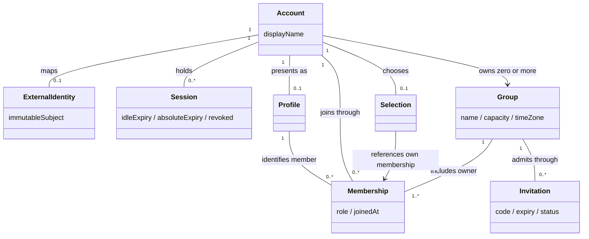
```mermaid
classDiagram
  Account "1" -- "0..1" ExternalIdentity : maps
  Account "1" -- "0..*" Session : holds
  Account "1" -- "0..1" Profile : presents as
  Account "1" -- "0..*" Membership : joins through
  Profile "1" -- "0..*" Membership : identifies member
  Group "1" -- "1..*" Membership : includes owner
  Account "1" -- "0..1" Selection : chooses
  Selection --> Membership : references own membership
  Group "1" -- "0..*" Invitation : admits through
  Account --> Group : owns zero or more
  Account : displayName
  ExternalIdentity : immutableSubject
  Session : idleExpiry / absoluteExpiry / revoked
  Group : name / capacity / timeZone
  Membership : role / joinedAt
  Invitation : code / expiry / status
```

An account may exist without a profile or group. A profile is shared across that account's group memberships, not recreated per group. Selection is convenience state, not permission. Invitation possession permits an attempted join; it does not establish membership. Ownership metadata and the owner's membership must agree when issuing invitations.

### IA-S1 — Authentication lifecycle (UC-I1–I3)

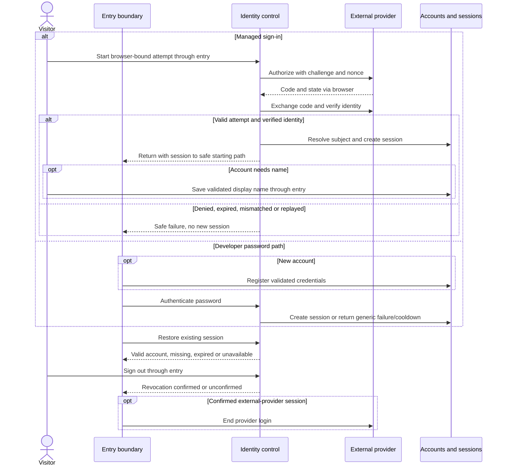
```mermaid
sequenceDiagram
  actor Visitor
  participant Entry as Entry boundary
  participant Identity as Identity control
  participant Provider as External provider
  participant Records as Accounts and sessions
  alt Managed sign-in
    Visitor->>Identity: Start browser-bound attempt through entry
    Identity->>Provider: Authorize with challenge and nonce
    Provider-->>Identity: Code and state via browser
    Identity->>Provider: Exchange code and verify identity
    alt Valid attempt and verified identity
      Identity->>Records: Resolve subject and create session
      Identity-->>Entry: Return with session to safe starting path
      opt Account needs name
        Visitor->>Records: Save validated display name through entry
      end
    else Denied, expired, mismatched or replayed
      Identity-->>Entry: Safe failure, no new session
    end
  else Developer password path
    opt New account
      Entry->>Records: Register validated credentials
    end
    Entry->>Identity: Authenticate password
    Identity->>Records: Create session or return generic failure/cooldown
  end
  Entry->>Identity: Restore existing session
  Identity-->>Entry: Valid account, missing, expired or unavailable
  Visitor->>Identity: Sign out through entry
  Identity-->>Entry: Revocation confirmed or unconfirmed
  opt Confirmed external-provider session
    Entry->>Provider: End provider login
  end
```

### IA-S2 — Group context and private membership (UC-I4–I5)

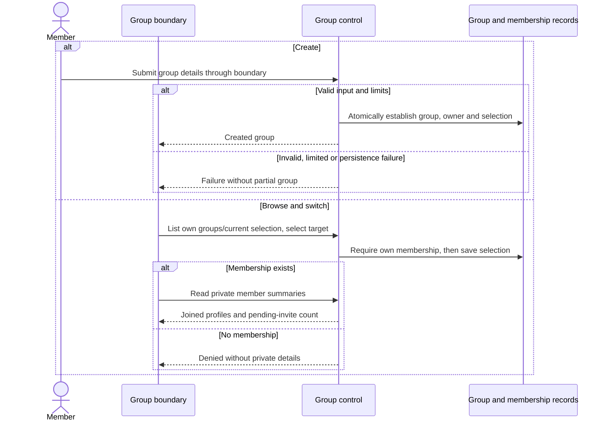
```mermaid
sequenceDiagram
  actor Member
  participant UI as Group boundary
  participant Control as Group control
  participant Records as Group and membership records
  alt Create
    Member->>Control: Submit group details through boundary
    alt Valid input and limits
      Control->>Records: Atomically establish group, owner and selection
      Control-->>UI: Created group
    else Invalid, limited or persistence failure
      Control-->>UI: Failure without partial group
    end
  else Browse and switch
    UI->>Control: List own groups/current selection, select target
    Control->>Records: Require own membership, then save selection
    alt Membership exists
      UI->>Control: Read private member summaries
      Control-->>UI: Joined profiles and pending-invite count
    else No membership
      Control-->>UI: Denied without private details
    end
  end
```

### IA-S3 — Invitations (UC-I6–I7)

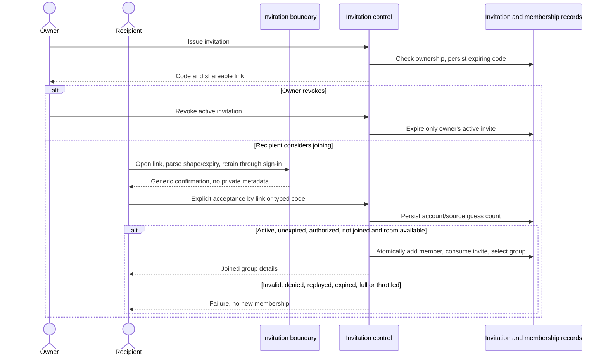
```mermaid
sequenceDiagram
  actor Owner
  actor Recipient
  participant UI as Invitation boundary
  participant Control as Invitation control
  participant Records as Invitation and membership records
  Owner->>Control: Issue invitation
  Control->>Records: Check ownership, persist expiring code
  Control-->>Owner: Code and shareable link
  alt Owner revokes
    Owner->>Control: Revoke active invitation
    Control->>Records: Expire only owner's active invite
  else Recipient considers joining
    Recipient->>UI: Open link, parse shape/expiry, retain through sign-in
    UI-->>Recipient: Generic confirmation, no private metadata
    Recipient->>Control: Explicit acceptance by link or typed code
    Control->>Records: Persist account/source guess count
    alt Active, unexpired, authorized, not joined and room available
      Control->>Records: Atomically add member, consume invite, select group
      Control-->>Recipient: Joined group details
    else Invalid, denied, replayed, expired, full or throttled
      Control-->>Recipient: Failure, no new membership
    end
  end
```

### IA-S4 — Owner management (UC-I8)

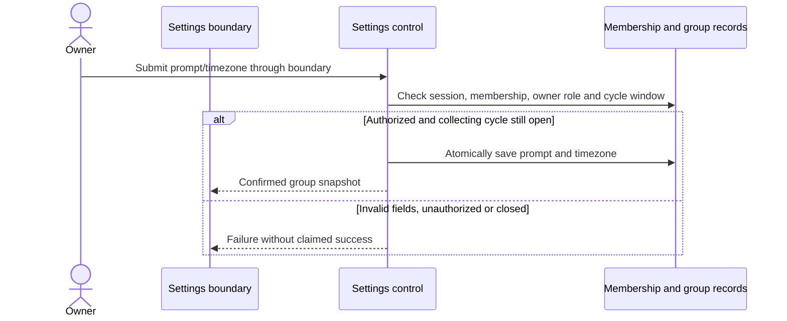
```mermaid
sequenceDiagram
  actor Owner
  participant UI as Settings boundary
  participant Control as Settings control
  participant Records as Membership and group records
  Owner->>Control: Submit prompt/timezone through boundary
  Control->>Records: Check session, membership, owner role and cycle window
  alt Authorized and collecting cycle still open
    Control->>Records: Atomically save prompt and timezone
    Control-->>UI: Confirmed group snapshot
  else Invalid fields, unauthorized or closed
    Control-->>UI: Failure without claimed success
  end
```

### IA-S5 — Delete identity and reconcile group ownership (UC-I9)

The account, profile, membership and group concepts in [IA-C1](#ia-c1) apply.
Deletion adds a cleanup responsibility rather than another entity.

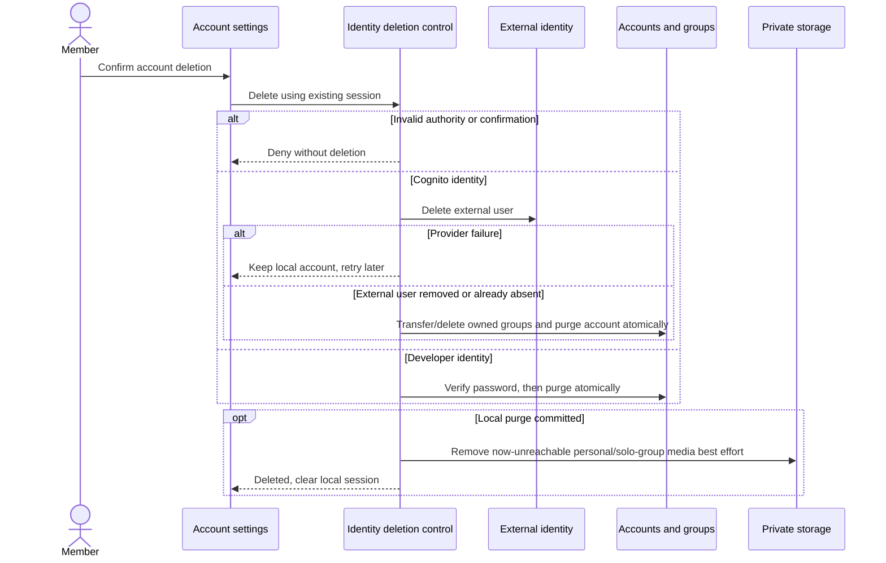
```mermaid
sequenceDiagram
  actor Member
  participant Entry as Account settings
  participant Control as Identity deletion control
  participant Provider as External identity
  participant Records as Accounts and groups
  participant Bytes as Private storage
  Member->>Entry: Confirm account deletion
  Entry->>Control: Delete using existing session
  alt Invalid authority or confirmation
    Control-->>Entry: Deny without deletion
  else Cognito identity
    Control->>Provider: Delete external user
    alt Provider failure
      Control-->>Entry: Keep local account, retry later
    else External user removed or already absent
      Control->>Records: Transfer/delete owned groups and purge account atomically
    end
  else Developer identity
    Control->>Records: Verify password, then purge atomically
  end
  opt Local purge committed
    Control->>Bytes: Remove now-unreachable personal/solo-group media best effort
    Control-->>Entry: Deleted, clear local session
  end
```

## Design model and flow mapping

### ID-C1 — Authentication implementation

`<<module>>` means exported/private functions grouped by file; `<<component>>` means a React function. `RealAccountClient` and `UsedStates` are actual classes; other boxes are not invented runtime classes. Class diagrams show representative members; sequences and traceability supply the complete flow mapping.

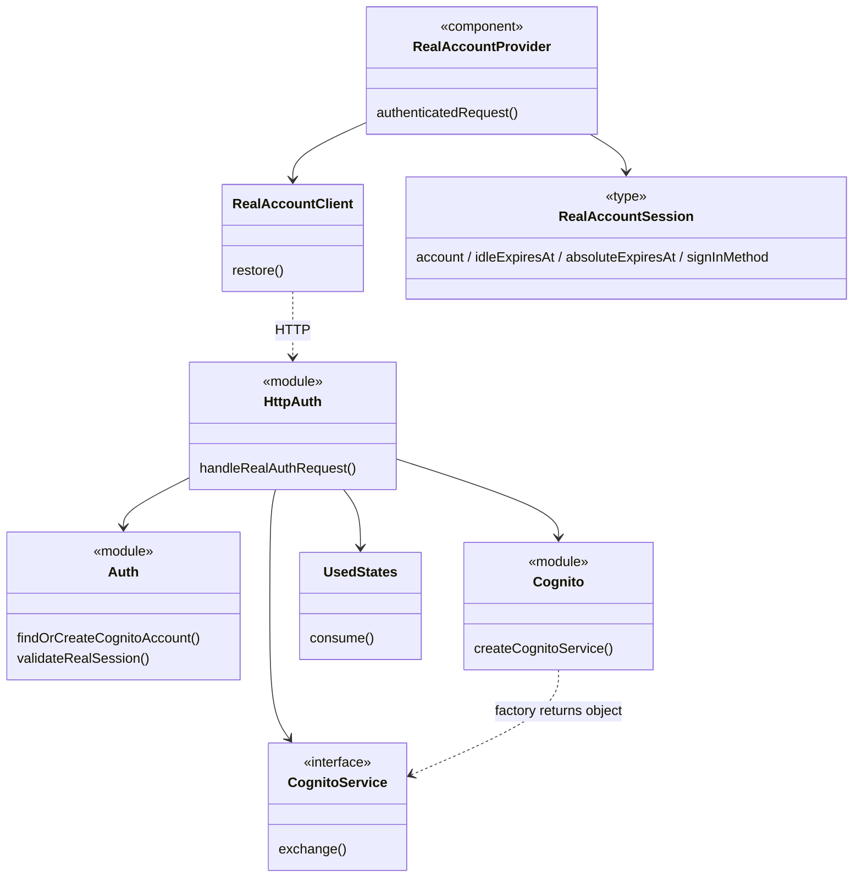
```mermaid
classDiagram
  RealAccountProvider --> RealAccountClient
  RealAccountProvider --> RealAccountSession
  RealAccountClient ..> HttpAuth : HTTP
  HttpAuth --> Auth
  HttpAuth --> Cognito
  HttpAuth --> CognitoService
  HttpAuth --> UsedStates
  Cognito ..> CognitoService : factory returns object
  <<component>> RealAccountProvider
  RealAccountProvider : authenticatedRequest()
  RealAccountClient : restore()
  <<module>> HttpAuth
  HttpAuth : handleRealAuthRequest()
  <<module>> Auth
  Auth : findOrCreateCognitoAccount()
  Auth : validateRealSession()
  <<interface>> CognitoService
  CognitoService : exchange()
  <<module>> Cognito
  Cognito : createCognitoService()
  UsedStates : consume()
  <<type>> RealAccountSession
  RealAccountSession : account / idleExpiresAt / absoluteExpiresAt / signInMethod
```

### ID-C2 — Group implementation (AFTER class model)

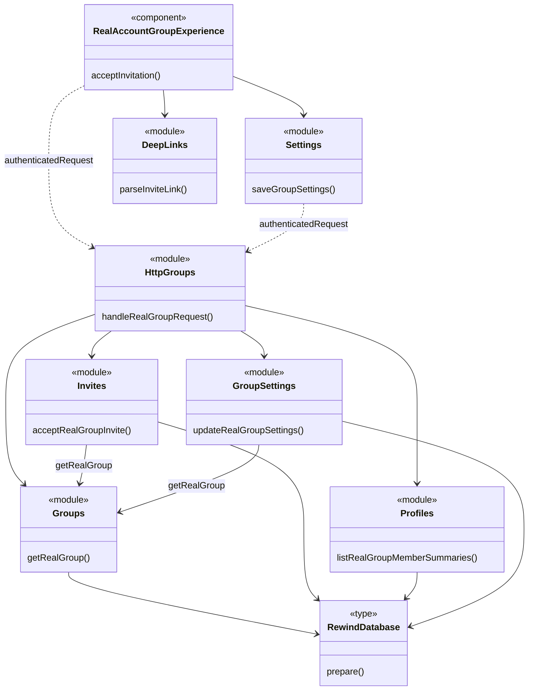
```mermaid
classDiagram
  RealAccountGroupExperience --> Settings
  RealAccountGroupExperience --> DeepLinks
  RealAccountGroupExperience ..> HttpGroups : authenticatedRequest
  Settings ..> HttpGroups : authenticatedRequest
  HttpGroups --> Groups
  HttpGroups --> Invites
  HttpGroups --> Profiles
  HttpGroups --> GroupSettings
  Invites --> Groups : getRealGroup
  GroupSettings --> Groups : getRealGroup
  Groups --> RewindDatabase
  Invites --> RewindDatabase
  Profiles --> RewindDatabase
  GroupSettings --> RewindDatabase
  <<component>> RealAccountGroupExperience
  RealAccountGroupExperience : acceptInvitation()
  <<module>> Settings
  Settings : saveGroupSettings()
  <<module>> DeepLinks
  DeepLinks : parseInviteLink()
  <<module>> HttpGroups
  HttpGroups : handleRealGroupRequest()
  <<module>> Groups
  Groups : getRealGroup()
  <<module>> Invites
  Invites : acceptRealGroupInvite()
  <<module>> Profiles
  Profiles : listRealGroupMemberSummaries()
  <<module>> GroupSettings
  GroupSettings : updateRealGroupSettings()
  <<type>> RewindDatabase
  RewindDatabase : prepare()
```

`RealGroup`/`RealGroupMembers` are local client interfaces in `RealAccountGroupExperience.tsx`; server `RealGroupInvite` and `AcceptRealGroupInviteResult` are data/result types. `HttpAuth` and `HttpGroups` label responsibilities in the same `server/src/http.ts` file. `RewindDatabase` is a `DatabaseSync` type alias; hosted PostgreSQL supplies a compatible synchronous adapter, not a domain repository class.

### ID-S1 — Managed and developer sign-in (UC-I1–I2)

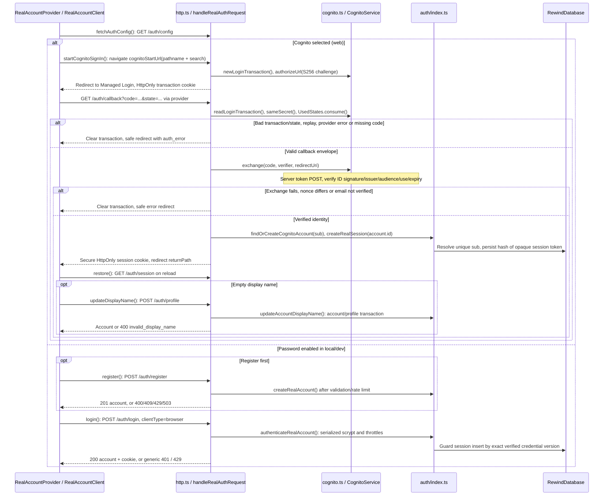
```mermaid
sequenceDiagram
  participant UI as RealAccountProvider / RealAccountClient
  participant HTTP as http.ts / handleRealAuthRequest
  participant OIDC as cognito.ts / CognitoService
  participant Auth as auth/index.ts
  participant DB as RewindDatabase
  UI->>HTTP: fetchAuthConfig(): GET /auth/config
  alt Cognito selected (web)
    UI->>HTTP: startCognitoSignIn(): navigate cognitoStartUrl(pathname + search)
    HTTP->>OIDC: newLoginTransaction(), authorizeUrl(S256 challenge)
    HTTP-->>UI: Redirect to Managed Login, HttpOnly transaction cookie
    UI->>HTTP: GET /auth/callback?code=...&state=... via provider
    HTTP->>OIDC: readLoginTransaction(), sameSecret(), UsedStates.consume()
    alt Bad transaction/state, replay, provider error or missing code
      HTTP-->>UI: Clear transaction, safe redirect with auth_error
    else Valid callback envelope
      HTTP->>OIDC: exchange(code, verifier, redirectUri)
      Note over OIDC: Server token POST, verify ID signature/issuer/audience/use/expiry
      alt Exchange fails, nonce differs or email not verified
        HTTP-->>UI: Clear transaction, safe error redirect
      else Verified identity
        HTTP->>Auth: findOrCreateCognitoAccount(sub), createRealSession(account.id)
        Auth->>DB: Resolve unique sub, persist hash of opaque session token
        HTTP-->>UI: Secure HttpOnly session cookie, redirect returnPath
        UI->>HTTP: restore(): GET /auth/session on reload
        opt Empty display name
          UI->>HTTP: updateDisplayName(): POST /auth/profile
          HTTP->>Auth: updateAccountDisplayName(): account/profile transaction
          HTTP-->>UI: Account or 400 invalid_display_name
        end
      end
    end
  else Password enabled in local/dev
    opt Register first
      UI->>HTTP: register(): POST /auth/register
      HTTP->>Auth: createRealAccount() after validation/rate limit
      HTTP-->>UI: 201 account, or 400/409/429/503
    end
    UI->>HTTP: login(): POST /auth/login, clientType=browser
    HTTP->>Auth: authenticateRealAccount(): serialized scrypt and throttles
    Auth->>DB: Guard session insert by exact verified credential version
    HTTP-->>UI: 200 account + cookie, or generic 401 / 429
  end
```

Configuration, not the UI, disables password registration/login. `parseAuthConfig` refuses release startup with passwords enabled and refuses passwords disabled without Cognito. A failed client config fetch retains its password-only default, but cannot bypass disabled server endpoints. The Cognito service returns verified `sub`/nonce/email-verification status; provider tokens are not exposed as browser API credentials.

### ID-S2 — Restore and web sign-out (UC-I3)

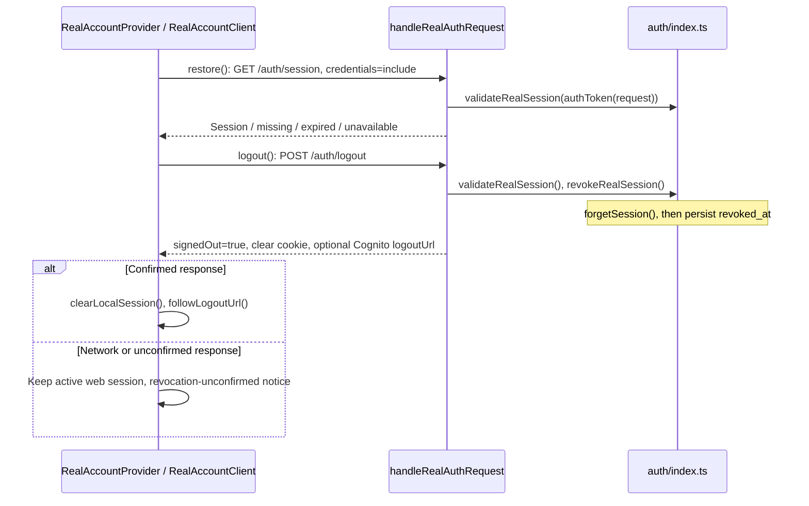
```mermaid
sequenceDiagram
  participant UI as RealAccountProvider / RealAccountClient
  participant HTTP as handleRealAuthRequest
  participant Auth as auth/index.ts
  UI->>HTTP: restore(): GET /auth/session, credentials=include
  HTTP->>Auth: validateRealSession(authToken(request))
  HTTP-->>UI: Session / missing / expired / unavailable
  UI->>HTTP: logout(): POST /auth/logout
  HTTP->>Auth: validateRealSession(), revokeRealSession()
  Note over Auth: forgetSession(), then persist revoked_at
  HTTP-->>UI: signedOut=true, clear cookie, optional Cognito logoutUrl
  alt Confirmed response
    UI->>UI: clearLocalSession(), followLogoutUrl()
  else Network or unconfirmed response
    UI->>UI: Keep active web session, revocation-unconfirmed notice
  end
```

Sessions have seven-day sliding idle expiry capped by a thirty-day absolute expiry. Validation uses a five-minute per-database cache; idle persistence is coalesced at ten-minute increments on cache hits. Own revocations invalidate immediately; changes outside this process can remain cached until TTL. `authenticatedRequest` clears protected client state on 401. Native token storage exists for development compatibility; it is not the release PWA credential path.

### ID-S3 — Create, select and inspect groups (UC-I4–I5)

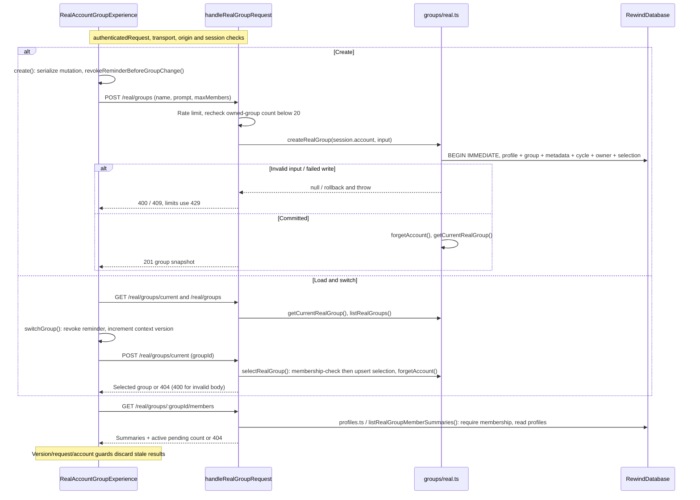
```mermaid
sequenceDiagram
  participant UI as RealAccountGroupExperience
  participant HTTP as handleRealGroupRequest
  participant Groups as groups/real.ts
  participant DB as RewindDatabase
  Note over UI,HTTP: authenticatedRequest, transport, origin and session checks
  alt Create
    UI->>UI: create(): serialize mutation, revokeReminderBeforeGroupChange()
    UI->>HTTP: POST /real/groups (name, prompt, maxMembers)
    HTTP->>HTTP: Rate limit, recheck owned-group count below 20
    HTTP->>Groups: createRealGroup(session.account, input)
    Groups->>DB: BEGIN IMMEDIATE, profile + group + metadata + cycle + owner + selection
    alt Invalid input / failed write
      Groups-->>HTTP: null / rollback and throw
      HTTP-->>UI: 400 / 409, limits use 429
    else Committed
      Groups->>Groups: forgetAccount(), getCurrentRealGroup()
      HTTP-->>UI: 201 group snapshot
    end
  else Load and switch
    UI->>HTTP: GET /real/groups/current and /real/groups
    HTTP->>Groups: getCurrentRealGroup(), listRealGroups()
    UI->>UI: switchGroup(): revoke reminder, increment context version
    UI->>HTTP: POST /real/groups/current (groupId)
    HTTP->>Groups: selectRealGroup(): membership-check then upsert selection, forgetAccount()
    HTTP-->>UI: Selected group or 404 (400 for invalid body)
  end
  UI->>HTTP: GET /real/groups/:groupId/members
  HTTP->>DB: profiles.ts / listRealGroupMemberSummaries(): require membership, read profiles
  HTTP-->>UI: Summaries + active pending count or 404
  Note over UI: Version/request/account guards discard stale results
```

### ID-S4 — Issue, preview and accept (UC-I6–I7; AFTER sequence)

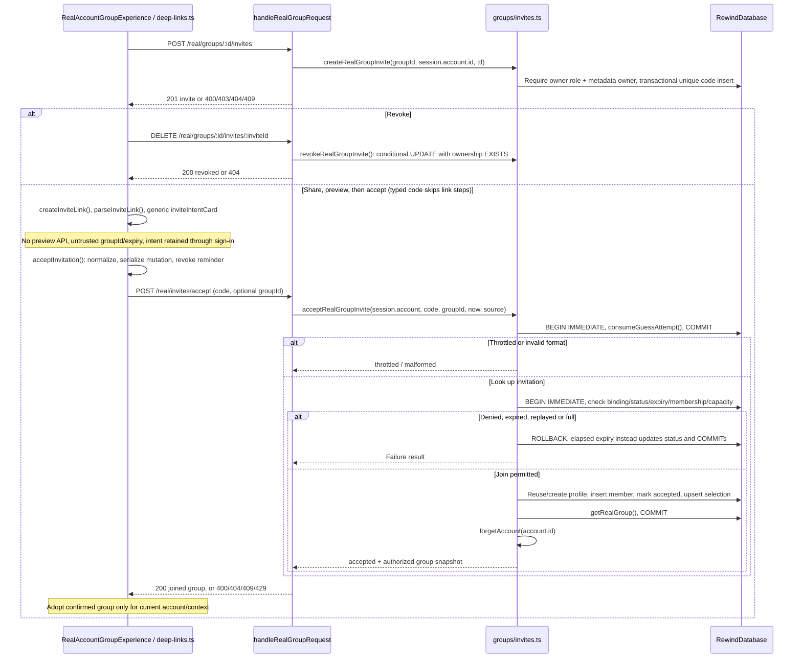
```mermaid
sequenceDiagram
  participant UI as RealAccountGroupExperience / deep-links.ts
  participant HTTP as handleRealGroupRequest
  participant Inv as groups/invites.ts
  participant DB as RewindDatabase
  UI->>HTTP: POST /real/groups/:id/invites
  HTTP->>Inv: createRealGroupInvite(groupId, session.account.id, ttl)
  Inv->>DB: Require owner role + metadata owner, transactional unique code insert
  HTTP-->>UI: 201 invite or 400/403/404/409
  alt Revoke
    UI->>HTTP: DELETE /real/groups/:id/invites/:inviteId
    HTTP->>Inv: revokeRealGroupInvite(): conditional UPDATE with ownership EXISTS
    HTTP-->>UI: 200 revoked or 404
  else Share, preview, then accept (typed code skips link steps)
    UI->>UI: createInviteLink(), parseInviteLink(), generic inviteIntentCard
    Note over UI: No preview API, untrusted groupId/expiry, intent retained through sign-in
    UI->>UI: acceptInvitation(): normalize, serialize mutation, revoke reminder
    UI->>HTTP: POST /real/invites/accept (code, optional groupId)
    HTTP->>Inv: acceptRealGroupInvite(session.account, code, groupId, now, source)
    Inv->>DB: BEGIN IMMEDIATE, consumeGuessAttempt(), COMMIT
    alt Throttled or invalid format
      Inv-->>HTTP: throttled / malformed
    else Look up invitation
      Inv->>DB: BEGIN IMMEDIATE, check binding/status/expiry/membership/capacity
      alt Denied, expired, replayed or full
        Inv->>DB: ROLLBACK, elapsed expiry instead updates status and COMMITs
        Inv-->>HTTP: Failure result
      else Join permitted
        Inv->>DB: Reuse/create profile, insert member, mark accepted, upsert selection
        Inv->>DB: getRealGroup(), COMMIT
        Inv->>Inv: forgetAccount(account.id)
        Inv-->>HTTP: accepted + authorized group snapshot
      end
    end
    HTTP-->>UI: 200 joined group, or 400/404/409/429
    Note over UI: Adopt confirmed group only for current account/context
  end
```

### ID-S5 — Management authorization (UC-I8)

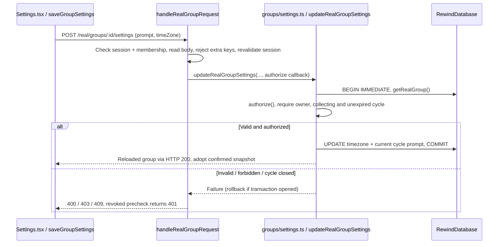
```mermaid
sequenceDiagram
  participant UI as Settings.tsx / saveGroupSettings
  participant HTTP as handleRealGroupRequest
  participant Settings as groups/settings.ts / updateRealGroupSettings
  participant DB as RewindDatabase
  UI->>HTTP: POST /real/groups/:id/settings (prompt, timeZone)
  HTTP->>HTTP: Check session + membership, read body, reject extra keys, revalidate session
  HTTP->>Settings: updateRealGroupSettings(..., authorize callback)
  Settings->>DB: BEGIN IMMEDIATE, getRealGroup()
  Settings->>Settings: authorize(), require owner, collecting and unexpired cycle
  alt Valid and authorized
    Settings->>DB: UPDATE timezone + current cycle prompt, COMMIT
    Settings-->>UI: Reloaded group via HTTP 200, adopt confirmed snapshot
  else Invalid / forbidden / cycle closed
    Settings-->>HTTP: Failure (rollback if transaction opened)
    HTTP-->>UI: 400 / 403 / 409, revoked precheck returns 401
  end
```

### ID-C3 — Account deletion implementation (UC-I9)

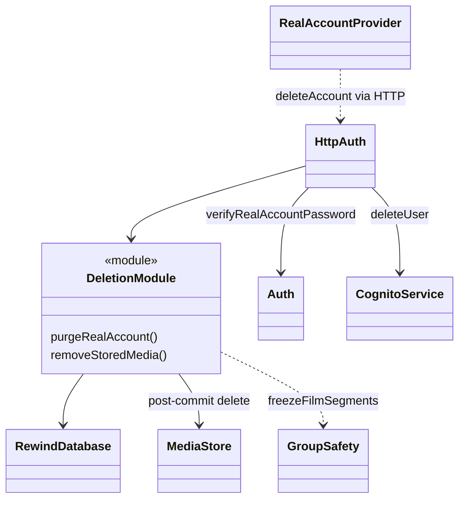
```mermaid
classDiagram
  class DeletionModule {
    <<module>>
    purgeRealAccount()
    removeStoredMedia()
  }
  RealAccountProvider ..> HttpAuth : deleteAccount via HTTP
  HttpAuth --> Auth : verifyRealAccountPassword
  HttpAuth --> CognitoService : deleteUser
  HttpAuth --> DeletionModule
  DeletionModule --> RewindDatabase
  DeletionModule --> MediaStore : post-commit delete
  DeletionModule ..> GroupSafety : freezeFilmSegments
```

### ID-S6 — Provider-first deletion and post-commit cleanup (UC-I9)

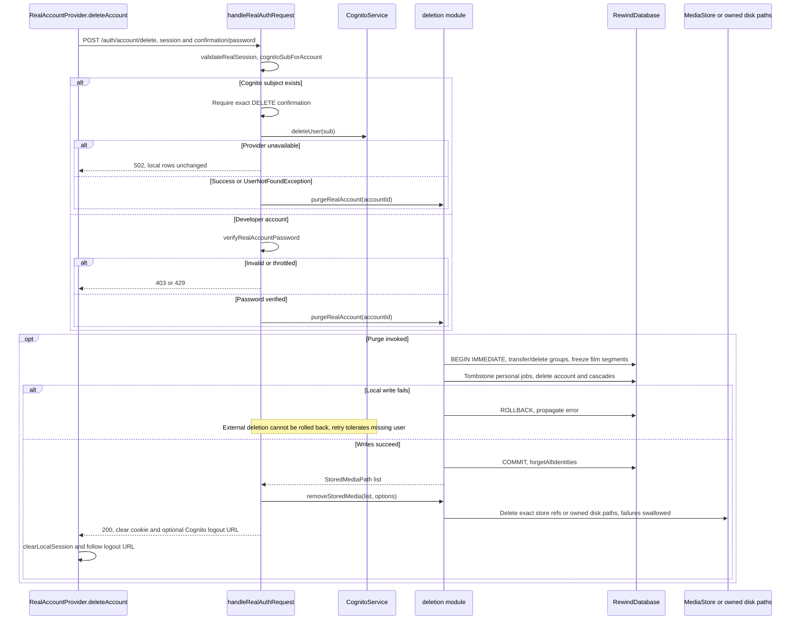
```mermaid
sequenceDiagram
  participant UI as RealAccountProvider.deleteAccount
  participant H as handleRealAuthRequest
  participant C as CognitoService
  participant D as deletion module
  participant DB as RewindDatabase
  participant S as MediaStore or owned disk paths
  UI->>H: POST /auth/account/delete, session and confirmation/password
  H->>H: validateRealSession, cognitoSubForAccount
  alt Cognito subject exists
    H->>H: Require exact DELETE confirmation
    H->>C: deleteUser(sub)
    alt Provider unavailable
      H-->>UI: 502, local rows unchanged
    else Success or UserNotFoundException
      H->>D: purgeRealAccount(accountId)
    end
  else Developer account
    H->>H: verifyRealAccountPassword
    alt Invalid or throttled
      H-->>UI: 403 or 429
    else Password verified
      H->>D: purgeRealAccount(accountId)
    end
  end
  opt Purge invoked
    D->>DB: BEGIN IMMEDIATE, transfer/delete groups, freeze film segments
    D->>DB: Tombstone personal jobs, delete account and cascades
    alt Local write fails
      D->>DB: ROLLBACK, propagate error
      Note over H,C: External deletion cannot be rolled back, retry tolerates missing user
    else Writes succeed
      D->>DB: COMMIT, forgetAllIdentities
      D-->>H: StoredMediaPath list
      H->>D: removeStoredMedia(list, options)
      D->>S: Delete exact store refs or owned disk paths, failures swallowed
      H-->>UI: 200, clear cookie and optional Cognito logout URL
      UI->>UI: clearLocalSession and follow logout URL
    end
  end
```

Personal clips become unavailable; existing shared compiled films remain owned
by the group. Frozen segment timing permits the UI to hide deleted authors'
segments, but this does not remove their bytes from a kept downloadable film.
The provider/local database sequence is not an atomic distributed transaction.

### Traceability

Paths are relative to this document. Line anchors identify symbols at the stated revision. Tests below are existing references, **not execution results**.

| UC    | Analysis → design diagrams                                          | Source file / exact symbol                                                                                                                                                                                                                                                                                                                                                                                                                   | Existing tests and relevant cases                                                                                                                                                                                                                                                                                                                                                                                                   |
| ----- | ------------------------------------------------------------------- | -------------------------------------------------------------------------------------------------------------------------------------------------------------------------------------------------------------------------------------------------------------------------------------------------------------------------------------------------------------------------------------------------------------------------------------------- | ----------------------------------------------------------------------------------------------------------------------------------------------------------------------------------------------------------------------------------------------------------------------------------------------------------------------------------------------------------------------------------------------------------------------------------- |
| I1    | [IA-C1](#ia-c1), [IA-S1](#ia-s1) → [ID-C1](#id-c1), [ID-S1](#id-s1) | [RealAccountProvider::startCognitoSignIn, updateDisplayName](../../src/auth/RealAccountProvider.tsx#L553); [handleRealAuthRequest](../../server/src/http.ts#L3602); [createCognitoService, newLoginTransaction, readLoginTransaction, UsedStates](../../server/src/auth/cognito.ts#L55); [findOrCreateCognitoAccount, updateAccountDisplayName](../../server/src/auth/index.ts#L646)                                                         | [cognito-auth](../../server/tests/cognito-auth.test.mjs#L182): callback, subject reuse, bad tokens/state/replay, cancellation, naming; [real-account-cognito](../../tests/real-account-cognito.test.tsx#L253): return path and first name.                                                                                                                                                                                          |
| I2    | [IA-S1](#ia-s1) → [ID-C1](#id-c1), [ID-S1](#id-s1)                  | [RealAccountClient::register, login](../../src/auth/real-account-client.ts#L159); [createRealAccount](../../server/src/auth/index.ts#L133), [authenticateRealAccount](../../server/src/auth/index.ts#L333); [parseAuthConfig](../../server/src/config.ts#L263)                                                                                                                                                                               | [real-account-auth](../../server/tests/real-account-auth.test.mjs#L437): generic failures, cooldown, credential-reset races and registration; [cognito-auth](../../server/tests/cognito-auth.test.mjs#L406): disabled passwords and release startup guard.                                                                                                                                                                          |
| I3    | [IA-S1](#ia-s1) → [ID-C1](#id-c1), [ID-S2](#id-s2)                  | [RealAccountClient::restore, logout](../../src/auth/real-account-client.ts#L250); [RealAccountProvider::signOut](../../src/auth/RealAccountProvider.tsx#L391); [validateRealSession, revokeRealSession](../../server/src/auth/index.ts#L462); [forgetSession](../../server/src/auth/identity-cache.ts#L72)                                                                                                                                   | [real-account-auth](../../server/tests/real-account-auth.test.mjs#L533): idle/absolute expiry and missing vs revoked; [real-account-entry-auth](../../tests/real-account-entry-auth.test.tsx#L1140): unconfirmed web logout; [real-account-session-expiry](../../tests/real-account-session-expiry.test.tsx#L69): idle vs absolute expiry; [real-account-cognito](../../tests/real-account-cognito.test.tsx#L347): provider logout. |
| I4    | [IA-C1](#ia-c1), [IA-S2](#ia-s2) → [ID-C2](#id-c2), [ID-S3](#id-s3) | [RealAccountGroupExperience::create](../../src/groups/RealAccountGroupExperience.tsx#L706); [createRealGroup, validateRealGroupInput](../../server/src/groups/real.ts#L15); [handleRealGroupRequest creation branch](../../server/src/http.ts#L3452)                                                                                                                                                                                         | [real-groups](../../server/tests/real-groups.test.mjs#L147): capacity and rollback; [real-group-experience](../../tests/real-group-experience.test.tsx#L310): create and remount; [rate-limit feedback](../../tests/real-group-experience.test.tsx#L47).                                                                                                                                                                            |
| I5    | [IA-C1](#ia-c1), [IA-S2](#ia-s2) → [ID-C2](#id-c2), [ID-S3](#id-s3) | [load](../../src/groups/RealAccountGroupExperience.tsx#L488), [switchGroup](../../src/groups/RealAccountGroupExperience.tsx#L875); [getRealGroup](../../server/src/groups/real.ts#L128), [getCurrentRealGroup, listRealGroups, selectRealGroup](../../server/src/groups/real.ts#L211); [listRealGroupMemberSummaries](../../server/src/groups/profiles.ts#L11)                                                                               | [real-group-profiles](../../server/tests/real-group-profiles.test.mjs#L87): selected groups and outsider denial; [real-group-members](../../tests/real-group-members.test.tsx#L85): switch, stale response, unknown counts; [real-group-invites](../../server/tests/real-group-invites.test.mjs#L385): forged group IDs.                                                                                                            |
| I6    | [IA-S3](#ia-s3) → [ID-C2](#id-c2), [ID-S4](#id-s4)                  | [createInvitation, revokeInvitation, shareInvitation](../../src/groups/RealAccountGroupExperience.tsx#L747); [inviteIntentCard](../../src/groups/RealAccountGroupExperience.tsx#L1065); [createInviteLink](../../src/invites/deep-links.ts#L51), [parseInviteLink](../../src/invites/deep-links.ts#L107); [createRealGroupInvite](../../server/src/groups/invites.ts#L125), [revokeRealGroupInvite](../../server/src/groups/invites.ts#L189) | [real-group-invites](../../server/tests/real-group-invites.test.mjs#L75): owner issuance/revoke; [deep-link-invites](../../tests/deep-link-invites.test.ts#L31): HTTPS binding, format/expiry denial; [real-account-entry-auth](../../tests/real-account-entry-auth.test.tsx#L565): generic retained intent, owner copy/share.                                                                                                      |
| I7    | [IA-C1](#ia-c1), [IA-S3](#ia-s3) → [ID-C2](#id-c2), [ID-S4](#id-s4) | [acceptInvitation](../../src/groups/RealAccountGroupExperience.tsx#L824); [JoinScreen, formatInviteCode](../../src/real/GroupFlows.tsx#L22); [acceptRealGroupInvite](../../server/src/groups/invites.ts#L214), [consumeGuessAttempt](../../server/src/groups/invites.ts#L66); [accept route/error mapping](../../server/src/http.ts#L3377)                                                                                                   | [real-group-invites](../../server/tests/real-group-invites.test.mjs#L175): session-account binding, selected group, replay, legacy codes, malformed/expired and durable guesses; [real-group-experience](../../tests/real-group-experience.test.tsx#L162): typed six-letter join.                                                                                                                                                   |
| I8    | [IA-S4](#ia-s4) → [ID-C2](#id-c2), [ID-S5](#id-s5)                  | [saveGroupSettings](../../src/real/Settings.tsx#L91); [handleRealGroupRequest settings branch](../../server/src/http.ts#L3100); [updateRealGroupSettings](../../server/src/groups/settings.ts#L5)                                                                                                                                                                                                                                            | [real-group-settings server](../../server/tests/real-group-settings.test.mjs#L112): member/outsider denial, extra fields, timezone and preserved deadline; [real-group-settings client](../../tests/real-group-settings.test.tsx#L21): safe payloads and failed-save feedback.                                                                                                                                                      |
| UC-I9 | [IA-C1](#ia-c1), [IA-S5](#ia-s5) → [ID-C3](#id-c3), [ID-S6](#id-s6) | [RealAccountProvider.deleteAccount](../../src/auth/RealAccountProvider.tsx#L494), [handleRealAuthRequest deletion route](../../server/src/http.ts#L3913), [purgeRealAccount / removeStoredMedia](../../server/src/auth/deletion.ts), [CognitoService.deleteUser](../../server/src/auth/cognito.ts)                                                                                                                                           | [account deletion and ownership reconciliation](../../server/tests/account-safety.test.mjs), [Cognito confirmation/provider failure](../../server/tests/cognito-auth.test.mjs#L366)                                                                                                                                                                                                                                                 |

## Design problem and alternatives

**Problem:** safely convert an untrusted invitation into exactly one authorized membership while keeping group selection consistent. A code alone cannot supply account authority, prove capacity, or prevent concurrent/repeated use. A preview must not disclose private group membership.

### IB-C1 — BEFORE class diagram: conceptual rejected baseline

This is an illustrative alternative, **not historical implemented architecture**. Its classes are hypothetical and do not appear in the source.

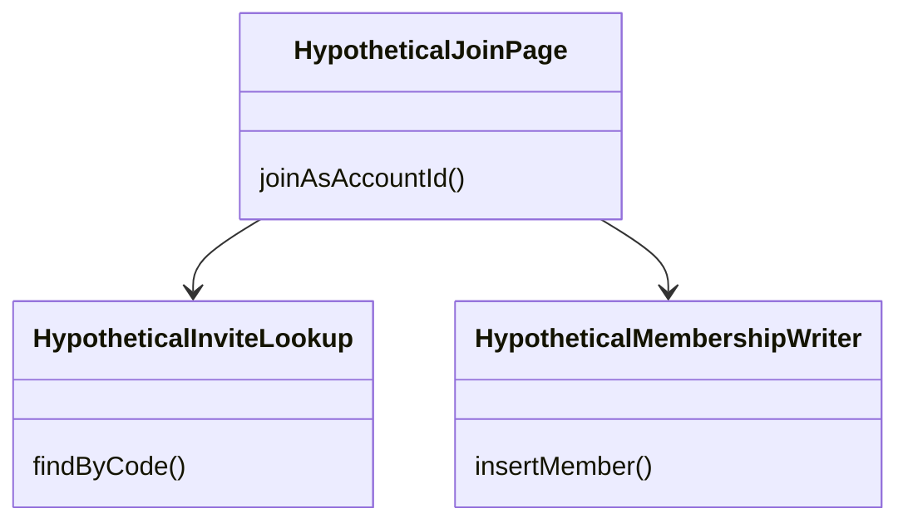
```mermaid
classDiagram
  HypotheticalJoinPage --> HypotheticalInviteLookup
  HypotheticalJoinPage --> HypotheticalMembershipWriter
  HypotheticalJoinPage : joinAsAccountId()
  HypotheticalInviteLookup : findByCode()
  HypotheticalMembershipWriter : insertMember()
```

### IB-S1 — BEFORE sequence: conceptual rejected baseline

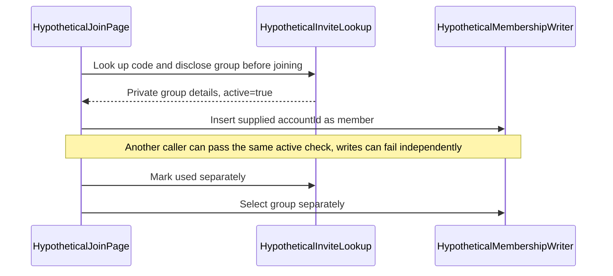
```mermaid
sequenceDiagram
  participant Page as HypotheticalJoinPage
  participant Lookup as HypotheticalInviteLookup
  participant Writer as HypotheticalMembershipWriter
  Page->>Lookup: Look up code and disclose group before joining
  Lookup-->>Page: Private group details, active=true
  Page->>Writer: Insert supplied accountId as member
  Note over Page,Writer: Another caller can pass the same active check, writes can fail independently
  Page->>Lookup: Mark used separately
  Page->>Writer: Select group separately
```

| Candidate approach                                                                        | Assessment against this problem                                                                                                                                                                                    |
| ----------------------------------------------------------------------------------------- | ------------------------------------------------------------------------------------------------------------------------------------------------------------------------------------------------------------------ |
| Client-led lookup and independent writes (IB-C1/IB-S1)                                    | Rejected: trusts client identity, exposes metadata early and permits partial membership/selection or double acceptance.                                                                                            |
| Stateless signed invitation with direct membership insert                                 | A signature could protect link claims, but cannot alone enforce single use, current capacity or current ownership; durable checks remain necessary. Not the implementation.                                        |
| Rich domain objects plus Repository and Unit of Work abstractions                         | Could encapsulate invariants, but would add object/repository layers absent from these small functional modules. Not the implementation.                                                                           |
| **Session-derived identity plus transactional server functions (chosen actual solution)** | `handleRealGroupRequest` binds the account; `acceptRealGroupInvite` validates durable state and commits membership, consumption and selection together. Existing relational constraints support the same boundary. |

**AFTER:** reuse [ID-C2](#id-c2) and [ID-S4](#id-s4). The client sends an invitation, not authority. A separate committed guess transaction makes rejection counting survive join rollback. The join transaction checks optional group binding, active/unexpired state, existing membership and capacity before writing. A unique `(group_id, account_id)` membership key and selection's membership foreign key reinforce consistency. Runtime exceptions roll back the join and map to 409.

These are layered boundary/control/persistence responsibilities and a Transaction Script style, not a claimed GoF pattern. `CognitoService` is an injected service interface/factory and provider adapter; the source does not implement GoF Abstract Factory or a class-based Strategy hierarchy. Invitation/session string unions do not constitute GoF State.

## Transition and implementation choices

| Applied analysis → design strategy     | Concrete implementation and consequence                                                                                                                                                                                                                                                 |
| -------------------------------------- | --------------------------------------------------------------------------------------------------------------------------------------------------------------------------------------------------------------------------------------------------------------------------------------- |
| Boundary/control/entity decomposition  | Analysis UI boundaries become React components; identity/group controls become handler and functional modules. Entities become rows and TypeScript shapes, not active-record classes. Components retain orchestration/state; server functions retain authorization and writes.          |
| Persistence identity mapping           | Cognito `sub` maps through unique `real_accounts.cognito_sub` to local account ID; email is not stored. `real_profiles.account_id` is unique; membership's composite FK binds account/profile, preventing interchangeable IDs. Client `memberId` identifies a profile, not the account. |
| Separate selection from authority      | `real_account_group_selections` references an existing `(group_id, account_id)` membership. `getRealGroup` joins membership for the requested account; changing selected ID cannot create access.                                                                                       |
| Service/interface extraction           | `createCognitoService(config, dependencies)` isolates authorize/exchange/token verification; tests can inject fetch/verifier. `CognitoService` injection through server options avoids live provider access in tests.                                                                   |
| Make invariants atomic                 | `createRealGroup`, `acceptRealGroupInvite` and `updateRealGroupSettings` use explicit transactions. Invite guesses commit separately; rejection must consume a guess without consuming a membership.                                                                                    |
| Map asynchronous UI results to context | `groupMutationPending`, context/request versions and account/mount guards prevent old group responses overwriting current state. Reminder revocation can block create/join/switch; this is a real coupling and failure mode.                                                            |

Implementation choices and limits:

- PKCE uses S256; the ten-minute `__Host-rewind_oidc` cookie is HttpOnly/Secure/SameSite=Lax and carries state, nonce, verifier, safe return path and expiry. It is base64url JSON, not an encrypted or signed application payload. `UsedStates` is a bounded in-memory replay map, scoped to one server process; this is not a distributed replay store.
- `__Host-rewind_session` contains a random opaque token; persistence stores its SHA-256 digest. Browser fetch includes cookies and never stores a JS bearer token. `authToken` rejects conflicting bearer/cookie credentials. HTTPS/origin checks remain server responsibilities; loopback HTTP is a development exception.
- Password accounts use scrypt, generic invalid-login responses and account/source throttles. Asynchronous password verification is followed by an insert guarded by the exact verified credential version, addressing concurrent password reset. Cognito accounts retain random unusable password-column values to preserve the existing schema.
- Invitation defaults: 24-hour lifetime, allowed 5 minutes–7 days; random six-letter uppercase code displayed `ABC-DEF`, with bounded collision retries. Server and link parser retain legacy eight-character alphanumeric codes; the manual entry formatter deliberately accepts six letters only. Guess budgets are ten per 15 minutes for both account and source, with hashed subject keys.
- Real links include group ID, code and expiry, and require HTTPS when group-bound. They contain no member list or group name. The parsed expiry is a client hint; the database expiry/status is authoritative. Preview does not reserve capacity or guarantee acceptance; one invitation is consumed by one join.
- Group name/prompt limits are 80/160 characters; capacity is 2–10 including owner. Creation selects the new group and starts a server-owned cycle. Settings change prompt/timezone only while the current cycle is collecting and unexpired; invitation create/revoke additionally check metadata ownership.
- SQL uses the shared `RewindDatabase` surface; SQLite `BEGIN IMMEDIATE` describes the source transaction boundary. Hosted PostgreSQL uses a compatibility adapter. This inspection does not establish multi-process race freedom or adapter-level lock equivalence; do not infer distributed guarantees from the sequence diagrams.

## Sources and limits

Primary evidence is the linked code and existing test definitions at the stated revision. Schema mappings: [018 accounts/sessions](../../server/migrations/018-real-account-auth.sql), [019 profiles/memberships/selection](../../server/migrations/019-real-groups.sql), [020 invitation identity](../../server/migrations/020-real-group-invites.sql), [021 acceptance/status](../../server/migrations/021-real-group-invite-acceptance.sql), [024 guess throttles](../../server/migrations/024-real-invite-guess-throttles.sql), [025 timezone](../../server/migrations/025-real-group-reminders.sql), [031 Cognito subject](../../server/migrations/031-cognito-accounts.sql). Infrastructure/provider provisioning is outside this model; one user pool per environment is the root agreement's policy, not a deployment verified here.

Verification for this document consists of static source/test inspection, local revision comparison, Markdown parsing, and document link/diagram-fence/sequence-branch checks. Entry routing and the naming gate are corroborated by the referenced App tests; the root App component was outside the scoped source inspection. No application tests, provider calls, runtime flows, deployment checks or device checks were run. Test references show intended checks, not a claim that they currently pass. Mermaid is editable source; rendering checks are recorded in the documentation PR. Error alternatives summarize handler behavior rather than exhaustive HTTP/parser failures. There is no general owner-transfer or member-removal API implied by these views; the automatic ownership handover in UC-I9 occurs only during account deletion. Moderation is a separate group-safety boundary.
