# Project 11 delivery evidence

This branch groups the Project 11 entry, account, layout, and feedback work into one reviewable change. The owner resolved the Demo placement conflict with: **Keep Demo only on Sign in.** The Welcome screen offers account creation and sign-in; `Try Demo` is available after opening Sign in.

## Issue mapping

| Issue | Change and proof                                                                                                                                                                                                                                                                                                                                                                                                                                                                                                                                                                  |
| ----- | --------------------------------------------------------------------------------------------------------------------------------------------------------------------------------------------------------------------------------------------------------------------------------------------------------------------------------------------------------------------------------------------------------------------------------------------------------------------------------------------------------------------------------------------------------------------------------- |
| #243  | Branded cold-launch screen stays visible for at least 600 ms after its first render; a regression test covers fast session restoration. Welcome is shortened and contains no Demo action. See the cold-launch and Welcome captures below, including the current-branch Safari capture.                                                                                                                                                                                                                                                                                            |
| #304  | The Sign in `Try Demo` path reached the synthetic sample Home in local production E2E, hosted dev browser, and the iPhone 17 Pro simulator's mobile Safari; reload was verified in the earlier hosted dev browser run. Sign-out returned to Welcome. The simulator run used only synthetic local sample data. No invite, contribution, media, or release state was changed. The fresh hosted iPhone Home Screen journey and API retry case remain open.                                                                                                                           |
| #305  | Real-account requests require the same-origin HTTPS boundary. The runtime distinguishes an absent browser session from a revoked session. Local smoke tests exercised the UI over loopback HTTPS; auth integration tests cover the server contract. Current-branch simulator Safari screenshots also confirm that the HTTP sign-in and registration screens warn and disable submission. Hosted pilot-account verification remains open.                                                                                                                                          |
| #306  | Native iPhone 17 Pro simulator capture confirms a hidden status bar and continuous dark surface through both safe areas. The web/PWA shell uses `viewport-fit=cover`, matching theme colors, zero-margin roots sized to `100dvh`, and a service-worker cache bump. The Home web scroll region is keyboard-focusable. Current-branch iPhone simulator screenshots cover Welcome, Sign in, registration and the sample route; Safari chrome is visible in the Safari captures. Installed PWA and physical-device verification remain open.                                          |
| #307  | Added public self-registration using the existing salted password storage, bounded request body, and per-source rate limit. Registration creates no session, Demo identity, or group membership.                                                                                                                                                                                                                                                                                                                                                                                  |
| #308  | Added username/password/confirmation UI, inline outcomes, pending/disabled states, HTTPS guard, direct sign-in after account creation, and invite-intent retention. Fresh browser entry no longer shows a false expired-session warning. Regression tests cover invalid/weak input, rate-limit, and service failure while preserving inputs. Native and Safari simulator captures confirm the form and HTTP guard; live HTTPS signup remains open. The native keyboard capture shows the lower submit control behind the keyboard; the final field's Go action was not submitted. |
| #309  | Added pressed-control response and a short route transition that respects reduced-motion settings. Loading feedback is covered by the cold-launch screen.                                                                                                                                                                                                                                                                                                                                                                                                                         |
| #296  | Home copy no longer exposes Demo or runtime diagnostics. Demo and local-runtime disclosure remain in Settings; see the Settings captures.                                                                                                                                                                                                                                                                                                                                                                                                                                         |
| #267  | Research-only brief: [performance profiling research](../doc/planning/performance-profiling-research.md). It discloses Luna agent authorship and independent critique; it does not claim a performance campaign.                                                                                                                                                                                                                                                                                                                                                                  |
| #145  | `npm run test:production-e2e` passed twice against disposable local data (two tests per run, including reset-to-reveal). This is local synthetic evidence only; required hosted journeys and rollback/acceptance observations were not run. See the limitation below.                                                                                                                                                                                                                                                                                                             |
| #232  | Launched this branch through `make run` on iPhone 15 simulator, iOS 17.5, Expo Go 57.0.9, using an isolated temporary database. The app reached Welcome; see the simulator capture below. This does not satisfy the issue's physical-iPhone collaborator check.                                                                                                                                                                                                                                                                                                                   |
| #314  | Investigation did not reproduce the reported native Video crash or produce an iOS exception. No speculative code change was made; the issue remains open for device logs.                                                                                                                                                                                                                                                                                                                                                                                                         |

The five additional issues are grouped under the **Miscellaneous Epic** (#319) in Project 11. They remain open where the issue's device or live-host acceptance gate has not been met.

### Hosted dev Demo journey

On the live CloudFront dev URL, I opened Sign in → Try Demo, selected the synthetic Amber member, and reached the Weekend People sample Home with the local runtime connected. Reload restored that Home session. I then signed out; the app returned to Welcome and the synthetic session ended. This browser journey did not create an invite, contribution, media file, or release, and it was not a physical iPhone Safari/Add-to-Home-Screen run. The older deployed shell displayed the stale expired-session warning after sign-out; the current PR branch suppresses that warning on fresh Welcome and covers it in the entry regression tests.

## Screenshots

Captured from the current branch against a disposable, seeded local runtime. Chromium used a **393 × 852 CSS-pixel viewport at DPR 3** (iPhone 15-sized emulation); these are browser captures, not screenshots from physical iOS hardware. The local app was served through a loopback-only HTTPS proxy so the secure-entry screens exercised their HTTPS-enabled UI state. The demo session used synthetic fixture data only.

### Cold launch

### Welcome

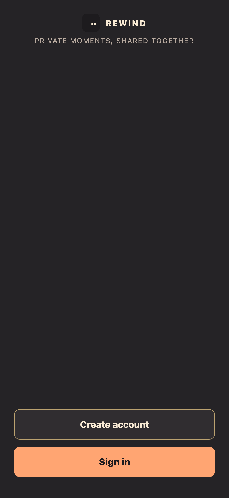

### Registration

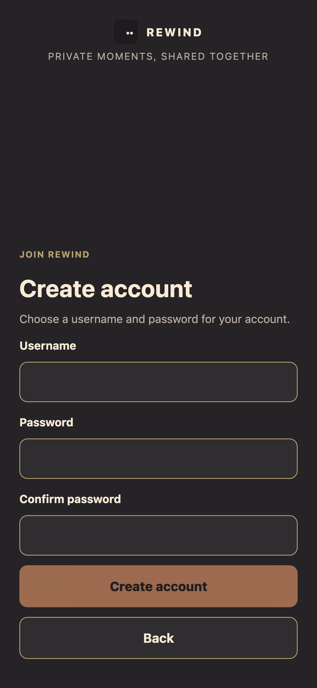

### Sign in and Demo placement

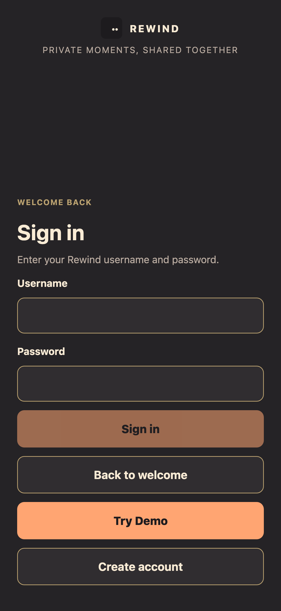

### Sample Home

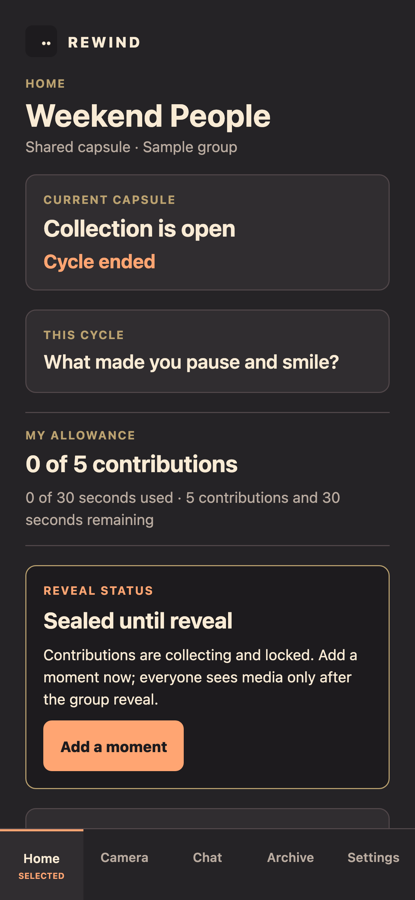

### Settings and diagnostics

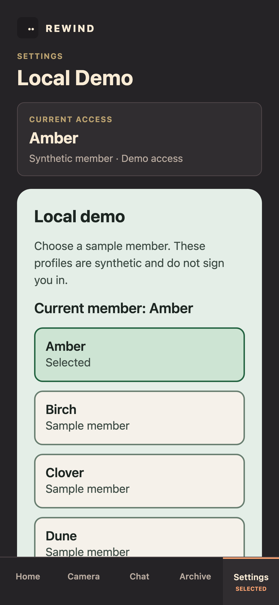

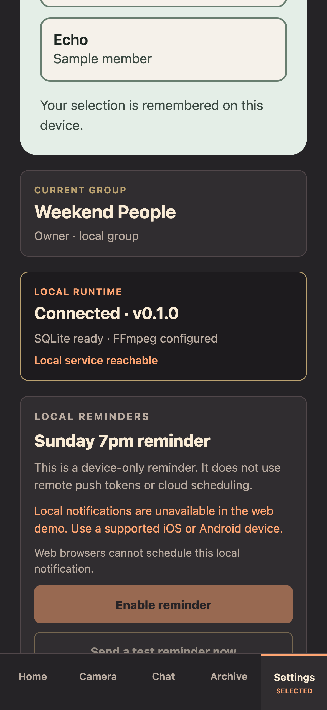

### iPhone 14 Plus Add-to-Home-Screen report

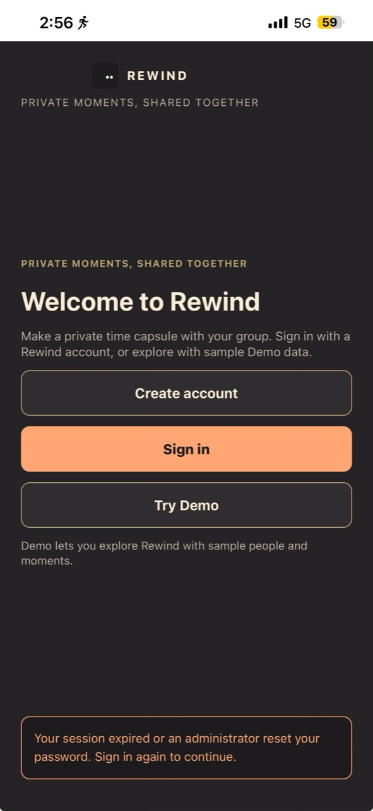

The owner reports white bands at both ends when opening the dev URL as a Safari Add-to-Home-Screen app on an iPhone 14 Plus, and says the result looks worse than expected. The supplied capture visibly shows the white top status-bar band. I reopened the live CloudFront URL and confirmed it still serves the older Welcome/Demo layout; the PR branch is not deployed there. The branch sets `viewport-fit=cover`, uses the black-translucent iOS status bar, matches the theme colors, and now gives `html`, `body`, and `#root` zero-margin full-dynamic-viewport sizing. The service-worker cache version advances so an installed copy fetches the corrected shell after deployment. The screenshot is evidence of the older live deployment, not physical verification of this branch. The user's follow-up and the remaining PWA acceptance gate are recorded in [issue #306](https://github.com/Collaboration95/rewind-app/issues/306#issuecomment-5907179117).

### Hosted CloudFront URL in iPhone simulator Safari

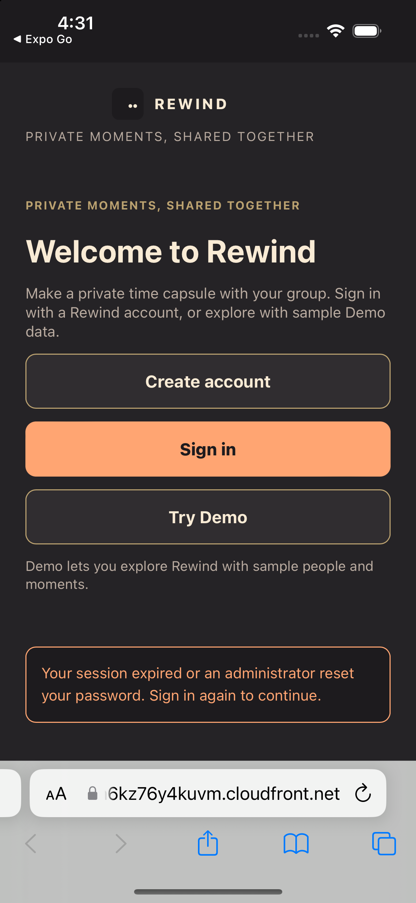

Opening the supplied URL on the iPhone 15 simulator redirects to the hosted CloudFront origin and displays the older Welcome/Demo shell with the stale expiry banner. Safari's own toolbar is visible in this capture. This is not the installed Home Screen app and does not verify the reported top/bottom bars; it confirms that the live distribution has not received PR #320.

### Current branch on iPhone simulator

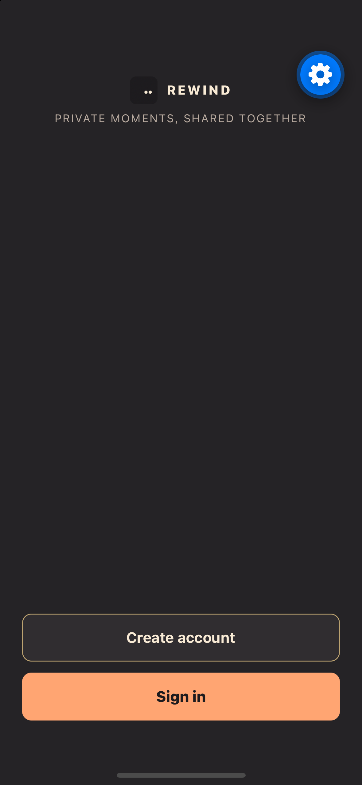

The current branch loaded in Expo Go 57.0.9 on the iPhone 15 simulator running iOS 17.5. The app surface fills the top and bottom safe areas without white bars, and the native status bar is hidden. The blue floating gear is Expo Go's developer overlay. This is simulator evidence only; it does not replace the physical iPhone Add-to-Home-Screen check or the physical-device requirement in #232.

### Current branch on iPhone 17 Pro simulator Safari

On 30 September 2026, I built the current branch with `npm run build:web` and opened the local web export in Safari on the iPhone 17 Pro simulator running iOS 26.5. The screenshots show the current Welcome, Sign in, Create account, Demo chooser, and synthetic sample Home screens. No account credentials were entered. Because this local preview uses HTTP, Sign in and Create account display the same-origin HTTPS warning and keep submission unavailable; no password was sent. From Sign in, I chose Try Demo → Amber (synthetic sample member) → Weekend People sample Home, then Settings → Sign out of Demo; sign-out returned to Welcome. This simulator run did not use the hosted service, Home Screen installation, or physical iPhone hardware. Safari's system status and browser controls are visible, so these captures do not prove native status-bar hiding or the installed-PWA safe-area result.

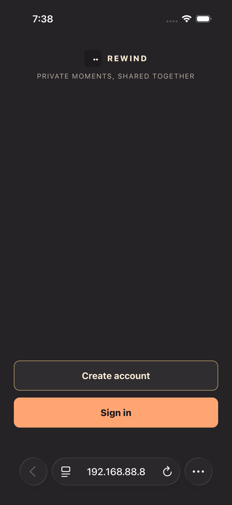

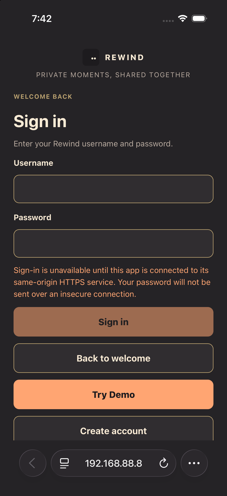

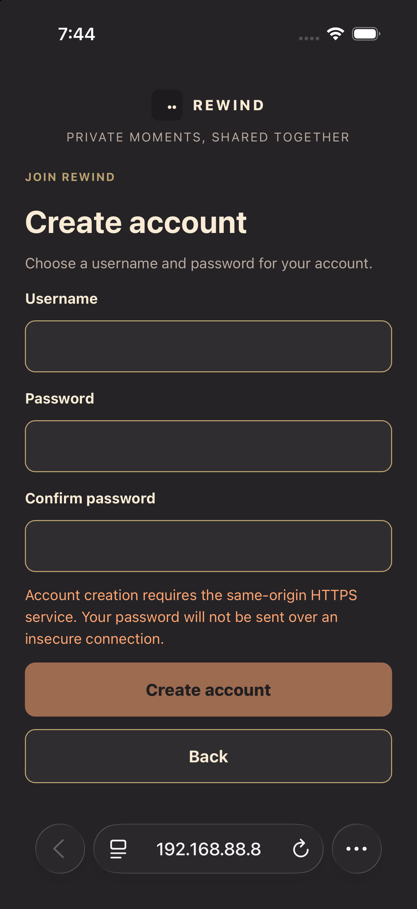

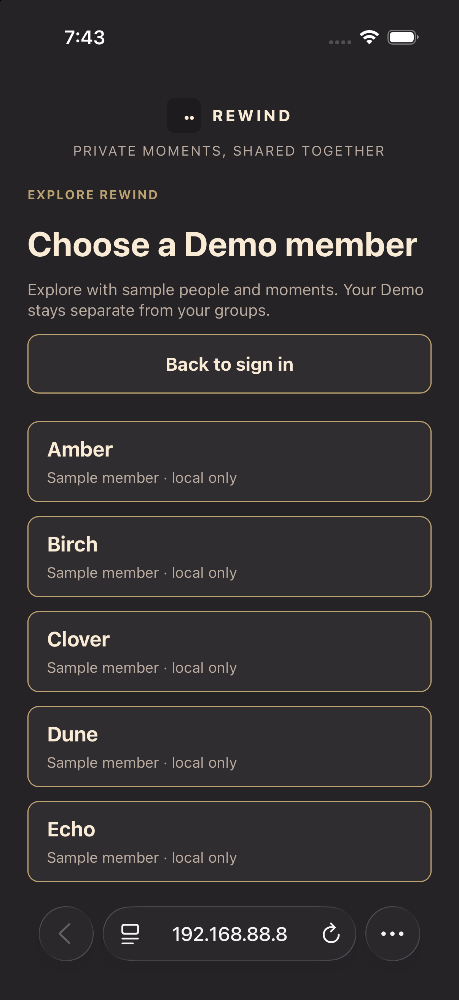

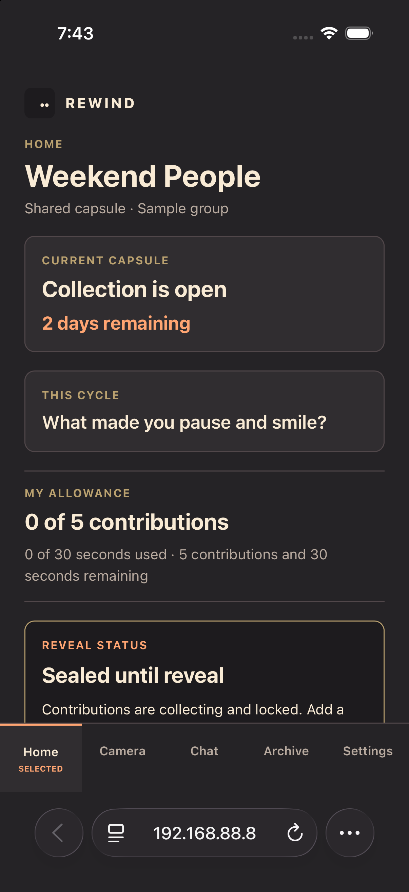

### Current branch in the native iPhone 17 Pro simulator

On 30 September 2026, I built and launched the current native app on iPhone 17 Pro / iOS 26.5. The `com.anonymous.rewind-app` build reached Welcome with the OS status bar hidden and the dark surface extending through the safe areas. Sign in and Create account both showed the same-origin HTTPS guard; no credentials were entered. Try Demo → Amber → Weekend People reached the synthetic sample Home, and Settings → Sign out of Demo returned to Welcome. The local server was HTTP, so account submission was unavailable. The keyboard-open signup capture also shows the lower submit control behind the keyboard; dismissing the keyboard reveals the disabled control, and no account was created. This is simulator evidence, not a physical-device or hosted HTTPS check.

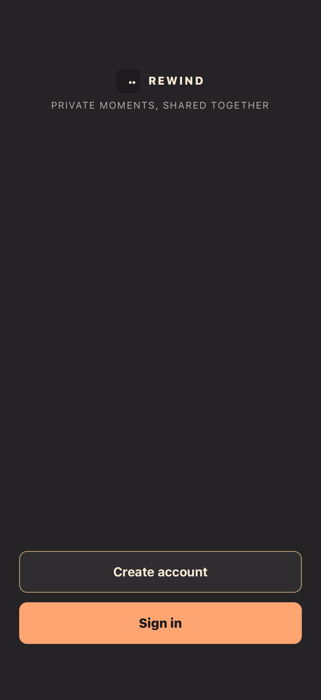

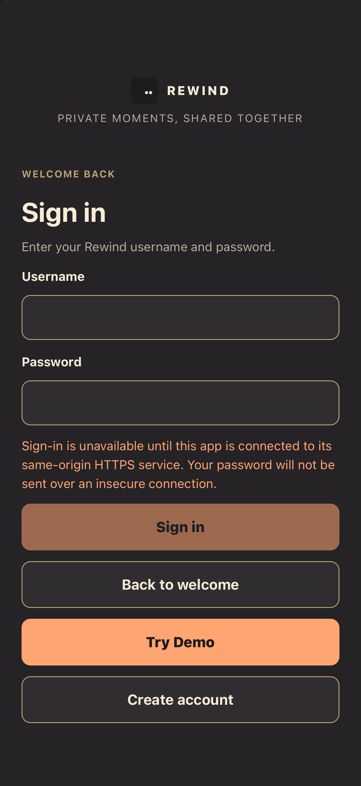

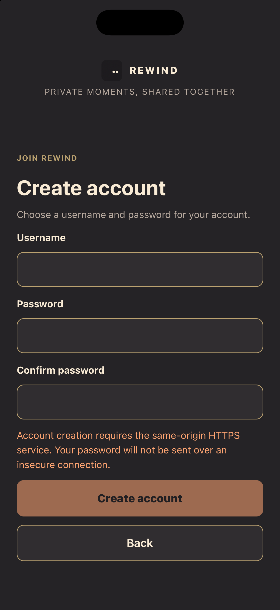

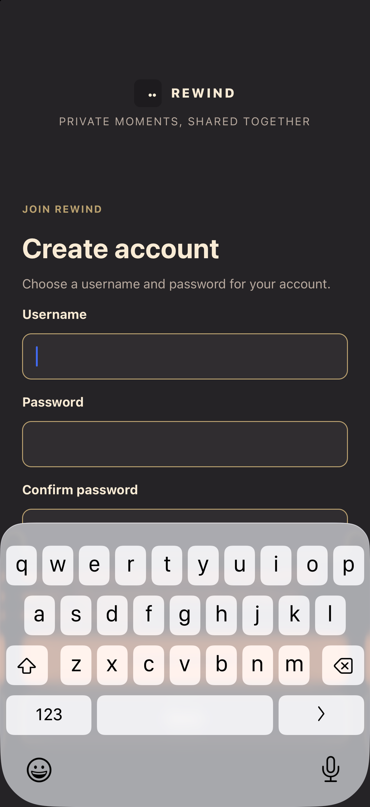

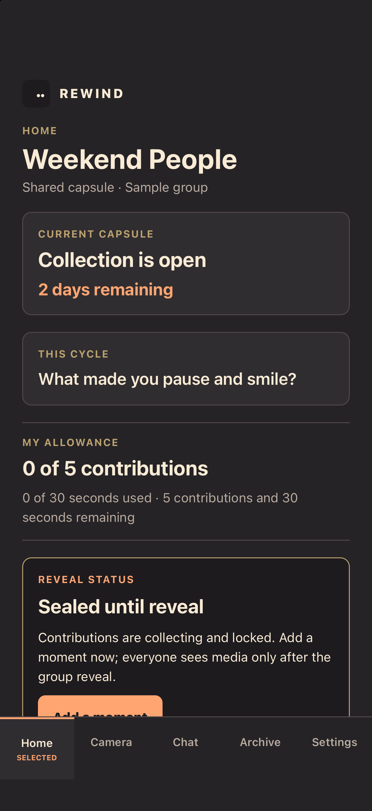

## Verification

- `npm run check` — passed (formatting, lint, architecture, types, server and app tests, and accessibility browser checks).
- `npm run test:responsive` — passed; 22 browser checks, rerun after making the Home web scroll region keyboard-focusable.
- `npm run typecheck` — passed after the Home scroll-region accessibility fix.
- `npm run test:production-e2e` — passed twice; two tests per run against disposable local data.
- Native simulator — `make run` launched the current branch in Expo Go 57.0.9 on iPhone 15 / iOS 17.5 with an isolated temporary database; the app reached Welcome and showed no white top/bottom bands.
- iPhone 17 Pro / iOS 26.5 simulator Safari — current branch Welcome → Sign in and Create account HTTPS guards → Try Demo → Amber sample Home → Settings sign-out to Welcome. No credentials were entered; local Safari ran over HTTP. This is not hosted HTTPS or installed-PWA verification.
- iPhone 17 Pro / iOS 26.5 native simulator — current app bundle reached Welcome with the native status bar hidden, displayed the Sign in/Create account HTTPS guards, completed the synthetic Demo route, and returned to Welcome after Demo sign-out. No credentials were entered. The keyboard-open capture shows the lower registration submit control obscured; secure signup was not available over the local HTTP service.

## Remaining acceptance gates

- **#145:** the live CloudFront app was inspected read-only. Its current entry did not match the new branch. The reset-to-reveal test mutates groups, invitations, contribution state, and release state, and no safe hosted reset/rollback route was confirmed. The two required hosted runs, restart persistence, rollback/fallback observations, and non-author rehearsal remain outstanding; no deployment or live fixture mutation was performed.
- **#232:** the current branch now opens in iPhone 15 simulator / iOS 17.5 / Expo Go 57.0.9 with `make run` and an isolated temporary database. This verifies the simulator workflow only; the issue's physical-iPhone collaborator walkthrough and report remain outstanding.
- **#314:** Luna's investigation and the simulator attempt did not yield a native crash log or root cause. A physical iPhone exception is still needed before choosing a fix.
- **#267:** this is a research deliverable only. No profiling campaign or before/after performance claim was made.
